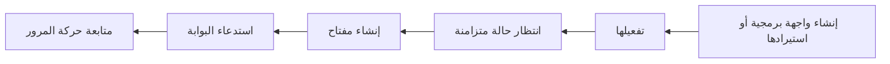

MIRQAB هو لوحة التحكم ومستوى التحكم حول بوابة واجهات برمجية مفتوحة المصدر. تصف الواجهة البرمجية مرة واحدة،
وتُصدر لها مفاتيح، ثم يمر كل استدعاء عبر البوابة، حيث يتحقق MIRQAB من المفتاح ويطبّق الحدود ويسجّل الطلب.
تأخذك هذه الصفحة في جولة عبر ساعتك الأولى.



## قبل أن تبدأ

- سجّل الدخول. افتح لوحة التحكم؛ وإذا لم تكن مسجّلًا للدخول، يحوّلك MIRQAB إلى صفحة **تسجيل الدخول**.
- تحتاج معظم الصفحات إلى صلاحية. إذا لم تملكها، تعرض الصفحة **لا يوجد صلاحية وصول** وتذكر الصلاحية
  التي تطلبها من المسؤول. أما الأزرار التي لا تملك صلاحيتها فتكون مخفية.
- توجد الصلاحيات موصوفة في [الأدوار والتدقيق والمؤسسات](/docs/roles-audit-tenants).

## 1. أضف واجهة برمجية

افتح **واجهات البرمجة**. لديك طريقتان للإضافة، وكلتاهما تحتاج إلى صلاحية `api:create`؛ وبدونها لا يظهر
الزران **إنشاء واجهة برمجة** و**استيراد OpenAPI**.

**يدويًا.** انقر **إنشاء واجهة برمجة** واملأ:

- **الاسم** و**المعرّف المختصر**. يتكوّن المعرّف المختصر من أحرف لاتينية صغيرة وأرقام وشرطات مفردة، ولا يمكن تغييره لاحقًا.
- **نوع المصادقة**. يعرض النموذج **مفتاح API** و**OAuth2 (بيانات اعتماد العميل)** و**بدون**، ويبدأ على **مفتاح API**.
- **عنوان URL الأساسي**، وهو الخادم الذي يجيب فعليًا، مثل `https://api.example.com`.
- **مسار الاستماع**، وهو المسار الذي يستخدمه المستدعون على البوابة. يجب أن يبدأ بالرمز `/`.

انقر **إنشاء**.

**من مستند OpenAPI.** انقر **استيراد OpenAPI**، واختر ملفًا، أو الصق المستند، أو استخدم تبويب
**من عنوان URL**، ثم انقر **فحص المستند** و**استيراد**. يفتح MIRQAB الواجهة الجديدة على تبويب
**نقاط النهاية**. تكون الواجهة المستوردة **مسودة** بنوع مصادقة **بدون**، أي أنها لا تحتاج إلى مفتاح. وإذا احتاج
المستدعون إلى مفتاح، فافتح الواجهة وانقر **تعديل** وغيّر **نوع المصادقة** إلى **مفتاح API** قبل أن تنقر **تفعيل**. لا تتحول
مخططات الأمان الواردة في المستند إلى مصادقة على البوابة. التفاصيل في [الواجهات البرمجية واستيراد OpenAPI](/docs/apis-and-openapi-import).

## 2. فعّل الواجهة البرمجية

تكون الواجهة الجديدة **مسودة**، والواجهة المسودة ليست منشورة على البوابة. في صفحة الواجهة انقر
**تفعيل**. عندها تنتقل حالة المزامنة، الظاهرة في عمود **مزامنة** بقائمة الواجهات وفي حقل حالة المزامنة بصفحة الواجهة، من **قيد الانتظار** إلى **متزامنة**. انتظر **متزامنة**
قبل إنشاء مفتاح: يذكر نموذج المفتاح أن الواجهة يجب أن تكون متزامنة أولًا. وإذا ظهرت **فشلت**، مرّر المؤشر فوق
الشارة لقراءة الخطأ وانقر **إعادة المحاولة** (تحتاج إلى `api:sync`).

## 3. أصدر مفتاحًا

افتح **المفاتيح** وانقر **إنشاء مفتاح**. أدخل **اسم المفتاح**، واختر **الواجهة** (لا تُعرض إلا الواجهات النشطة)
وانقر **إنشاء المفتاح**. يعرض مربع حوار بعنوان **نسخ مفتاح API الخاص بك** المفتاح مرة واحدة. انسخه
الآن؛ فلا يمكن عرضه مرة أخرى. راجع [المفاتيح والخطط](/docs/keys-and-plans).

## 4. استدعِ الواجهة البرمجية

أرسل الطلب إلى البوابة وليس إلى الخادم الخلفي. العنوان هو عنوان البوابة، ثم المعرّف المختصر
للمستأجر (يظهر في صفحة **المستأجرون**)، ثم مسار الاستماع، ثم مسار نقطة النهاية. ولا تعرض لوحة التحكم عنوان البوابة؛ اسأل عنه من يشغّلون المنصة. يوضع المفتاح في ترويسة
`Authorization`، وهي اسم الترويسة الافتراضي:

```bash
curl -H "Authorization: <your-key>" \
  "https://<gateway-address>/<tenant-slug>/<listen-path>/<endpoint-path>"
```

الصق المفتاح كما عُرض. وإذا كان **نوع المصادقة** للواجهة **بدون**، فاترك الترويسة.
لمعرفة رموز الحالة التي قد تعود إليك، راجع [المفاتيح والخطط](/docs/keys-and-plans#what-callers-see).

يستطيع المطورون الذين لا ينبغي أن يستخدموا لوحة التحكم الحصول على المفاتيح وتجربة الواجهة بأنفسهم في
[بوابة المطورين](/docs/portal).

## 5. تابع حركة المرور

- تعرض الصفحة الرئيسية للوحة التحكم الطلبات ومعدل الأخطاء وزمن الاستجابة لآخر 24 ساعة افتراضيًا.
- تعرض **التحليلات** الأرقام نفسها مع جداول لكل واجهة ولكل مفتاح، وتتيح **الحركة** التصفية
  حسب الواجهة والمفتاح والطريقة والحالة والمسار وزمن الاستجابة. تحسب المخططات والأرقام كل الحركة، أما الجداول فتسرد أنشط 50 واجهة أو مفتاحًا. راجع
  [التحليلات وحركة المرور](/docs/analytics-and-traffic).
- كلتاهما تحتاج إلى صلاحية `analytics:read`.
- إذا عرضت الصفحة **خط أنابيب التحليلات لا يستقبل بيانات**، فلا يُسجَّل شيء بعد. راجع
  [استكشاف الأخطاء وإصلاحها](/docs/troubleshooting).

## إلى أين تذهب بعد ذلك

- [مسار الطلب](/docs/how-it-works): ما يمر به الاستدعاء.
- [الواجهات البرمجية واستيراد OpenAPI](/docs/apis-and-openapi-import): التعديل والاستيراد وضوابط نقاط النهاية.
- [المفاتيح والخطط](/docs/keys-and-plans): المفاتيح والخطط والمنتجات والحصص.
- [بوابة المطورين](/docs/portal): خدمة ذاتية لمطوريك.
- [البحث في حركة المرور](/docs/searching-traffic): العثور على الطلبات الملتقطة حسب محتواها.

تم التحقق منه مقابل الإيداع e4f3acc.
