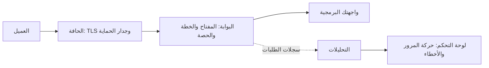

يمر كل استدعاء لواجهة برمجية تديرها في MIRQAB بالمراحل نفسها.

## ما تفعله كل مرحلة

1. **الحافة.** تُنهي اتصال TLS وتشغّل جدار حماية تطبيقات الويب. في الإعداد الافتراضي يكتفي جدار الحماية بالكشف والتسجيل
   ولا يحظر شيئًا. إذا ضُبط على الحظر، فإن الطلب المحظور لا يصل إلى البوابة أبدًا، فلا يستهلك حصة ولا يترك سجلًا في حركة المرور.
2. **البوابة.** تتحقق من المفتاح والخطة والحصة، ثم تحوّل الاستدعاء إلى واجهتك البرمجية.
3. **واجهتك البرمجية.** تجيب عن الاستدعاء. ما تعرضه لوحة التحكم هو رمز حالتها وزمن استجابتها.
4. **التحليلات.** تسجّل البوابة كل طلب، وتقرأ لوحة التحكم وصفحة حركة المرور تلك السجلات.

## أين تنظر عند حدوث مشكلة

- الاستدعاء المرفوض بسبب مفتاحه أو حصته يظهر في **حركة المرور** برمز حالة 4xx.
- الاستدعاء الذي حظره جدار الحماية، إذا كان مضبوطًا على الحظر، لا يظهر هناك إطلاقًا.
- إذا أخبرتك لوحة التحكم أن التحليلات لا تستقبل بيانات، فالعطل في مسار تسجيل الطلبات وليس في واجهتك البرمجية.
