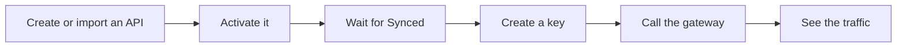

MIRQAB is the dashboard and control plane around an open-source Tyk API gateway. You describe an API
once, issue keys for it, and every call then passes through the gateway, where MIRQAB checks the key,
applies limits and records the request. This page walks through your first hour.



## Before you start

- Sign in. Open the dashboard; if you are not signed in, MIRQAB sends you to the **Sign in** page.
- Most pages need a permission. If you lack it, the page shows **No access** and names the permission
  to ask an administrator for. Buttons you lack permission for are hidden.
- Permissions are described in [Roles, audit and tenants](/docs/roles-audit-tenants).

## 1. Add an API

Open **APIs**. You have two ways to add one. Both need the `api:create` permission; without it the
**Create API** and **Import OpenAPI** buttons do not appear.

**By hand.** Click **Create API** and fill in:

- **Name** and **Slug**. The slug cannot change later.
- **Auth type**. The form offers **API Key**, **OAuth2 (client credentials)** and **None**, and starts on **API Key**.
- **Upstream URL**, the server that really answers, for example `https://api.example.com`.
- **Listen path**, the path callers use on the gateway. It must start with `/`.

Click **Create**.

**From an OpenAPI document.** Click **Import OpenAPI**, choose a file, paste the document, or use the
**From URL** tab, then click **Check document** and **Import**. MIRQAB opens the new API on its
**Endpoints** tab. An imported API starts with **Auth type** set to **None**, so the gateway does not
ask callers for a key. To require one, open the API, click **Edit** and change **Auth type** to
**API Key**. Details are in [APIs and OpenAPI import](/docs/apis-and-openapi-import).

## 2. Activate the API

A new API is **Draft**, and a draft API is not live on the gateway. On the API's page click
**Activate**. The sync status, shown in the **Sync** column of the APIs list and as the sync status field on the API's page, then moves from **Pending** to **Synced**. Wait for **Synced**
before you create a key: the key form says the API must be synced first. If it shows **Failed**, hover over
the badge to read the error and click **Retry** (it needs `api:sync`).

## 3. Issue a key

Open **Keys** and click **Create Key**. Enter a **Key name**, pick the **API** (only active APIs are
listed) and click **Create key**. A dialog titled **Copy your API key** shows the key once. Copy it
now; it cannot be shown again. See [Keys and plans](/docs/keys-and-plans).

## 4. Call the API

Send the request to the gateway, not to your upstream. The address is the gateway address, then your
tenant's slug (shown on the **Tenants** page), then the listen path, then the path of the endpoint. The key goes in the
`Authorization` header, which is the default header name:

```bash
curl -H "Authorization: <your-key>" \
  "https://<gateway-address>/<tenant-slug>/<listen-path>/<endpoint-path>"
```

Paste the key as it was shown. If the API's **Auth type** is **None**, leave the header
out. For the status codes you may get back, see [Keys and plans](/docs/keys-and-plans#what-callers-see).

Developers who should not use the dashboard can get keys and try the API themselves in the
[developer portal](/docs/portal).

## 5. See the traffic

- The dashboard home shows requests, error rate and latency for the last 24 hours by default.
- **Analytics** shows the same figures, with tables per API and per key, and **Traffic** lets you
  filter by API, key, method, status, path and latency. The charts cover all traffic. See
  [Analytics and traffic](/docs/analytics-and-traffic).
- Both need the `analytics:read` permission.
- If the page says **Analytics pipeline not receiving data**, nothing is being recorded yet. See
  [Troubleshooting](/docs/troubleshooting).

## Where to go next

- [How a request travels](/docs/how-it-works): what a call passes through.
- [APIs and OpenAPI import](/docs/apis-and-openapi-import): edit, import, endpoint controls.
- [Keys and plans](/docs/keys-and-plans): keys, plans, products and quotas.
- [Developer portal](/docs/portal): self-service for your developers.
- [Searching traffic](/docs/searching-traffic): find captured requests by content.
