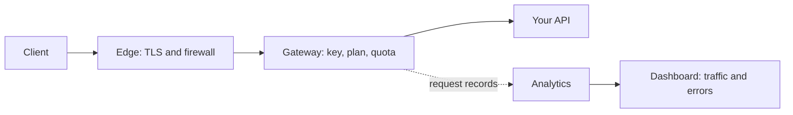

Every call to an API you manage in MIRQAB goes through the same stages.

## What each stage does

1. **Edge.** Terminates TLS and runs the web application firewall. As shipped, the firewall only detects and logs and blocks
   nothing. If it is set to block, a blocked request never reaches the gateway, so it uses no quota and leaves no traffic record.
2. **Gateway.** Checks the key, the plan and the quota, then forwards the call to your API.
3. **Your API.** Answers the call. Its status code and latency are what the dashboard reports.
4. **Analytics.** The gateway records each request; the dashboard and the traffic page read those
   records.

## Where to look when something is wrong

- A call that is refused for its key or quota appears in **Traffic** with a 4xx status.
- A call that the firewall blocked, if it is set to block, does not appear there at all.
- If the dashboard says analytics is not receiving data, the record pipeline is down, not your API.
