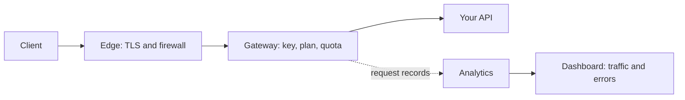

Every call to an API you manage in MIRQAB goes through the same stages.

## What each stage does

1. **Edge.** Terminates TLS and runs the web application firewall. As shipped, the firewall only detects and logs and blocks
   nothing. If the platform operator turns on blocking, a blocked request never reaches the gateway, so it uses no quota and leaves no traffic record.
2. **Gateway.** Checks the key, the plan and the quota, then forwards the call to your API.
3. **Your API.** Answers the call. Its status code and its time (shown as upstream latency) are what the dashboard reports,
   together with the gateway's own time and the codes the gateway returns.
4. **Analytics.** The gateway records each request, unless the API has **Do not track** on; the dashboard and the traffic page read those
   records.

## Where to look when something is wrong

- A call that is refused for its key or quota is counted in **Traffic** as a 4xx response (use **Exact status**, for example 401, 403 or 429).
  It is not recorded if the API has **Do not track** on.
- A call that the firewall blocked, if the platform operator turns on blocking, does not appear there at all.
- If the dashboard says analytics is not receiving data, the record pipeline is down, not your API.

Verified against commit e4f3acc.
