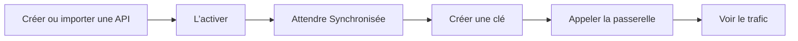

MIRQAB est le tableau de bord et le plan de contrôle d’une passerelle Tyk open source. Vous décrivez une API
une seule fois, vous émettez des clés pour elle, puis chaque appel passe par la passerelle, où MIRQAB vérifie la clé,
applique les limites et enregistre la requête. Cette page retrace votre première heure.



## Avant de commencer

- Connectez-vous. Ouvrez le tableau de bord ; si vous n’êtes pas connecté, MIRQAB vous envoie vers la page **Connexion**.
- La plupart des pages exigent une permission. Si elle vous manque, la page affiche **Accès refusé** et nomme la permission
  à demander à un administrateur. Les boutons pour lesquels vous n’avez pas la permission sont masqués.
- Les permissions sont décrites dans [Rôles, audit et organisations](/docs/roles-audit-tenants).

## 1. Ajouter une API

Ouvrez **API**. Il y a deux façons d’en ajouter une. Les deux exigent la permission `api:create` ; sans elle, les
boutons **Créer une API** et **Importer OpenAPI** n’apparaissent pas.

**À la main.** Cliquez sur **Créer une API** et renseignez :

- **Nom** et **Slug**. Le slug ne peut plus changer ensuite.
- **Type d'authentification**. Le formulaire propose **Clé API**, **OAuth2 (identifiants client)** et **Aucun**, et démarre sur **Clé API**.
- **URL amont**, le serveur qui répond réellement, par exemple `https://api.example.com`.
- **Chemin d'écoute**, le chemin que les appelants utilisent sur la passerelle. Il doit commencer par `/`.

Cliquez sur **Créer**.

**À partir d’un document OpenAPI.** Cliquez sur **Importer OpenAPI**, choisissez un fichier, collez le document, ou utilisez
l’onglet **Depuis une URL**, puis cliquez sur **Vérifier le document** et **Importer**. MIRQAB ouvre la nouvelle API sur son onglet
**Points de terminaison**. Une API importée démarre avec **Type d'authentification** réglé sur **Aucun** : la passerelle ne
demande donc pas de clé aux appelants. Pour en exiger une, ouvrez l’API, cliquez sur **Modifier** et passez **Type d'authentification** à
**Clé API**. Les détails sont dans [API et import OpenAPI](/docs/apis-and-openapi-import).

## 2. Activer l’API

Une nouvelle API est en **Brouillon**, et une API en brouillon n’est pas en ligne sur la passerelle. Sur la page de l’API, cliquez sur
**Activer**. Le statut de synchronisation, affiché dans la colonne **Synchro** de la liste des API et dans le champ de statut de synchro de la page de l’API, passe alors de **En attente** à **Synchronisée**. Attendez **Synchronisée**
avant de créer une clé : le formulaire de clé indique que l’API doit d’abord être synchronisée. Si l’état est **Échec**, survolez
le badge pour lire l’erreur et cliquez sur **Réessayer** (il faut `api:sync`).

## 3. Émettre une clé

Ouvrez **Clés** et cliquez sur **Créer une clé**. Saisissez un **Nom de la clé**, choisissez l’**API** (seules les API actives sont
listées) et cliquez sur **Créer la clé**. Une boîte de dialogue intitulée **Copiez votre clé API** affiche la clé une seule fois. Copiez-la
maintenant : elle ne pourra plus être affichée. Voir [Clés et forfaits](/docs/keys-and-plans).

## 4. Appeler l’API

Envoyez la requête à la passerelle, pas à votre serveur amont. L’adresse est celle de la passerelle, suivie du slug de votre
organisation (affiché sur la page **Organisations**), puis du chemin d’écoute, puis du chemin du point de terminaison. La clé se place dans l’en-tête
`Authorization`, qui est le nom d’en-tête par défaut :

```bash
curl -H "Authorization: <your-key>" \
  "https://<gateway-address>/<tenant-slug>/<listen-path>/<endpoint-path>"
```

Collez la clé telle qu’elle a été affichée. Si le **Type d'authentification** de l’API est **Aucun**, omettez l’en-tête. Pour les codes de statut que vous pouvez recevoir, voir
[Clés et forfaits](/docs/keys-and-plans#what-callers-see).

Les développeurs qui ne doivent pas utiliser le tableau de bord peuvent obtenir des clés et essayer l’API eux-mêmes dans le
[portail développeur](/docs/portal).

## 5. Voir le trafic

- L’accueil du tableau de bord affiche les requêtes, le taux d’erreur et la latence des dernières 24 heures par défaut.
- **Analytique** affiche les mêmes chiffres, avec des tableaux par API et par clé, et **Trafic** permet de
  filtrer par API, clé, méthode, statut, chemin et latence. Les graphiques couvrent tout le trafic. Voir
  [Analyses et trafic](/docs/analytics-and-traffic).
- Les deux exigent la permission `analytics:read`.
- Si la page indique **Le pipeline analytique ne reçoit pas de données**, rien n’est encore enregistré. Voir
  [Dépannage](/docs/troubleshooting).

## Pour aller plus loin

- [Le trajet d’une requête](/docs/how-it-works) : ce que traverse un appel.
- [API et import OpenAPI](/docs/apis-and-openapi-import) : modifier, importer, contrôles par point de terminaison.
- [Clés et forfaits](/docs/keys-and-plans) : clés, forfaits, produits et quotas.
- [Portail développeur](/docs/portal) : le libre-service de vos développeurs.
- [Rechercher dans le trafic](/docs/searching-traffic) : retrouvez des requêtes capturées par leur contenu.
