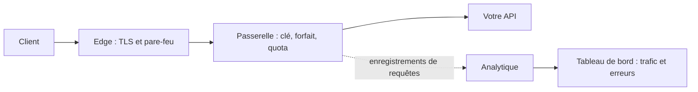

Chaque appel vers une API gérée dans MIRQAB traverse les mêmes étapes.

## Ce que fait chaque étape

1. **Edge.** Termine le TLS et exécute le pare-feu applicatif web. Tel que livré, le pare-feu se contente de détecter et de
   journaliser, sans rien bloquer. Si l’opérateur de la plateforme active le blocage, une requête bloquée n’atteint jamais la passerelle : elle
   ne consomme aucun quota et ne laisse aucun enregistrement de trafic.
2. **Passerelle.** Vérifie la clé, le forfait et le quota, puis transmet l’appel à votre API.
3. **Votre API.** Répond à l’appel. Son code de statut et son temps de réponse (affiché comme latence en amont) sont ce que le tableau de bord rapporte,
   avec le temps propre à la passerelle et les codes que la passerelle renvoie.
4. **Analytique.** La passerelle enregistre chaque requête, sauf si **Ne pas suivre** est activé pour l’API ; le tableau de bord et la page de trafic lisent ces
   enregistrements.

## Où regarder en cas de problème

- Un appel refusé à cause de sa clé ou de son quota est compté dans **Trafic** comme une réponse 4xx (utilisez **Statut exact**, par exemple 401, 403 ou 429).
  Il n’est pas enregistré si **Ne pas suivre** est activé pour l’API.
- Un appel bloqué par le pare-feu, si l’opérateur de la plateforme active le blocage, n’y apparaît pas du tout.
- Si le tableau de bord indique que l’analytique ne reçoit pas de données, c’est le pipeline d’enregistrement qui est
  arrêté, pas votre API.

Vérifié par rapport au commit e4f3acc.
