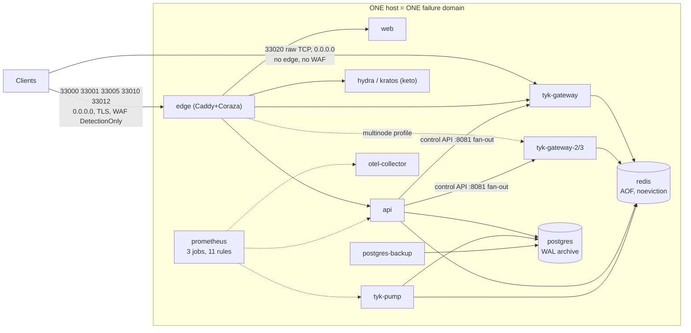

# HA observability — 00. Current state and gaps

> **Status:** planning package; owner decisions D-OBS-01…14 **approved 2026-09-27** (recommended defaults, [04 §6](04-roadmap-decisions-validation.md#6-owner-decisions-needed)).
> - OG-OBS-00/01/02 have since been **implemented as repo changes and lab-verified, but not deployed** ([04 §3.1](04-roadmap-decisions-validation.md#31-deployment-go-ahead-checklist-og-obs-0102)).
> - The current-state findings below describe the stack **as audited at HEAD `cc096d8`**, before those changes. No firewall rule, running service or alert delivery has changed.
>
> **Package:** [00 current state](00-current-state-and-gaps.md) · [01 target architecture](01-target-architecture.md) ·
> [02 assets and signals](02-assets-and-signal-catalog.md) · [03 dashboards, alerts, runbooks](03-dashboards-alerts-and-runbooks.md) ·
> [04 roadmap, decisions, validation](04-roadmap-decisions-validation.md)

## Executive summary

**What exists.** OpenGateway runs as **one Docker Compose project on one host**.
- 21 default services, plus 3 more in the optional `multinode` profile. Kubernetes is excluded by owner decision O1, enforced by [`check-no-k8s.sh`](../../infra/scripts/check-no-k8s.sh).
- Prometheus v3.1.0 scrapes three targets and evaluates **11 alert rules**, but **nothing receives the alerts**. There is no Alertmanager, no Grafana, and no trace or log backend.
- Two things are genuinely good. The API exports useful gauges: Redis memory, gateway node sync, and certificate expiry. Postgres backups are thorough, and a four-layer scratch-restore script exists.

**What is missing for HA monitoring.**
- There are no host or container metrics and no probes from outside the host.
- Alerts are not delivered, and no dead-man's switch exists.
- There is no concept of host, site or failure domain anywhere in the repo. A gateway node is identified only by its URL string.
- The API and web app have no request latency or error metrics.
- Caddy, Hydra, Kratos and Keto all expose Prometheus metrics that nobody scrapes.
- Traces live only in a rotating stdout log.

**Live evidence that this matters.** On 2026-09-27 at 12:42:18Z, `open-gateway-prometheus` and both health-check sidecars were stopped with SIGTERM (graceful exit). They were still down at 17:17Z, about 4.5 hours of zero monitoring. Nothing noticed, because nothing outside Prometheus watches Prometheus (see §6). The same blind spot hides a whole-host outage today.

**HA reality.** Today every form of redundancy lives inside **one failure domain**:
- The 3-Tyk-node profile tests node-level behaviour. It does not survive a host failure.
- The edge is a documented single point of failure (~4.5 s on restart).
- Postgres and Redis are single instances, and backups sit on the same host.

**Top owner decisions.** All of them were **approved on 2026-09-27** with the recommended defaults; the full list is in [04 §6](04-roadmap-decisions-validation.md#6-owner-decisions-needed):
1. How many hosts or VMs, where, and in which failure domains. **Approved: scenario A now; scenario B once a second host exists.** See [01](01-target-architecture.md).
2. Where monitoring runs, outside the application's failure domain, and which external heartbeat service to use.
3. Notification channel, on-call owner, and severity routing.
4. Inventory source of truth. The recommended default is a private versioned YAML file.
5. SLO targets and RTO/RPO. These are only proposals until a baseline has been measured.

### Traceability: requirement → evidence

IDs are defined in [02](02-assets-and-signal-catalog.md) (signals), [03](03-dashboards-alerts-and-runbooks.md) (DB-xx dashboards,
AL-xx alerts, RB-xx runbooks) and [04](04-roadmap-decisions-validation.md) (OG-OBS-xx work packages, VD-xx drills).
Owners are **roles**, because no people are named in the repo.

| Requirement | Data source (state) | Dashboard | Alert | Owner role | Proof |
|---|---|---|---|---|---|
| Host CPU | node_exporter `node_cpu_seconds_total`, `node_pressure_cpu_*` (**new integration**) | DB-03 | AL-HOST-02 | Platform/SRE | OG-OBS-01 AT-1, VD-03 |
| Container CPU | cAdvisor `container_cpu_usage_seconds_total` (**new**) | DB-04 | AL-CTR-04 (after limits exist) | Platform/SRE | OG-OBS-01 AT-2 |
| RAM / OOM | `node_memory_MemAvailable_bytes`, `node_vmstat_oom_kill`, `container_oom_events_total` (**new**) | DB-03, DB-04 | AL-HOST-03, AL-CTR-03 | Platform/SRE | OG-OBS-01 AT-3 |
| Disk space, inodes, read-only state, I/O latency | node_exporter filesystem and disk families (**new**) | DB-03 | AL-HOST-04…07 | Platform/SRE | OG-OBS-01 AT-1 |
| Network throughput, errors, drops | node_exporter `node_network_*` (**new**) | DB-03 | AL-HOST-08 | Platform/SRE | OG-OBS-01 AT-1 |
| External availability | blackbox `probe_success` from ≥2 vantage points (**new**) | DB-02 | AL-EDGE-01, AL-HOST-01 | Platform/SRE | VD-03, VD-09 |
| Gateway latency vs upstream latency | Pump `tyk_latency{type}` (**existing**, ms buckets); Caddy request histogram (**needs configuration**) | DB-06 | AL-TYK-05, EX-01 | Gateway owner | OG-OBS-02 AT-4, VD-02 |
| Errors (edge, gateway, API) | Caddy status codes (**needs configuration**); `tyk_http_status` (**existing**); API histogram (**new**) | DB-05, DB-06, DB-09 | AL-EDGE-02, AL-TYK-06, AL-APP-02 | Gateway owner / App owner | OG-OBS-02 AT-2 |
| Saturation | PSI (**new**), `redis_used_memory_bytes` (**existing**), Postgres connections (**new**) | DB-03, DB-07 | AL-HOST-02, EX-03, AL-DATA-02 | Platform/SRE / Data owner | OG-OBS-01/02 |
| Replication | `pg_stat_replication` via postgres_exporter (**only if a replica is built**) | DB-07 | AL-DATA-05 | Data owner | VD-05 (conditional) |
| Failover | per-node probes (**new**), `caddy_reverse_proxy_upstreams_healthy` (**existing, unscraped**), `gateway_nodes_in_sync` (**existing**) | DB-02, DB-06 | AL-TYK-01, AL-EDGE-04, EX-07 | Gateway owner | VD-02, VD-03 |
| Hostname | inventory `hostname`, checked against `node_uname_info{nodename}` (**new**) | DB-01, DB-03 | AL-MON-08 | Platform/SRE | OG-OBS-00 AT-3 |
| IP (service/management) | inventory only; management IPs in a **restricted** view (**new**) | DB-01 (restricted panel) | AL-MON-08 (drift) | Platform/SRE | OG-OBS-00 AT-3 |
| Location / site | manual site registry in inventory (**new**; `unknown` until verified) | DB-01 | — | Platform/SRE | OG-OBS-00 AT-2 |
| Failure domain | inventory `failure_domain` → target label (**new**) | DB-02 | AL-HOST-01 grouped by failure domain | Platform/SRE | VD-03, VD-04 |
| Monitoring HA | 2× Prometheus + Alertmanager cluster + external dead-man (**new**) | DB-11 | AL-MON-00…06 | Platform/SRE | VD-09, VD-10 |
| Backup / restore | backup marker → textfile metric; drill receipt (**new**; marker **existing**) | DB-07 | AL-BKP-01, AL-BKP-02 | Data owner | VD-12 |
| Alert delivery | Alertmanager → receiver; Watchdog → external heartbeat (**new**) | DB-11 | AL-MON-00, AL-MON-06 | Platform/SRE | VD-10 |

## 1. Evidence and method

**Checkout state**
- `git rev-parse HEAD` → `cc096d80754e7170ec9d1cba2b503b639d766e31`.
- Branch `v1-observability-and-users`, 2 commits ahead of `main` (`d6f626a`).
- The working tree has three uncommitted edits in `docs/`: `ANALYTICS-PIPELINE.md`, `architecture.md` and `security.md`. None of them touch infrastructure, and all are left as they are.

**Diff since the audit baseline** (`6cf40f98b772d5adabad02aa1383e532ed4ae65c`)
- 21 commits, 321 files.
- Across `infra/`, `observability/` and `.github/` the only change is the `SPEC_FETCH_ALLOWED_HOSTS` env var on the `api` service (`infra/docker-compose.yml:671-674`).
- The rest are application changes. Two of them affect monitoring:
  - The Pump redaction trigger and a traffic view that fails closed.
  - A new API gauge, `og_spec_source_oldest_overdue_seconds`.

**Inputs not available.** The prompt references three documents that are not in this checkout or in `~/Downloads`: `OPENGATEWAY_EXISTING_ARCHITECTURE_AUDIT.md`, `OPENGATEWAY_ARCHITECTURE.md` and `OPENGATEWAY_ROADMAP.md`. Owner decisions D-1…D-9 cited by the engineering guidelines are therefore **unknown** here. `OPENGATEWAY_ENGINEERING_GUIDELINES.md` v1.0 was read.

**Read-only commands run.** Git inspection; file reads; `docker ps`, `docker ps -a` and `docker inspect` (state, exit code, health); `docker logs --tail`; and unauthenticated HTTP `GET` requests against the local dev stack's `/metrics`, `/hello` and `/health` endpoints. No database or Redis query was made. The Tyk control API was not called. `docker compose config` was not run, because it interpolates secrets.

**Not done** (these need authorization — see [04](04-roadmap-decisions-validation.md)):
- No service was started or restarted, so Prometheus stayed down.
- No load was generated.
- No failover or outage was simulated.

**Local runtime ≠ staging or production.** Every runtime observation below comes from one developer machine. **No staging host was verified to exist.** Its identity is supplied only through the `STAGING_*` GitHub secrets, and there is no git remote (§4.8).

## 2. Audit statements re-verified at HEAD

| # | Audit statement | Verdict at HEAD | Evidence |
|---|---|---|---|
| 1 | Compose-only, no Kubernetes | **Confirmed** (owner decision O1, CI-enforced) | `infra/scripts/check-no-k8s.sh:1-58`, `.github/workflows/ci.yml:139-151` |
| 2 | The optional 3-Tyk-node profile runs on ONE host | **Confirmed.** Compose has no placement primitive. `grep -r replicas infra/` must stay at zero | profile `multinode`: `infra/docker-compose.yml:408,423,443`; `infra/docker-compose.prod.yml:160-165` |
| 3 | Prometheus 3.1 scrapes Pump, API and OTel, with 11 rules | **Confirmed statically.** At runtime Prometheus was **stopped** (§6) | `observability/prometheus.yml:11-34`; `infra/docker-compose.yml:591-598`; `observability/rules/open-gateway.yml` |
| 4 | No Alertmanager, Grafana or trace backend | **Confirmed, and deliberate** ("absent §9") | `observability/prometheus.yml:6-8`; `observability/README.md:4-6,125-127` |
| 5 | The OTel collector writes to stdout | **Confirmed for traces** (`debug` exporter). The WAF pipeline exports `coraza_rule_detections_total` on `:8889` | `observability/otel-collector.yaml:74-97`; `infra/docker-compose.yml:571-581` |
| 6 | CI/CD never ran on a real runner | **Confirmed, and stronger:** `git remote -v` is empty, and `gh run list` fails with "no git remotes found" | `.github/workflows/ci.yml`, `cd-staging.yml` |
| 7 | Tyk OSS 5.15.0 and Pump 1.17.0 pinned | **Confirmed.** Pinned by tag, not digest. Only the prod `edge` image is digest-pinned | `infra/docker-compose.yml:354,462`; `infra/scripts/prod-preflight.sh` check 5 |
| 8 | Caddy internal-CA TLS; Coraza in DetectionOnly | **Confirmed** | `infra/edge/Caddyfile:67,204` (`tls internal`), `:99,221` (`SecRuleEngine DetectionOnly`) |
| 9 | Direct TCP `:33020` reaches Tyk without the edge or WAF | **Confirmed.** The port is published on **all interfaces**, not just 127.0.0.1 | `infra/docker-compose.yml:364-372`; `infra/edge/README.md:76-78` |
| 10 | A Postgres backup and restore exist | **Confirmed.** `pg_basebackup` runs daily, keeps 7, and archives WAL every 5 min. The four-layer restore drill exists but is **manual and never scheduled**. Backups are **local to the host** | `infra/scripts/pg-backup.sh:69-78`; `infra/scripts/pg-restore-scratch.sh`; `docs/deployment.md:490-492` |
| 11 | No Redis backup | **Confirmed.** AOF persistence exists (`--appendonly yes`), but on the same host, with no export, retention or drill | `infra/docker-compose.yml:317,321-322` |

## 3. Current topology and failure domains

| Component | Redundancy today | Failure scope | Detected today by |
|---|---|---|---|
| Host (power, disk, NIC, kernel) | none | **everything** | nothing. Prometheus is on the same host (§6) |
| Edge (Caddy) | 1 instance, documented SPOF | all HTTP(S) traffic; ~4.5 s per restart | `edge-healthcheck` sidecar (a container healthcheck only, never alerted); `edge` healthcheck |
| Tyk gateway | 1 node, or 3 on one host via `multinode` | data plane. Passive LB `fail_duration 10s` on :33005 only | `tyk-healthcheck` sidecar; API `GET /gateway/nodes/health`; `gateway_nodes_in_sync` |
| Redis | 1 instance; `noeviction`, 512 MB | gateway keys, quotas, sessions, analytics buffer | API gauges `redis_*`, and EX-02/03 (rules only) |
| Postgres | 1 instance; no replica | API, Ory, analytics | API `/api/health`; `pg_isready` healthcheck |
| Ory Hydra/Kratos/Keto | 1 each | login, token issuance, authorization | container healthchecks only; metrics exposed but unscraped |
| Pump | 1 | analytics freshness (Pump rows + Prometheus metrics) | `MetricsTargetDown` (EX-08) and `/analytics/health` |
| Prometheus | 1; no healthcheck | all monitoring | **nothing** |
| Backups | same host volumes | recover from a deleted row, but not from disk loss | `postgres-backup` marker healthcheck (container only) |

## 4. Current telemetry inventory

### 4.1 Prometheus configuration

- **Settings.** Scrape and evaluation interval are 15 s, with no `external_labels`, `alerting`, `remote_write`, or `--web.enable-lifecycle` (the last is deliberate).
- **Retention.** Retention is 15 days, with no size cap.
- **Exposure.** Prometheus is `expose`-only on `open-gateway-network` and has no healthcheck (`observability/prometheus.yml:6-34`, `infra/docker-compose.yml:590-609`).

| Job | Target | Path | Carries |
|---|---|---|---|
| `tyk-pump` | `tyk-pump:9090` | `/metrics` | `tyk_http_requests_total` (custom), `tyk_http_status`, `tyk_http_status_per_path`, `tyk_http_status_per_key`, `tyk_http_status_per_oauth_client`, `tyk_latency{type}` |
| `open-gateway-api` | `api:4000` | `/api/metrics` | `redis_used_memory_bytes`, `redis_maxmemory_bytes`, `redis_evicted_keys`, `gateway_nodes_total`, `gateway_nodes_in_sync`, `edge_certificate_expiry_timestamp_seconds`, `edge_certificate_lifetime_seconds`, `og_spec_source_oldest_overdue_seconds`, plus prom-client `nodejs_*`/`process_*` |
| `otel-collector` | `otel-collector:8889` | `/metrics` | `coraza_rule_detections_total` only. It was empty at probe time because no rule had fired |

### 4.2 Exposed but not collected

- **Caddy** `:2019/metrics`. This returns `caddy_reverse_proxy_upstreams_healthy` for all 5 upstreams, plus config-reload gauges.
  - :2019 is the **admin API, and it is unauthenticated**, so it must not be scraped as-is. Per-request metrics (`caddy_http_*`) are **not enabled** (`infra/edge/Caddyfile`, and there is no `metrics` option).
- **Kratos** `:4434/admin/metrics/prometheus` and **Hydra** `:4445/admin/metrics/prometheus` both return HTTP 200 with `http_requests_*` and `http_response_*`. The observed admin ports are unauthenticated.
- **Keto** `:4466` and `:4467` `/metrics/prometheus` both return 200, with `grpc_server_*`. A dedicated metrics port `4468` is configured in `infra/ory/keto/keto.yml:16-18` but not exposed.
- **OTel collector** self-telemetry on `:8888` is not listening: `service.telemetry` configures logs only.
- **Web** has no metrics or health route: every path answers 307.

### 4.3 Alert rules (existing — evaluated, **never delivered**)

| ID | Rule | Watches | for / severity |
|---|---|---|---|
| EX-01 | `GatewayLatencyP95High` | p95 `tyk_latency_bucket{type="total"}` > 1000 ms. This **includes upstream time** | 5m / warning |
| EX-02 | `RedisEvictingKeys` | `redis_evicted_keys > 0`. It can't fire under `noeviction` | 1m / critical |
| EX-03 | `RedisMemoryHigh` | used / max > 0.8 | 2m / warning |
| EX-04 | `CorazaWouldBlockSpike` | `increase(coraza_rule_detections_total{rule_id="949110"}[5m]) > 10` | 1m / warning |
| EX-05 | `EdgeRootCertificateExpiringSoon` | root CA expires in < 14 d | 1m / critical |
| EX-06 | `EdgeCertificateRenewalStalled` | less than 25 % of the leaf or intermediate lifetime left | 15m / critical |
| EX-07 | `GatewayNodesOutOfSync` | `gateway_nodes_in_sync < gateway_nodes_total` | 2m / warning |
| EX-08 | `MetricsTargetDown` | `up{job=~"open-gateway-api\|tyk-pump\|otel-collector"} == 0` | 2m / critical |
| EX-09…11 | `EdgeCertificateMetricsAbsent`, `RedisMetricsAbsent`, `GatewaySyncMetricsAbsent` | absent-metric guards | 10m / warning |

Source: `observability/rules/open-gateway.yml:14-204`. There are no recording rules. The runbook comment at `docs/OAS-SPEC-SOURCE.md:148` states that `og_spec_source_oldest_overdue_seconds` is deliberately **not** alerted yet.

### 4.4 Logs

- **API.** pino JSON goes to stdout.
  - Request id: `genReqId` uses the edge's `x-request-id`.
  - `traceparent` is attached to every line.
  - Redacted fields: `authorization`, `cookie` and `x-tyk-authorization`.
  - `hostname` and `pid` are pino defaults (`apps/api/src/app.module.ts:40-54`).
- **Caddy.** The access log is JSON on stdout, with `request_id`, `traceparent`, and `upstream` on :33005 (which node served the request).
- **Coraza.** Per-rule detections are written to `/var/log/caddy/waf.log` with **no rotation** (`infra/edge/Caddyfile:55-61`).
- **Ory.** JSON logs at level `info`.
- **Docker log driver.** It is `json-file` with **no size cap** everywhere except `otel-collector`, which uses 32 MB × 3.

### 4.5 Traces

- **API.** OTLP over HTTP. It runs only when `OTEL_EXPORTER_OTLP_ENDPOINT` is set, uses the SDK default sampler, and instruments HTTP and Prisma (`apps/api/src/tracing.ts:9-48`).
- **Tyk.** OTel over gRPC with `AlwaysOn` (`infra/docker-compose.yml:109-120`).
- **Caddy.** Injects `traceparent`.
- **Sink.** Everything goes to the collector's `debug` exporter, which writes to stdout (32 MB × 3). **Traces cannot be queried after the fact.**

### 4.6 Health and state endpoints

| Endpoint | What it proves | Watched by |
|---|---|---|
| API `GET /api/health` | Postgres, Redis and gateway reachable from the API | CD smoke test only (never run) |
| Tyk `GET :8081/hello` | per node: `status` and `details.redis` | `tyk-healthcheck` sidecar (**stopped**, `restart:` unset) |
| Pump `GET :8083/health` | liveness | the same sidecar; the API's `pumpReachable` |
| API `GET /gateway/nodes/health` (`settings:read`) | per node: reachable, version, latency, redis | humans, via the UI |
| API `GET /apis/:id/drift` (`api:read`) | node-vs-node definition hash drift, recomputed on each call | humans |
| API `ReconcileService` `@Interval(60s)` | writes `ApiDefinition.syncState` and feeds `gateway_nodes_in_sync` | EX-07 (rule only) |
| API `GET /analytics/health` | Pump tables present and Pump reachable; the tenant's last record | humans |
| `postgres-backup` healthcheck | the last successful base backup is less than 2× the interval old | Docker health status only |

### 4.7 Gateway fan-out and drift

- **Fan-out is sequential.** `forEachNode` / `fanOut` (`apps/api/src/modules/tyk-integration/services/tyk-client.service.ts:305-351`) never treats a push as a transaction.
- **Partial failure is visible.** It returns per-node `NodeOutcome{nodeUrl, ok, error}`, and the sync route replies with HTTP **207** (`api.controller.ts:158-171`).
- **One circuit breaker per node**, keyed `tyk:<nodeUrl>`: 5 failures open it, and it resets after 30 s.
- **Drift is node-versus-node only.** It is detected by SHA-256 of each definition with volatile paths stripped (`reconcile.service.ts:49-96`).
  - **Desired (Postgres) versus each node's managed fields is not implemented.** The engineering guidelines, §6, list it as future work.
  - Only **aggregate** gauges exist. There is no per-node series, and nothing meters fan-out outcomes.

### 4.8 Delivery

- **CI.** `ci.yml` covers lint, tests, guards (`check-docs-paths`, `check-locale-keys`, `check-page-gates`, `check-no-k8s`) and a Playwright auth e2e.
- **CD.** `cd-staging.yml` builds the images, pushes them to GHCR, then runs `deploy-staging.sh` over SSH on **one** staging host.
- **Neither has ever run: there is no remote.** Nothing emits deploy or change markers.

## 5. Gap register

| ID | Gap | Evidence | Impact | Addressed by |
|---|---|---|---|---|
| GAP-01 | No host metrics: CPU, memory, disk, I/O, network, time, hardware | no `node_exporter` anywhere in the repo (lane B §10) | saturation and hardware faults are invisible | OG-OBS-01 |
| GAP-02 | No container metrics and **no resource limits** | no `cadvisor`; `deploy:` absent from both Compose files | a noisy neighbour or an OOM kill can take down co-located services with no signal | OG-OBS-01 |
| GAP-03 | No out-of-host probe | nothing external; Prometheus runs on the same host | a whole-host or network outage is undetectable | OG-OBS-02, OG-OBS-05 |
| GAP-04 | No alert delivery, no dead-man's switch | no `alerting:` block; no Alertmanager | the 11 rules notify no one | OG-OBS-04 |
| GAP-05 | Monitoring can stop silently | §6 (observed 2026-09-27) | several hours of blindness went unnoticed | OG-OBS-04, OG-OBS-05 |
| GAP-06 | Missing self-health: Prometheus, `tyk-gateway`, `tyk-pump` and `otel-collector` have no healthcheck; the health sidecars have no `restart:` and are not watched | `infra/docker-compose.yml:381-382,479-482,590-609` | a stuck-but-running process goes unnoticed | OG-OBS-01, OG-OBS-02 |
| GAP-07 | No asset or site identity | lane A §11: no `labels:`, `node_id`, `site`, or `failure_domain`; a node is identified only by its `TYK_ADMIN_URLS` entry | a failing node can't be located to a host, IP or site | OG-OBS-00 |
| GAP-08 | Exposed but unscraped (Caddy, Ory); Caddy request metrics off; Caddy admin unauthenticated | §4.2 | edge and identity SLIs are unavailable | OG-OBS-02 |
| GAP-09 | No API or web request latency and error metrics; web has no health route | only gauges exist (`metrics.service.ts:122-171`) | no p95/p99 or 5xx figures for the control plane | OG-OBS-02 |
| GAP-10 | Pump `tyk_http_status_per_key` and `_per_path` (unbounded labels); the custom metric carries `api_name` (tenant-supplied text) | lane E §4 | cardinality blow-up, and tenant data on fleet dashboards | OG-OBS-02 (drop/relabel) |
| GAP-11 | No Postgres or Redis exporter. Redis is visible only through the API (3 gauges) | lane B §10 | no connection, lock, WAL-archive or persistence signals | OG-OBS-02 |
| GAP-12 | Drift is node-versus-node only; no per-node series; fan-out outcomes not metered | §4.7 | a partial fan-out is visible only to someone reading an HTTP 207 | OG-OBS-02 (metrics), plus the roadmap "runtime integrity" item |
| GAP-13 | No trace or log backend; Docker logs uncapped; WAF log unrotated | §4.4, §4.5 | no history, and a disk-fill risk | OG-OBS-01 (caps), OG-OBS-05 (backend decision) |
| GAP-14 | Backups local only; restore drill manual; no Redis backup; backup freshness not in Prometheus | §2 rows 10–11 | disk or host loss loses data and backups together; RPO unknown | OG-OBS-02, OG-OBS-06 |
| GAP-15 | Single edge; no LB, VIP or DNS failover; `:33020` on `0.0.0.0` bypasses the WAF | `infra/edge/README.md:24-37` | host HA isn't possible without an ingress design | decisions D-OBS-01/05 (see [01](01-target-architecture.md)) |
| GAP-16 | CI/CD never ran; no change markers | §4.8 | dashboards can't answer "what changed?" | OG-OBS-03 |
| GAP-17 | No runbooks, SLOs, on-call, RTO or RPO | lane C §8: only unchecked checklist items at `docs/deployment.md:866-867` | alerts would have no owner or procedure | OG-OBS-04 |
| GAP-18 | Doc drift: `README.md:76`, `docs/architecture.md:69` and `docs/deployment.md:541-542` describe Grafana, Loki and Tempo | lane B §10 | readers assume tooling that doesn't exist | OG-OBS-03 (docs task) |
| GAP-19 | `TYK_GW_SECRET` falls back to a committed default; the guidelines say to rotate the previously exposed value | `infra/docker-compose.yml:68,660` | the control API travels between hosts in scenario B | OG-OBS-00 prerequisite (P-2) |

## 6. Live observation: monitoring stopped and nobody knew

| Container | State | Exit code | FinishedAt (UTC) | Restart policy |
|---|---|---|---|---|
| `open-gateway-prometheus` | exited | 0 (SIGTERM, "exiting gracefully") | 2026-09-27T12:42:19Z | `unless-stopped` |
| `open-gateway-edge-healthcheck` | exited | 137 (killed after the 10 s grace period) | 2026-09-27T12:42:28Z | none |
| `open-gateway-tyk-healthcheck` | exited | 137 | 2026-09-27T12:42:28Z | none |

- **What stopped them.** The three stopped together. That points to an explicit `docker stop` or `docker compose stop`, not a crash: `oom=false`, and the last Prometheus log line is `"Received an OS signal, exiting gracefully"`.
- **Why they stayed down.** `unless-stopped` never restarts a container that was explicitly stopped.
- **Nothing reported it.** The Docker health status of the other containers stayed `healthy`, and no rule could fire, because the rule engine *was* the thing that stopped.
- **Exposure.** At 17:17Z the gap had lasted about 4.5 hours.
- **This planning run did not stop or restart them.** Restarting is left to the owner (`docker compose -f infra/docker-compose.yml up -d prometheus tyk-healthcheck edge-healthcheck`).

The lesson is design input for [01 §5](01-target-architecture.md#5-monitoring-control-plane-and-its-own-ha): liveness of the monitoring stack must be watched from **outside** it. That means an always-firing Watchdog sent to an external heartbeat receiver, and an external probe of the host.

## 7. Unknowns (not guessed)

| Unknown | Why it matters | How to resolve |
|---|---|---|
| Number, location, provider and failure domains of real production and staging hosts | defines the scenario (A, B or C) and every `site` / `failure_domain` label | owner decision D-OBS-01 |
| Management, service and public IPs; DNS names; owners | inventory fields | OG-OBS-00 site registry |
| Owner decisions D-1…D-9 from the roadmap (document unavailable) | may constrain HA scope | owner supplies the roadmap |
| Whether the restore drill has ever run against a real deployment. `docs/deployment.md:418-419` says it was executed, but there is no receipt | RPO/RTO claims | VD-12 with a recorded receipt |
| ~~Actual series count and rule health~~ **Measured 2026-09-27, after P-1 restarted Prometheus:** 255 head series; `tyk_latency_bucket` is the largest family at 81 series; 11/11 rules report health `ok`, none firing | capacity model | done. Re-measure after OG-OBS-01/02 |
| Tyk Pump behaviour with more than one Pump instance on one Redis | Pump HA design | a controlled test in VD-08; until then, keep one Pump |
| Tyk OSS 5.15.0 per-node metrics beyond `/hello` and OTel | per-node dashboards | lane D evidence in [02](02-assets-and-signal-catalog.md); a live scrape |
| Effective Redis RDB `save` schedule (image default; not set) | Redis RPO | read `CONFIG GET save` during an authorized maintenance window |
