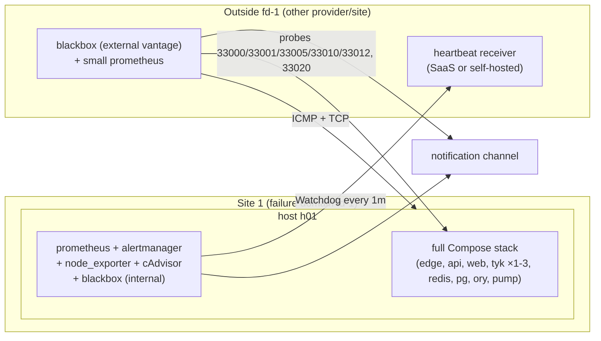
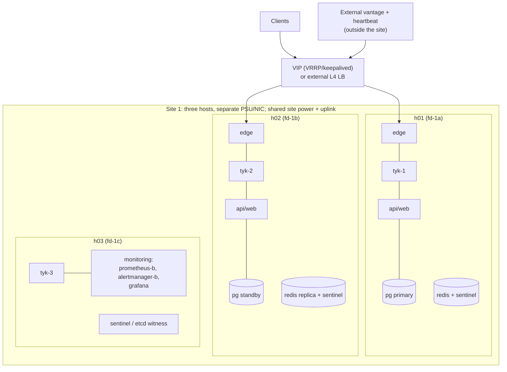
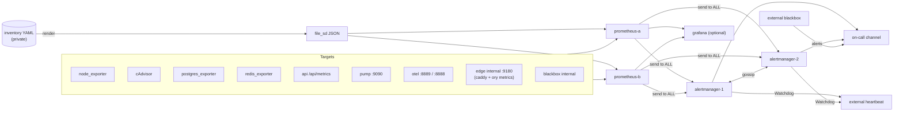

# HA observability — 01. Target architecture

> **Status:** PROPOSED; owner decisions D-OBS-01…14 **approved 2026-09-27** (recommended defaults, [04 §6](04-roadmap-decisions-validation.md#6-owner-decisions-needed)); **execution not yet authorised**. Every scenario below is a design option. **None of them exists
> today.** Current state: [00](00-current-state-and-gaps.md). Primary-source notes for each external claim are in
> [02 §7](02-assets-and-signal-catalog.md#7-primary-sources).

## 1. Design principles

1. **Detect outside-in.** User-facing probes and an external heartbeat come first. Internal metrics explain an outage; they cannot prove one. A monitor inside the failure domain it watches goes down with it ([00 §6](00-current-state-and-gaps.md#6-live-observation-monitoring-stopped-and-nobody-knew)).
2. **Keep monitoring HA separate from application HA.** Watching three hosts well is not the same as being able to lose one. Each scenario states both properties separately.
3. **Collect with least privilege, and stay inside the repo's guardrails.**
   - Stay Compose-only (O1, `infra/scripts/check-no-k8s.sh`).
   - Every new service gets an ADR, an `open-gateway-*` container name and a `DENIED_HOSTS` entry, so it passes the Compose host-denylist test at `apps/api/src/modules/api-management/dto/proxy-url.validator.spec.ts:91-116`.
   - Every new service is added to `prod-preflight.sh` if it holds a secret.
   - Never place an unauthenticated admin endpoint on `open-gateway-network`, and never attach Prometheus to `ory-internal`.
4. **Keep labels bounded, and treat tenant data as private.** Asset, site and node identity are labels. Tenant, key, path and client-IP values never are. `api_name` and the per-key Pump metrics are dropped ([02 §4](02-assets-and-signal-catalog.md#4-label-policy)).
5. **Extend before adding, and measure before promising.** Reuse Prometheus v3.1 and the 11 existing rules. Add a component only where the capacity model or the failure analysis requires it. SLO numbers stay PROPOSED until a baseline exists.

## 2. HA scenarios

**Approved (D-OBS-01, 2026-09-27):**
- **Scenario A is the current target.**
- Scenario B is designed but only gets built once a second host exists.
- Scenario C applies only if site loss must be survived.

None of them exists today.

### Scenario A — one host, better monitoring (NOT host HA)

- **SPOFs** (unchanged): the host (power, disk, NIC, kernel), the site uplink, the edge, Redis, Postgres, backup volumes on that same host.
- **What improves:**
  - A whole-host outage is detected within a few minutes by the external vantage and the heartbeat.
  - Saturation and OOM kills become visible.
  - Alerts reach a human.
- **Realistic failure scope.** Any host-level fault is a full outage. RTO equals host repair or rebuild time, and RPO equals the last off-host backup copy, which makes that copy a prerequisite.

### Scenario B — multiple hosts, one site

- **Placement.**
  - One Compose project per host, from a per-host overlay (for example `docker-compose.host-h01.yml`, **proposed**).
  - There is no orchestrator. Adding one would revisit O1 (decision D-OBS-12).
  - Every service is pinned to a host by which overlay runs where.
- **SPOFs that remain:**
  - site power and uplink, and the shared switch;
  - the VIP or LB configuration itself;
  - Redis, unless Sentinel is built;
  - Pump, which stays a singleton until VD-08 proves multi-Pump behaviour;
  - the ingress design, which the owner has not chosen (D-OBS-05).
- **What it buys.** It survives the loss of **one host** for the data plane (≥2 edges and ≥2 Tyk nodes), for the API/web, and for Postgres after a promotion. Promotion is manual unless Patroni is adopted (D-OBS-06).

### Scenario C — multiple sites or availability zones (only if the owner needs site loss covered)

- **Sites.** The primary site runs scenario B. A DR site runs a warm standby with an async Postgres replica, a gateway tier and monitoring.
- **Failover.** DNS failover with a short TTL, or anycast. Cutover is a human decision unless automated failover is explicitly approved.
- **Data at risk.** Redis state (gateway keys, quotas, sessions) is **not** replicated across sites.
  - Whether keys can be rebuilt from Postgres is **unknown**: Tyk key sessions live in Redis, and the platform stores only SHA-256 hashes (`docs/security.md`).
  - VD-06 must answer this before scenario C is designed.
- **Failure scope.** Site loss costs the async replication lag in Postgres, plus every Redis-held session and quota counter.

| | A | B | C |
|---|---|---|---|
| Survives container crash | yes (restart policy) | yes | yes |
| Survives one Tyk node loss | only with the `multinode` profile | yes | yes |
| Survives host loss | **no** | yes, for stateless tiers; Postgres after promotion; Redis only with Sentinel | yes |
| Survives site loss | no | **no** | yes, with the RPO above |
| Detects host loss | yes, externally | yes | yes |
| Monitoring survives host loss | only the external vantage | yes, with ≥2 Prometheus/AM hosts | yes |

## 3. Component redundancy and recovery assumptions

| Component | Today | A | B (proposed) | C (proposed) | Monitoring must see |
|---|---|---|---|---|---|
| Ingress: edge, DNS, VIP/LB | 1 Caddy, `0.0.0.0`, internal CA | same, plus an external probe | 2 edges behind VRRP or an external LB; health-checked | plus DNS failover | probe per port per vantage; `caddy_reverse_proxy_upstreams_healthy`; certificate expiry; VIP owner |
| `:33020` TCP passthrough | on all interfaces, bypasses the WAF | TCP probe | one listener per Tyk host; the LB design must cover it too | same | `tcp_connect` probe; classified separately from HTTP |
| API / web | 1 each, no health route on web | same | ≥2 each behind the edges | per site | probe `/api/health` and the web login page; edge-observed 5xx rate and latency |
| Tyk nodes + shared Redis | 1–3 on one host; one Redis | same | one node per host; `TYK_ADMIN_URLS` with host-qualified URLs; Redis + Sentinel ×3 | per site; Redis per site | `/hello` body per node; per-node fan-out outcome; drift; Redis role and link |
| Postgres | 1; WAL archive local | plus an off-host copy | primary plus streaming standby; manual or Patroni promotion | cross-site async | `pg_up`, connections, locks, WAL archive success, replication lag, backup freshness |
| Ory Hydra/Kratos/Keto | 1 each, DB-backed (stateless processes) | same | 2 each behind the edges (Hydra/Kratos); Keto ×2 | per site | health/ready probes; OIDC discovery + JWKS probe; Ory `http_*` 5xx and latency |
| Pump | 1 | same | 1, active-passive; a second instance is stopped until VD-08 | per site | Pump health; analytics freshness; Redis analytics buffer size |
| Prometheus / alerts | 1, no receiver, no healthcheck | 1 plus an external vantage and heartbeat | 2 replicas on different hosts; Alertmanager ×2–3 gossiped | one per site plus external | Watchdog, scrape gaps, notification drops, AM cluster size |
| OTel collector | 1, traces to stdout | plus self-metrics | one per host (agent pattern) | per site | `otelcol_exporter_send_failed_*`, queue fill |
| Backup storage | same-host volumes | plus an off-host copy (object storage or a second host) | copy to a different host and site | cross-site | last success, last off-host copy, last restore drill |

### How the control API reaches every node, and how partial state becomes visible

- **Today.**
  - `TykClientService` fans out **sequentially** to every URL in `TYK_ADMIN_URLS`, one circuit breaker per node (`tyk-client.service.ts:251-351`).
  - `POST /apis/:id/sync` returns **207** with `nodes[]` when any node fails (`api.controller.ts:158-171`).
  - `ReconcileService` hashes every node's definition every 60 s (`reconcile.service.ts:22-96,229-247`) and publishes only `gateway_nodes_total` and `gateway_nodes_in_sync`.
- **Scenario B network path.**
  - Each Tyk host publishes `:8081` **only** on its private or management interface.
  - A firewall allowlist admits only the API hosts, and `TYK_GW_SECRET` is rotated first (prerequisite P-2).
  - Nothing reaches `:8081` through the edge.
- **New signals** (OG-OBS-02; they instrument code that already exists and change no behaviour):
  - `og_tyk_fanout_total{node, operation, outcome}` where `outcome` is `ok|error|circuit_open`.
  - `og_tyk_node_in_sync{node}`.
  - `og_tyk_node_reachable{node}`.
  - Here `node` is a **bounded** alias from the inventory (`tyk-1..3`). It is never a URL containing a secret, and it grows only when a node is added.
- **Desired-versus-effective drift** (Postgres render compared with each node's managed fields) **does not exist yet**. It belongs to the roadmap's "runtime integrity" work, not to this package. Until it exists, dashboards must label drift as **node-versus-node**.

## 4. SLIs and draft SLOs

**Every target is PROPOSED.** None is current performance. First measure a 14–30 day baseline in OG-OBS-02 and OG-OBS-03, then the owner signs off.

- **Reference observation, not a baseline.** A 30-sample warm-connection run on the developer machine on 2026-09-27:
  - direct upstream p50 44.9 ms;
  - through the edge and Tyk p50 52.1 ms;
  - through bare Tyk (in-network) p50 47.2 ms.
- **What that suggests.** Tyk adds roughly 2 ms and the edge TLS+WAF roughly 5 ms. That is one shared, loaded machine; production must be measured separately.

| SLI | Definition | Source | PROPOSED target (30-day window) | Error budget |
|---|---|---|---|---|
| Data-plane availability | good/total of external `http` probes to a platform-owned health API on `:33005`, from ≥2 vantage points, **plus** edge-observed non-5xx/total for requests on the `:33005` server | blackbox + Caddy metrics | 99.9% (B/C); 99.5% (A) | 43.2 min (99.9%); 3.6 h (99.5%) |
| Gateway-added latency | p95/p99 of `tyk_latency{type="gateway"}` (ms; excludes upstream) | Pump | p95 ≤ 20 ms, p99 ≤ 50 ms | — |
| End-to-end latency, owned probe route | p95 `probe_duration_seconds` through `:33005` | blackbox | set after baseline | — |
| Control-plane API availability | non-5xx/total on the `:33001` server, excluding `/api/metrics` (which the edge returns 404 for) | Caddy metrics | 99.5% | 3.6 h |
| Control-plane API latency | p95 of edge-observed duration on `:33001` | Caddy | p95 ≤ 500 ms | — |
| Authentication | success of synthetic OIDC discovery + JWKS + Kratos `/health/ready`; Ory 5xx/total | blackbox + Ory `http_requests_*` | 99.9% | 43.2 min |
| Tyk per-node health | share of 1-minute intervals where a node's `/hello` body says `"status":"pass"` | internal blackbox | 99.9% per node; 100% "≥1 node pass" | — |
| Configuration consistency | share of time `gateway_nodes_in_sync == gateway_nodes_total` | API gauge | 99%; any drift resolved within 10 min | — |
| Analytics freshness | age of the newest raw analytics row platform-wide, while traffic is present | new API gauge `og_analytics_newest_record_age_seconds` | < 300 s in 99% of 5-min windows | — |
| Backup freshness | age of the last successful base backup; age of the last off-host copy; age of the last restore drill | new textfile metrics | < 26 h; < 26 h; < 35 d | — |
| Alert delivery | Watchdog heartbeat gap; a monthly synthetic alert reaches the on-call channel | external heartbeat; VD-10 | gap < 5 min; delivered < 2 min | — |

**RTO and RPO questions for the owner** (defaults are recommendations, not facts):

| Asset | Question | Recommended default |
|---|---|---|
| Postgres | Maximum tolerable data loss? | RPO ≤ 5 min in A (the `archive_timeout=300` WAL, **once copied off-host**); ≈ replication lag in B/C |
| Redis | Is losing sessions, quotas and rate-limit counters acceptable? Can keys be re-provisioned? | treat as RPO = last AOF on a surviving disk. Key rebuild is unknown until VD-06 |
| Tyk configuration | Re-renderable from Postgres? | yes via `/apis/:id/sync`. RPO 0 for configuration, bounded by Postgres |
| Analytics | Is a gap acceptable? | a gap is recorded, not backfilled. Missing rows ≠ no traffic |
| Whole platform | Time to restore service after host loss | A: rebuild time (measure it in VD-03). B: ≤ 15 min for the stateless tiers |

**Maintenance.**
- Planned work uses Alertmanager silences with a mandatory comment, an owner, and an expiry of 4 hours or less.
- The owner decides whether maintenance time counts against the SLO (D-OBS-10). The recommendation is to exclude only pre-announced windows.

## 5. Monitoring control plane and its own HA

| Option | What | Fits | Pros | Cons |
|---|---|---|---|---|
| **M1: minimum viable extension** | In-host Prometheus v3.1 (existing), 1 Alertmanager, node_exporter, cAdvisor, internal blackbox, postgres and redis exporters. **Plus** an external vantage (small VPS or SaaS probe) and an external heartbeat for the Watchdog | Scenario A | smallest change; uses the existing rules; detects host loss from outside | in-host monitoring dies with the host; only the external vantage survives |
| **M2: HA pair** (recommended for B/C) | 2 Prometheus replicas on **different hosts or failure domains** with identical `file_sd` targets and `external_labels: {replica: a\|b}`. Alertmanager ×2–3 gossiped with `--cluster.peer`; every Prometheus sends to **all** Alertmanagers, not through an LB. `alert_relabel_configs` drops `replica`. The external vantage and heartbeat stay | Scenario B, C | survives any single monitoring host; Alertmanager dedups notifications | duplicate series (×2 storage); dashboards pick one replica per datasource or fail over |
| M3: plus long-term or global storage (Thanos, Mimir, VictoriaMetrics) | Remote storage or a deduplicating query layer | only if retention > ~90 d or a cross-site global view is needed | long retention; one query view | a new stateful system and new operations work; **not justified at ~10–30k series** ([04 §4](04-roadmap-decisions-validation.md#4-capacity-and-cost-model)) |

**Recommendation.** Start with M1. Move to M2 when a second host exists. Reject M3 unless the owner requires more than 90 days of metric retention (D-OBS-09).

**Why duplicates are harmless in M2.**
- Both replicas evaluate the same rules and send identical alerts. Once `replica` is dropped, Alertmanager deduplicates them.
- A network partition "fails open": both sides notify rather than neither.
- Dashboards query one replica. A deduplicating layer is unnecessary at this scale.

**Self-monitoring (signals in [02 §3.10](02-assets-and-signal-catalog.md#310-monitoring-itself)):**
- **`Watchdog`.** An always-firing `vector(1)` routed to an **external** heartbeat receiver. Silence from it means "the pipeline is broken".
- **Mutual scrape.** Each Prometheus scrapes the other and every Alertmanager. The signals are `up`, `prometheus_rule_evaluation_failures_total`, `prometheus_notifications_dropped_total`, `prometheus_notifications_queue_length`, the `prometheus_tsdb_*` compaction and WAL failure counters, and `alertmanager_cluster_members`.
- **OTel collector.** Self-metrics via the **legacy** `service.telemetry.metrics.address: 0.0.0.0:8888` form. v0.121.0 predates the `readers:` schema, and the port is exposed on the internal network only.
- **Detecting a whole-host outage from outside.** The external vantage probes every published port and the host itself (ICMP/TCP), and the heartbeat receiver alerts on silence. Both are **outside** the application's failure domain by requirement (D-OBS-02).

## 6. Secure collection paths

| New collector | Placement | Privilege and exposure | Guardrail work |
|---|---|---|---|
| node_exporter | per host; `network_mode: host`, `pid: host`, `/` mounted read-only at `/host`, `--path.rootfs=/host` | effectively host-level visibility. In B, listen **only** on the management IP (`--web.listen-address=<mgmt-ip>:9100`), use a TLS + basic-auth `--web.config.file`, and firewall it to the monitoring hosts | ADR; `DENIED_HOSTS`; not attached to `open-gateway-network` (it uses the host network) |
| cAdvisor | per host; mounts `/` ro, `/var/run` rw, `/sys` ro, `/var/lib/docker` ro; **no** `privileged`, and **no** `docker.sock` unless required | `/var/run` rw gives broad host introspection. Unpublished in A; in B, management IP with basic auth | ADR; `DENIED_HOSTS`; resource-cap it; keep the metric set small (`--disable_metrics`) |
| blackbox (internal) | per site, on `open-gateway-network` | outbound probes only; no secrets | ADR; `DENIED_HOSTS` |
| blackbox (external) | outside the failure domain | probes public ports only | not in this Compose project; its own runbook |
| postgres_exporter | per Postgres instance; `open-gateway-network` | its own login role with `pg_monitor`, never superuser; DSN from a required `${VAR:?}` | ADR; `DENIED_HOSTS`; **add a `prod-preflight.sh` check** |
| redis_exporter | per Redis; `open-gateway-network` | `REDIS_PASSWORD` in prod; `--check-keys` limited to the analytics buffer key pattern | ADR; `DENIED_HOSTS`; preflight check |
| Caddy request metrics | **existing edge**: add the global `metrics` option plus a `metrics` handler on an **unpublished internal listener** (for example `:9180`) | never expose admin `:2019`. The internal listener serves only `/metrics` | Caddyfile change; the edge restart contract (~4.5 s) applies |
| Ory metrics | the same internal edge listener proxies **GET-only, path-allowlisted** `/admin/metrics/prometheus` (Hydra, Kratos) and `/metrics/prometheus` (Keto) from `ory-internal` | Prometheus never joins `ory-internal`, so the unauthenticated admin APIs stay out of reach | Caddyfile change; a test that `POST` and other paths return 404 |
| Alertmanager, Grafana | monitoring hosts; `expose`-only, or management IP with auth | Grafana needs its own auth plus Postgres for HA (SQLite is not supported for HA). Receiver URLs are secrets | ADR each; `DENIED_HOSTS`; preflight check for receiver secrets |

**Service discovery.**
- A versioned `file_sd` JSON is **rendered from the inventory** ([02 §2](02-assets-and-signal-catalog.md#2-inventory-schema-and-sources)) and picked up without a Prometheus restart (default `refresh_interval` 5 m).
- There is no Docker-socket service discovery, because it would require socket access on the monitoring host.

**Network segmentation, recommended in addition.**
- A new `monitoring` bridge network for the exporters.
- Prometheus joins `open-gateway-network` only where it must scrape the api, pump and otel targets.
- Changing this needs the Compose network review from the engineering guidelines, §9.

## 7. Data flow and self-monitoring

## 8. Logs and traces: options, not assumptions

| Option | What | Cost and risk | When |
|---|---|---|---|
| L0 (recommended now) | Keep pino, Caddy and Ory JSON on stdout. **Cap the Docker log driver** on every service (for example `max-size 50m, max-file 5`); rotate `waf.log`; keep the trace `debug` exporter for development only | no new service; logs searchable only with `docker logs`; traces are not a backend | OG-OBS-01 |
| L1 | Loki (logs) and Tempo in monolithic mode (traces), fed by the existing OTel collector; Grafana for search | +2 stateful services. Loki is small (~1 core, ~300 MB) at low volume; Tempo's monolithic figures are unverified. Retention, redaction and access control must be designed; new ADRs | only after the owner sets log and trace retention and access policy (D-OBS-09) |
| L2 | A managed SaaS backend | data leaves the site: a privacy review is needed for tenant request metadata | owner decision |

- **Conditions for any backend.** Trace attributes and log lines must keep the existing redaction rules (`app.module.ts:52`) and the Pump redaction trigger's guarantees, and tenant IDs belong only in access-controlled logs.
- **Never** describe stdout collector output as a trace backend.
