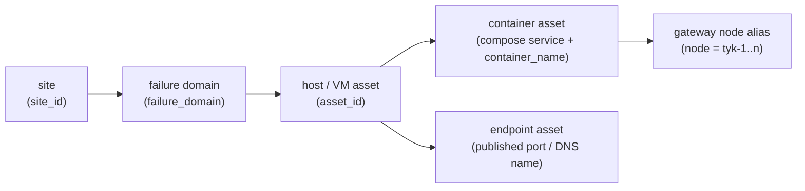

# HA observability — 02. Assets and signal catalog

> **Status:** PROPOSED; owner decisions D-OBS-01…14 **approved 2026-09-27** (recommended defaults, [04 §6](04-roadmap-decisions-validation.md#6-owner-decisions-needed)); **execution not yet authorised**. The schema and the example are **synthetic**. They use documentation
> IP ranges (RFC 5737), the `.example.internal` domain and country code `ZZ`. No real host, IP or location appears
> anywhere in this package.

**State tags** used in every table:
- **existing**: collected today.
- **needs configuration**: the endpoint or data already exists but is not collected or enabled.
- **new integration**: a new exporter, probe or metric.
- **unverified**: the metric or label name is not yet observed in a real scrape of the pinned version.

**Name confidence:**
- ✓ observed on the local runtime (2026-09-27).
- ◐ confirmed in the official docs ([§7](#7-primary-sources)) but not yet scraped here.
- ✗ a standard name that has not been verified. **Write no PromQL against a ✗ name** until it has been scraped.

## 1. Identity model



- **`asset_id` is the stable key.** It is never reused, never derived from an IP, and survives a re-IP or rename.
- **Physical location comes only from a verified site registry.** It never comes from a private IP, and never from public-IP geolocation.

## 2. Inventory schema and sources

### 2.1 Example template (synthetic values only)

```yaml
# inventory/opengateway.example.yaml. Synthetic example; the real file lives in a PRIVATE repository (D-OBS-04).
schema_version: 1
sites:
  - site_id: site-zz-01
    display_name: "Example site 1"
    country: ZZ                  # ISO 3166 user-assigned code = placeholder
    city: "Example City"
    provider: "example-provider" # or "on-prem"
    region: null                 # cloud only
    availability_zone: null      # cloud only
    datacenter: "EX-DC1"
    coordinates: null            # only from a verified contract/provider record
    last_verified_at: "2026-01-01T00:00:00Z"
    verified_by: "platform-owner"
failure_domains:
  - failure_domain: fd-zz-01-a
    site_id: site-zz-01
    scope: rack                  # host | rack | power_feed | az | site
    description: "Rack A, PDU A, ToR switch A"
assets:
  - asset_id: og-zz-h01
    kind: vm                     # physical_host | vm | container | endpoint
    hostname: h01
    fqdn: h01.example.internal
    dns_names: [h01.example.internal]
    ip:
      service: [192.0.2.10]      # RFC 5737 TEST-NET-1
      management: [198.51.100.10] # RESTRICTED view only
      public: []
    identity: { serial: unknown, vm_uuid: unknown, hypervisor: unknown }
    os: { name: unknown, version: unknown }
    site_id: site-zz-01
    rack: unknown                # RESTRICTED
    rack_unit: unknown           # RESTRICTED
    environment: prod            # prod | staging | dev
    cluster: og-prod-zz
    failure_domain: fd-zz-01-a
    roles: [edge, tyk-gateway, api, web]
    owner: platform-team
    oncall: platform-oncall
    criticality: tier-0          # tier-0 (user-facing) … tier-3
    exposure: public-edge        # public-edge | lan | loopback | internal-network
    scrape_targets:
      - { job: node, target: "h01.example.internal:9100" }
      - { job: cadvisor, target: "h01.example.internal:9338" }
    probe_targets:
      - { module: icmp, target: "192.0.2.10" }
    depends_on: []
    last_verified_at: "2026-01-01T00:00:00Z"
  - asset_id: og-zz-h01-tyk-1
    kind: container
    parent_asset_id: og-zz-h01
    compose_project: open-gateway
    compose_service: tyk-gateway
    container_name: open-gateway-tyk-gateway
    node: tyk-1                  # bounded gateway-node alias used as a metric label
    control_url_ref: "TYK_ADMIN_URLS[0]"  # reference, never the URL itself
    image: "tykio/tyk-gateway:v5.15.0"
    image_digest: "sha256:unknown"
    owner: gateway-owner
    criticality: tier-0
    exposure: internal-network
    probe_targets:
      - { module: tyk_hello, target: "http://tyk-gateway:8081/hello" }
    last_verified_at: "2026-01-01T00:00:00Z"
```

- **Unverified fields** are always written as `unknown`, never guessed.
- **Management IPs, rack and rack unit** go in a separate file readable only by the platform owner, or in a sops-encrypted file. The owner decides which (D-OBS-04).

### 2.2 Field ownership, verification and drift

| Field(s) | Authoritative source | Automated verification (proposed) | Drift signal |
|---|---|---|---|
| `asset_id`, `kind`, `roles`, `criticality`, `owner`, `oncall`, `environment`, `cluster`, `failure_domain` | inventory file (PR-reviewed, CODEOWNERS) | schema lint in the inventory repo's CI | — |
| `hostname` | inventory | ✗ `node_uname_info{nodename}` equals `hostname` | AL-MON-08 |
| `fqdn`, `dns_names` | DNS zone | resolve each name and compare with `ip.service`/`ip.public` (blackbox `dns` probe, or the renderer at render time) | AL-MON-08 |
| `ip.service`, `ip.public` | inventory; public IPs from the provider panel | reachability probe from the monitoring hosts; the external vantage for public IPs | probe failure; AL-MON-08 |
| `ip.management` | restricted inventory file | reachability from the monitoring hosts only | probe failure |
| `site`, `country`, `city`, `datacenter`, `rack`, `coordinates` | **manual site registry** (contract, provider record, or a site visit) | human attestation updates `last_verified_at`. **Never** IP geolocation | `last_verified_at` older than 180 d → AL-MON-08 (warning) |
| `provider`, `region`, `availability_zone` | the provider metadata API if cloud; otherwise manual | a renderer check where an API exists | mismatch → AL-MON-08 |
| `compose_project`, `compose_service`, `container_name` | Compose files plus the **proposed** `labels:` (`og.asset_role`, `og.criticality`) | cAdvisor `name` series present on the expected host | expected container missing → AL-CTR-01 |
| `image`, `image_digest` | deploy manifest: `DEPLOY_SHA` and `*_IMAGE` digests (`infra/scripts/deploy-staging.sh`) | a deploy writes `og_deploy_info` (textfile) | digest mismatch vs manifest → DB-12 |
| `scrape_targets`, `probe_targets` | rendered from the inventory | the set of `up`/`probe_success` series equals the inventory set | missing or extra target → AL-MON-08 |
| `last_verified_at` | the renderer (automated fields) plus a human (site fields) | — | stale → AL-MON-08 |

**Rendering.** A small renderer (OG-OBS-00) turns the inventory into three outputs:
1. `file_sd` JSON per job, carrying the bounded labels in §4.
2. A textfile `og_asset_info{asset_id, hostname, site, failure_domain, role, environment} 1`, used for dashboard joins.
3. `og_inventory_last_verified_timestamp_seconds{asset_id}`.

Prometheus picks up `file_sd` changes without a restart (default `refresh_interval: 5m`).

## 3. Signal catalog by layer

- **Default scrape interval** is 15 s, the current global setting (`observability/prometheus.yml:11-12`).
- **Default probe interval** is 30 s.
- **Default retention** is 15 d local; exceptions are noted.
- **Panel and alert IDs** are defined in [03](03-dashboards-alerts-and-runbooks.md). **Work packages** are in [04](04-roadmap-decisions-validation.md).

### 3.1 Host / VM (node_exporter, per host)

| ID | Objective · signal (unit) | Source · state | Example query / name confidence | Labels · cardinality risk | Panel | Alert | Owner / RB | Validate |
|---|---|---|---|---|---|---|---|---|
| HOST-01 | CPU busy (ratio) | node_exporter · new integration | `1 - avg by (asset_id) (rate(node_cpu_seconds_total{mode="idle"}[5m]))` ◐ | `cpu`, `mode` · bounded by core count | DB-03 | AL-HOST-02 | Platform / RB-01 | compare with `mpstat` at OG-OBS-01 acceptance |
| HOST-02 | CPU, memory and I/O pressure (PSI, s/s) | node_exporter · new | `node_pressure_cpu_waiting_seconds_total`, `node_pressure_io_stalled_seconds_total`, `node_pressure_io_waiting_seconds_total`, `node_pressure_irq_stalled_seconds_total`, `node_pressure_memory_stalled_seconds_total`, `node_pressure_memory_waiting_seconds_total` ✓ (observed in lab 2026-09-27) | none extra | DB-03 | AL-HOST-02 | Platform / RB-01 | first scrape lists the names |
| HOST-03 | Load average | node_exporter · new | `node_load1`, `node_load5`, `node_load15` ✓ (observed in lab 2026-09-27) | none | DB-03 | — | Platform | first scrape |
| HOST-04 | Available memory (ratio) | node_exporter · new | `node_memory_MemAvailable_bytes` ✓ / `node_memory_MemTotal_bytes` ✓ (observed in lab 2026-09-27) | none | DB-03 | AL-HOST-03 | Platform / RB-01 | first scrape |
| HOST-05 | Swap in use; OOM kills (count) | node_exporter (vmstat) · new | `node_memory_SwapFree_bytes`, `node_memory_SwapTotal_bytes` ✓; `node_vmstat_oom_kill` ✓, present with a real value, no extra collector flag needed (observed in lab 2026-09-27) | none | DB-03 | AL-HOST-03 | Platform / RB-01 | the VD-01 memory-pressure lab |
| HOST-06 | Filesystem free (ratio), inodes free, read-only | node_exporter · new | `node_filesystem_avail_bytes` ◐, `node_filesystem_readonly` ◐, inodes: `node_filesystem_files`, `node_filesystem_files_free` ✓ (observed in lab 2026-09-27) | `mountpoint`, `device` · **churn from Docker overlay mounts**: exclude `/var/lib/docker/.+` and `/run/.+` | DB-03 | AL-HOST-04/05/06 | Platform / RB-02 | the Docker overlay mounts are absent from the series |
| HOST-07 | Disk utilisation (s/s), latency (s/op), IOPS, throughput | node_exporter · new | `node_disk_io_time_seconds_total` ◐; read/write time and ops: `node_disk_read_time_seconds_total`, `node_disk_write_time_seconds_total`, `node_disk_reads_completed_total`, `node_disk_writes_completed_total` ✓ (observed in lab 2026-09-27) | `device` · bounded | DB-03 | AL-HOST-07 | Platform / RB-02 | first scrape |
| HOST-08 | NIC throughput (B/s), errors, drops | node_exporter · new | `node_network_*` family ◐; errors/drops: `node_network_receive_errs_total`, `node_network_transmit_errs_total`, `node_network_receive_drop_total`, `node_network_transmit_drop_total` ✓ (observed in lab 2026-09-27) | `device` · **veth churn**: exclude `^(veth.*\|br-.*\|docker0)$` | DB-03 | AL-HOST-08 | Platform / RB-03 | no veth series present |
| HOST-09 | Clock offset (s), sync status | node_exporter (timex) · new | `node_timex_offset_seconds`, `node_timex_sync_status`, `node_timex_maxerror_seconds`, `node_timex_estimated_error_seconds` ✓ (observed in lab 2026-09-27) | none | DB-03 | AL-HOST-09 | Platform / RB-03 | first scrape |
| HOST-10 | Reboot / uptime | node_exporter · new | `node_boot_time_seconds` ✓ (observed in lab 2026-09-27) | none | DB-03 | AL-HOST-10 (info) | Platform | reboot in the lab (VD-03) |
| HOST-11 | Resolver health (DNS) | blackbox `dns` from each host · new | `probe_success`, `probe_dns_lookup_time_seconds` ◐ | `instance` = resolver · bounded | DB-03 | AL-HOST-08 | Platform / RB-03 | point at a bogus resolver in the lab |
| HOST-12 | Temperature; RAID/SMART; PSU | hwmon ◐ (physical only); smartctl/IPMI exporter · **unverified: depends on hardware access** | `node_hwmon_*` family ◐ | `chip`, `sensor` · bounded | DB-03 | AL-HOST-11 | Platform | only if a management interface exists (D-OBS-01) |
| HOST-13 | Host reachable (target up), from inside and from outside | Prometheus `up{job="node"}` ◐; external `icmp`/`tcp` probe · new | `up{job="node"} == 0` ◐ | `asset_id` | DB-02 | AL-HOST-01 | Platform / RB-04 | VD-03 |

### 3.2 Docker / Compose (cAdvisor + functional probes, per host)

| ID | Signal (unit) | Source · state | Example query / confidence | Labels · risk | Panel | Alert | Owner / RB | Validate |
|---|---|---|---|---|---|---|---|---|
| CTR-01 | CPU per container (cores) | cAdvisor · new | `rate(container_cpu_usage_seconds_total{name=~"open-gateway-.*"}[5m])` ◐ | `name`, `image`, `id` · **drop `id`** (cgroup path, churns on recreate) | DB-04 | AL-CTR-04 | Platform / RB-05 | first scrape |
| CTR-02 | Working-set memory (bytes); against its limit | cAdvisor · new | `container_memory_working_set_bytes` ◐; limit: `container_spec_memory_limit_bytes` ✓ (observed in lab 2026-09-27), still meaningless until limits are actually set on services (GAP-02) | same | DB-04 | AL-CTR-04 | Platform / RB-05 | first scrape |
| CTR-03 | OOM kills (count) | cAdvisor · new | `increase(container_oom_events_total[15m]) > 0` ◐ | same | DB-04 | AL-CTR-03 | Platform / RB-05 | VD-01 |
| CTR-04 | Expected container missing | cAdvisor + inventory · new | `container_last_seen` ◐ absent for an inventory container | same | DB-04 | AL-CTR-01 | Platform / RB-05 | VD-01 (stop one container) |
| CTR-05 | Restart loop | cAdvisor · new | `changes(container_start_time_seconds{name=~"open-gateway-.*"}[15m]) > 2` ✓ — `container_start_time_seconds` observed with a real value (observed in lab 2026-09-27); this restart-time-change proxy is the adopted `ContainerRestartLoop` expr (`observability/rules/containers.yml`). **cAdvisor has no dedicated restart counter**, confirmed at v0.60.6 across every `--disable_metrics` setting including fully unfiltered — this proxy is the only lever, not a gap | same | DB-04 | AL-CTR-02 | Platform / RB-05 | VD-01 |
| CTR-06 | Network and filesystem I/O | cAdvisor · new | `container_network_*_bytes_total`, `container_fs_usage_bytes` ◐ | same | DB-04 | — | Platform | first scrape |
| CTR-07 | Functional readiness per service (not process existence) | internal blackbox · new | `probe_success{job="internal-http"}` ◐ on `/api/health`, Tyk `:8081/hello` body, Pump `:8083/health`, Ory `/health/ready` | `instance` = endpoint · bounded | DB-02, DB-04 | per-service AL-* | per owner | VD-01 |
| CTR-08 | Container → host placement | cAdvisor series carry the host's `asset_id` target label · new | join on `asset_id` | bounded | DB-04 | — | Platform | inventory host = cAdvisor host |
| CTR-09 | Image and digest actually running | `og_deploy_info{component, image, digest}` textfile written by deploy · new; cAdvisor `image` label ◐ | — | `digest` changes on every deploy · bounded by deploy count | DB-12 | — | Platform | compare with `docker inspect` after a deploy |
| CTR-10 | Log volume and disk growth | node_exporter FS on `/var/lib/docker` · new; **Docker log caps** · needs configuration | HOST-06 | — | DB-03 | AL-HOST-04 | Platform / RB-02 | cap is set on every service |

### 3.3 Edge and traffic

| ID | Signal (unit) | Source · state | Example query / confidence | Labels · risk | Panel | Alert | Owner / RB | Validate |
|---|---|---|---|---|---|---|---|---|
| EDGE-01 | Requests and errors per server/port (req/s, ratio) | Caddy `metrics` global option + an internal `metrics` handler · needs configuration | `caddy_http_requests_total{handler,server}` ✓ — **no `code` or `method` label at all** (observed in lab 2026-09-27); `caddy_http_request_errors_total` **does not exist**, drop it — use `caddy_http_request_duration_seconds_count{code,method,handler,server}` instead, which does carry `code` | `server`, `code`, `method` (on the duration family, not on `requests_total`) · **unknown client methods pass through literally, unmapped** (confirmed in lab): map them to `OTHER` with metric relabelling, this is still required, not optional | DB-05 | AL-EDGE-02 | Gateway / RB-06 | enable in the lab; read the labels |
| EDGE-02 | Request latency at the edge (s) | Caddy · needs configuration | `caddy_http_request_duration_seconds_{bucket,count,sum}{code,handler,method,server,le}` ✓, and `caddy_http_response_duration_seconds_{bucket,count,sum}` (same labels) ✓ (observed in lab 2026-09-27) | same | DB-05, DB-09 | AL-EDGE-03 | Gateway / RB-06 | same |
| EDGE-03 | Upstream health per upstream | Caddy (exposed, unscraped) · needs configuration | `caddy_reverse_proxy_upstreams_healthy` ✓ | `upstream` · bounded | DB-05, DB-06 | AL-EDGE-04 | Gateway / RB-06 | stop `web`; the gauge drops to 0 |
| EDGE-04 | Config reload success | Caddy · needs configuration | `caddy_config_last_reload_successful` ✓ | none | DB-05 | AL-EDGE-05 | Gateway / RB-06 | a bad Caddyfile in the lab |
| EDGE-05 | Served-certificate expiry per port, and trust path | blackbox `http`/`tcp` with `tls_config.ca_file` set to the distributed root · new; existing API gauges | `probe_ssl_earliest_cert_expiry` ◐; `edge_certificate_expiry_timestamp_seconds` ✓ | `instance` · bounded | DB-05 | AL-EDGE-05, EX-05/06 | Security / RB-07 | an expired-certificate fixture (VD-11) |
| EDGE-06 | Would-block WAF detections (DetectionOnly) | OTel count connector · existing | `increase(coraza_rule_detections_total{rule_id="949110"}[5m])` ✓ (empty until a rule fires) | `rule_id` · bounded by CRS | DB-05 | EX-04 | Security / RB-08 | replay a CRS test payload in the lab |
| EDGE-07 | External availability of `:33000`, `:33001`, `:33005`, `:33010`, `:33012` from ≥2 vantage points | external blackbox · new | `probe_success`, `probe_duration_seconds`, `probe_http_status_code` ◐ | `instance`, `vantage` · bounded | DB-02, DB-05 | AL-EDGE-01 | Platform / RB-04 | VD-03 |
| EDGE-08 | Direct TCP `:33020` (bypasses the edge and WAF) | blackbox `tcp_connect` · new | `probe_success{module="tcp_connect"}` ◐ | bounded | DB-05 | AL-EDGE-06 | Gateway / RB-06 | stop the TCP API in the lab |
| EDGE-09 | Public DNS names resolve to the expected IPs | blackbox `dns` · new, **once public names exist** | `probe_success` ◐ | bounded | DB-05 | AL-MON-08 | Platform | wrong-record fixture |
| EDGE-10 | Access log: `request_id`, `traceparent`, `upstream` node | Caddy JSON stdout · existing | log search (L0 is `docker logs`) | high cardinality, **logs only** | — | — | Gateway | find one request by id |

**Probe routes** (decision D-OBS-10 sub-item):
- `:33000`: the web login page. Follow redirects, expect 200.
- `:33001`: `/api/health`.
- `:33005`: needs a **platform-owned synthetic API**, for example a mock-response route with no upstream. Probing a tenant API would measure the tenant.
- `:33010`: `/.well-known/openid-configuration`.
- `:33012`: `/health/ready`.

### 3.4 Tyk nodes (1–3)

| ID | Signal (unit) | Source · state | Example query / confidence | Labels · risk | Panel | Alert | Owner / RB | Validate |
|---|---|---|---|---|---|---|---|---|
| TYK-01 | Node health (`/hello` returns **200 even when Redis is down**: match the body) | internal blackbox with `fail_if_body_not_matches_regexp: '"status":"pass"'` · new | `probe_success{job="tyk-hello"}` ◐; body shape ✓ (`{"status":"pass",…,"details":{"redis":{"status":"pass"…}}}`) | `node` · bounded | DB-06 | AL-TYK-01 | Gateway / RB-09 | VD-02 |
| TYK-02 | Redis as seen by each node | same probe with a second module matching `"redis":{"status":"pass"` · new | `probe_success{job="tyk-hello-redis"}` ◐ | `node` | DB-06 | AL-TYK-02 | Gateway / RB-09 | VD-06 |
| TYK-03 | Config consistency across nodes (**node vs node**, not desired vs effective) | API gauges · existing | `gateway_nodes_in_sync < gateway_nodes_total` ✓ (EX-07) | none | DB-06 | EX-07 | Gateway / RB-10 | hand-edit one node in the lab |
| TYK-04 | Per-node sync state, reachability, fan-out outcome | **new API metrics** `og_tyk_node_in_sync{node}`, `og_tyk_node_reachable{node}`, `og_tyk_fanout_total{node,operation,outcome}` · new | proposed names | `node` (alias, **never a URL**), `operation` (≈12 values), `outcome` (3) | DB-06 | AL-TYK-04 | Gateway / RB-10 | block one node's `:8081` in the lab; see `outcome="error"` |
| TYK-05 | Gateway-added latency vs upstream (ms) | Pump · existing | `histogram_quantile(0.95, sum by (le) (rate(tyk_latency_bucket{type="gateway"}[5m])))` ✓ (`type="gateway"` observed; `"total"` is used by EX-01; `"upstream"` ✗) | `api`, `type` · `api` bounded by API count | DB-06 | AL-TYK-05, EX-01 | Gateway / RB-11 | compare with the warm-connection bench ([01 §4](01-target-architecture.md#4-slis-and-draft-slos)) |
| TYK-06 | Responses by code per API: 5xx, and auth/limit denials 401/403/429 (codes only; **never a matched rule**) | Pump · existing | `sum by (code) (rate(tyk_http_status[5m]))` ✓ | `api`, `code` · bounded | DB-06 | AL-TYK-06 | Gateway / RB-11 | a mock-API 5xx in the lab |
| TYK-07 | Per-node request rate, errors and runtime | Tyk OTel **metrics**, confirmed present at 5.15.0 · needs configuration | `TYK_GW_OPENTELEMETRY_METRICS_ENABLED=true` ✓ (observed in lab 2026-09-27 — gateway logs "Meter provider initialized successfully"). Names: `tyk.http.requests` (Sum, no labels), `tyk.api.requests.total` (Sum; `http.request.method`, `http.response.status_code` as a **string**, `tyk.api.id`), `tyk.gateway.request.duration` / `tyk.upstream.request.duration` (Histogram, s; same labels minus status_code, plus `tyk.response_flag`), `http.server.request.duration` (Histogram, s; adds status_code) ✓ — see `F-lab-names.md` §10 for the full table | `tyk.api.id` (opaque, not `api_name`), `http.request.method`, `http.response.status_code` · bounded. **No `node` label or equivalent exists** on metrics or resource attributes — `tyk.gw.id` is a random per-process id, not the `tyk-1..n` alias; getting `node` needs a distinct `TYK_GW_OPENTELEMETRY_RESOURCENAME` per gateway process, mapped to `node` at the collector/relabel stage | DB-06 | — | Gateway | a lab export listing the names |
| TYK-08 | Traces | Tyk OTel `AlwaysOn` → collector `debug` · existing (not a backend) | — | — | — | — | Gateway | L1 decision |

### 3.5 PostgreSQL

| ID | Signal (unit) | Source · state | Example query / confidence | Labels · risk | Panel | Alert | Owner / RB | Validate |
|---|---|---|---|---|---|---|---|---|
| PG-01 | Up | postgres_exporter · new | `pg_up == 0` ◐ | `instance` | DB-07 | AL-DATA-01 | Data / RB-12 | VD-05 lab |
| PG-02 | Connections vs `max_connections` (ratio) | postgres_exporter · new | `pg_stat_activity_count{application_name,backend_type,datname,state,usename,wait_event,wait_event_type}` / `pg_settings_max_connections` ✓ (observed in lab 2026-09-27). **Cardinality caution:** `application_name`/`usename` are free-text-shaped — use `sum without(application_name,usename,wait_event,wait_event_type) (pg_stat_activity_count)` in any alert/panel, never the raw metric | `datname` · bounded (opengateway, hydra, kratos, keto) | DB-07 | AL-DATA-02 | Data / RB-12 | first scrape |
| PG-03 | Commits, rollbacks, deadlocks (/s) | postgres_exporter `database` collector ◐ · new | `pg_stat_database_xact_commit{datid,datname}`, `pg_stat_database_xact_rollback{datid,datname}`, `pg_stat_database_deadlocks{datid,datname}` ✓ (observed in lab 2026-09-27) | `datname` | DB-07 | AL-DATA-03 | Data / RB-12 | first scrape |
| PG-04 | Locks by mode | postgres_exporter `locks` collector ◐ · new | `pg_locks_count{datname,mode}` ✓ (observed in lab 2026-09-27) | `mode`, `datname` · bounded (9 modes × db count, confirmed) | DB-07 | AL-DATA-03 | Data | first scrape |
| PG-05 | WAL archiving: successes, failures, age of last archive | postgres_exporter `stat_archiver` ◐ · new | `pg_stat_archiver_archived_count`, `pg_stat_archiver_failed_count` ✓ (observed in lab 2026-09-27) — both counters only, **no age/timestamp metric exists in the default collector** at v0.20.1 (checked case-insensitively, none found); age needs a custom-queries YAML addition, new work not just config | none | DB-07 | AL-DATA-04 | Data / RB-13 | make `/wal_archive` read-only in the lab |
| PG-06 | Database size and data-volume free space | `pg_database_size_bytes{datname}` ✓ (observed in lab 2026-09-27), a more direct route than the HOST-06 proxy below; node_exporter FS · new | HOST-06 on the Docker volume mount (still valid as a volume-level check) | bounded | DB-07 | AL-HOST-04 | Data / RB-02 | first scrape |
| PG-07 | Replication lag | `stat_replication` ◐ · **only if a replica exists** (D-OBS-06) | `pg_replication_is_replica`, `pg_replication_lag_seconds`, `pg_replication_last_replay_seconds` ✓ (observed in lab 2026-09-27, single-node — all global/unlabelled there; per-replica labels not observable without a built replica) | bounded | DB-07 | AL-DATA-05 | Data / RB-12 | VD-05 |
| PG-08 | Base-backup freshness | `pg-backup.sh` writes `og_backup_last_success_timestamp_seconds{kind="pg_base"}` to a textfile · new (marker `/backups/.last-success` exists) | `time() - og_backup_last_success_timestamp_seconds > 26*3600` | `kind` | DB-07 | AL-BKP-01 | Data / RB-13 | stop `postgres-backup` in the lab |
| PG-09 | Restore-drill success | `pg-restore-scratch.sh` writes `og_restore_drill_last_success_timestamp_seconds` on exit 0 · new | age > 35 d | none | DB-07 | AL-BKP-02 | Data / RB-13 | VD-12 |
| PG-10 | Off-host copy freshness | off-host copy job · new, conditional (D-OBS-14) | age > 26 h | `destination` · bounded | DB-07 | AL-BKP-03 | Data / RB-13 | VD-12 |

### 3.6 Redis

| ID | Signal (unit) | Source · state | Example query / confidence | Labels · risk | Panel | Alert | Owner / RB | Validate |
|---|---|---|---|---|---|---|---|---|
| RDS-01 | Up | redis_exporter · new | `redis_up == 0` ◐ | `instance` | DB-07 | AL-DATA-06 | Data / RB-14 | VD-06 |
| RDS-02 | Memory used vs max (ratio) | API gauges · existing; exporter · new | `redis_used_memory_bytes / (redis_maxmemory_bytes > 0)` ✓ (EX-03) | `redis` | DB-07 | EX-03 | Data / RB-14 | — |
| RDS-03 | Evictions; **rejected writes under `noeviction`** | API gauge ✓ (EX-02 cannot fire under `noeviction`); rejection stats from the exporter ✓, but coarser than hoped (observed in lab 2026-09-27) | **No OOM/`noeviction`-specific counter exists.** Closest: `redis_commands_failed_calls_total{cmd}`, `redis_commands_rejected_calls_total{cmd}` — per-command, doesn't isolate the failure reason | none | DB-07 | EX-02, AL-DATA-07 | Data / RB-14 | fill Redis in the lab |
| RDS-04 | Clients, blocked clients | exporter · new | `redis_connected_clients`, `redis_blocked_clients` ✓ (observed in lab 2026-09-27) | none | DB-07 | — | Data | first scrape |
| RDS-05 | AOF and RDB health (last write/bgsave status, rewrite in progress) | exporter · new | `redis_aof_last_write_status`, `redis_aof_last_bgrewrite_status`, `redis_rdb_last_bgsave_status` (1=ok), `redis_rdb_last_save_timestamp_seconds` (unix ts — gives age directly), `redis_rdb_bgsave_in_progress`, `redis_aof_rewrite_in_progress` ✓ (observed in lab 2026-09-27) | none | DB-07 | AL-DATA-08 | Data / RB-14 | make the volume read-only in the lab |
| RDS-06 | Analytics buffer backlog (Pump lag) | exporter `--check-keys` on the analytics key pattern · new | `redis_key_size{db,key}` (LLEN for a list) ✓ (observed in lab 2026-09-27) | `key` limited to **one** pattern · **cardinality risk confirmed real**: each matching key gets its own series — safe only if Pump writes one fixed key/list platform-wide; unbounded if keys are per-org (verify against Pump's actual Redis key scheme before wiring AL-PUMP-03) | DB-10 | AL-PUMP-03 | Gateway / RB-15 | stop Pump in the lab |
| RDS-07 | Replica link and Sentinel quorum | exporter · **only if Sentinel is built** (D-OBS-07) | ✗ | bounded | DB-07 | AL-DATA-09 | Data | VD-06 |

### 3.7 Identity (Ory)

| ID | Signal (unit) | Source · state | Example query / confidence | Labels · risk | Panel | Alert | Owner / RB | Validate |
|---|---|---|---|---|---|---|---|---|
| IDP-01 | HTTP rate, 5xx, duration per service | Hydra `:4445/admin/metrics/prometheus` ✓, Kratos `:4434/admin/metrics/prometheus` ✓, Keto `:4466/metrics/prometheus` ✓; scraped **via the edge's internal GET-only allowlist proxy** · needs configuration | `http_requests_total`, `http_requests_duration_seconds_*`, `http_requests_statuses_total` ✓; labels: `app`, `buildTime`, `code`, `endpoint`, `hash`, `method`, `version` (plus `status_bucket` — `2xx`/`3xx`/`4xx` — on `http_requests_statuses_total`) ✓ (observed in lab 2026-09-27) | `endpoint` is **already route-templated by Ory itself** (e.g. Hydra: `/admin/clients/{param}`, not a raw client id) — no raw-path label was observed on any Ory service, so **no relabeling is needed**; the earlier "drop or map to a template" caution is resolved, not just filled in | DB-08 | AL-IDP-02 | Identity / RB-16 | first scrape via the proxy |
| IDP-02 | Keto check latency and errors | Keto gRPC metrics ✓ · needs configuration | `grpc_server_handled_total`, `grpc_server_handling_seconds_*` ✓; `grpc_method` ✓ (observed in lab 2026-09-27, 11 values: BatchCheck, Check, DeleteRelationTuples, Expand, GetVersion, List, ListNamespaces, ListRelationTuples, ServerReflectionInfo, TransactRelationTuples, Watch) | `grpc_method` · bounded (11 values, confirmed) | DB-08 | AL-IDP-04 | Identity / RB-16 | first scrape |
| IDP-03 | Readiness | blackbox `/health/ready` (Kratos via `:33012`, Hydra via `:33010`, Keto via the internal proxy) · new | `probe_success` ◐ | bounded | DB-08 | AL-IDP-01 | Identity / RB-16 | VD-07 |
| IDP-04 | OIDC discovery and JWKS served (token-issuance precondition) | blackbox on `:33010/.well-known/openid-configuration` and the `jwks_uri` · new | `probe_success` ◐ | bounded | DB-08 | AL-IDP-03 | Identity / RB-16 | VD-07 |
| IDP-05 | Synthetic login | **not in the first iteration.** It needs a dedicated, tenant-less monitoring identity and a secret (D-OBS-11) | — | — | — | — | Identity | — |
| IDP-06 | Courier (email) failures | Kratos JSON logs only · existing (logs) | log search | — | — | — | Identity | L1 decision |

### 3.8 API and web

| ID | Signal (unit) | Source · state | Example query / confidence | Labels · risk | Panel | Alert | Owner / RB | Validate |
|---|---|---|---|---|---|---|---|---|
| APP-01 | API and web availability, 5xx, p95/p99 as seen at the edge | Caddy per-server metrics (EDGE-01/02) · needs configuration | per `server` for `:33001` and `:33000` | bounded | DB-09 | AL-APP-02, AL-APP-03 | App / RB-17 | VD-01 |
| APP-02 | API functional health | blackbox `/api/health` in-network and through the edge · new | `probe_success` ◐; body shape ✓ (`{"status":"ok","checks":{postgres,redis,gateway}}`) | bounded | DB-09 | AL-APP-01 | App / RB-17 | VD-01 |
| APP-03 | Web up (it has no health route: every path answers 307) | blackbox following redirects to the login page · new | `probe_success` ◐ | bounded | DB-09 | AL-APP-04 | App / RB-17 | stop `web` in the lab |
| APP-04 | Node runtime: event-loop lag, heap, RSS, GC | prom-client defaults · existing | `nodejs_*`, `process_*` ✓ | none | DB-09 | AL-APP-05 | App / RB-17 | — |
| APP-05 | Route-level API latency (diagnostic only) | optional prom-client histogram `og_http_request_duration_seconds{route,method,status_class}` · new, **optional** | proposed | `route` = Nest route **template** (bounded ~150) · never a raw path | DB-09 | — | App | a unit test that the labels use templates |
| APP-06 | Background job outcomes: reconcile (60 s), analytics retention (03:00), spec-source fetch | new `og_job_runs_total{task,outcome}` (renamed from `job` to `task` — a `job` label collides with Prometheus's own target `job` label and gets rewritten to `exported_job`); existing `og_spec_source_oldest_overdue_seconds` ✓ (not alerted yet, `docs/OAS-SPEC-SOURCE.md:148`) | proposed | `task` (≈5), `outcome` (2) | DB-09 | AL-APP-06 | App / RB-17 | a failing-job unit test |
| APP-07 | Tenant-isolation and authorisation denials, **without tenant labels** | new `og_authz_denied_total{reason}` where `reason` is `tenant_mismatch\|missing_permission\|no_tenant` | proposed | `reason` (3) | DB-09 | — (trend only) | Security | a two-tenant denial test |

### 3.9 Pump and analytics

| ID | Signal (unit) | Source · state | Example query / confidence | Labels · risk | Panel | Alert | Owner / RB | Validate |
|---|---|---|---|---|---|---|---|---|
| PUMP-01 | Pump scrape target up | Prometheus · existing | `up{job="tyk-pump"}` ✓ (EX-08) | — | DB-10 | EX-08 | Gateway / RB-15 | stop Pump in the lab |
| PUMP-02 | Pump liveness | internal blackbox `:8083/health` · new | `probe_success` ◐ | — | DB-10 | AL-PUMP-01 | Gateway / RB-15 | — |
| PUMP-03 | **Analytics freshness.** On 2026-09-27 a stuck Pump logged `Error on Purge Loop … lookup redis: i/o timeout` for ~11.5 h while `/health` stayed OK | new API gauge `og_analytics_newest_record_age_seconds` (platform-wide `max(timestamp)`, no tenant label) | proposed | none | DB-10 | AL-PUMP-02 | Gateway / RB-15 | block Pump→Redis in the lab |
| PUMP-04 | Redis analytics backlog | RDS-06 | — | — | DB-10 | AL-PUMP-03 | Gateway / RB-15 | — |
| PUMP-05 | Redaction trigger present (the traffic view fails closed without it) | new gauge `og_analytics_redaction_trigger_present` from the existing `pg_trigger` check | proposed | none | DB-10 | AL-PUMP-04 | Gateway / RB-15 | drop the trigger in a throwaway Postgres |
| PUMP-06 | Retention job ran | APP-06 `task="analytics_retention"` | proposed | — | DB-10 | AL-APP-06 | Gateway | — |
| PUMP-07 | **Cardinality control:** `tyk_http_status_per_key{key}`, `_per_path{path}` and `_per_oauth_client{client_id}` are unbounded and privacy-sensitive; `tyk_http_requests_total` carries `api_name` (tenant text) | Pump `disabled_metrics` ◐ and a Prometheus `labeldrop: api_name` · needs configuration | `count by (__name__)({job="tyk-pump"})` must not include the per-key/path/client families | — | DB-11 | AL-MON-03 (series growth) | Platform | a scrape after the change |

### 3.10 Monitoring itself

| ID | Signal | Source · state | Example query / confidence | Panel | Alert | Owner / RB | Validate |
|---|---|---|---|---|---|---|---|
| MON-01 | Pipeline heartbeat | `Watchdog` rule `vector(1)` → Alertmanager → external heartbeat · new | ◐ (pattern) | DB-11 | AL-MON-00 | Platform / RB-18 | VD-09, VD-10 |
| MON-02 | Every target reachable | `up` for **all** jobs (EX-08 lists only three) · existing, **extend** | `up == 0` ◐ | DB-11 | AL-MON-01 | Platform / RB-18 | stop one target |
| MON-03 | Scrape health and series growth | `scrape_duration_seconds`, `scrape_samples_scraped`, `scrape_series_added`, `prometheus_tsdb_head_series` ◐ | `prometheus_tsdb_head_series` needs a **self-scrape job, currently absent** | DB-11 | AL-MON-03 | Platform | — |
| MON-04 | Rule evaluation failures | `prometheus_rule_evaluation_failures_total` ◐ · needs a self-scrape | `increase(...[10m]) > 0` | DB-11 | AL-MON-02 | Platform / RB-18 | load a broken rule in the lab |
| MON-05 | Notifications dropped / Alertmanager unreachable | `prometheus_notifications_dropped_total`, `prometheus_notifications_queue_length` ◐ | `increase(prometheus_notifications_dropped_total[10m]) > 0` | DB-11 | AL-MON-04 | Platform / RB-18 | VD-10 |
| MON-06 | Alertmanager cluster and delivery | `alertmanager_cluster_members` ✓, `alertmanager_notifications_failed_total` ✓ · new (standalone `v0.34.1` in the lab — Alertmanager itself is still not deployed, this was name capture only) | `alertmanager_cluster_members` (gauge, no labels) ✓; `alertmanager_notifications_failed_total{integration,reason}` ✓ (14 integrations × 7 reasons, bounded) (observed in lab 2026-09-27) | DB-11 | AL-MON-05, AL-MON-06 | Platform / RB-18 | VD-10 |
| MON-07 | OTel collector drops and queue | `otelcol_exporter_send_failed_*`, `otelcol_exporter_queue_size`/`_capacity` ✓ · needs configuration (legacy `telemetry.metrics.address`, still works at 0.121.0 with a deprecation warning) | `otelcol_exporter_send_failed_spans{exporter}`, `otelcol_exporter_queue_size{data_type,exporter}`/`_capacity{data_type,exporter}` — **no `_total` suffix on any of these, confirmed** by forcing a real export failure in the lab (observed in lab 2026-09-27) | DB-11 | AL-MON-07 | Platform | kill the exporter target in the lab |
| MON-08 | TSDB and monitoring disk | HOST-06 on the `prometheus_data` mount · new | — | DB-11 | AL-MON-09 | Platform / RB-02 | — |
| MON-09 | Inventory freshness and drift | `og_inventory_last_verified_timestamp_seconds`, a target-set comparison · new | proposed | DB-01 | AL-MON-08 | Platform | stale-entry fixture |
| MON-10 | Monitoring stack stopped (the §6 incident) | external heartbeat silence and external probes · new | — | — | AL-MON-00 | Platform / RB-18 | VD-09 |

### 3.11 Logs and traces

| ID | Signal | Source · state | Notes |
|---|---|---|---|
| LOG-01 | API request logs | pino JSON · existing | `x-request-id` from the edge, `traceparent`, redacts `authorization`/`cookie`/`x-tyk-authorization` (`apps/api/src/app.module.ts:40-54`). **Add** `asset_id` and `node` via pino base bindings from env (`OG_ASSET_ID`), so a log line resolves to a host |
| LOG-02 | Edge access and WAF logs | Caddy JSON · existing; `waf.log` · existing, **unrotated** | the edge is the trusted source of `X-Request-Id`; rotate `waf.log` (OG-OBS-01) |
| LOG-03 | Ory, Tyk and Pump logs | JSON / text on stdout · existing | Pump purge-loop errors exist only here, which is why PUMP-03 is needed |
| LOG-04 | Docker log retention | `json-file`, **uncapped** except for otel · needs configuration | cap every service; size-based retention is the only retention at L0 |
| TRC-01 | Traces | API (opt-in env) + Tyk (`AlwaysOn`) → collector `debug` · existing, **not a backend** | add resource attributes `service.version`, `deployment.environment` and the host `asset_id`. Backend: decision L0/L1/L2 ([01 §8](01-target-architecture.md#8-logs-and-traces-options-not-assumptions)) |

## 4. Label policy

**Allowed on metrics** (versioned as `inventory_label_schema: 1`; any change is a reviewed PR):

| Label | Values | Source | Max cardinality |
|---|---|---|---|
| `environment` | `prod`, `staging`, `dev` | inventory → `file_sd` | 3 |
| `site` | `site_id` | inventory | number of sites |
| `failure_domain` | failure-domain id | inventory | number of failure domains |
| `asset_id` | host or VM asset id (the bounded host identifier) | inventory | number of hosts |
| `role` | the role enum (`edge`, `tyk-gateway`, `api`, …) | inventory | ~15 |
| `node` | gateway alias `tyk-1..n` | inventory `node` | number of nodes |
| `vantage` | probe origin (`internal`, `ext-1`, `ext-2`) | probe config | ≤ 4 |
| `replica` | `a`, `b` (Prometheus `external_labels`; dropped before alerting) | config | 2 |
| `job`, `instance` | Prometheus defaults. `instance` should be a DNS name, **not an IP**, so IPs stay off shared dashboards | config | number of targets |

**Forbidden on metrics** (use logs or the inventory instead):
- client IP;
- `tenant_id`, `org_id`;
- API key, key hash, OAuth `client_id`;
- user id, email;
- raw request path or URL;
- `api_name` (tenant free text);
- `request_id`, `trace_id`;
- IP addresses as label values;
- `hostname` on high-volume series. It goes in `og_asset_info`, joined with `on(asset_id) group_left(hostname, site)`.

**Where each fact lives:**

| Fact | Inventory | Metric label | Logs | Dashboard lookup |
|---|---|---|---|---|
| asset id, site, failure domain, role, node | ✓ | ✓ | ✓ (LOG-01) | ✓ |
| hostname, FQDN | ✓ | only via `og_asset_info` | pino default `hostname` | ✓ |
| service / public IP | ✓ | ✗ | edge logs (client IP) | restricted panel |
| management IP, rack, rack unit | ✓ (restricted file) | ✗ | ✗ | restricted panel only |
| tenant id, API id | ✗ | `api` (Tyk API id) on tenant-scoped dashboards only | access-controlled logs | tenant-scoped views, not the fleet views |
| request id, trace id | ✗ | ✗ | ✓ | link from a panel to a log search |

## 5. Cardinality and retention model (summary)

- **Series per source:**
  - node_exporter: ~800–1,500 per host, after the mount and veth exclusions (lab measurement on a dev host with extra hwmon/nvme sensors ran ~2,600–2,800; treat this range as host-hardware-dependent, not a fixed number — re-measure per target host type).
  - cAdvisor: ~70–85 per container with the recommended `--disable_metrics` set (measured: 71/container; 84/container at cAdvisor's own compiled-in default; 230/container fully unfiltered), after dropping `id` and disabling unused metric groups.
  - blackbox: ~10–15 per probe.
  - postgres_exporter: ~550–600 per instance at this scale (measured: 563 on a 4-database lab instance) — most of it is the static `pg_settings_*` GUC dump (~180 series), not traffic-driven; scales mainly with the number of databases via `pg_stat_activity_count`/`pg_locks_count`, not with query volume.
  - redis_exporter: ~240 per instance (measured: 241 idle, default config, no `--check-keys` matches yet).
  - Ory (Hydra/Kratos/Keto), if all three are scraped through the edge proxy: ~250 (Kratos), ~585 (Hydra), **~640 (Keto)** — **Keto's cost is mostly a static, traffic-independent floor**: its `grpc_server_handled_total`/`grpc_server_handling_seconds_*` families pre-register the full `grpc_method` × `grpc_service` × `grpc_code` cross-product at scrape time (11 methods × ~10 services × several gRPC status codes, almost all zero-valued at idle) — this is not "bounded by observed combinations" in the usual traffic-driven sense used elsewhere in this section, it is bounded by the *server's own instrumentation surface*, present from the first scrape regardless of load.
  - Pump: the base families scale with the number of APIs × codes, **once per-key/path/client are disabled**.
  - Caddy: roughly the number of servers × codes × methods × histogram buckets.

  The full model with formulas and low/expected/high scenarios is in [04 §4](04-roadmap-decisions-validation.md#4-capacity-and-cost-model).
- **Relabel rules** that ship with OG-OBS-01/02:
  - `labeldrop: [id]` on cAdvisor;
  - `labeldrop: [api_name]` on Pump;
  - Pump `disabled_metrics` for the per-key/path/OAuth-client families;
  - node_exporter mount and device excludes;
  - map unknown Caddy methods to `OTHER`.
- **Retention:**
  - Metrics stay at 15 d local (the current setting); add `--storage.tsdb.retention.size` at ≤ 80–85 % of the volume.
  - Logs are size-capped under L0.
  - Traces have no retention until L1 is decided.
  - Longer metric retention needs D-OBS-09 (and M3 only if > 90 d).

## 6. Inventory ownership and exposure

- **Public repo:** the schema, this synthetic example and the renderer.
- **Private repo:** the real inventory and the restricted file (D-OBS-04).
- **Site-wide dashboards** show `asset_id`, hostname, site and role. **Management IPs and rack positions** appear only in a restricted panel or folder.
- **A geographic map** is optional, and only from verified site `coordinates`.
- **No unauthenticated topology dashboard** is published.

## 7. Primary sources

These are research inputs. None of them proves that a feature is present in OpenGateway.

- **Prometheus.**
  - [Alertmanager HA](https://prometheus.io/docs/alerting/latest/high_availability/): send to all instances, gossip dedup.
  - [storage and sizing](https://prometheus.io/docs/prometheus/latest/storage/): retention × samples/s × 1–2 B/sample.
  - [file-based SD](https://prometheus.io/docs/guides/file-sd/).
  - [naming and labels](https://prometheus.io/docs/practices/naming/).
  - [multi-target exporter pattern](https://prometheus.io/docs/guides/multi-target-exporter/).
  - [node_exporter guide](https://prometheus.io/docs/guides/node-exporter/) and [README](https://github.com/prometheus/node_exporter): host PID, host network and rootfs flags; current v1.12.x.
  - [cAdvisor guide](https://prometheus.io/docs/guides/cadvisor/): no restart counter.
  - [blackbox_exporter](https://github.com/prometheus/blackbox_exporter).
  - [postgres_exporter](https://github.com/prometheus-community/postgres_exporter) (`pg_monitor` role).
- **Other exporters.** [redis_exporter](https://github.com/oliver006/redis_exporter).
- **Caddy.** [metrics](https://caddyserver.com/docs/metrics): the `metrics` option is required for HTTP metrics since 2.8. [coraza-caddy](https://github.com/corazawaf/coraza-caddy) exposes no Prometheus metrics.
- **Tyk.**
  - [logs and metrics](https://tyk.io/docs/api-management/logs-metrics): no native Prometheus endpoint in the Gateway; OTel metrics since 5.13 (docs are unpinned, verify on 5.15.0).
  - [health check](https://tyk.io/docs/planning-for-production/ensure-high-availability/health-check): `/hello` returns 200 even when a dependency fails.
  - [Tyk Pump README](https://github.com/TykTechnologies/tyk-pump/blob/master/README.md): `tyk_latency`, `disabled_metrics`, `custom_metrics`.
- **Ory.** [observability](https://www.ory.com/docs/self-hosted/operations/observability): metrics on the admin ports. Paths observed here differ slightly (see IDP-01).
- **OpenTelemetry.**
  - [internal telemetry](https://opentelemetry.io/docs/collector/internal-telemetry/): at 0.121.0 use the legacy `metrics.address`.
  - [debug exporter](https://github.com/open-telemetry/opentelemetry-collector/blob/main/exporter/debugexporter/README.md): troubleshooting only.
  - [count connector](https://github.com/open-telemetry/opentelemetry-collector-contrib/tree/main/connector/countconnector).
- **Grafana stack.** [Grafana requirements](https://grafana.com/docs/grafana/latest/setup-grafana/installation/): HA needs an external database. [Loki sizing](https://grafana.com/docs/loki/latest/setup/size/). [Tempo planning](https://grafana.com/docs/tempo/latest/set-up-for-tracing/setup-tempo/plan/).
- **Meta-monitoring.** [End-to-end Watchdog alerts](https://training.promlabs.com/training/monitoring-and-debugging-prometheus/metrics-based-meta-monitoring/end-to-end-watchdog-alerts/) (PromLabs training, not a vendor doc).
