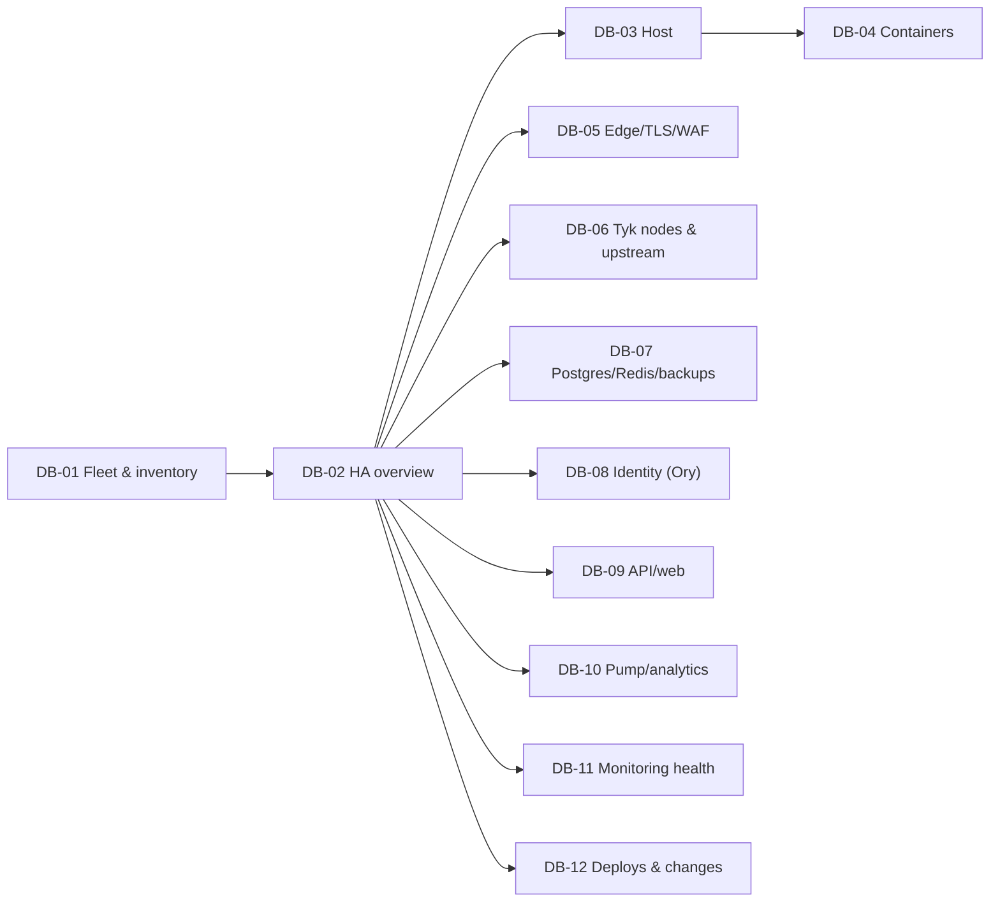

# HA observability — 03. Dashboards, alerts and runbooks

> **Status:** PROPOSED; owner decisions D-OBS-01…14 **approved 2026-09-27** (recommended defaults, [04 §6](04-roadmap-decisions-validation.md#6-owner-decisions-needed)); **execution not yet authorised**.
> - **Grafana is approved for internal use only** (D-OBS-11, 2026-09-27) but **not built yet**. It was deliberately cut earlier (`observability/README.md:4-6`). If it is not adopted, the panel list below doubles as a catalog of saved Prometheus queries.
> - **No alert is delivered today.** The 11 existing rules evaluate, but no receiver exists, and Prometheus itself was found stopped ([00 §6](00-current-state-and-gaps.md#6-live-observation-monitoring-stopped-and-nobody-knew)).
> - Signal IDs (HOST-01, TYK-04, …) refer to [02](02-assets-and-signal-catalog.md).

## 1. Dashboard navigation



| ID | Dashboard | Audience · access | Key panels | Answers |
|---|---|---|---|---|
| DB-01 | Fleet & inventory | Platform/SRE · internal. **Management IPs and rack live in a restricted sub-panel/folder** | asset table (`og_asset_info` joined with `up`): asset_id, hostname, site, failure domain, role, owner, `last_verified_at`; inventory drift (MON-09); optional site map from **verified** coordinates only | Which host and IP? Which site? Is the inventory current? |
| DB-02 | HA overview | on-call · internal | per failure domain: hosts up (HOST-13), external probe matrix per port × vantage (EDGE-07), Tyk nodes pass/total (TYK-01), `gateway_nodes_in_sync/total` (TYK-03), Postgres/Redis up, Watchdog heartbeat age, open critical alerts | Is the platform serving? Which failure domain is degraded? |
| DB-03 | Host drilldown (variable: `asset_id`) | Platform/SRE | CPU (HOST-01/02), memory/OOM (HOST-04/05), filesystem incl. `/var/lib/docker` and volume mounts (HOST-06), disk latency (HOST-07), NIC errors (HOST-08), clock offset (HOST-09), boot time (HOST-10), hwmon (HOST-12). Header: asset_id, hostname, site, approved service IP | Is the host saturated or failing? |
| DB-04 | Container drilldown (vars: `asset_id`, `name`) | Platform/SRE | CPU and memory per container (CTR-01/02), OOM/restarts (CTR-03/05), missing containers (CTR-04), functional probes (CTR-07), placement (CTR-08), running image/digest (CTR-09) | Which container on which host? Which version? |
| DB-05 | Edge, TLS, WAF | Gateway, Security | per port: rate, 5xx, p95/p99 (EDGE-01/02); upstream health (EDGE-03); config reload (EDGE-04); certificate expiry per port and per chain role (EDGE-05, EX-05/06); would-block detections by `rule_id` (EDGE-06); `:33020` TCP probe (EDGE-08), **labelled "bypasses edge/WAF"** | Is ingress healthy and trusted? |
| DB-06 | Tyk nodes & upstream (var: `node`) | Gateway owner | per-node `/hello` and Redis status (TYK-01/02); node-vs-node sync (TYK-03/04, **labelled "node vs node, not desired vs effective"**); fan-out outcomes (TYK-04); gateway-added vs total latency (TYK-05); codes by API incl. 401/403/429 (TYK-06, **codes, not matched rules**) | Which Tyk node? Which upstream/API? Gateway or upstream? |
| DB-07 | Data: Postgres, Redis, backups | Data owner | Postgres up/connections/locks/WAL archive (PG-01…05); replication (PG-07, only if built); Redis memory/rejects/persistence/backlog (RDS-*); backup, off-host copy and restore-drill age (PG-08…10) | Is data safe? What is the current RPO exposure? |
| DB-08 | Identity (Ory) | Identity owner | readiness (IDP-03), OIDC discovery/JWKS (IDP-04), HTTP 5xx and latency per service (IDP-01), Keto check latency (IDP-02) | Can users log in and get tokens? |
| DB-09 | API & web | App owner | edge-observed availability/5xx/p95/p99 for `:33001` and `:33000` (APP-01); `/api/health` and web probes (APP-02/03); event-loop lag, heap, RSS (APP-04); job outcomes (APP-06); authz denials by reason (APP-07) | Is the control plane usable? |
| DB-10 | Pump & analytics | Gateway owner | Pump up/health (PUMP-01/02); **freshness** (PUMP-03); Redis backlog (PUMP-04); redaction trigger present (PUMP-05); retention job (PUMP-06); Pump series count (PUMP-07) | Are analytics current and safe? |
| DB-11 | Monitoring health | Platform/SRE | targets up by job, scrape duration, head series, rule failures, notifications dropped, Alertmanager cluster/delivery, OTel exporter failures, TSDB disk, Watchdog heartbeat age (MON-*) | Can we trust silence? |
| DB-12 | Deploys & changes | everyone internal | `og_deploy_info` timeline (CTR-09) as annotations on DB-02/05/06/09; Caddy config reloads; Tyk sync/reload events (TYK-04); inventory changes | What changed, and when? |

### 1.1 Answering the operator's questions

| Question | Where it is answered |
|---|---|
| Which host and IP? | alert labels carry `asset_id`; DB-01 resolves it to hostname and approved service IP (management IP: restricted) |
| Which site / failure domain? | `site` and `failure_domain` labels on every target (from `file_sd`) |
| Which Tyk node? | `node` label (`tyk-1..n`) on TYK-01/02/04 series; edge access log field `upstream` for a single request |
| Which version? | DB-04/DB-12 via `og_deploy_info` (digest); Tyk `/hello` `version` (`5.15.0` observed) |
| Which upstream? | Pump `api` label (Tyk API id) → the product's API detail page, which is **tenant-scoped**. Fleet views show counts only |
| What changed? | DB-12 annotations: deploy, Caddy reload, Tyk sync, inventory change |
| Which services and tenants could be affected? | the inventory `depends_on` graph gives services. For tenants, the gateway owner runs a tenant-scoped query in the product's analytics (by `tykApiId`). **Fleet dashboards never list tenants** |

### 1.2 External status versus internal views

- **External status** is optional (D-OBS-11). It shows per-service `operational / degraded / outage`, derived only from SLIs such as EDGE-07 and IDP-04. It carries no host names, IPs, sites or tenant data, and is published from a system outside the platform's failure domain.
- **Internal views** sit behind authentication, in three folders or roles:
  - `fleet`: platform, gateway and data owners.
  - `restricted-infra`: platform owners only. Holds management IPs, rack positions and coordinates.
  - `security`: WAF and certificates.
- **Tenant analytics stay in the product UI**, with its existing permissions (`analytics:read`, `api:update`). They are never mirrored into Grafana.

## 2. Severity and routing

| Severity | Meaning | Route (proposed; channel is D-OBS-03) | Response |
|---|---|---|---|
| `critical` | user impact now, or data-loss / RPO risk | page the on-call (24×7 or business hours — owner decides) | ack ≤ 15 min (PROPOSED) |
| `warning` | degradation, saturation trend, lost redundancy | team chat or ticket | next business day, or before the trend reaches critical |
| `info` | context: reboot, deploy | none; dashboard annotation | — |
| heartbeat | `Watchdog` | **external heartbeat receiver only**, never a human | the external service pages when the heartbeat goes silent |

**Grouping and deduplication.**
- `group_by: [alertname, environment, site, failure_domain]`, with `group_wait 30s`, `group_interval 5m`, `repeat_interval 4h`.
- In M2, both Prometheus replicas send to all Alertmanagers. `replica` is dropped via `alert_relabel_configs`, so identical alerts dedup.

**Inhibition.**
- `HostDown` (AL-HOST-01) inhibits `warning` and `critical` alerts carrying the same `asset_id`.
- `SiteUnreachable` (AL-SITE-01, scenario C only) inhibits host alerts that share its `site`.
- `Watchdog` is **never** inhibited.

**Maintenance.**
- Silences must have a matcher on `asset_id` or `node`, an owner, a comment, and an expiry of 4 h or less.
- A silence never matches `Watchdog`.
- A global "silence everything" is forbidden. The runbook requires the narrowest matcher.

**End-to-end verification** (VD-10):
- Continuous: the Watchdog heartbeat must arrive at least every 1 min, and the external receiver alerts after 5 min of silence.
- Monthly: fire a synthetic `critical` test alert (for example `amtool alert add` with a `test="true"` label) and record the channel receipt time. The target is ≤ 2 min.
- A rule is **not** counted as delivered until its route has passed this test.

Illustrative Alertmanager routing. The version is not pinned yet. Receiver URLs come from secret files, and the pinned version's `*_file` option must be verified first.

```yaml
route:
  receiver: team-chat
  group_by: [alertname, environment, site, failure_domain]
  routes:
    - matchers: [alertname="Watchdog"]
      receiver: external-heartbeat
      repeat_interval: 1m
    - matchers: [severity="critical"]
      receiver: oncall-page
    - matchers: [severity="info"]
      receiver: blackhole
inhibit_rules:
  - source_matchers: [alertname="HostDown"]
    target_matchers: [severity=~"warning|critical"]
    equal: [asset_id]
```

## 3. Alert catalog

Conventions:
- **Expr** uses only names that were observed (✓) or confirmed in the docs (◐), or metrics this package proposes (*proposed*). Anything else is a **TODO**, with the reason given.
- **Threshold** means a draft value. Every threshold is PROPOSED until the baseline measurement in OG-OBS-03.
- **Scope** means the labels that locate the fault.

### 3.1 Existing rules (preserved; `observability/rules/open-gateway.yml`)

| ID | Rule | Keep? | Proposed change | Delivery status |
|---|---|---|---|---|
| EX-01 | `GatewayLatencyP95High` (`type="total"` > 1000 ms, 5m, warning) | keep | it includes **upstream** time, so it mostly measures tenants. Route it to chat. AL-TYK-05 covers the gateway's own overhead | not delivered |
| EX-02 | `RedisEvictingKeys` | keep | cannot fire under `noeviction`; kept as a guard in case the policy changes | not delivered |
| EX-03 | `RedisMemoryHigh` | keep | — | not delivered |
| EX-04 | `CorazaWouldBlockSpike` | keep | route to `security` | not delivered |
| EX-05 | `EdgeRootCertificateExpiringSoon` | keep | pair it with the probe-based AL-EDGE-05 | not delivered |
| EX-06 | `EdgeCertificateRenewalStalled` | keep | — | not delivered |
| EX-07 | `GatewayNodesOutOfSync` | keep | add per-node detail via TYK-04 | not delivered |
| EX-08 | `MetricsTargetDown` (3 jobs) | keep until AL-MON-01 is proven, then retire | — | not delivered |
| EX-09…11 | `*MetricsAbsent` guards | keep | add the same guard for new sources (AL-BKP-04, AL-MON-03) | not delivered |

### 3.2 Monitoring itself (deliver first)

| ID | Name · symptom | Expr / TODO | Draft threshold · for | Sev | Scope | Owner · route | RB | Test |
|---|---|---|---|---|---|---|---|---|
| AL-MON-00 | `Watchdog`: always firing; its *absence* is the alert | `vector(1)` ◐ | — | heartbeat | — | Platform · external heartbeat | RB-18 | VD-09, VD-10 |
| AL-MON-01 | `TargetDown`: a scrape target is unreachable | `up == 0` ◐ | 2m | critical if `role` is tier-0, else warning | job, asset_id, role | Platform | RB-18 | stop one exporter in the lab |
| AL-MON-02 | `RuleEvaluationFailures` | `increase(prometheus_rule_evaluation_failures_total[10m]) > 0` ◐ (**needs a self-scrape job**) | 0m | warning | replica | Platform | RB-18 | load a broken rule in the lab |
| AL-MON-03 | `SeriesBudgetExceeded`: cardinality growth | `prometheus_tsdb_head_series > <budget>` ◐ | budget = 2× the baseline · 30m | warning | replica | Platform | RB-18 | — |
| AL-MON-04 | `NotificationsDropped` | `increase(prometheus_notifications_dropped_total[10m]) > 0` ◐ | 0m | critical (and the Watchdog silence catches a total loss) | replica | Platform | RB-18 | VD-10 |
| AL-MON-05 | `AlertmanagerClusterDegraded` | `alertmanager_cluster_members` ✓ (observed in lab 2026-09-27, gauge, no labels) | < expected size · 5m | warning | instance | Platform | RB-18 | stop one AM (VD-09) |
| AL-MON-06 | `AlertmanagerNotificationsFailing` | `increase(alertmanager_notifications_failed_total{integration,reason}[5m]) > 0` ✓ (observed in lab 2026-09-27) | rate > 0 · 5m | critical | integration | Platform | RB-18 | VD-10 (broken receiver) |
| AL-MON-07 | `OtelExporterFailing` | `increase(otelcol_exporter_send_failed_spans{exporter}[10m]) > 0` ✓ — **no `_total` suffix, confirmed** by forcing a real send failure in the lab 2026-09-27 | increase > 0 · 10m | warning | exporter | Platform | RB-18 | point the exporter at a dead sink in the lab |
| AL-MON-08 | `InventoryDriftOrStale` | *proposed* `og_inventory_last_verified_timestamp_seconds`; a target-set comparison | age > 30 d (automated fields), 180 d (site fields) · 1h | warning | asset_id | Platform | RB-18 | a stale-entry fixture |
| AL-MON-09 | `MonitoringDiskFillingUp` | `predict_linear(node_filesystem_avail_bytes{mountpoint=~".*prometheus.*"}[6h], 24*3600) < 0` ◐ | 30m | warning | asset_id | Platform | RB-02 | — |

### 3.3 Host and site

| ID | Name · symptom | Expr / TODO | Threshold · for | Sev | Scope | Owner | RB | Test |
|---|---|---|---|---|---|---|---|---|
| AL-HOST-01 | `HostDown`: the host is unreachable. **In scenario A, only the external vantage can fire this**, because the internal Prometheus runs on that host | internal `up{job="node"} == 0` ◐; external `probe_success{module="icmp"} == 0` ◐ | 2m | critical | asset_id, site, failure_domain | Platform | RB-04 | VD-03 |
| AL-SITE-01 | `SiteUnreachable` (scenario C only) | every external probe to one `site` is failing | 3m | critical | site | Platform | RB-04 | VD-04 |
| AL-HOST-02 | `HostCpuSaturated` | `1 - avg by (asset_id) (rate(node_cpu_seconds_total{mode="idle"}[5m])) > 0.9` ◐; PSI names ✓ (observed in lab 2026-09-27: `node_pressure_cpu_waiting_seconds_total` etc., see 02 §3.1) | 0.9 · 15m | warning | asset_id | Platform | RB-01 | — (no load test authorized) |
| AL-HOST-03 | `HostMemoryLow` / OOM kill | `node_memory_MemAvailable_bytes / node_memory_MemTotal_bytes < 0.10` ◐; `increase(node_vmstat_oom_kill[10m]) > 0` ✓ (observed in lab 2026-09-27) | 0.10 · 10m | critical | asset_id | Platform | RB-01 | VD-01 |
| AL-HOST-04 | `HostDiskWillFillIn24h` | `predict_linear(node_filesystem_avail_bytes{fstype!~"tmpfs\|overlay"}[6h], 24*3600) < 0` ◐ | 30m | warning | asset_id, mountpoint | Platform | RB-02 | — |
| AL-HOST-05 | `HostDiskAlmostFull` | `node_filesystem_avail_bytes / node_filesystem_size_bytes < 0.10` ✓ (size name observed in lab 2026-09-27) | 0.10 · 5m | critical | asset_id, mountpoint | Platform | RB-02 | fill a scratch volume in the lab |
| AL-HOST-06 | `HostFilesystemReadOnly` | `node_filesystem_readonly{mountpoint!~"/sys.*\|/proc.*"} == 1` ◐ | 1m | critical | asset_id, mountpoint | Platform | RB-02 | remount read-only in the lab |
| AL-HOST-07 | `HostDiskLatencyHigh` | read/write time and ops names ✓ (observed in lab 2026-09-27): `node_disk_read_time_seconds_total`, `node_disk_write_time_seconds_total`, `node_disk_reads_completed_total`, `node_disk_writes_completed_total` — draft expr still needs a real baseline (no load test authorized here) | baseline p95 × 3 · 15m | warning | asset_id, device | Platform | RB-02 | — |
| AL-HOST-08 | `HostNetworkErrorsOrDns` | `increase(node_network_receive_errs_total[10m]) + increase(node_network_transmit_errs_total[10m]) + increase(node_network_receive_drop_total[10m]) + increase(node_network_transmit_drop_total[10m]) > 0` ✓ (names observed in lab 2026-09-27); `probe_success{job="dns"} == 0` ◐ | > 0 sustained · 10m | warning | asset_id, device | Platform | RB-03 | bogus resolver in the lab |
| AL-HOST-09 | `HostClockSkew` | `abs(node_timex_offset_seconds) > 0.05` ✓ (offset and `node_timex_sync_status` names observed in lab 2026-09-27) | \|offset\| > 50 ms · 10m | warning | asset_id | Platform | RB-03 | — |
| AL-HOST-10 | `HostRebooted` | `changes(node_boot_time_seconds[1h]) > 0` ✓ (observed in lab 2026-09-27) | — | info | asset_id | Platform | — | VD-03 |
| AL-HOST-11 | `HostHardwareFault` (temperature, RAID, PSU) | conditional on hardware access (D-OBS-01) | vendor limits | warning | asset_id | Platform | RB-01 | — |

### 3.4 Containers

| ID | Name · symptom | Expr / TODO | Threshold · for | Sev | Scope | Owner | RB | Test |
|---|---|---|---|---|---|---|---|---|
| AL-CTR-01 | `ExpectedContainerMissing` | *proposed* `og_expected_container{asset_id,name}` (rendered from the inventory) `unless on(asset_id,name) (time() - container_last_seen < 120)` ◐ | 2m | critical (tier-0), else warning | asset_id, name | Platform | RB-05 | VD-01 |
| AL-CTR-02 | `ContainerRestartLoop` | `changes(container_start_time_seconds{name=~"open-gateway-.*"}[30m]) > 2` — the proxy remains the `container_start_time_seconds` restart-time-change count; **confirmed cAdvisor has no restart counter at v0.60.6** (checked with `disable_metrics` unset, default, and fully unfiltered — no such family exists) ✓ (observed in lab 2026-09-27) | > 2 in 30m | warning | asset_id, name | Platform | RB-05 | VD-01 |
| AL-CTR-03 | `ContainerOomKilled` | `increase(container_oom_events_total{name=~"open-gateway-.*"}[15m]) > 0` ◐ | 0m | critical | asset_id, name | Platform | RB-05 | VD-01 |
| AL-CTR-04 | `ContainerNearMemoryLimit` | TODO: meaningful only **after limits exist** (GAP-02) | > 0.9 of the limit · 10m | warning | asset_id, name | Platform | RB-05 | — |

### 3.5 Edge

| ID | Name · symptom | Expr / TODO | Threshold · for | Sev | Scope | Owner | RB | Test |
|---|---|---|---|---|---|---|---|---|
| AL-EDGE-01 | `ExternalProbeFailing`: a port fails from ≥2 vantage points | `count by (instance) (probe_success{vantage=~"ext-.*"} == 0) >= 2` ◐ | 2m | critical | instance (port), site | Platform | RB-04 | VD-03 |
| AL-EDGE-02 | `Edge5xxRatioHigh` | **corrected, not just verified:** `caddy_http_requests_total{handler,server}` has **no `code` label at all** (observed in lab 2026-09-27) — the original expr would return nothing. Use the duration histogram's `_count` instead, which does carry `code`: `sum by (server)(rate(caddy_http_request_duration_seconds_count{code=~"5.."}[5m])) / sum by (server)(rate(caddy_http_request_duration_seconds_count[5m]))` ✓ | 0.05 · 10m (baseline) | warning | server | Gateway | RB-06 | a mock 5xx upstream in the lab |
| AL-EDGE-03 | `EdgeLatencyHigh` | labels ✓ (observed in lab 2026-09-27): `code`, `handler`, `method`, `server`, `le`; `histogram_quantile(0.95, sum by (le,server) (rate(caddy_http_request_duration_seconds_bucket[5m])))` | baseline-based · 10m | warning | server | Gateway | RB-06 | — |
| AL-EDGE-04 | `EdgeUpstreamUnhealthy` | `caddy_reverse_proxy_upstreams_healthy == 0` ✓ | 1m | critical for a site's only upstream (api, web, hydra, kratos); warning for one of several Tyk nodes | upstream | Gateway | RB-06 | stop `web` in the lab |
| AL-EDGE-05 | `EdgeCertExpiringOrReloadFailed` | `(probe_ssl_earliest_cert_expiry - time()) < 7*86400` ◐; `caddy_config_last_reload_successful == 0` ✓ | < 7 d warning, < 2 d critical; reload 5m | warning/critical | instance | Security | RB-07 | VD-11 |
| AL-EDGE-06 | `TcpPassthroughDown` (`:33020`, which bypasses the edge and WAF) | `probe_success{job="tcp-33020"} == 0` ◐ | 2m | warning | instance | Gateway | RB-06 | — |

### 3.6 Tyk gateway

| ID | Name · symptom | Expr / TODO | Threshold · for | Sev | Scope | Owner | RB | Test |
|---|---|---|---|---|---|---|---|---|
| AL-TYK-01 | `TykNodeDown`: `/hello` fails, or its body is not `pass` | `probe_success{job="tyk-hello"} == 0` ◐ | 1m | warning per node; **critical** if `sum(probe_success{job="tyk-hello"}) == 0` | node, asset_id | Gateway | RB-09 | VD-02 |
| AL-TYK-02 | `TykNodeRedisFailing` | `probe_success{job="tyk-hello-redis"} == 0` ◐ | 1m | critical | node | Gateway | RB-09 | VD-06 |
| AL-TYK-04 | `TykFanoutPartialFailure` | *proposed* `increase(og_tyk_fanout_total{outcome!="ok"}[10m]) > 0` | 0m | warning | node, operation | Gateway | RB-10 | block one node's `:8081` in the lab |
| AL-TYK-05 | `GatewayOverheadHigh`: the gateway's own share of latency | `histogram_quantile(0.95, sum by (le) (rate(tyk_latency_bucket{type="gateway"}[5m]))) > 20` ✓ (ms) | 20 ms · 10m (PROPOSED) | warning | — (add `node` once TYK-07 exists) | Gateway | RB-11 | compare with the warm-connection bench |
| AL-TYK-06 | `UpstreamErrorRateHigh` (usually tenant-caused) | `sum by (api)(rate(tyk_http_status{code=~"5.."}[5m])) / sum by (api)(rate(tyk_http_status[5m])) > 0.05` ✓ | 0.05 · 10m | warning → **chat, never a page** | api (Tyk id) | Gateway | RB-11 | a mock 5xx API in the lab |

### 3.7 Data and backups

| ID | Name · symptom | Expr / TODO | Threshold · for | Sev | Scope | Owner | RB | Test |
|---|---|---|---|---|---|---|---|---|
| AL-DATA-01 | `PostgresDown` | `pg_up == 0` ◐ | 1m | critical | instance | Data | RB-12 | VD-05 |
| AL-DATA-02 | `PostgresConnectionsHigh` | `sum without(application_name,usename,wait_event,wait_event_type) by (datname) (pg_stat_activity_count) / on(datname) group_left pg_settings_max_connections > 0.8` ✓ (observed in lab 2026-09-27) — `application_name`/`usename` must be summed away, see 02 §3.5 PG-02 cardinality note | > 0.8 of max · 10m | warning | datname | Data | RB-12 | — |
| AL-DATA-03 | `PostgresDeadlocksOrRollbacks` | `increase(pg_stat_database_deadlocks{datname!~"template.*"}[10m]) > 0` ✓ (observed in lab 2026-09-27) | above baseline · 10m | warning | datname | Data | RB-12 | — |
| AL-DATA-04 | `WalArchiveFailing`: RPO at risk | `increase(pg_stat_archiver_failed_count[15m]) > 0` ✓ (failure-count name observed in lab 2026-09-27) — the **age half stays TODO**: postgres_exporter v0.20.1's default collector has no last-archived-time/age metric at all (checked exhaustively), needs a custom-queries YAML addition, new work not just a name fix | any failure, or age > 15 min (3 × `archive_timeout`) | critical | instance | Data | RB-13 | read-only `/wal_archive` in the lab |
| AL-DATA-05 | `PostgresReplicationLag` (only if a replica exists) | `pg_replication_lag_seconds > 60` ✓ (name observed in lab 2026-09-27; single-node lab, so the metric was global/unlabelled there — a real replica's label shape wasn't observable) | > 60 s · 5m (PROPOSED) | warning → critical | instance | Data | RB-12 | VD-05 |
| AL-DATA-06 | `RedisDown` | `redis_up == 0` ◐ | 1m | critical | instance | Data | RB-14 | VD-06 |
| AL-DATA-07 | `RedisRejectingWrites` (`noeviction` fails loudly) | `increase(redis_commands_failed_calls_total[1m]) > 0` ✓ but **coarse**: no OOM-specific error-reason breakdown exists in this exporter version, so this also fires on any other command failure, not only `noeviction` rejections (observed in lab 2026-09-27) | > 0 · 1m | critical | instance | Data | RB-14 | fill Redis in the lab |
| AL-DATA-08 | `RedisPersistenceFailing` | `redis_aof_last_write_status == 0 or redis_aof_last_bgrewrite_status == 0 or redis_rdb_last_bgsave_status == 0` ✓ (observed in lab 2026-09-27) | not ok · 5m | warning | instance | Data | RB-14 | read-only volume in the lab |
| AL-DATA-09 | `RedisReplicaOrQuorumLost` (only if Sentinel exists) | TODO ✗ | 1m | critical | instance | Data | RB-14 | VD-06 |
| AL-BKP-01 | `PostgresBackupStale` | *proposed* `time() - og_backup_last_success_timestamp_seconds{kind="pg_base"} > 26*3600` | 26 h | critical | kind | Data | RB-13 | stop `postgres-backup` in the lab |
| AL-BKP-02 | `RestoreDrillOverdue` | *proposed* `time() - og_restore_drill_last_success_timestamp_seconds > 35*86400` | 35 d | warning | — | Data | RB-13 | VD-12 |
| AL-BKP-03 | `OffHostCopyStale` (conditional, D-OBS-14) | *proposed* `og_offhost_copy_last_success_timestamp_seconds` age > 26 h | 26 h | critical | destination | Data | RB-13 | VD-12 |
| AL-BKP-04 | `BackupMetricAbsent` (guard) | `absent(og_backup_last_success_timestamp_seconds)` | 30m | warning | — | Data | RB-13 | — |

### 3.8 Identity, API/web and analytics

| ID | Name · symptom | Expr / TODO | Threshold · for | Sev | Scope | Owner | RB | Test |
|---|---|---|---|---|---|---|---|---|
| AL-IDP-01 | `OryNotReady` | `probe_success{job="ory-ready"} == 0` ◐ | 2m | critical | instance | Identity | RB-16 | VD-07 |
| AL-IDP-02 | `Ory5xxRatioHigh` | `sum by (app) (rate(http_requests_statuses_total{status_bucket="5xx"}[5m])) / sum by (app) (rate(http_requests_statuses_total[5m]))` ✓ (labels observed in lab 2026-09-27: `app`, `buildTime`, `hash`, `method`, `status_bucket`, `version`; `endpoint` is already route-templated by Ory, see 02 §3.7 IDP-01) | 0.05 · 10m | warning | service | Identity | RB-16 | — |
| AL-IDP-03 | `OidcDiscoveryOrJwksFailing` | `probe_success{job="oidc"} == 0` ◐ | 2m | critical | instance | Identity | RB-16 | VD-07 |
| AL-IDP-04 | `KetoCheckLatencyHigh` | `histogram_quantile(0.95, sum by (le,grpc_method) (rate(grpc_server_handling_seconds_bucket{grpc_method=~"Check\|BatchCheck"}[5m])))` ✓ (`grpc_method` observed in lab 2026-09-27, bounded to 11 values, see 02 §3.7 IDP-02) | baseline-based · 10m | warning | method | Identity | RB-16 | — |
| AL-APP-01 | `ApiHealthFailing` | `probe_success{job="api-health"} == 0` ◐ | 2m | critical | vantage | App | RB-17 | VD-01 |
| AL-APP-02 | `Api5xxRatioHigh` (edge-observed on `:33001`) | Caddy labels ✓ — same correction as AL-EDGE-02: use `caddy_http_request_duration_seconds_count{code=~"5..",server="..33001.."}`, not `caddy_http_requests_total` (no `code` label there) | 0.05 · 10m | warning | server | App | RB-17 | — |
| AL-APP-03 | `ApiLatencyHigh` | Caddy labels ✓ (observed in lab 2026-09-27, see AL-EDGE-03): `histogram_quantile(0.95, sum by (le) (rate(caddy_http_request_duration_seconds_bucket{server="..33001.."}[5m])))` | p95 > 500 ms · 10m (PROPOSED) | warning | server | App | RB-17 | — |
| AL-APP-04 | `WebDown` | `probe_success{job="web-login"} == 0` ◐ | 2m | critical | vantage | App | RB-17 | stop `web` in the lab |
| AL-APP-05 | `NodeEventLoopLagHigh` | `nodejs_eventloop_lag_p99_seconds > 0.5` ✓ | 10m | warning | job | App | RB-17 | — |
| AL-APP-06 | `BackgroundJobFailing` | *proposed* `increase(og_job_runs_total{task,outcome="error"}[1h]) > 0` (label renamed `job`→`task`: `job` collides with Prometheus's own target `job` label, rewritten to `exported_job`). `og_spec_source_oldest_overdue_seconds` ✓ is **only alerted once its runbook exists** (`docs/OAS-SPEC-SOURCE.md:148`) | 0m | warning | task | App | RB-17 | a failing-job unit test |
| AL-PUMP-01 | `PumpHealthFailing` | `probe_success{job="pump-health"} == 0` ◐ | 2m | warning | — | Gateway | RB-15 | stop Pump in the lab |
| AL-PUMP-02 | `AnalyticsStale`: the Pump is stuck while "healthy" | *proposed* `og_analytics_newest_record_age_seconds > 300`, **gated on traffic observed by the edge, not by Pump** (TODO: Caddy `:33005` rate labels). A Pump-derived traffic gate would stop firing exactly when Pump stops | 300 s · 10m | warning | — | Gateway | RB-15 | block Pump→Redis in the lab (VD-08) |
| AL-PUMP-03 | `AnalyticsBacklogGrowing` | `redis_key_size{key="<the Pump analytics key>"}` growing ✓ (name observed in lab 2026-09-27 via `--check-keys=analytics-*`) — **verify the exact key first**: every matching key becomes its own series, safe only if Pump uses one fixed key/list platform-wide (see 02 §3.6 RDS-06) | growing for 15m | warning | — | Gateway | RB-15 | VD-08 |
| AL-PUMP-04 | `RedactionTriggerMissing` (unredacted capture at rest) | *proposed* `og_analytics_redaction_trigger_present == 0` | 5m | critical → **security** route | — | Security | RB-15 | drop the trigger in a throwaway Postgres |

## 4. Runbooks

### 4.1 Template (every RB-xx follows it)

```markdown
# RB-xx <title>
Owner role: <role> · Alerts: <AL-…> · Dashboards: <DB-…>
## Symptom
## Impact (who / what / since when)
## First checks (read-only, in order)
- queries / dashboard panels / `docker ps`, `docker inspect`, `docker logs --tail` (never print secrets)
## Safe mitigation (least risky first; each step reversible)
## Rollback of the mitigation
## Escalate when
## Evidence to record
- alert start/end times, detection delay, actions and exact command exits, observed recovery time (NOT an invented SLO)
```

### 4.2 Index

| RB | Title | First checks | Safe mitigation (summary) |
|---|---|---|---|
| RB-01 | Host CPU/memory saturation, OOM | DB-03 → DB-04, top containers by CPU/memory; `dmesg` OOM lines | identify the offender. Restart only a stateless container. Add limits via change control, never ad hoc |
| RB-02 | Disk full or read-only (Docker logs, `waf.log`, TSDB, Postgres/Redis volumes) | DB-03 mounts; largest paths | rotate or truncate **logs only**. Never delete Postgres WAL by hand: `pg_archivecleanup` via `pg-backup.sh` only |
| RB-03 | Network, DNS, clock | DB-03 NIC and time; resolver probe | fix the resolver or NTP; no data-path change |
| RB-04 | Host or site unreachable | DB-02 external matrix; the heartbeat service | console or provider; scenario B: confirm the VIP moved; declare an incident |
| RB-05 | Container crash, OOM, restart loop, missing | DB-04; `docker inspect` exit code / OOM flag; `docker logs --tail` | `docker compose up -d <svc>` for an explicitly stopped container. **Check who stopped it** ([00 §6](00-current-state-and-gaps.md#6-live-observation-monitoring-stopped-and-nobody-knew)) |
| RB-06 | Edge 5xx or latency, upstream unhealthy, `:33020`, reload failure | DB-05, DB-09; Caddy JSON access log by `request_id` | restart the edge only knowing the ~4.5 s gap; revert the Caddyfile on a reload failure |
| RB-07 | Certificate expiry or trust path | DB-05; EX-05/06; `infra/edge/README.md` trust steps | internal CA: check `caddy_data` and leaf renewal; re-distribute the root |
| RB-08 | WAF would-block spike (DetectionOnly) | DB-05 `rule_id`; WAF log | observe only; tune false positives in a staged change. No blocking mode without its own plan |
| RB-09 | Tyk node down, or Redis failing from a node | DB-06 `/hello` body; the API's `GET /gateway/nodes/health` | restart the node container. If Redis, go to RB-14 |
| RB-10 | Tyk partial fan-out or node drift | DB-06; `GET /apis/:id/drift` (`api:read`); HTTP 207 `nodes[]` | `POST /apis/:id/sync` (`api:sync`) or `POST /gateway/reload`, then **read back** the drift. These are manual repair levers, not a versioned rollback (engineering guidelines, §6) |
| RB-11 | Gateway latency or upstream errors | DB-06 `type="gateway"` vs `"total"`; codes by API | gateway overhead: node resources (RB-01). Upstream: notify the tenant via a tenant-scoped channel; no platform action |
| RB-12 | Postgres down, connections, locks, lag | DB-07 | no promotion without the owner. Scenario B: promotion procedure (to be written with D-OBS-06) |
| RB-13 | Backup, WAL archive, off-host copy, restore drill | DB-07; `pg-restore-scratch.sh --list`; `docs/deployment.md:415-509` | re-run the backup; fix the archive target; run the drill in scratch only |
| RB-14 | Redis down, memory, rejects, persistence | DB-07; EX-02/03 | never switch to `allkeys-lru` (see the WP12b/R3 comment, `infra/docker-compose.yml:289-312`); drain the analytics backlog (RB-15); resize via change control |
| RB-15 | Pump stale or backlog; redaction trigger missing | DB-10; Pump logs (`Error on Purge Loop`); `/analytics/health` | restart Pump (this cleared the 2026-09-27 stuck-Redis case). **Trigger missing is a security incident**: the traffic view already fails closed; check the retention job's reinstall |
| RB-16 | Ory not ready, errors, OIDC/JWKS | DB-08; `/health/ready`; container logs | restart the affected service; check its DB (RB-12) |
| RB-17 | API/web down, 5xx, latency, event loop, jobs | DB-09; pino logs by `request_id` | restart the stateless container; roll back to the previous image digest (DB-12) |
| RB-18 | Monitoring pipeline: Watchdog silent, targets down, delivery failing, rule failures | DB-11; the external heartbeat console; `docker ps -a` for `prometheus` / `alertmanager` | start the stopped monitoring containers; fix the receiver; confirm the Watchdog heartbeat resumes; record the blind interval |
