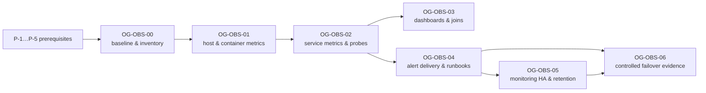

# HA observability — 04. Roadmap, decisions and validation

> **Status:** owner decisions D-OBS-01…14 **approved 2026-09-27** (recommended defaults, [04 §6](04-roadmap-decisions-validation.md#6-owner-decisions-needed)).
> - **OG-OBS-00, 01 and 02 are implemented as repo changes** (2026-09-27, uncommitted). They were verified in throwaway lab containers and are **not deployed**: the running stack has not been restarted or recreated. Deploying them needs a separate owner go-ahead and the checklist in [§3.1](#31-deployment-go-ahead-checklist-og-obs-0102).
> - OG-OBS-03…06, the drills and the other tests below remain a **design for later authorised work**. None of it may be executed until the owner approves it and, for OG-OBS-06, gives written authorisation per environment.
> - Effort ranges are estimates under the stated assumptions. They are not a schedule.
> - **Later change (go-live prep, 2026-10-01):** the `tyk-healthcheck` and `edge-healthcheck` services named in step P-1 no longer exist, so its command is now `docker compose -f infra/docker-compose.yml up -d prometheus`. The step is a dated record and is left as written.

## 1. Sequencing

| Track | Work packages | Needs new hosts? |
|---|---|---|
| **Quick wins on one host** (scenario A) | OG-OBS-00, 01, 02, 03, 04 (M1), plus the **external** vantage and heartbeat | no. The only outside dependency is a small external vantage or a SaaS heartbeat (D-OBS-02) |
| **True multi-host HA** | OG-OBS-05 (M2) and the multi-host drills in OG-OBS-06. **Application HA** (ingress VIP, Postgres standby, Redis Sentinel) is a separate plan these depend on | yes (D-OBS-01) |

**Effort assumptions.**
- Scenario A, one host, about 25 containers, 1–3 Tyk nodes.
- One engineer who knows the repo, with a lab runtime available.
- Ranges exclude owner decision time and the 14–30 day baseline wait.
- Every new service follows the Compose checklist in [01 §6](01-target-architecture.md#6-secure-collection-paths): ADR, `open-gateway-*` name, `DENIED_HOSTS` entry, network review, `prod-preflight.sh` check if it holds a secret.

## 2. Prerequisites

| ID | Prerequisite | Why | Owner action |
|---|---|---|---|
| P-1 | ✅ **Done 2026-09-27**: restarted the stopped monitoring containers | Prometheus and both health sidecars have been down since 2026-09-27 12:42Z ([00 §6](00-current-state-and-gaps.md#6-live-observation-monitoring-stopped-and-nobody-knew)) | `docker compose -f infra/docker-compose.yml up -d prometheus tyk-healthcheck edge-healthcheck`, then find out who stopped them |
| P-2 | Rotate `TYK_GW_SECRET` and remove the committed-default fallback (`infra/docker-compose.yml:68,660`) | control-API traffic crosses hosts in scenario B; the engineering guidelines (§6) require rotating the previously exposed value | secret rotation drill (guidelines, priority "First") |
| P-3 | Add a git remote and complete one real CI and staging run | deploy markers and digest provenance need a real pipeline; `git remote -v` is empty | owner |
| P-4 | Provide the real inventory data (hosts, IPs, sites, owners) | the plan must not invent infrastructure | owner, in a private repo (D-OBS-04) |
| P-5 | Written authorisation per drill and environment | drills stop services; the local dev stack also runs other work | owner |

## 3. Work packages

### OG-OBS-00 Baseline and inventory decisions

| Item | Detail |
|---|---|
| Scope | Record the D-OBS decisions. Adopt the inventory schema v1 and label schema v1 ([02 §2, §4](02-assets-and-signal-catalog.md#2-inventory-schema-and-sources)). Build the inventory renderer. Fix doc drift (GAP-18) by marking the Grafana/Loki/Tempo text as *not deployed* |
| Repo paths (proposed) | `infra/inventory/schema.json` (JSON Schema), `infra/inventory/opengateway.example.yaml` (synthetic, the same content as 02 §2.1), `infra/scripts/render-inventory.mjs` plus a unit test. Real data goes to a **private** repo |
| Owner role | Platform/SRE, with the product owner for decisions |
| Depends on | P-4, D-OBS-01, 02, 03, 04 |
| Effort | 2–4 days after decisions |
| Risk | Management IPs leak into the public repo. Mitigate with a separate restricted file, CODEOWNERS, and a CI check rejecting non-RFC 5737 IPs in `infra/inventory/` |
| Acceptance | **AT-1** The renderer turns the example into valid `file_sd` JSON and the `og_asset_info` textfile (unit test). **AT-2** Site fields default to `unknown`, and the schema rejects a duplicate or missing `asset_id`. **AT-3** The hostname and IP verification design (MON-09) is proven against one lab host. **AT-4** Decisions are recorded in §6 |
| Rollback | Docs and scripts only; the renderer is unused until OG-OBS-01 |
| Status | **Implemented in repo 2026-09-27.** Schema, synthetic example, renderer, and an 11-case `node --test` suite. The suite includes the RFC 5737-only IP guard, and CI runs it as a guard step. Probe targets render to `file_sd/probe-<module>.json`. Those job names must be aligned with the blackbox jobs in `observability/prometheus.yml` when `file_sd` is wired in (OG-OBS-03). AT-3 (the MON-09 lab host) is still open |

### OG-OBS-01 Host and container metrics (single-host quick win)

| Item | Detail |
|---|---|
| Scope | Add `node-exporter` and `cadvisor` services (ADR-OBS-01). Set a **`logging:` cap on every service**. Rotate `waf.log`. Add a Prometheus self-scrape job and a healthcheck, plus `--storage.tsdb.retention.size`. Enable OTel self-telemetry (legacy `service.telemetry.metrics.address`). Add relabel rules ([02 §5](02-assets-and-signal-catalog.md#5-cardinality-and-retention-model-summary)) |
| Repo paths | `infra/docker-compose.yml`, `observability/prometheus.yml`, `observability/otel-collector.yaml`, `infra/edge/Caddyfile` (`waf.log` roll options), `apps/api/src/modules/api-management/dto/proxy-url.validator.ts` (`DENIED_HOSTS` += `node-exporter`, `cadvisor`), `observability/rules/` (AL-HOST-*, AL-CTR-*, AL-MON-01/02/03/09), `observability/README.md` |
| Owner role | Platform/SRE |
| Depends on | OG-OBS-00 label schema. Provisional single-host labels are acceptable |
| Effort | 3–5 days, including lab verification of every ✗ name |
| Risk | Privileged exporters (host PID and network, `/var/run` rw): security review. Cardinality from overlay mounts and veth devices. Log caps can drop forensic logs, so size the caps generously |
| Acceptance | **AT-1** node_exporter series exist, with no `/var/lib/docker` overlay mounts and no veth devices. **AT-2** cAdvisor CPU and memory exist for every `open-gateway-*` container, and `id` is dropped. **AT-3** A lab memory hog triggers `container_oom_events_total` and AL-CTR-03 fires in the lab (VD-01). **AT-4** `docker inspect` shows a `LogConfig` max-size on every service. **AT-5** Prometheus self-metrics and the healthcheck work. **AT-6** The Compose host-denylist test passes (`proxy-url.validator.spec.ts:91-116`). **AT-7** `check-no-k8s.sh` and `check-docs-paths.sh` pass. **AT-8** Every ✗ name in 02 is upgraded to ✓, or its rule stays TODO |
| Rollback | Revert the Compose, Prometheus and collector changes. The exporters are stateless |
| Status | **Implemented in repo 2026-09-27, lab-verified, not deployed.** node-exporter uses the host netns but listens only on the docker0 gateway `172.17.0.1:9100`; Prometheus scrapes it as `host.docker.internal:9100` (see ADR-OBS-01). cAdvisor `v0.60.6` comes from `ghcr.io`, because `gcr.io` stopped at v0.55.1. It runs with a measured `--disable_metrics` set (71 series per container), a label allowlist, and `/dev/kmsg` + `SYSLOG` so OOM events are recorded. Every service has a json-file 50m×5 log cap. All images are pinned by digest. AT-3 was proven in the lab: the OOM counter works with kmsg+SYSLOG. The lab also found that an OOM killing PID 1 under a restart policy leaves no counter series, so a restart-loop rule covers that case. AT-4 and AT-5 need the deploy |

### OG-OBS-02 Service metrics and synthetic probes

| Item | Detail |
|---|---|
| Scope | **Internal blackbox** with modules for the `/hello` body (`"status":"pass"` and the Redis check), `http_2xx`, `tcp_connect` and `dns`. **`postgres-exporter`**, using a `pg_monitor` role created by an idempotent, reviewed SQL script. **`redis-exporter`**, with `--check-keys` limited to the analytics key. **Caddy** `metrics` option on an unpublished internal listener, plus a GET-only path-allowlisted proxy for Ory metrics (ADR-OBS-04). **Pump** `disabled_metrics` for the per-key, per-path and per-OAuth-client families, plus `labeldrop: api_name`. A **Tyk OTel metrics** lab capture (TYK-07). New **API metrics**: `og_tyk_fanout_total`, `og_tyk_node_in_sync`, `og_tyk_node_reachable`, `og_analytics_newest_record_age_seconds`, `og_analytics_redaction_trigger_present`, `og_job_runs_total`, `og_authz_denied_total`. **Backup textfile metrics** written by the backup and restore scripts. **`og_deploy_info`** written by the deploy script |
| Repo paths | `infra/docker-compose.yml`, `observability/blackbox.yml` (new), `infra/edge/Caddyfile`, `infra/pump/pump.conf`, `observability/prometheus.yml`, `apps/api/src/modules/observability/metrics.service.ts` (+ spec), `apps/api/src/modules/tyk-integration/services/tyk-client.service.ts` (outcome counter at `forEachNodeRaw`), `apps/api/src/modules/api-management/services/reconcile.service.ts` (per-node gauge), `infra/scripts/pg-backup.sh`, `infra/scripts/pg-restore-scratch.sh`, `infra/scripts/deploy-staging.sh`, `infra/scripts/prod-preflight.sh` (exporter secrets), `proxy-url.validator.ts` (`DENIED_HOSTS` += `blackbox`, `postgres-exporter`, `redis-exporter`) |
| Owner role | Gateway owner (edge, Tyk, Pump); Data owner (exporters); App owner (API metrics) |
| Depends on | OG-OBS-01 |
| Effort | 6–10 days |
| Risk | The Caddyfile change touches the SPOF edge (~4.5 s restart), so do it in a window. The Ory proxy must refuse `POST` and non-metrics paths. The `pg_monitor` role is a database change. A Pump config change means a Pump restart, which leaves a recorded analytics gap |
| Acceptance | **AT-1** The probe matrix is green in the lab, and one deliberate failure flips exactly one probe. **AT-2** Caddy per-server metrics are present, `:2019` remains unreachable from other containers, and the Ory proxy returns 404 or 405 for `POST` and other paths. **AT-3** No per-key, per-path, per-OAuth-client or `api_name` series. **AT-4** `tyk_latency{type}` values are recorded from a real scrape, and TYK-07 names are captured or documented as unavailable on 5.15.0. **AT-5** The new API metrics are unit-tested for bounded labels, with `node` as an alias and never a URL. **AT-6** The backup textfile metric advances after a run, and AL-BKP-01 fires in the lab when backups stop. **AT-7** Exporters run least-privilege (no superuser), with secrets via required `${VAR:?}` and preflight checks |
| Rollback | Revert the configs; the exporters are removable; reload a reverted Caddyfile |
| Status | **Implemented in repo 2026-09-27, lab-verified, not deployed.** Deviations from the plan: - The exporter secret `PG_EXPORTER_PASSWORD` is **optional in the base file and required (`:?`) in the prod overlay**. `pg-monitoring-init` fails closed (exit 1) when it is empty or shorter than 32 characters, and never creates a passwordless role. A required variable in the base file would have broken every `docker compose` command on an existing `.env`. - The Ory metrics proxy uses Kratos `/metrics/prometheus` and Keto's configured metrics port `4468`. Both were checked read-only against the live containers. - AT-2 was proven in a lab: `POST` returns 405, other paths 404, and `:2019` is unreachable. - AT-4: TYK-07 was captured. Tyk 5.15.0 emits OTel metrics, but with no `node` label (see 02 TYK-07). - AT-6 was proven in a lab: the textfile file must be mode 0644 because node-exporter runs as `nobody`. - The pg `og_monitor` role is non-superuser and a member of `pg_monitor` only, and its password never appears in the logs |

### 3.1 Deployment go-ahead checklist (OG-OBS-01/02)

Nothing below has been run against the live stack.
1. Add the exporter secret without recreating anything: `printf 'PG_EXPORTER_PASSWORD=%s\n' "$(openssl rand -hex 32)" >> infra/.env`. `install.sh` also works, but it runs `docker compose up -d --build` and recreates the stack.
   - Without the key, `pg-monitoring-init` exits 1 and never creates a passwordless role, and Postgres monitoring stays down (`pg_up 0`).
   - Nothing else may wait on that job. On 2026-09-27, `./rebuild.sh` ran against the working tree while `postgres-exporter` still waited on the job with `service_completed_successfully`. Compose aborted the start and left Ory, the edge, the API and the web app in `Created` until they were started by hand.
   - **`./rebuild.sh` deploys the working tree**, uncommitted changes included.
2. Pick a maintenance window. The Caddyfile change restarts the SPOF edge (~4.5 s, R-OBS-06), and the Pump config change leaves a recorded analytics gap.
3. `docker compose -f infra/docker-compose.yml up -d --build api`, then `docker compose -f infra/docker-compose.yml up -d`.
   - The C4 metrics only exist in a rebuilt API image. Without the rebuild, `ApiProposedMetricsAbsent` fires.
   - The edge is recreated because its Compose definition changed, and it picks up the mounted Caddyfile. Until that happens, `OryNotReady` fires, because the probes target the new `:9180` listener.
   - `BackupMetricAbsent` stays quiet until the first backup writes its textfile.

   Then confirm:
   - every new target is `up`;
   - `prometheus_tsdb_head_series` is below the `SeriesBudgetExceeded` threshold;
   - no alert other than `Watchdog` fires.
4. Production only, before exposure: drop tcp/9100 on the LAN interface in the host firewall (ADR-OBS-01 residual 1), and run `prod-preflight.sh`.
5. Alerts are **still not delivered**. There is no Alertmanager until OG-OBS-04, which waits on D-OBS-02/03.

### OG-OBS-03 Dashboards, asset joins and baseline

| Item | Detail |
|---|---|
| Scope | If D-OBS-11 = yes, Grafana with provisioning-as-code, folders and RBAC (`fleet`, `restricted-infra`, `security`) and datasources for both replicas. Otherwise, a saved-query catalog. `og_asset_info` joins. A **14–30 day baseline**, then finalise the SLO and threshold values in [01 §4](01-target-architecture.md#4-slis-and-draft-slos) and [03 §3](03-dashboards-alerts-and-runbooks.md#3-alert-catalog) |
| Repo paths (proposed) | `observability/grafana/provisioning/**`, `observability/grafana/dashboards/DB-*.json`, `infra/docker-compose.yml` (a `grafana` service; an external Postgres database if Grafana runs HA). Doc-drift fixes in `README.md:76`, `docs/architecture.md:69`, `docs/deployment.md:512-584` |
| Owner role | Platform/SRE |
| Depends on | OG-OBS-01/02 data; D-OBS-11 |
| Effort | 4–7 days, plus the baseline elapsed time |
| Risk | Tenant data leaking onto fleet views; Grafana admin secrets |
| Acceptance | **AT-1** Every DB-xx renders with lab data, and a review checklist confirms no tenant identifiers in fleet folders. **AT-2** Restricted panels are visible only to the restricted role. **AT-3** A lab incident walkthrough answers every question in [03 §1.1](03-dashboards-alerts-and-runbooks.md#11-answering-the-operators-questions). **AT-4** Baseline percentiles are recorded, and each PROPOSED target is either confirmed or changed with a reason |
| Rollback | Remove the `grafana` service; the dashboards are files |

### OG-OBS-04 Alert delivery and runbooks

| Item | Detail |
|---|---|
| Scope | Alertmanager (one instance in M1). The routing, inhibition and silence policy in [03 §2](03-dashboards-alerts-and-runbooks.md#2-severity-and-routing). Receivers (D-OBS-03). **Watchdog → external heartbeat** (D-OBS-02). Activate only the rules whose expressions use ✓ or ◐ names. Write runbook files RB-01…18. Add the `alerting:` block and `alert_relabel_configs`. Retire EX-08 once AL-MON-01 is proven. This **reverses** the "Alertmanager deliberately absent" note in `observability/README.md:4-6` (ADR-OBS-03) |
| Repo paths (proposed) | `observability/alertmanager.yml` (receiver secrets as files, **not** in the repo), `observability/prometheus.yml`, `observability/rules/*.yml` with `promtool test rules` fixtures, `docs/ha-observability/runbooks/RB-*.md`, `infra/docker-compose.yml` (`alertmanager` service), `prod-preflight.sh` (receiver secret present), `DENIED_HOSTS` += `alertmanager` |
| Owner role | Platform/SRE; each owner writes their own runbooks |
| Depends on | OG-OBS-01/02; D-OBS-02, D-OBS-03 |
| Effort | 3–5 days, plus runbook authoring |
| Risk | Alert fatigue from thresholds that haven't been baselined: start with the `critical` set only. Receiver secret leakage |
| Acceptance | **AT-1** A synthetic `critical` alert is delivered to the chosen channel in ≤ 2 min, with a receipt recorded. **AT-2** The external service sees the Watchdog heartbeat. Stopping Alertmanager or Prometheus in the lab makes the external service alert within 5–10 min (VD-09, VD-10). **AT-3** Inhibition is unit-tested: `HostDown` suppresses alerts for the same asset. **AT-4** `promtool check rules` and `promtool test rules` pass for every active rule. **AT-5** Every active rule has an owner and a runbook link, and no active rule uses a ✗ name |
| Rollback | Disable the routes but keep the rules evaluating; stop Alertmanager |

### OG-OBS-05 Monitoring HA and retention

| Item | Detail |
|---|---|
| Scope | M1 → M2 once ≥2 hosts exist: a second Prometheus on a different host, an Alertmanager cluster (≥2, `--cluster.peer`), external vantage points in 2 locations, identical `file_sd`, the `replica` external label dropped before alerting. Cross-host collection security: exporter TLS and basic auth via `--web.config.file`, and firewall allowlists. Retention and log/trace backend decision (D-OBS-09; L0/L1/L2) |
| Repo paths (proposed) | `infra/docker-compose.host-<role>.yml` per-host overlays; `observability/prometheus.yml` (`external_labels` from env); `observability/web-config.example.yml` (the real credentials stay out of the repo) |
| Owner role | Platform/SRE |
| Depends on | D-OBS-01 = B or C; OG-OBS-04 |
| Effort | 5–10 days for B; C is larger and depends on the DR design |
| Risk | Duplicate notifications if `replica` isn't dropped. Alertmanager split-brain, which fails open to duplicates (acceptable). Secrets crossing hosts |
| Acceptance | **AT-1** Stopping monitoring host 1 still gets alerts delivered via replica b (VD-09). **AT-2** With both replicas active, each alert produces exactly one notification. **AT-3** Exporters refuse unauthenticated or non-allowlisted scrapes. **AT-4** Storage is sized per §4 with ≥ 20 % headroom and `retention.size` set |
| Rollback | Revert to M1 |

### OG-OBS-06 Controlled failover and recovery evidence

| Item | Detail |
|---|---|
| Scope | Run the §7 drill matrix in an **authorised, controlled** environment. For each drill, record detection time, the notification, user impact, the recovery action and the **observed** recovery time |
| Repo paths (proposed) | `docs/ha-observability/evidence/<date>-VD-xx.md` |
| Owner role | Platform/SRE, with each component owner |
| Depends on | OG-OBS-04; OG-OBS-05 for multi-host drills; P-5 per drill |
| Effort | 1–2 days per drill round in A; more in B/C |
| Risk | A drill run against the wrong environment. The authorisation names the environment, host and window. Restores go to scratch only |
| Acceptance | Every VD-xx has an evidence record with measured detection and recovery times. Every failed expectation becomes a ticket |
| Rollback | n/a: each drill is designed to be reversible, with a stated reversal step |

## 4. Capacity and cost model

Formulas and inputs are shown so they can be recomputed.

- **Prometheus storage** follows its [storage guide](https://prometheus.io/docs/prometheus/latest/storage/): `disk = retention_seconds × samples_per_second × bytes_per_sample`, at 1–2 B/sample. **2 B** is used below as the upper bound.
- **`samples_per_second = active_series / scrape_interval`** (15 s).
- **Series per source are estimates.** Replace them with the measured `prometheus_tsdb_head_series` after OG-OBS-01 and 02.

| Source (series) | Formula | Low: A, 1 host, 25 containers, 1 Tyk, ≤ 50 APIs | Expected: B, 3 hosts, 45 containers, 3 Tyk, ≤ 200 APIs | High: C, 6 hosts, 90 containers, 6 Tyk, ≤ 1,000 APIs, 2 sites |
|---|---|---|---|---|
| node_exporter | hosts × ~2,700 (**measured** in the lab on this workstation with the C1 excludes; hosts with fewer sensors and NVMe devices will be lower) | 2,700 | 8,100 | 16,200 |
| cAdvisor | containers × ~71 (**measured**, v0.60.6 with the chosen `--disable_metrics`; 84 at the default, 230 unfiltered) | 1,775 | 3,195 | 6,390 |
| blackbox | probes × ~12 | 180 | 360 | 720 |
| Pump `tyk_http_status` | APIs × ~5 codes | 250 | 1,000 | 2 × 5,000 |
| Pump `tyk_latency` (histogram) | APIs × 2 types × 28 (26 buckets + sum + count) | 2,800 | 11,200 | 2 × 56,000 |
| Pump `tyk_http_requests_total` (custom) | APIs × ~10 method×code combinations | 500 | 2,000 | 2 × 10,000 |
| Caddy | edges × ~1,000 | 1,000 | 2,000 | 4,000 |
| API, Postgres, Redis, Ory, OTel exporters | sum of per-instance estimates | 2,150 | 5,550 | 9,500 |
| Prometheus and Alertmanager self | replicas × ~1,000 + AMs × 200 | 1,200 | 2,600 | 5,200 |
| **Total per replica** | | **≈ 12.6 k** | **≈ 36 k** | **≈ 184 k** |
| Samples/s (÷ 15 s) | | ≈ 840 | ≈ 2,400 | ≈ 12,300 |
| Disk at 15 d, 2 B/sample | `1,296,000 × sps × 2` | ≈ 2.2 GB | ≈ 6.2 GB | ≈ 32 GB |
| Provisioned volume (× 1.25 compaction headroom, then round up) | | 5 GB | 10–15 GB | 50 GB |
| Prometheus RAM (**estimate**, ~4–8 KiB per head series + ~200 MB base) | | 0.5–1 GB | 1–2 GB | 3–4 GB |

**Measured baseline (2026-09-27, before any new exporter):** 255 head series. `tyk_latency_bucket` is already the largest family (81 series). That fits the reading below.

**Lab measurements (2026-09-27, OG-OBS-01/02):**
- node_exporter ≈ 2,625–2,739 series. The dynamic hwmon, thermal and NVMe collectors vary from run to run.
- cAdvisor: 71 series per container.
- Resident memory: cAdvisor ≈ 27–30 MiB, and the other exporters 7–12 MiB each.
- postgres_exporter ≈ 563 series, redis_exporter ≈ 241, and the three Ory services ≈ 1,475 combined, about 2,280 together. That already exceeds the low-tier estimate of 2,150 for the "API, Postgres, Redis, Ory, OTel exporters" row, before the API and OTel series are counted. Treat that row as roughly 3,000 at the low tier until the deploy measures it.

The node_exporter and cAdvisor rows above use these measurements. The other rows are still estimates. Source: `.omc/research/ha-observability/F-lab-names.md`, git-ignored.

**Readings from the model.**
- **Pump dominates at scale.** `tyk_latency` per API is the largest term. At the high tier, consider recording rules that aggregate across APIs with a short raw retention, or accept the cost. Whether Pump's histogram buckets can be changed is unverified.
- **M3** (Thanos, Mimir or VictoriaMetrics) is **not justified** at the low and expected tiers. A single Prometheus comfortably handles about 30 k series. HA (M2) is for availability, not scale.
- **Scrape network.** About `series × ~100 B ÷ 15 s` per replica, roughly 0.2 MB/s at the expected tier. That is negligible, even cross-host.
- **Exporter overhead** was measured in the lab at cAdvisor ≈ 30 MiB and the other exporters ≤ 12 MiB each. cAdvisor is capped at `mem_limit: 256m` and `cpus: 0.5`. Re-check `process_resident_memory_bytes` on the real host after the deploy.
- **Monitoring backups.**
  - Rule and dashboard **config is in Git**.
  - The TSDB is **not** backed up by default. Losing history is accepted unless D-OBS-09 says otherwise.
  - A Grafana database needs a backup if Grafana runs HA. That can be the same Postgres backup, with a separate database.
- **Commercial costs** stay placeholders until the owner chooses providers: `<EXT_VANTAGE_COST>` × 2 locations, `<HEARTBEAT_SERVICE_COST>`, `<MONITORING_HOST_COST>` for scenario B.

## 5. Decision records

| ADR | Decision | Drivers | Alternatives considered | Why chosen | Consequences | Follow-ups | Status |
|---|---|---|---|---|---|---|---|
| ADR-OBS-01 | Add node_exporter and cAdvisor as Compose services | GAP-01/02; official Prometheus guides | Docker engine `metrics-addr` (engine-level only, no per-container resources); netdata (a new all-in-one stack); agentless SSH | standard, pinned, scrape-native | See **ADR-OBS-01 details** below the table | host firewall drop of tcp/9100 on the LAN NIC in prod; TLS + basic-auth `web-config` for cross-host (scenario B) | **Accepted 2026-09-27**: implemented in repo and lab-verified; the deploy is pending |
| ADR-OBS-02 | Internal blackbox **and** an external vantage | GAP-03; Tyk `/hello` returns 200 even when Redis fails | SaaS uptime only (no body or per-node checks); internal only (cannot see host loss) | internal checks node bodies; external proves reachability from outside | two probe configs; an external host or service to run | choose providers (D-OBS-02) | Accepted (via D-OBS-02) |
| ADR-OBS-03 | Alertmanager plus a Watchdog on an external heartbeat. **Reverses** "deliberately absent" | GAP-04/05; §6 incident | keep querying `ALERTS` by hand (the current design: nobody is told); direct webhook from Prometheus (not supported) | the only way to deliver, group and dedup | a new service, and receiver secrets | receiver, channel and on-call owner (D-OBS-03) | Accepted (via D-OBS-03) |
| ADR-OBS-04 | Caddy metrics and Ory metrics through an **unpublished internal listener on the existing edge**, with a GET-only path allowlist | GAP-08; Caddy admin is unauthenticated; Ory admin sits on `ory-internal` | Prometheus joins `ory-internal` (reaches unauthenticated admin APIs); a new metrics-proxy service (one more component); scrape `:2019` (exposes config read and write) | least privilege, no new service | Ory metrics depend on the edge's uptime (probes cover liveness anyway). Kratos uses `/metrics/prometheus` and Keto its configured metrics port `4468` | the refusal test passed in the lab: `POST` → 405, other paths → 404, `:2019` unreachable | **Accepted 2026-09-27**: implemented in repo and lab-verified; the deploy is pending |
| ADR-OBS-05 | Private versioned YAML inventory, rendered to `file_sd` | GAP-07; no existing CMDB | NetBox (worth it at > ~20 assets or several teams); Docker SD (needs socket access; no site data); hardcoded `static_configs` (drifts) | smallest thing that carries identity, with review | the renderer must be maintained | revisit at > 20 assets | Accepted (via D-OBS-04) |
| ADR-OBS-06 | Monitoring HA: M1 now, M2 with the second host; reject M3 | capacity model §4; GAP-05 | M3 now (unneeded operations cost) | matches scale and failure domains | duplicate series in M2 (2× storage) | re-evaluate if retention needs exceed 90 d | Accepted (via D-OBS-01, D-OBS-09) |
| ADR-OBS-07 | Logs and traces: L0 now (caps, rotation); L1 only after the retention and access policy | GAP-13; privacy | L1 now (2 stateful services without a policy); L2 SaaS (tenant metadata egress) | no new service before the policy exists | no historical trace search yet | D-OBS-09 | Accepted (via D-OBS-09) |
| ADR-OBS-08 | Grafana (optional). **Reverses** "cut §9" | operator questions in 03 §1.1 | saved Prometheus queries only | joins, navigation and RBAC folders | a new service; HA needs an external database | D-OBS-11 | Accepted (via D-OBS-11) |

**ADR-OBS-01 details (2026-09-27).**
- **node-exporter.**
  - Runs with `network_mode: host` and `pid: host`, mounts `/` read-only, and listens only on `${NODE_EXPORTER_LISTEN_ADDRESS:-172.17.0.1:9100}` (the docker0 gateway).
  - Prometheus reaches it through `extra_hosts: host.docker.internal:host-gateway`.
  - In the lab the LAN IP, `127.0.0.1` and the VPN IP all refused connections, and the real host NICs were visible.
  - Rejected alternatives:
    - bridge mode, which shows no host NICs;
    - `0.0.0.0`, because this host's firewalld zone opens ports 1025–65535 on the LAN;
    - `127.0.0.1`, which Prometheus's bridge cannot reach.
- **cAdvisor.**
  - Reaches `docker.sock` through `/var/run`. This is **root-equivalent** and **required**: without it there are 0 `open-gateway-*` series. A `:ro` mount does not limit a Unix socket.
  - Has `/dev/kmsg` + `cap_add: SYSLOG`, because the host has `kernel.dmesg_restrict=1` and OOM events need the kernel log. It is not privileged.
  - Keeps only the compose project and service labels (`--store_container_labels=false` plus an allowlist), and keeps only `open-gateway-*` containers at scrape time.
- **Residual risks (accepted for scenario A):**
  1. A same-L2 peer that adds a static route to `172.17.0.0/16` through this host could reach `:9100`. This was not testable without a second host. In prod, drop tcp/9100 on the LAN interface.
  2. Any container on the host can reach `172.17.0.1:9100` by raw IP. That includes Tyk, through a tenant `proxyUrl`, because RFC 1918 is allowed by design. A hostname denylist cannot close it. The exporters on `open-gateway-network` have the same exposure, which is why each one is limited to what that reachability can do:
     - **redis-exporter** runs with `--disable-scrape-endpoint --disable-exporting-key-values`. Before this, `/scrape?check-keys=` read any Redis key **value** using the exporter's stored password; the security review proved this in a lab.
     - **postgres-exporter** keeps `/probe`, because v0.20.1 has no flag to disable it. In the lab it connected only with the **caller's** credentials (`user=nobody`, empty password) and never with `og_monitor`'s, and no `auth_module` is configured. What remains is an outbound Postgres-protocol connection to any address reachable from `open-gateway-network`.
     - **node-exporter, cAdvisor, blackbox and Prometheus** only serve metrics or run a GET probe.

     Follow-up for scenario B: put the exporters on a dedicated `monitoring` network, or put basic auth in front of them with `--web.config.file`.
  3. If Docker's `bip` changes, set `NODE_EXPORTER_LISTEN_ADDRESS`. The failure is loud (`up == 0`).

## 6. Owner decisions needed

**2026-09-27: the owner approved every recommended default below.**
- This approves the *decisions*. It does not authorise executing OG-OBS-00…06.
- The last column lists the specifics still missing. A work package that depends on one of them waits for that input.

| ID | Decision | Approved default (owner, 2026-09-27) | Tradeoff | Prerequisite for | Still needed from owner |
|---|---|---|---|---|---|
| D-OBS-01 | Number and location of hosts or VMs; site, provider, region; failure domains; scenario A, B or C | **A now**; design B once a second host exists; C only if site loss must be survived | A cannot survive host loss; B needs ingress and data HA work; C needs a DR design | OG-OBS-05, VD-03/04 | real host inventory data (P-4); scenario A is the current target |
| D-OBS-02 | Monitoring placement outside the application's failure domain; external vantage and heartbeat provider | 2 small external VPSes at different providers or regions running blackbox, plus a hosted dead-man heartbeat | a third-party dependency, and data egress of probe results | OG-OBS-04 (Watchdog) | the 2 external providers/regions and the heartbeat service |
| D-OBS-03 | Notification channel, recipients, severity routing, on-call owner, hours | `critical` → a paging app; `warning` → team chat; one named on-call owner; business hours until the first on-call rotation | a paging cost versus missed nights | OG-OBS-04 | the paging app, the chat workspace/channel, and the named on-call owner |
| D-OBS-04 | Inventory source of truth | a private Git repo with YAML, plus a restricted (sops) file for management IPs and rack | manual upkeep versus the NetBox operations cost | OG-OBS-00 | where the private repo lives, and who holds the sops keys |
| D-OBS-05 | Ingress HA: VIP (keepalived/VRRP), provider LB, or DNS failover | B: VRRP VIP across two edge hosts on one L2 segment; a provider LB if there's no shared L2; C: DNS failover with a short TTL | VRRP needs L2 adjacency; an LB adds a provider dependency; DNS failover is slow | application-HA plan | nothing now (scenario B is future work) |
| D-OBS-06 | Postgres HA target | A: an **off-host** copy of WAL and base backups; B: a streaming standby with **manual** promotion first; Patroni and etcd only if RTO < 15 min is required | manual promotion is slower; Patroni adds quorum infrastructure | VD-05 | nothing beyond D-OBS-14 (off-host destination) |
| D-OBS-07 | Redis HA and backup | A: AOF plus a periodic off-host RDB copy; B: Sentinel ×3 only if losing keys and quotas on host loss is unacceptable. Answer VD-06 (can keys be rebuilt from Postgres?) first | Sentinel is 3 more processes, and clients must support it | VD-06 | nothing beyond D-OBS-14; answer VD-06 before any Sentinel work |
| D-OBS-08 | Expected scale: Tyk nodes, API/web replicas, number of APIs, RPS | plan against the "expected" tier in §4 until measured | over- or under-provisioning | §4 | nothing (revisit after the OG-OBS-03 baseline) |
| D-OBS-09 | Retention for metrics, logs and traces, and the backend | metrics 15 d local; logs L0 size-capped; traces none; revisit after 30 days; M3 rejected | no long history | OG-OBS-05, ADR-OBS-07 | nothing (revisit after 30 days) |
| D-OBS-10 | SLO targets, a platform-owned probe API on `:33005`, whether maintenance counts | adopt the targets in 01 §4 as **goals** after the baseline; exclude only pre-announced maintenance; create the synthetic probe API | a stricter SLO costs more engineering | OG-OBS-03 | nothing (the probe API is built in OG-OBS-02) |
| D-OBS-11 | Dashboard exposure, Grafana, external status page, synthetic login | Grafana internal only with restricted folders; no public status page yet; synthetic login deferred | less transparency toward customers | OG-OBS-03 | who gets `restricted-infra` access |
| D-OBS-12 | Orchestrator stance | **Keep Compose-only (O1)** with per-host overlays; no Swarm or Kubernetes | manual placement; revisiting it would delete `check-no-k8s.sh` in the same commit | OG-OBS-05 | nothing |
| D-OBS-13 | Budget | placeholders in §4 | — | all | **actual budget figures** for the §4 placeholders |
| D-OBS-14 | Off-host backup destination and drill cadence | S3-compatible object storage at another provider or site; a monthly scratch-restore drill with a receipt | storage cost; egress | PG-10, VD-12 | object-storage provider and bucket |

## 7. Verification drill matrix (design only; needs P-5 authorisation)

| VD | Scenario | Expected detection: signal → alert | Expected detection time | Notification | User impact | Recovery action | Evidence |
|---|---|---|---|---|---|---|---|
| VD-01 | Container crash, OOM or explicit stop (e.g. `api`) | CTR-04/07 → AL-CTR-01, AL-APP-01; OOM → AL-CTR-03 | ≤ 3 min | critical page | A: API and UI down; B: none (≥2 replicas) | restart policy, or `docker compose up -d`; find the cause | alert timestamps, `docker inspect` exit and OOM flag |
| VD-02 | One Tyk node lost (`multinode`) | TYK-01 → AL-TYK-01 (warning); EDGE-03 → AL-EDGE-04 (warning) | ≤ 2 min | chat | brief errors within Caddy's `fail_duration 10s`, then the remaining nodes serve | restart the node; check EX-07 and the drift endpoint | error count during failover; drift result |
| VD-03 | Host power or network loss | external AL-EDGE-01 + AL-HOST-01; in A, the Watchdog also goes silent | ≤ 5 min | page, from outside | A: full outage; B: VIP failover, stateless tiers continue | A: boot or rebuild; B: promote Postgres if the primary was on that host | detection delay; measured RTO |
| VD-04 | Site loss (C only) | AL-SITE-01 | ≤ 5 min | page | DR failover per D-OBS-05/06 | DNS failover and promotion | RPO (replication lag), RTO |
| VD-05 | Postgres primary lost (**only if replication exists**) | AL-DATA-01, AL-DATA-05 | ≤ 2 min | page | writes fail until promotion | promotion runbook (RB-12) | measured RTO; lost-transaction check |
| VD-06 | Redis outage | AL-DATA-06, AL-TYK-02, EX-03 | ≤ 2 min | page | keyed APIs fail authentication; quota counters lost | restart (AOF). **Answer: can keys be rebuilt from Postgres?** | the answer, recorded; recovery time |
| VD-07 | Ory error (Hydra or Kratos stopped) | AL-IDP-01, AL-IDP-03 | ≤ 2 min | page | new logins and token issuance fail; existing tokens work until expiry | restart the service | impact window |
| VD-08 | Stale Pump (block Pump → Redis in the lab) | PUMP-03 → AL-PUMP-02, PUMP-04 → AL-PUMP-03, with `/health` still OK | ≤ 15 min | chat | analytics gap; the gateway is unaffected | restart Pump; record the gap | a gap, not "no traffic" |
| VD-09 | Whole monitoring node down | the external heartbeat notices the Watchdog is silent | ≤ 10 min | page from the external service | none, but the team is blind | restart monitoring; in M2, replica b keeps alerting | the blind interval |
| VD-10 | Alert receiver broken | AL-MON-06 (via another route); the monthly synthetic test fails | at the next test or failure | the alternate route | none (hidden risk) | fix the receiver | test receipt |
| VD-11 | Certificate near expiry (a short-lived lab certificate) | AL-EDGE-05; EX-05/06 | before expiry, per threshold | warning → critical | none if acted on | renew; redistribute the root | alert lead time |
| VD-12 | Backup and restore drill | AL-BKP-01 when backups are stopped; drill: `pg-restore-scratch.sh` L0–L4 exit 0 → `og_restore_drill_last_success_timestamp_seconds` | ≤ 26 h for staleness; the drill runs monthly | warning / critical | none (scratch only) | re-run the backup; fix the archive | L0–L4 verdicts, restore duration, off-host copy age |

**Evidence standard** for every record: environment and authorisation reference, start and end timestamps, the alerts that fired (exported), notification receipt time, the user-impact observation, the **observed** recovery time, and deviations from the expected outcome. The engineering guidelines (§9) state: *"State observed recovery time instead of inventing SLOs."*

## 8. Risks

| ID | Risk | Mitigation |
|---|---|---|
| R-OBS-01 | Privileged exporters widen the attack surface | security review in the ADRs; management-IP-only listeners; TLS and basic auth cross-host. `docker.sock` **is** justified for cAdvisor, since it has 0 named series without it; it is root-equivalent and accepted in ADR-OBS-01. node-exporter listens only on the docker0 gateway |
| R-OBS-02 | Cardinality explosion (Pump per-key, Caddy `method`, veth devices, overlay mounts) | relabel rules shipped with the collector; AL-MON-03 series budget |
| R-OBS-03 | Alert fatigue from thresholds that haven't been baselined | start with the `critical` set only; baseline in OG-OBS-03; every rule has an owner and a runbook |
| R-OBS-04 | Tenant data leaks onto fleet dashboards | the label policy ([02 §4](02-assets-and-signal-catalog.md#4-label-policy)); RBAC folders; review checklist AT-1 in OG-OBS-03 |
| R-OBS-05 | Monitoring shares the application's failure domain | an external vantage and heartbeat are mandatory (D-OBS-02); VD-09 |
| R-OBS-06 | An edge change causes an outage (the edge is a SPOF) | maintenance window; a Caddyfile revert plan; accept the ~4.5 s restart |
| R-OBS-07 | Rules on unverified metric names stay silent | no ✗ name in any active rule; `absent()` guards; AT-8 in OG-OBS-01 |
| R-OBS-08 | The inventory drifts or goes stale | MON-09 / AL-MON-08; drift checks in the renderer |
| R-OBS-09 | Secrets leak through monitoring config (receiver URLs, exporter DSNs, basic auth) | secret files outside the repo; `${VAR:?}`; `prod-preflight.sh` checks |
| R-OBS-10 | The plan is read as describing infrastructure that exists | every scenario is marked PROPOSED; D-OBS-01 gates B and C |

## 9. Changelog

- 2026-09-27: initial planning package at HEAD `cc096d8`. Research notes live in the git-ignored `.omc/research/ha-observability/` (not published). Nothing implemented.
- 2026-09-27: OG-OBS-00/01/02 implemented as uncommitted repo changes and lab-verified; not deployed.
  - ADR-OBS-01/04 are accepted, with the ADR-OBS-01 residual risks recorded.
  - The capacity model now uses measured node_exporter and cAdvisor series counts.
  - The deploy checklist is §3.1.
  - Metric-name marks in 02/03 were upgraded from the lab capture.
