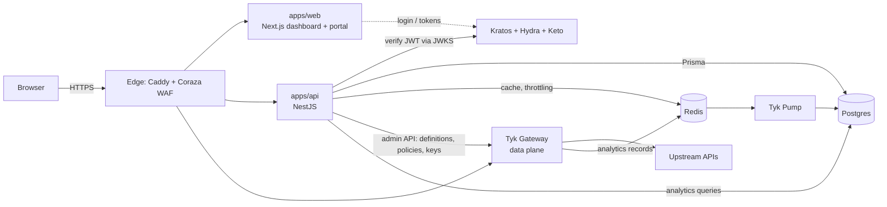

# MIRQAB reference documentation

Per-component reference for every part of the system. Each page was written from the code (file paths in backticks); anything not confirmed is marked **unverified**. The older guides in `docs/` (architecture, deployment, development, security, OAS-*, ANALYTICS-PIPELINE) explain *why*; these pages explain *what is where and how it behaves*. Where they disagree, trust the reference page and the code — see [Known documentation drift](#known-documentation-drift).

## What MIRQAB is

An admin dashboard and control plane around the **open-source Tyk Gateway** (no Tyk Dashboard). The browser talks to a NestJS API; only the API holds Tyk credentials and pushes API definitions, policies and keys to the gateway. Analytics come from Tyk Pump into Postgres. Identity is Ory (Kratos for login, Hydra for OAuth2 tokens, Keto for relations).

## Reading order

| If you want to… | Read |
|---|---|
| Understand containers, ports, networks, Caddy routing | [infrastructure.md](infrastructure.md) |
| Look up an environment variable | [configuration.md](configuration.md) |
| Take the stack to production: required inputs, steps, every `localhost` to change, known gaps | [../go-live.md](../go-live.md) |
| Work on users, tenants, roles, keys, plans, products, quotas, the developer portal, audit | [api-identity-and-commerce.md](api-identity-and-commerce.md) |
| Work on API definitions, Tyk sync, OpenAPI import, certificates, webhooks, MCP, analytics (incl. `/analytics/traffic`), API bootstrap and shared guards | [api-gateway-and-analytics.md](api-gateway-and-analytics.md) |
| Work on the dashboard: routes, components, hooks, session flow, i18n, theming | [web-app.md](web-app.md) |
| Work on the shared UI package, Prisma schema, shared types, monorepo tooling | [packages.md](packages.md) |

## Component map

| Part | Location | Reference page |
|---|---|---|
| Dashboard and developer portal | `apps/web` | [web-app.md](web-app.md) |
| REST API (20 NestJS modules) | `apps/api` | [identity and commerce](api-identity-and-commerce.md), [gateway and analytics](api-gateway-and-analytics.md) |
| Shared UI (shadcn primitives, `PageFilter`, `DataTable`, dialogs, KPI/chart pieces, `WorldMap`) | `packages/ui` | [packages.md](packages.md) |
| Prisma schema, migrations, seed | `packages/database` | [packages.md](packages.md) |
| Shared types, lint/format/tsconfig bases | `packages/types`, `packages/config` | [packages.md](packages.md) |
| Container stack (29 compose services), edge, Ory, pump, observability | `infra/` | [infrastructure.md](infrastructure.md) |
| Installer and rebuild scripts | `install.sh`, `infra/scripts` | [infrastructure.md](infrastructure.md) |

## Cross-cutting facts worth knowing first

- **Tenancy.** Every tenant-scoped query filters by the caller's tenant; analytics scope by the tenant's own Tyk API ids (never by `org_id`, which is global). A caller with no tenant is rejected.
- **Permissions.** `resource:action` codes, enforced on the API by guards and mirrored in the UI by `PermissionGate` / `usePermissions`. The UI hiding something is convenience, not security.
- **Session cookies.** `mq_access_token` and `mq_refresh_token` (prefixed so they cannot collide with another app on `localhost`, since browsers share cookies across ports). Set by `apps/web`; the API reads the access cookie or a Bearer header.
- **Response envelope.** `{ success: true, data }` / `{ success: false, error }`; the web `api-client` unwraps it and retries once after `POST /oauth2/refresh` on a 401.
- **Build-time public config.** `NEXT_PUBLIC_*` values (including `NEXT_PUBLIC_GATEWAY_NODE_LOCATIONS`, which places nodes on the dashboard map) are baked into the web image at build time — change them, rebuild the image.
- **Design system.** shadcn components only; shared ones live in `packages/ui` and `apps/web/src/components/ui/*` re-exports or wraps them.
- **Reuse-first rule.** Generic UI belongs in `packages/ui` as a prop-driven component: labels, links, locale and data come in as props, and the package imports no `next-intl`, `next/*`, `@tanstack/react-query` or `apps/web` code. The app keeps only a thin adapter for i18n, routing or data hooks (list: [packages.md](packages.md#the-adapter-pattern)). Before writing any control, check the export index in [packages.md](packages.md); before adding a second copy of a pattern, extract it.

## Known documentation drift

Found while writing these pages. The reference pages are correct; these older files still contain the statements below.

| File | Stale statement |
|---|---|
| `apps/web/README.md` | Axios client, `/login` page, old route/hook tables, wrong env list, dev port 33000 |
| `apps/api/README.md` | `/auth/login`/`register`/`refresh`/`logout` routes (only `GET /auth/me` exists), `JWT_SECRET` "required", quotas "no REST surface", wrong guard/file names, many missing routes |
| `docs/architecture.md` | Bearer forwarding in the auth flow (the API reads the cookie itself), `GET` refresh, ADR-009 circuit key, `QuotasModule` dependencies |
| `docs/deployment.md` | Sample compose/nginx (real edge is Caddy + Coraza, internal ports differ), `TYK_ORG_ID`, `JWT_SECRET` rotation, Grafana dashboards, "API reads `COOKIE_SECURE`" |
| `docs/development.md` | Frontend tree, Axios, Jest/Playwright (the app uses Vitest), `JWT_SECRET` |
| `docs/TYK-LOCAL-DEV.md` | `TYK_ORG_ID`, a `33005:8080` mapping that does not exist, "no health signal" |
| `docs/ANALYTICS-PIPELINE.md` | `omit_detailed_recording: true` (config has `false`), missing `/analytics/traffic` |
| `docs/security.md` | Per-endpoint auth rate limit (only the portal has `@Throttle`) |
| `README.md` | Loki/Tempo/Grafana in the stack, `TYK_ORG_ID`, "docker-compose has 4 services", Prisma Studio URL |
| `apps/*/.env.example` | Old cookie names in the API example; web example's `NEXT_PUBLIC_API_URL` lacks `/api`; two unread `NEXT_PUBLIC_ENABLE_*` flags |

## Issues found in the code (not fixed)

Recorded by the documentation pass so they are not lost. Each is described in the reference page of its module.

| Area | Issue |
|---|---|
| Analytics export | ~~header had 6 columns for 7 values per row~~ — **fixed**: header now includes `API ID` (test asserts equal widths) |
| Webhooks | ~~`GET /apis/:id` exposed `TYK_WEBHOOK_RELAY_SECRET` inside `oasDocument`~~ — **fixed**: blanked (`[redacted]`) in every `ApiDetail` response by `redactRelaySecret`; the stored copy is unchanged. Rotate the secret if it may already have been read |
| API delete | `ApiService.remove()` ignores per-node results unless all fail, leaving an orphan on a failed node that reconcile cannot see |
| MCP | `POST /mcps/:id/sync` nests `syncStatus` under `data`, so a failed sync is audited as `SYNC_SUCCEEDED`; reconcile skips MCP servers |
| Reconcile / reload | Reconcile only detects drift, never repairs; a failed reload still counts the node as `ok: true` |
| Plans / products | Delete removes the Tyk policy first; a foreign-key restrict from subscriptions then fails the row delete with a generic 500 |
| Tenants | `PATCH /tenants/:id` validates the slug but does not persist it |
| Quotas | `POST /quotas/meter` meters every tenant, not just the caller's |
| Portal | Any Kratos failure on register is reported as 409 "account already exists"; portal actions write no audit rows |
| Cookies | ~~Session cookies were not `Secure` on the default stack~~ — **fixed**: compose now passes `COOKIE_SECURE` (default `true`) to `web`, which sets the cookies; takes effect on the next container recreate |
| Edge | Coraza WAF runs in `DetectionOnly` |
| Installer | Final health probe uses `http://` on HTTPS ports; still writes the unused `TYK_ORG_ID`; `infra/gateway/tyk.conf` is an empty directory |
| Packages | `packages/types` enums are stale against Prisma (`ApiStatus` lacks `RETIRED`, `AuditAction` misses ~13 values); `packages/ui/package.json` declares `@radix-ui/react-separator`, which nothing imports; `packages/config` eslint/prettier bases have no importer |
| Dead config | `JWT_SECRET` (still required by compose), `TYK_ORG_ID`, `LOG_LEVEL`, `NEXT_PUBLIC_ENABLE_ANALYTICS`, `NEXT_PUBLIC_ENABLE_WEBSOCKETS`, `TenantSlugGuard`, `TenantService.findOneBySlug` |

## Known follow-ups (UI reuse)

Gaps noticed while documenting the expanded `packages/ui`; none is a bug. Details in [web-app.md](web-app.md) and [packages.md](packages.md).

| Area | Gap |
|---|---|
| Form sheets | Six `*-form-sheet.tsx` (`apis/api-form-sheet.tsx`, `keys/key-form-sheet.tsx`, `plans/plan-form-sheet.tsx`, `products/product-form-sheet.tsx`, `roles/role-form-sheet.tsx`, `tenants/tenant-form-sheet.tsx`) repeat the same header / footer boilerplate; a generic `FormSheet` is not extracted (the duplication is reported by the maintainers; the six files were not diffed here, unverified) |
| Layout chrome | `components/layout/breadcrumb.tsx`, `theme-switcher.tsx` and `locale-switcher.tsx` are app-only (next-intl / next-themes / route logic inline) and not generic in the package |
| Default strings | `DialogContent` / `SheetContent` default `closeLabel` to the English `Close`; only the app wrappers and `RevealDialog` callers pass a translated one |
| Package deps | `@tanstack/react-table` is both a peer and a devDependency of `packages/ui` (intended). The unused `@radix-ui/react-separator` and `react-collapsible` were removed in `8d80a36` |
| Boundary check | The "no `next-intl` / `next/*` / `react-query` / `apps/web`" rule for `packages/ui` is upheld today (grep) but no lint rule enforces it (unverified for root ESLint config) |
| Search gaps | Request search is the lean core only: no substring, regex, JSON-field or path-glob search (measured too slow or costly, see `ANALYTICS-PIPELINE.md`). Word search does not stem and sees only the first 16 KiB of a body. A record the pump delivers more than 6 hours late is never indexed |
| Docs gaps | `/docs` is pinned to Fumadocs 15.8.5 (16.x needs Next 16), so the generated API reference (`fumadocs-openapi`) waits for that upgrade. Arabic search misses some word forms (`الوثائق` vs `وثائق`) |
| Audit | Reading captured bodies through request search writes no audit row (a decision, asserted by a test). Dashboard "Recent activity" is scoped to the selected API through `details.resourceId`; `apis` rows written before that id was recorded (8 of 128 in the dev data) are not matched |
| Stale doc | `packages/ui/components.json` still points shadcn at `@ui/components/ui` although components sit flat in `src/components/` |

## Keeping this current

- Add a route, module, component or variable → update its reference page in the same change.
- A line marked **unverified** should be confirmed and unmarked, not repeated elsewhere as fact.
- New tenant-scoped code must follow the tenancy rule above; new UI must follow the reuse-first rule above and use shadcn components from `packages/ui`.
