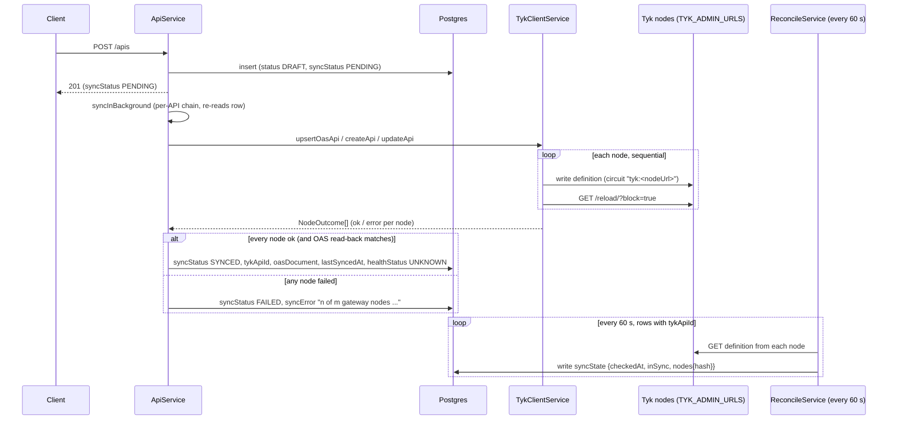
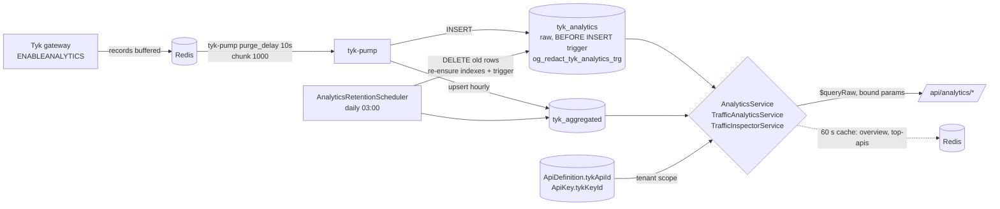

# API Gateway Control Plane and Analytics: Module Reference

This document describes the NestJS modules in `apps/api/src/modules/` that manage API definitions on
the Tyk gateway and read analytics back out of it, plus the shared code they sit on
(`apps/api/src/common/`) and the process bootstrap (`apps/api/src/main.ts`,
`apps/api/src/app.module.ts`).

Everything below was read from the source on branch `feat/web-dashboard-redesign` (commit `698fb0b`).
Statements I could not confirm in code are marked **unverified**. Every path is relative to the repo
root unless it starts with `docs/`. All HTTP paths are served under the global prefix `/api`
(for example `/api/apis`); this document omits the prefix in tables.

## Table of contents

1. [Module summary](#1-module-summary)
2. [Bootstrap: `main.ts` and `app.module.ts`](#2-bootstrap-maints-and-appmodulets)
3. [Shared code: `apps/api/src/common`](#3-shared-code-appsapisrccommon)
4. [api-management](#4-api-management)
5. [api-import](#5-api-import)
6. [spec-fetch](#6-spec-fetch)
7. [tyk-integration](#7-tyk-integration)
8. [analytics (including `GET /analytics/traffic`)](#8-analytics)
9. [certificates](#9-certificates)
10. [settings](#10-settings)
11. [webhooks](#11-webhooks)
12. [mcp](#12-mcp)
13. [observability](#13-observability)
14. [Scheduled jobs at a glance](#14-scheduled-jobs-at-a-glance)
15. [Environment variables referenced here](#15-environment-variables-referenced-here)

## 1. Module summary

| Module | Purpose | Route prefix | Key permissions |
|---|---|---|---|
| `api-management` | CRUD for `ApiDefinition`, sync to every Tyk node, drift, health, gateway status | `/apis`, `/gateway` | `api:read` `api:create` `api:update` `api:delete` `api:sync`, `settings:read` `settings:update` |
| `api-import` | Create/update an API from an OpenAPI 3.x document; endpoint governance; watched spec URLs | `/apis/import*`, `/apis/:id/spec*`, `/apis/:id/endpoints`, `/apis/:id/spec-source`, `/apis/:id/spec-candidates*`, `/spec-updates` | `api:create` (import), `api:update` (writes), `api:read` (reads) |
| `spec-fetch` | SSRF-guarded HTTP fetcher for tenant-supplied spec URLs (no controller) | none | none |
| `tyk-integration` | The only client of the Tyk admin API: per-node fan-out, per-node circuit breaker (no controller) | none | none |
| `analytics` | Tenant-scoped reads of the Tyk Pump tables, filtered traffic view, traffic inspector, retention, redaction trigger | `/analytics` | `analytics:read`, `analytics:export` (CSV) |
| `certificates` | Upstream mTLS certificate upload/list/delete, passthrough to Tyk `/tyk/certs` | `/certificates` | `cert:read` `cert:create` `cert:delete` |
| `settings` | Read-only tenant config view (Tyk org id, retention windows) | `/settings` | `settings:read` |
| `webhooks` | Signed, retried webhook delivery of Tyk gateway events, plus the public relay endpoint Tyk calls | `/webhooks`, `/webhooks/relay` | `api:read`, `api:update`; relay is `@Public()` (shared secret) |
| `mcp` | MCP (Model Context Protocol) proxies in front of an existing OAS API | `/mcps` | `api:*`, plus `plan:read` on create/update |
| `observability` | Prometheus registry served at `GET /metrics` (no controller of its own) | `/metrics` (in `AppController`) | none (`@Public()`) |

Related endpoints owned by `AppController` (`apps/api/src/app.controller.ts`), all `@Public()` and
`@SkipThrottle()`: `GET /` (liveness), `GET /health` (readiness: Postgres, Redis, gateway `/hello`;
503 when any is down), `GET /metrics`.

## 2. Bootstrap: `main.ts` and `app.module.ts`

`apps/api/src/main.ts`, in execution order:

1. `import './tracing'` runs first. OpenTelemetry (`apps/api/src/tracing.ts`) starts only when
   `OTEL_EXPORTER_OTLP_ENDPOINT` is set. It patches `http` and Prisma, so it must precede them.
2. `BigInt.prototype.toJSON` is patched to `toString()` so Prisma `BigInt` columns (`AuditLog.id`)
   serialize.
3. `NestFactory.create(AppModule, { bufferLogs: true })`, with `nestjs-pino` as the logger.
4. `app.set('trust proxy', hops)` where `hops = parseTrustProxyHops(TRUST_PROXY_HOPS)`
   (`apps/api/src/common/config/env.ts`). A non-negative integer; default `0`; invalid falls back to `0`
   with a warning. Never `true`, because that would let a client forge `X-Forwarded-For` and choose its
   own throttle bucket. Compose sets `TRUST_PROXY_HOPS` to `1` by default (`infra/docker-compose.yml`).
5. `helmet()` with defaults, then `cookie-parser`.
6. `enableCors`: origins from `CORS_ORIGINS` (comma separated, default `http://localhost:33000`),
   `credentials: true`, methods `GET POST PUT PATCH DELETE OPTIONS`, allowed headers
   `Content-Type, Authorization, X-Tenant-ID, X-Correlation-ID`, exposed header `X-Correlation-ID`.
7. Global `ValidationPipe`: `transform: true`, `whitelist: true`, `forbidNonWhitelisted: true`,
   `enableImplicitConversion: true`. An unknown property in a body or query is a 400, not silently
   dropped.
8. Global `AllExceptionsFilter` (see section 3).
9. `setGlobalPrefix('api')`.
10. Swagger UI at `/api/docs` (title "MIRQAB API", bearer auth).
11. `enableShutdownHooks()`, then `listen(PORT)`. `PORT` defaults to `33001` in code; the compose file
    sets `PORT: 4000` for the container and only `expose`s `4000` (`infra/docker-compose.yml`), with the
    edge terminating TLS on 33001.

`apps/api/src/app.module.ts`:

- `ConfigModule.forRoot({ isGlobal: true, envFilePath: ['.env.local', '.env'] })`.
- `LoggerModule` (pino): request id is the edge's `X-Request-Id` when present, else a UUID;
  `traceparent` is copied onto each line; `/api/metrics` and `/api/health` are not logged;
  `Authorization`, `Cookie` and `x-tyk-authorization` request headers are redacted.
- `ThrottlerModule.forRoot([{ ttl: 60000, limit: NODE_ENV === 'production' ? 100 : 1000 }])`, the only
  `forRoot`. In-memory storage, so limits are per replica. The only per-route `@Throttle()` overrides in
  the API are on the portal (`modules/portal/controllers/portal-auth.controller.ts` 5/min,
  `portal-subscriptions.controller.ts` 10/min).
- Two global guards, in this order: `ThrottlerGuard`, then `JwtAuthGuard`. So authentication is on by
  default and a route must opt out with `@Public()`. Tenant and permission checks are still opt-in per
  controller (`@UseGuards(TenantIsolationGuard, PermissionsGuard)`).
- Module imports include every module in this document plus `AuthModule`, `TenantsModule`,
  `KeysModule`, `PlansModule`, `AuditModule` and others outside the scope of this reference.

## 3. Shared code: `apps/api/src/common`

`common/common.module.ts` imports `RedisModule.forRoot()` (global) and `CircuitBreakerModule`.
`common/database/database.module.ts` is `@Global()` and provides the Prisma singleton under the token
`'PRISMA_CLIENT'`. Many services instead import `prisma` directly from `@open-gateway/database`.

### Guards (`common/guards/`)

| Guard | Behaviour |
|---|---|
| `JwtAuthGuard` | `AuthGuard('jwt')`; returns `true` when `@Public()` is on the handler or class. The strategy (`modules/auth/strategies/jwt.strategy.ts`) reads the token from the `mq_access_token` cookie or an `Authorization: Bearer` header, requires RS256 and the configured issuer (`ORY_HYDRA_ISSUER`), fetches the key from Hydra's JWKS, then builds the session per request from Postgres and Keto (`AuthService#resolveSession`). Nothing tenant- or role-related is read from the token itself. |
| `TenantIsolationGuard` | Rejects with 403 if an `X-Tenant-ID` header differs from `user.tenantId`, or if the user has no tenant. Otherwise sets `request.tenantId`. No super_admin bypass. |
| `PermissionsGuard` | Reads the `@Permissions()` list; the user must hold **all** of them, else 403 `Missing permissions: ...`. `super_admin` (case-insensitive) passes, but only within its active tenant. No `@Permissions()` on a route means allowed. |
| `RolesGuard` | At least one required role, compared case-insensitively. Not used by the modules in this document. |

`TenantIsolationGuard` and `PermissionsGuard` increment `og_authz_denied_total{reason}`.

Gotcha: `@Permissions()` on a method **replaces** the class-level list (`getAllAndOverride`). See
`GET /analytics/export`, which needs `analytics:export` only, not both.

### Decorators (`common/decorators/`)

`@Public()`, `@Permissions(...codes)`, `@Roles(...)`, `@CurrentUser()`, `@CurrentTenant()` (reads
`request.tenantId`, which only `TenantIsolationGuard` sets, falling back to the JWT-derived
`user.tenantId`; it never reads the raw header), and `@Audit(action, entityType?)`, which is metadata
for the audit interceptor.

### Interceptors

`apps/api/src/common/interceptors/` exists but is **empty**. The only interceptor is
`AuditLogInterceptor` in `modules/audit/interceptors/audit-log.interceptor.ts`, registered globally
through `APP_INTERCEPTOR` in `modules/audit/audit.module.ts`. Behaviour relevant here:

- It only acts on handlers carrying `@Audit(...)`. The action label must exist in the Prisma
  `AuditAction` enum (`common/decorators/audit-actions.tripwire.spec.ts` guards this).
- The request body is stored **only for `PATCH` and `PUT`**, with keys matching
  `pass|secret|token|authorization|api-key|credential` redacted, URLs stripped of userinfo and query, and
  the body capped at 16 KiB. `POST` bodies are not stored.
- The write is fire-and-forget (`setImmediate`); a failed audit write is only logged.
- The resource id comes from `:id` in the route, else from a top-level `id` in the response body. Handlers
  that return `{ success, data }` (certificates, webhooks, mcp create) therefore get no `resourceId`.
- For `@Audit('api:sync_succeeded')` it records `SYNC_FAILED` when the response body has
  `syncStatus === 'FAILED'`. It reads that field at the **top level** of the body. `POST /apis/:id/sync`
  returns it there; `POST /mcps/:id/sync` nests it under `data`, so an MCP sync that ends `FAILED` is
  audited as `SYNC_SUCCEEDED` (from the code; not exercised).
- A 5xx error is audited as `SYNC_FAILED` regardless of which action was decorated.

### Filters (`common/filters/all-exceptions.filter.ts`)

`AllExceptionsFilter` catches everything and answers
`{ success: false, error: { code, message, details?, traceId? } }`. `code` is Nest's `error` string when
present, else the HTTP status name (`UNAUTHORIZED`). Any 500 is replaced by the generic
"Internal server error" (the real error is logged). `traceId` is the request's `X-Correlation-ID`
header, if any. An exception carrying a `sunsetAt: Date` also gets a `Sunset` header
(`RetiredVersionException`, used by `GET /apis/:id` on a retired version).

Success responses have no global envelope. Controllers in this document are inconsistent: `/apis` and
`/analytics` return the raw object, while `/certificates`, `/webhooks` (except `DELETE`), `/mcps`,
`/apis/:id/traffic` and the spec routes return `{ success: true, data }`.

### Redis (`common/redis/`)

`RedisService` wraps an `ioredis` client (`REDIS_URL`, default `redis://localhost:33003`) with retry
backoff up to 2 s and `maxRetriesPerRequest: 3`. A failed ping at boot is logged, not fatal. Uses in
this document: the 60 s analytics cache, the Tyk response-cache invalidation (`SCAN` + `DEL`), the
readiness probe, and the `redis_*` gauges. `RedisService#keys()` (blocking `KEYS`) exists but the Tyk
client deliberately uses `SCAN`.

### Circuit breaker (`common/circuit-breaker/`)

`CircuitBreakerService` is in-memory and per process. Defaults: `failureThreshold: 5` consecutive
failures, `resetTimeout: 30` s, `halfOpenMaxCalls: 2`. States: CLOSED, OPEN, HALF_OPEN. `execute(name, fn)`
returns `{ success, data | error, circuitState }`; it throws `CircuitBreakerOpenError` only when the
circuit is open (or half-open call budget is used). A circuit not registered explicitly is created with
defaults on first use; nothing in the Tyk client registers custom settings. See section 7 for what is
wrapped.

### Ory helpers (`common/ory/`)

Plain functions, not providers; environment is read per call.

- `keto.ts`: `ketoCheck(tenantId, 'view' | 'manage', userId)` against `ORY_KETO_READ_URL`
  (default `http://keto:4466`), namespace `Tenant`. 5 s timeout. 200 and 403 are answers; any other status,
  or a body without a boolean `allowed`, throws (an unreachable Keto is a 500, not a silent deny).
  `ketoWriteMembership` and `ketoDeleteMembership` use `ORY_KETO_WRITE_URL` (default
  `http://keto:4467`). `relationForRole` maps `admin` and `super_admin` to `admin`, all else to `member`.
- `jwks.ts`: `resolveSigningKey(jwksUri, kid)` caches RSA signing keys by `kid`. At most one fetch per
  minute (`REFETCH_COOLDOWN_MS`); a key is trusted at most 10 minutes since the last **successful**
  fetch (`MAX_CACHE_AGE_MS`). Fail-closed: once past 10 minutes, a failed refresh rejects the token rather
  than reusing the cached key. A Hydra outage therefore becomes an API outage after up to 10 minutes.
- `kratos.ts`: `kratosWhoAmI`, `kratosCreateIdentity`, `kratosSendVerificationEmail` for the developer
  portal (`ORY_KRATOS_PUBLIC_URL`, `ORY_KRATOS_ADMIN_URL`). Not used by the modules here.

### Utils and other

- `common/utils/csv.ts` `csvCell()`: RFC 4180 quoting; a cell starting with `= + - @ TAB CR` is prefixed
  with `'` to defuse spreadsheet formula injection. Used by `GET /analytics/export`.
- `common/metrics/ops-metrics.ts`: unregistered-at-import Prometheus counters (`og_tyk_fanout_total`,
  `og_job_runs_total`, `og_authz_denied_total`) bumped from code that `ObservabilityModule` itself
  depends on; `MetricsService` registers them and seeds every label set at 0 so the first failure is
  visible to `increase()`.
- `common/types/index.ts`: `UserPayload`, `RoleType` (`super_admin | admin | operator | viewer`),
  `isSuperAdmin()`. It also declares a second `CircuitState` enum and `CircuitBreakerResult` that
  duplicate the ones in `common/circuit-breaker/circuit-breaker.types.ts`; the circuit-breaker module's
  own types are the ones actually used by the service.

## 4. api-management

**Purpose.** Owns the `ApiDefinition` lifecycle. Postgres is the source of truth; every change is
pushed to all Tyk nodes, and the outcome is recorded on the row.

**Location.** `apps/api/src/modules/api-management/`: `controllers/api.controller.ts`,
`controllers/gateway-status.controller.ts`, `services/api.service.ts`, `services/reconcile.service.ts`,
`services/health-check.service.ts`, `services/gateway-status.service.ts`,
`services/endpoint-governance.service.ts` (+ `endpoint-governance.ts`, `endpoint-operations.ts`,
`endpoint-capabilities.ts`), `services/tyk-mappers.ts` (row to Tyk classic/OAS definition),
`services/hydra-signing-key.ts`, `dto/*` (including `proxy-url.validator.ts`, the SSRF deny list).

### HTTP endpoints

All controllers use `TenantIsolationGuard` + `PermissionsGuard`.

| Method | Path | Permission | Behaviour |
|---|---|---|---|
| POST | `/apis` | `api:create` (+ `PlanLimitGuard`) | Validate, insert with `status: DRAFT`, `syncStatus: PENDING`; return 201 **before** the gateway sync, which runs in the background. 403 `PLAN_LIMIT_EXCEEDED` at the plan ceiling. |
| POST | `/apis/:id/versions` | `api:create` | Create an OAS child version (own `proxyUrl`/auth/config, selected by `x-api-version`). Child is created `ACTIVE`; its sync is **awaited**, then the parent re-syncs in the background. OAS only; no version of a version. |
| GET | `/apis` | `api:read` | Paginated list (`page`, `pageSize`, `status`, `syncStatus`, `q`). |
| GET | `/apis/:id` | `api:read` | One API. A `RETIRED` version answers 410 with a `Sunset` header. |
| PATCH | `/apis/:id` | `api:update` | Merge update; sets `syncStatus: PENDING`; background re-sync. `config` is merged per section (absent keeps, `null` clears) under a compare-and-set with one retry, else 409 `API_CONFIG_CHANGED`. |
| DELETE | `/apis/:id` | `api:delete` | 409 while versions, keys or OAuth2 clients reference it. Deletes from the gateway first (502 and the row is kept if that fails), then the row. |
| POST | `/apis/:id/sync` | `api:sync` | Awaited re-sync. 200 when every node accepted, **207** when at least one did not; body includes `nodes`. |
| POST | `/apis/:id/debug` | `api:update` | Sample request through Tyk `/tyk/debug` using the definition rebuilt from the stored row. Optional `targetUrl` is subject to the SSRF deny list (400). Single node. |
| GET | `/apis/:id/traffic` | `api:update` | Captured request/response detail (Traffic Inspector, section 8). |
| POST | `/apis/:id/cache/invalidate` | `api:update` | Drops the API's response cache on every node. |
| GET | `/apis/:id/drift` | `api:read` | Recomputes per-node drift on demand. |
| GET | `/gateway/status` | `settings:read` | Gateway `/hello` summary, per-`syncStatus` counts and up to 20 failed syncs for the tenant. HTTP 200 even when the gateway is down. |
| GET | `/gateway/nodes/health` | `settings:read` | `/hello` for every node in `TYK_ADMIN_URLS`. Not tenant-scoped. |
| POST | `/gateway/reload` | `settings:update` | Blocking reload of **every** node; per-node latency. Platform-wide, audited as `gateway:updated`. |

Endpoint governance routes (`GET/PATCH /apis/:id/endpoints`) are served by `ApiSpecController` in
`api-import` (section 5), backed by `EndpointGovernanceService` from this module.

### Services

- `ApiService`: create/update/remove/version, sync orchestration, debug, cache invalidation, drift.
  Syncs of one API are serialised through an in-process promise chain (`syncChains`), each re-reading the
  row, so two quick PATCHes cannot leave the gateway on the older config while the row says `SYNCED`.
- `ReconcileService`: see below.
- `HealthCheckService`: probes `config.uptimeTests` URLs from the API itself (not from Tyk).
- `GatewayStatusService`: thin read model over `TykClientService` and `ApiDefinition`.
- `EndpointGovernanceService`: `list` and `update` of per-endpoint controls (block, public, rate limit,
  cache, timeout, size limit, mock, validation), keyed to the stored spec's endpoint index; compare-and-set
  on a `revision`.
- `tyk-mappers.ts`: `mapToTykOas` (default) and `mapToTykFormat` (CLASSIC and TCP). Tenant scoping is
  stamped here: gateway listen path is `/{tenantSlug}{listenPath}`, and `org_id` is `Tenant.tykOrgId`.

### Data (Prisma)

`ApiDefinition` (`api_definitions`), unique on `(tenantId, slug)`, `(tenantId, listenPath)` and
`(parentApiId, versionName)`. Notable columns: `tykApiId` (`og-<id>` for OAS, Tyk-assigned for CLASSIC),
`status` (`DRAFT | ACTIVE | DISABLED | RETIRED`), `syncStatus` (`PENDING | SYNCED | FAILED`), `syncError`,
`syncState` (per-node drift JSON), `oasDocument` (last document sent), `healthStatus`, `webhooksEnabled`,
`retiredAt`. Also reads `ApiSpec`, `ApiKey`, `Tenant`. Enums are in
`packages/database/prisma/schema.prisma`.

### Dependencies

Tyk admin API (all writes, reads, reload), Postgres, `OAuthClientsModule` (Hydra signing key for
`OAUTH` APIs; delete guard), `AnalyticsModule` (traffic inspector), `PlanLimitGuard` from `modules/plans` (how it is wired into this module was not checked).
No direct Redis use here.

### Flow: create, sync, reconcile

### Background jobs

| Job | Where | Schedule | Effect |
|---|---|---|---|
| Reconcile (`reconcile`) | `ReconcileService.reconcileAll`, `@Interval(60_000)` | 60 s | For every row with a `tykApiId`, reads the definition from each node, hashes it (volatile paths stripped: `x-tyk-api-gateway.info.state`, `_id`, `internal_id`) and writes `syncState`. |
| Health check (`health_check`) | `HealthCheckService.checkAll`, `@Interval(30_000)` | 30 s | For `ACTIVE` APIs that have `config.uptimeTests`, probes each URL (default timeout 5 s; status < 400 is up) and stores `healthStatus`: all up `HEALTHY`, none `DOWN`, mixed `DEGRADED`. APIs without probes are skipped, not reset. |
| Node set provenance | `ReconcileService.onModuleInit` | boot | Writes an `AuditLog` row (`resource: 'GatewayNodeSet'`, `tenantId: null`) only when the node list changed. |

Both intervals run in every API replica; there is no leader election (**unverified** for multi-replica
behaviour beyond the code showing none).

### Gotchas

- **Create and update return before the gateway is touched.** The response says `PENDING`; the real
  outcome is only on the row afterwards (`syncStatus`, `syncError`). Failures are never thrown to the
  caller of `POST/PATCH`. `POST /apis/:id/sync` is the awaited path.
- **A new API is `DRAFT` and the mapper sets Tyk `active` only for `status === ACTIVE`**
  (`tyk-mappers.ts`). It is not live until the status is patched to `ACTIVE` (`createVersion` is the
  exception; it creates `ACTIVE`). Imports go through `ApiService.create`, so they are also `DRAFT`.
- **Reconcile detects drift; it does not repair it.** `reconcileAll` only writes `syncState`. A node that
  missed a write stays stale until someone calls `POST /apis/:id/sync` or edits the API.
  `syncStatus` ("did our last write succeed") and `syncState.inSync` ("do nodes agree right now") are
  separate signals.
- **Reconcile covers `ApiDefinition` only.** `McpServer` rows have no `syncState` and are not reconciled.
- **Partial fan-out is `FAILED`, not `SYNCED`.** If some nodes accept and some do not, the row is
  `FAILED` with "n of m gateway nodes did not accept the definition"; the controller returns 207.
- **Reload failures are swallowed.** `TykClientService.reload` only logs; a node whose write succeeded but
  whose reload failed still counts `ok: true`. For OAS APIs the read-back compares governed operations
  after the write (`readBackMismatches`) and can downgrade a node to failed; CLASSIC APIs have no
  read-back.
- **`remove()` ignores per-node results.** It calls `tykClient.deleteApi` and discards the returned
  `NodeOutcome[]`. It throws (502, row kept) only when **every** node fails. If one node fails, the row is
  deleted and that node keeps an orphan definition that reconcile can no longer see (no row). Unverified
  beyond reading the code.
- **Sync chains are per process.** Two API replicas can still interleave writes (comment in
  `api.service.ts` names an advisory lock or outbox as the upgrade).
- **Each successful sync resets `healthStatus` to `UNKNOWN`**, and the 30 s health job then restores it.
- `listenPath` uniqueness is **per tenant** (`assertListenPathFree`, unique `(tenantId, listenPath)`);
  the gateway path is prefixed with the tenant slug.
- `GET /gateway/status` and `/gateway/nodes/health` use `settings:read`, not `analytics:read` (WP14
  re-gate). `POST /gateway/reload` reloads every node for every tenant.
- `ApiDetail` (returned by `GET /apis/:id`) includes `oasDocument`, the document last sent to Tyk. When
  `webhooksEnabled` is true, `buildTykEventHandlers` puts the platform-wide `TYK_WEBHOOK_RELAY_SECRET` into
  the event-handler headers of that document (`webhooks/webhook-relay.constants.ts`), so a holder of
  `api:read` on such an API receives the relay secret. This is from code reading, not exercised; see the
  webhooks section.

## 5. api-import

**Purpose.** Create an API from an OpenAPI 3.x document, keep versioned copies of the spec, let operators
govern individual endpoints, and optionally watch a spec URL for changes.

**Location.** `apps/api/src/modules/api-import/`: `controllers/` (`api-import`, `api-spec`,
`api-spec-update`, `spec-source` which also holds `SpecUpdatesController`), `services/` (`api-import`,
`api-spec`, `spec-update`, `spec-source`, `spec-candidate`, `spectral-lint`, `spec-source.scheduler`,
`oas-endpoints`, `oas-safety`, `spec-diff`), `oas-ruleset.ts`, `spec-body.middleware.ts`.
Feature docs already exist: `docs/OAS-IMPORT.md`, `docs/OAS-SPEC-SOURCE.md`, `docs/OAS-SPEC-FETCH.md`,
`docs/OAS-ENDPOINT-GOVERNANCE.md`.

### HTTP endpoints

| Method | Path | Permission | Behaviour |
|---|---|---|---|
| POST | `/apis/import` | `api:create` | Raw JSON/YAML body (up to 5 MB, else 413). Spectral lint: any error-severity finding is 422 and nothing is created; warnings are returned. Calls `ApiService.create` with the API row and first `api_specs` row in one transaction. Query: `slug`, `serverIndex`. |
| POST | `/apis/import/preview` | `api:create` | Same checks, writes nothing (not audited). |
| POST | `/apis/import/url/preview` | `api:create` | Preview from a URL fetched through the guarded fetcher. JSON body. |
| POST | `/apis/import/url` | `api:create` | Import from a URL; `watch: true` also creates a spec source (checks the 50-per-tenant cap first). |
| GET | `/apis/:id/spec` | `api:read` | Newest stored document, source text as submitted. |
| GET | `/apis/:id/endpoints` | `api:read` | Endpoint index joined with governance, `orphans`, `revision`, `capabilities`. |
| PATCH | `/apis/:id/endpoints` | `api:update` | Set endpoint controls or allow-list mode; compare-and-set on `expectedRevision` (409 `ENDPOINT_REVISION_STALE`); re-syncs in the background. |
| POST | `/apis/:id/spec/preview` | `api:update` | Diff a changed document against the stored one, apply nothing. |
| POST | `/apis/:id/spec` | `api:update` | Apply as the next `api_specs` version. `expectedVersion` (0 to attach a first spec) else 409 `SPEC_VERSION_STALE`; removed governed endpoints need `acknowledgeRemoved=true` else 409 `SPEC_REMOVES_GOVERNED_ENDPOINTS`; identical bytes answer `unchanged: true`. |
| GET | `/apis/:id/spec-source` | `api:read` | The watched URL (redacted) and last check. |
| PUT | `/apis/:id/spec-source` | `api:update` | Watch a URL. `intervalMinutes` in {15, 60, 360, 1440}; max 50 per tenant. |
| DELETE | `/apis/:id/spec-source` | `api:update` | Stop watching; a pending proposal is superseded. |
| POST | `/apis/:id/spec-source/check` | `api:update` | Check now. 429 `SPEC_CHECK_COOLDOWN` if checked in the last 30 s (database clock). |
| GET | `/apis/:id/spec-candidates` | `api:read` | Pending proposal and the last 20. |
| GET | `/apis/:id/spec-candidates/:cid/diff` | `api:read` | Dry-run of applying it. |
| POST | `/apis/:id/spec-candidates/:cid/apply` | `api:update` | Apply (compare-and-set on `expectedVersion`). |
| POST | `/apis/:id/spec-candidates/:cid/dismiss` | `api:update` | Dismiss; that content is not proposed again. |
| GET | `/spec-updates` | `api:read` | Up to 100 APIs with a pending proposal. |

### Services

- `ApiImportService`: `import` and `preview`; the preview is the single gate chain (5 MB, YAML alias
  budget, external `$ref` refusal, Spectral lint, OAS 3.x only, at most 5000 operations) and the real
  import reuses it. `SpecUpdateService` reuses the same preview.
- `SpectralLintService`: one repo-wide ruleset, `oas-ruleset.ts` (extends Stoplight `oas`; errors block).
- `ApiSpecService`: reads stored specs and the endpoint index.
- `SpecSourceService`: watched-URL CRUD and one claimed check. `SpecCandidateService`: detect, diff, apply,
  dismiss proposals (`CANDIDATE_RETENTION = 20` kept per API).
- `SpecSourceScheduler`: the tick, below.

`ApiImportModule.configure()` mounts `specBodyMiddleware` (text parser, 5 MB, any content type) only on
`POST apis/import`, `apis/import/preview`, `apis/:id/spec`, `apis/:id/spec/preview`. A request sent as
`application/json` is parsed earlier by Nest's app-wide parser and is refused with 415
`OAS_IMPORT_WRONG_CONTENT_TYPE`.

### Data (Prisma)

`ApiSpec` (immutable rows per `(apiDefId, versionNo)`, keeps `sourceText`, `endpointIndex`),
`ApiSpecSource` (one per API: `url`, `intervalMinutes`, `nextCheckAt`, `lastCheckedAt`, `etag`,
`lastModified`, `consecutiveFailures`), `SpecCandidate` (`state`: pending/applied/dismissed/superseded),
plus `ApiDefinition.config` for governance (`config.endpoints`, `config.restrictToSpec`).

### Dependencies

`ApiManagementModule` (`ApiService`), `SpecFetchModule`, `AuditModule` (a `SPEC_UPDATE_DETECTED` audit row),
`ObservabilityModule` (registry for `og_spec_source_oldest_overdue_seconds`), Postgres. No Redis.

### Background job

`SpecSourceScheduler.tick`, `@Interval(60_000)`, task label `spec_source_fetch`. An in-process `running`
flag skips overlapping ticks. Each tick reads up to 200 due sources, orders them round-robin by tenant,
and stops at a 45 s budget; a tenant may use at most half the budget unless it is the only tenant due.
Cross-replica safety comes from the claim in `SpecSourceService.claimAndCheck` (an `updateMany` on
`nextCheckAt` that also advances it).

### Gotchas

- **The claim advances `nextCheckAt` before the fetch.** A crash mid-check simply retries at the next
  interval; it cannot double-run across replicas.
- **Backoff:** after the second consecutive failure the next check is `interval * 2^(failures-1)`,
  capped at 24 h (`backoffMinutes`). A success resets `consecutiveFailures`.
- ETag/Last-Modified are stored only after the gates pass, so a bad document is re-fetched rather than
  hidden by a later 304.
- The spec URL may carry secrets in its query string. It is returned and audited redacted
  (`https://host/…`) and never logged; the audit interceptor applies the `origin` mode on spec-URL routes.
- Re-uploading a spec never rewrites governance. Governance is keyed by endpoint key and survives on keys
  the new index still has; keys it lost become reported **orphans**, not deleted.
- Applying a spec version writes `api_specs` and sets `syncStatus: PENDING` in one transaction (guarded by
  the config it read; else 409 `SPEC_GOVERNANCE_CHANGED`), then starts `ApiService.syncNow` after commit.
- `import` needs only `api:create` (no separate `api:import` permission); the API it makes is `DRAFT`
  (see section 4).

## 6. spec-fetch

**Purpose.** The only sanctioned way to fetch a tenant-supplied spec URL. It resolves DNS itself, checks
every address against a policy, and connects to the vetted address.

**Location.** `apps/api/src/modules/spec-fetch/`: `spec-fetcher.service.ts`, `spec-url-policy.ts`,
`spec-fetch.types.ts`, `spec-fetch.module.ts`. Exports `SpecFetcherService` and the `SPEC_FETCHER` token.

**HTTP endpoints.** None.

**Services.** `SpecFetcherService.fetch(url, conditions?)` returns `OK { text, etag, lastModified }` or
`NOT_MODIFIED`, or throws `SpecFetchError` with a fixed code and message (`BAD_URL`, `BLOCKED_TARGET`,
`UNREACHABLE`, `TIMEOUT`, `TOO_LARGE`, `TOO_MANY_REDIRECTS`, `HTTP_<n>`). `validateUrl(url)` runs the same
policy including DNS. Error messages never contain the URL, a redirect Location or remote text.

**Data.** None.

**Dependencies.** `dns.Resolver` (c-ares, 2.5 s timeout, 2 tries), `node:http`/`node:https`, `ipaddr.js`,
`proxyUrlDenyReason` from `api-management/dto/proxy-url.validator.ts`, `ConfigService`
(`SPEC_FETCH_ALLOWED_HOSTS`). No Redis, no Postgres.

**Limits (from constants in the source).** 5 MB body, 10 s overall timeout, at most 3 redirects, at most 2
concurrent fetches and 20 waiting.

**Gotchas.**

- An address is connectable only if `ipaddr.js` classes it `unicast` (IPv6 inside `2000::/3`) and it is
  outside a fixed extra-deny list (cloud metadata addresses, benchmarking and similar ranges). Private,
  unique-local and CGNAT addresses are reachable **only** through the operator allow-list
  `SPEC_FETCH_ALLOWED_HOSTS`. Some ranges (cloud metadata) cannot be lifted by any allow-list entry.
- The allow-list parser throws at construction on an invalid entry, or a CIDR overlapping the container's
  own networks or a Compose service name. A bad value therefore fails the module at boot.
- c-ares does not read `/etc/hosts` or search domains. Allow-list internal hosts by fully-qualified name.
- There is deliberately no environment variable that relaxes the own-network check (test-only option in
  code).

## 7. tyk-integration

**Purpose.** The single client of the Tyk admin API (`/tyk/...`). Everything that writes to the gateway
goes through it, fans out to every node, and is circuit-broken per node.

**Location.** `apps/api/src/modules/tyk-integration/`: `services/tyk-client.service.ts`,
`services/tenant-scope.ts`, `tyk-integration.module.ts`.

**HTTP endpoints.** None.

**Services.**

- `TykClientService`. API definitions (`createApi/updateApi/deleteApi` classic; `upsertOasApi/deleteOasApi`
  OAS; `upsertMcp/deleteMcp`), policies (`upsertPolicy/deletePolicy/getPolicy`), keys, certificates
  (`uploadCert/listCertIds/getCert/deleteCert`), org sessions (`setOrgSession/getOrgSession/deleteOrgSession`),
  `invalidateCache`, `debug`, health (`gatewayHealth`, `nodeHealth`) and `reloadAllNodes`. Per-node reads
  for drift: `getApiFromNode`, `getOasApiFromNode`, `getMcpFromNode`.
- `loadTenantScope(tenantId)` returns `{ tykOrgId, slug }`. It is the single place a tenant's gateway org is
  resolved, so definitions, policies and keys are stamped identically.

**Data.** Reads `Tenant.tykOrgId` and `Tenant.slug`.

**Dependencies.** Tyk admin API (`TYK_ADMIN_URL`, `TYK_ADMIN_SECRET`, `TYK_GATEWAY_URL`, node list
`TYK_ADMIN_URLS`), `CircuitBreakerService`, `RedisService` (response-cache key deletion).

**Behaviour that matters.**

- **Fan-out.** `forEachNode` writes to each configured node sequentially (the nodes share one Redis, and a
  parallel write-plus-reload races Tyk's own file-then-reload). Each node produces a `NodeOutcome`
  (`ok/error`). `fanOut` throws only when **every** node failed, rethrowing the first node's original
  error; a partial failure returns normally and the caller reports 207.
- **Circuit breaker.** Every admin call goes through `request()`, keyed `tyk:<nodeUrl>`, so a dead node opens
  only its own circuit. Only a `fetch` rejection (connection refused, DNS, the 10 s `AbortSignal.timeout`)
  counts as a failure; a Tyk 4xx/5xx with a JSON body is a normal domain error (`TykResponseError`, a
  `BadRequestException`) and does not trip the circuit. Defaults apply: 5 failures, 30 s reset, 2
  half-open calls. `gatewayHealth()`, `nodeHealth()` and the reload helper are **not** circuit-broken
  (`reloadAllNodes` is, because it uses `request()`).
- **Reload.** After each definition/policy write the client calls `GET /reload/?block=true` on that node.
  `/reload/group` only schedules a reload and `block=true` works single-node only (measured, per source
  comments), so each node gets its own blocking reload. `createApi` and policy upsert then poll
  (`API_LOAD_ATTEMPTS = 10` x 100 ms) for the object to load.
- **Node list.** `parseNodeUrls` dedupes, trims trailing slashes and falls back to `TYK_ADMIN_URL`. Calls
  that pass no node (`getApi`, `waitForApiLoaded`, `reloadGateway`) default to `TYK_ADMIN_URL`, which is not
  necessarily the first `TYK_ADMIN_URLS` entry.
- **Response-cache invalidation.** Tyk's `DELETE /tyk/cache/{apiID}` answers OK but deletes nothing on
  v5.15.0 (per source comment), so the client also `SCAN`/`DEL`s Redis keys matching
  `cache-<tykApiId>*`. This couples the code to Tyk's private key layout;
  a source comment names `wp15b-acceptance.ts` as the guard, but that file does not exist in `apps/api/test/e2e/` (unverified which test now covers it).
- Responses are passed through `sanitizeResponse` (strips Tyk internals); the admin key is never logged,
  and `debug()` strips it from Tyk's echoed output (`stripSecrets`).
- Metrics: every per-node attempt increments `og_tyk_fanout_total{node,operation,outcome}` with outcome
  `ok`, `error` or `circuit_open`. Node label is `tyk-<n>` by list position, never the URL.

**Gotchas.**

- The circuit state is process-local; it is not shared between replicas and resets on restart.
- A missing `TYK_ADMIN_URL` or `TYK_ADMIN_SECRET` only logs a warning at boot; calls fail at runtime.

## 8. analytics

**Purpose.** Tenant-scoped analytics read directly from the Tyk Pump tables, a filtered traffic view
(`GET /analytics/traffic`), a per-API captured-traffic inspector, CSV export, retention and the
insert-time redaction trigger.

**Location.** `apps/api/src/modules/analytics/`: `controllers/analytics.controller.ts`,
`services/analytics.service.ts`, `services/traffic-analytics.service.ts`,
`services/traffic-query.builder.ts`, `services/pump-query.builder.ts`,
`services/traffic-inspector.service.ts`, `services/http-dump-parser.ts`,
`services/analytics-retention.scheduler.ts`, `services/pump-health.service.ts`, `dto/*`, and `search/` (the
traffic-search projection: `traffic-search.types.ts`, `.validate.ts`, `.query.builder.ts`, `.sql.ts`, `.ddl.ts`,
`.row.ts`, `.store.service.ts`, `.indexer.service.ts`, `.service.ts`, `.query.ts`).
`AnalyticsModule` exports `AnalyticsService` and `TrafficInspectorService`.

### HTTP endpoints

The controller has `@Permissions('analytics:read')` at class level. `range` is one of `1h | 24h | 7d | 30d`,
default `24h`.

| Method | Path | Permission | Behaviour |
|---|---|---|---|
| GET | `/analytics/overview` | `analytics:read` | Totals, error rate (percent 0-100), average and upstream latency, p50/p95/p99, active API/key counts. Cached in Redis 60 s. |
| GET | `/analytics/timeseries` | `analytics:read` | Bucketed requests, errors and latency. `metric` only affects the cache-key contract; all series are returned. Buckets: `1h` minute, `24h`/`7d` hour, `30d` day, at most 750. |
| GET | `/analytics/apis` | `analytics:read` | Per-API rollup, busiest first, `limit` up to 100. |
| GET | `/analytics/keys` | `analytics:read` | Per-key rollup for the tenant's `ApiKey.tykKeyId` hashes, `limit` up to 100. |
| GET | `/analytics/top-apis` | `analytics:read` | Top APIs by requests, `limit` up to 50 (default 10). Cached in Redis 60 s. |
| GET | `/analytics/status-codes` | `analytics:read` | Status-code breakdown. |
| GET | `/analytics/traffic` | `analytics:read` | Filtered KPIs, time series, status and method breakdowns, top and slowest endpoints. Not cached. |
| GET | `/analytics/health` | `analytics:read` | `pipelineReady`, `pumpReachable`, table presence, tenant-scoped `rowCount` and `lastRecordAt`. |
| GET | `/analytics/export` | `analytics:export` (replaces the class-level permission) | Streams CSV (`format=csv` only), newest first, capped at 50,000 rows in batches of 1,000. Header and rows both have 7 columns (Timestamp, API ID, API, Method, Path, Status, Latency (ms)); never `rawrequest`/`rawresponse`. |
| POST | `/analytics/traffic/search` | `analytics:read` **and** `api:update` (replaces the class-level list) | Search captured request/response detail with typed clauses, see [Traffic search](#traffic-search-post-analyticstrafficsearch). |
| GET | `/analytics/traffic/search/:id?ts=` | `analytics:read` **and** `api:update` | One search result with its headers and bodies; `ts` is the value the search returned. |
| GET | `/apis/:id/traffic` | `api:update` (on the API controller) | Traffic Inspector page, see below. |

### `GET /analytics/traffic`

Query DTO `AnalyticsTrafficQueryDto` (`dto/analytics-query.dto.ts`); every filter is optional:

| Param | Type | Effect |
|---|---|---|
| `range` | `1h\|24h\|7d\|30d` | Window start (`analyticsWindow`). |
| `apiId` | UUID | One `ApiDefinition` of the caller's tenant. |
| `keyId` | UUID | One `ApiKey` of the caller's tenant (matched on `apikey = ApiKey.tykKeyId`). |
| `method` | `GET POST PUT PATCH DELETE HEAD OPTIONS` | Exact method. |
| `statusClass` | `2xx 3xx 4xx 5xx` | Range on `responsecode`. |
| `status` | int 100-599 | Exact `responsecode`. |
| `path` | string up to 200 | Case-insensitive substring; `\`, `%`, `_` are escaped so it matches literally (`ILIKE ... ESCAPE`). |
| `minLatencyMs` | int 0-600000 | `latency_total >= n`. |
| `auth` | `authenticated\|anonymous` | `apikey <> '00000000'` or `= '00000000'`. |

Flow (`TrafficAnalyticsService.getTraffic`):

1. `resolveFilters`: resolves `apiId`/`keyId` **against the caller's tenant** (`findFirst({ id, tenantId })`),
   or, without `apiId`, takes the tenant's set of non-null `tykApiId`s. If there is no synced API, or the
   API/key is not the tenant's, or the key has no `tykKeyId`, it returns `null` and the service answers a
   zeroed response without touching the pump tables.
2. Five queries run in parallel through `safeQuery` (summary, time series, status codes, methods,
   endpoints). A failed query is logged and degrades to empty rows.
3. The service folds results into `summary` (`requests`, `requestsPerSecond = requests / windowSeconds`,
   errors split into client/server, average and upstream latency, p50/p95/p99, `uniqueClients`, `uniqueKeys`,
   `anonymousShare`, `bytesIn`, `lastRequestAt`), `timeseries`, `statusClasses`, top 10 `statusCodes`,
   `methods`, `topEndpoints` (top 10 by requests) and `slowestEndpoints` (top 10 by p95 among endpoints with
   at least 5 requests, chosen from the busiest 50).

Query builder (`traffic-query.builder.ts`): a shared `trafficWhere()` builds
`apiid = ANY($ids::text[]) AND "timestamp" >= $from` plus the optional filters, all as bound parameters.
Only fixed SQL fragments chosen from closed enums are interpolated. **This endpoint always reads the raw
table `public.tyk_analytics`**, because method, path, status, key and latency exist only there; it never
uses `tyk_aggregated`, so it is bounded by raw retention (default 30 days). `errors` counts
`responsecode >= 400`. `unique_clients` is `COUNT(DISTINCT ipaddress)`.

### Pump tables and tenant scoping

The tables `tyk_analytics` (raw, one row per request) and `tyk_aggregated` (hourly rollup) are created by
Tyk Pump itself and are deliberately **not** in `schema.prisma`; all access is `$queryRaw` with bound
parameters. Column details are in `docs/ANALYTICS-PIPELINE.md`.

- **Scoping is by `apiid`, never `org_id`.** `org_id` is one global value for all tenants, so every query
  filters `apiid = ANY(tenant's ApiDefinition.tykApiId set)` (or `apikey = ANY(tenant's ApiKey.tykKeyId set)`
  for keys). An empty set short-circuits before any SQL runs. The Pump rows themselves carry no tenant, so
  the Postgres lookup of the tenant's ids **is** the tenant boundary.
- `tyk_aggregated` rows with `dimension = 'errors'` or `''` carry no `apiid` and are never queried.
- **Source selection** (`analyticsWindow`): `1h` reads the raw table with the exact window start; `24h`,
  `7d`, `30d` read `tyk_aggregated` (`dimension = 'apiid'` for APIs, `'apikeys'` for keys), with the lower
  bound floored to the hour because its `timestamp` is a bigint epoch of the hour bucket. Percentiles
  (`p50/p95/p99`) always read the raw table.
- **Two counter traps** (`pump-query.builder.ts`): totals come from `counter_hits`/`counter_success`/
  `counter_error` because `code_2x`/`code_200` stay 0; latency is the weighted
  `SUM(counter_total_latency) / NULLIF(SUM(counter_hits), 0)`, never an average of per-row averages.
- Buckets are cut in UTC and returned as epoch seconds, not in the DB session time zone.
- **Indexes** are created by the API, not by a migration (`ANALYTICS_INDEX_DDL`): `og_tyk_analytics_apiid_ts`,
  `_ts`, `_apikey_ts`, and a partial `og_tyk_analytics_captured_apiid_ts` (`WHERE rawrequest <> '' OR
  rawresponse <> ''`). Run at `AnalyticsService.onModuleInit` and again by the retention job, guarded by
  `to_regclass` because Pump may create the table after the API boots.

### Traffic search (`POST /analytics/traffic/search`)

Searches the redacted projection `og_traffic_search` (one row per captured request, filled from `tyk_analytics`
by `TrafficSearchIndexerService`; see [ANALYTICS-PIPELINE.md](../ANALYTICS-PIPELINE.md#traffic-search-projection)),
not the pump table. Code: `apps/api/src/modules/analytics/search/`.

**Permission.** `analytics:read` **and** `api:update`, declared on the method (it replaces the class-level
`analytics:read`, so both are listed). This is the bar of the per-API inspector (`GET /apis/:id/traffic`),
because a search returns captured bodies across every API. There is no `@Audit` marker, so a search writes no
audit row (a decision, asserted by a test; revisit if reading captured bodies needs a trail).

**Request body** (validated by `validateSearchRequest`; unknown keys are dropped, unknown kinds refused):

| Field | Meaning |
|---|---|
| `range` | `1h`, `24h` (default), `7d` or `30d`. Always applied, which is what lets Postgres skip the other days' partitions. |
| `clauses` | At most 8. Each has `kind`, optional `neg` (exclude), and the fields below. |
| `limit` | 1-100, default 50. The server fetches one extra row to know whether there is a next page; there is no total count. |
| `cursor` | `{ ts, id }` from the previous page's `nextCursor`. `ts` keeps microseconds. |

| `kind` | Fields | Notes |
|---|---|---|
| `status` | `match`: `{type:'cmp',op,value}`, `{type:'range',from,to}` or `{type:'in',values}` | 100-599; up to 10 values |
| `latency` | `op`, `value` (ms) | `>`, `>=`, `<`, `<=` |
| `method` | `values` | upper-case, up to 7 |
| `path` | `value` | prefix match (`LIKE 'value%'`, wildcards in the typed text escaped); at least 3 letters or digits |
| `route` | `value` | exact match (`path = value`, bound as typed); any length up to 200, so `/` is valid. This is what an endpoint row's link sends: the endpoint tables group by the whole `(method, path)`, which a prefix would over-count. Like `path`, it filters the rows the `(apiid, ts)` index returns: no index on `path` exists, by design (see the DDL header in `traffic-search.ddl.ts`). The stored path has JWT-shaped segments replaced by `[REDACTED]`, so a route that carries a JWT cannot match. |
| `api` | `value` | an API of the caller's tenant by id, name or slug; anything else matches nothing |
| `key` | `value` | key alias |
| `header` | `side` (`req`/`res`), `name` (lower-case), optional `value` | no `value` = the header exists. A redacted header keeps its name, so `authorization` exists but its value matches nothing. |
| `body` | `side` (`req`/`res`/`any`), `value` | whole words in order (`phraseto_tsquery('simple', ...)`): no stemming, so `fund` does not match `funds`. At least 3 letters or digits; refused when every word is one of `id, data, name, value, true, false, null, type, status, message`; at most 3 body clauses. |

Not in the lean core (measured too slow or too costly, see the pipeline doc): substring, regular expression,
JSON-field and path-glob search. `json` and `regex` are refused as unknown kinds.

**Scope.** `apiid = ANY(<tenant's Tyk API ids>)` is the first predicate of every query, built from the caller's
own `ApiDefinition` rows with a `tykApiId`; the projection rows carry no tenant. A tenant with no synced API gets
an empty page without touching the table.

**Response.** `{ range, items, hasMore, nextCursor, indexedUntil }`. Each item: `id`, `ts`, `apiId`/`apiName`
(`null` if the API was deleted), `method`, `path`, `status`, `latencyMs`, `keyAlias`, `reqTruncated`,
`resTruncated` (the body was cut at 16 KiB before it was indexed, so a search only saw the part that was kept).
`indexedUntil` is how far the indexer has caught up; an empty result before it is real.

**Errors** (`error.code` in the usual envelope): `400 SEARCH_INVALID` for a bad request or clause,
`422 SEARCH_TOO_BROAD` when the statement runs past its budget (`SET LOCAL statement_timeout`, default 3000 ms,
`TRAFFIC_SEARCH_TIMEOUT_MS` clamped to 100-10000), `403` without both permissions.

**Detail.** `GET /analytics/traffic/search/:id?ts=<ts>` returns the item plus `ip`, `reqHeaders`, `resHeaders`,
`reqBody`, `resBody`. `id` must be digits and `ts` an ISO timestamp; `ts` selects the day partition. A row of
another tenant, a row that aged out and a row that never existed all answer `404`.

### Traffic Inspector (`GET /apis/:id/traffic`)

`TrafficInspectorService.list(tenantId, apiDefId, range, page, pageSize)` returns the captured raw
request/response dumps for one API. Page size default 20, max 50; page max 1000. It reads at most 64 KiB of
base64 per dump column (`substr`, not `left`, to avoid detoasting), then `parseHttpDump` (max 16 KiB body)
redacts a second time by name pattern (headers, query/form parameters, JSON fields, plus the API's own
`authHeaderName`).

`data.status`: `NOT_ENABLED` only when `config.detailedRecording` is off **and** nothing was ever captured
for the API; `FAILED` when the read throws **or the redaction trigger is missing/disabled** (no row is
shown); `OK` otherwise, possibly with an empty page and `hasMore` computed without a `COUNT`. The tenant
check is the `findFirst({ id, tenantId })` on `ApiDefinition`; another tenant's API is 404.

### Redaction trigger

`analyticsRedactionDdl(fields)` installs `og_redact_http_dump()` and a `BEFORE INSERT` trigger
`og_redact_tyk_analytics_trg` on `tyk_analytics`. Per row it decodes `rawrequest`/`rawresponse` (base64),
cuts the text to 16,384 characters **before** any regex, redacts the values of `Authorization`, `Cookie`,
`Set-Cookie`, `X-Tyk-Authorization`, `X-Api-Key` headers, and configured JSON body fields
(`ANALYTICS_REDACT_FIELDS`; default list in `DEFAULT_REDACT_FIELDS`), appends a truncation marker, and
re-encodes. An undecodable body is replaced by the base64 of `[UNREDACTABLE: non-UTF8 body]`; it never
stores the original and never raises (a raising row would abort Pump's multi-row INSERT for every tenant).

- The field list is baked into the function at install time. A changed `ANALYTICS_REDACT_FIELDS` takes
  effect on the **next API boot**, not live.
- Installed at boot (`AnalyticsService.onModuleInit`) and again by the daily retention job. If the trigger
  was missing or disabled (`tgenabled` not `O`/`A`), the same statement also redacts rows already stored,
  in the same transaction.
- Field keys match exactly (`token` does not cover `access_token`; both are in the defaults). Nested
  objects under a field are not redacted by the trigger; form-encoded bodies and query strings are covered
  only by the display-time pass.
- `MetricsService` exports `og_analytics_redaction_trigger_present` so a missing trigger can alert.

### Services

- `AnalyticsService`: overview/timeseries/apis/keys/top-apis/status-codes/export/health, Redis cache
  (`analytics:{tenantId}:{metric}:{range}`, TTL 60 s, only `overview` and `top-apis`), `onModuleInit` DDL.
  `loadApiRollup` is public because `AuditService.findRelatedTraffic` calls it; the caller owns scoping.
- `TrafficAnalyticsService`: the filtered view above.
- `TrafficInspectorService`, `http-dump-parser.ts`: captured-traffic page.
- `PumpHealthService`: `GET PUMP_HEALTH_URL` (3 s). Never throws; unset URL, error and non-2xx all read as
  not reachable. Not circuit-broken.
- `AnalyticsRetentionScheduler`: see jobs.
- `TrafficSearchStoreService` (`search/`): creates `og_traffic_search` and its indexes at boot and every 6 hours,
  keeps the partitions of today and the next two days, drops partitions older than `ANALYTICS_RETENTION_DAYS`.
  Never throws.
- `TrafficSearchIndexerService` (`search/`): every 10 s (and hourly over 6 h) copies captured rows from
  `tyk_analytics` into the projection through `parseHttpDump` with each API's `authHeaderName`; paused while the
  redaction trigger is missing. `TRAFFIC_SEARCH_BACKFILL_DAYS` (default 7, never above retention) bounds the first scan.
- `TrafficSearchService` (`search/`): the endpoint logic above; `queryWithTimeout` applies the statement budget.

### Data

Pump tables above; Prisma models `ApiDefinition`, `ApiKey` (for scope); `ApiDefinition.config`
(`detailedRecording`, `authHeaderName`, `doNotTrack`).

### Dependencies

Postgres, Redis (cache only), Tyk Pump (`PUMP_HEALTH_URL`, table writer). No Tyk admin API calls.
`ScheduleModule.forRoot()` is registered once, by `QuotasModule`; this module only declares the cron.

### Background job

`AnalyticsRetentionScheduler.handleRetention`, `@Cron(EVERY_DAY_AT_3AM)` (process-local time zone), task
label `analytics_retention`. When `tyk_analytics` exists it first re-ensures indexes and the redaction
trigger, then deletes raw rows older than `ANALYTICS_RETENTION_DAYS` (default 30) and, if present,
aggregate rows older than `ANALYTICS_AGGREGATE_RETENTION_DAYS` (default 365). A non-positive or
non-integer value falls back to the default. The aggregate cutoff compares the bare bigint column so the
pump's index stays usable.

### Gotchas

- Any pump-query failure or missing table degrades to zeros/empty and is logged as a warning. Only the
  Traffic Inspector distinguishes "unknown" (`FAILED`) from "no traffic".
- An API with `tykApiId = null` (never synced) has no analytics. A tenant with no synced APIs gets zeroes
  everywhere.
- `RETIRED` and `DISABLED` APIs that still have a `tykApiId` remain in the tenant scope, so their history
  is included.
- Unauthenticated traffic (`apikey = '00000000'`) is excluded from key rollups but counts in the API
  rollups, and is filterable via `auth=anonymous` on `/analytics/traffic`.
- `/analytics/traffic` always reads raw rows, so with the 30-day default retention a `30d` range is only
  complete if raw retention has not been lowered. Overview totals for `24h+` come from the aggregate, so
  the two endpoints can disagree by the raw/aggregate difference (**unverified** in practice).
- **CSV export.** `EXPORT_CSV_HEADER` in `analytics.service.ts` and `exportRowsQuery` both carry 7 columns (`ts, apiid, api_name, method, path, responsecode, latency_total`); an earlier header of 6 columns shifted every row and was fixed in `96fb27b`. Pagination is `OFFSET` over `ORDER BY "timestamp" DESC` with no tiebreaker, so rows that share a timestamp can repeat or be skipped across batches.
- Adding an `@Permissions()` on a method overrides the class-level `analytics:read` (used deliberately for
  export).

## 9. certificates

**Purpose.** Upload, list and delete certificates used for **upstream mTLS** (the gateway presenting a
client certificate to an upstream). Not gateway client-certificate authentication.

**Location.** `apps/api/src/modules/certificates/`: `controllers/certificate.controller.ts`,
`services/certificate.service.ts`, `dto/certificate.dto.ts`.

| Method | Path | Permission | Behaviour |
|---|---|---|---|
| GET | `/certificates` | `cert:read` | The tenant's certificates (metadata only; never the private key). |
| POST | `/certificates` | `cert:create` | Body `{ pem }`; for a client cert, append the private key PEM in the same string. Reads it back after upload. |
| DELETE | `/certificates/:id` | `cert:delete` | 404 if not this tenant's; 409 if any of the tenant's APIs still references it. |

**Services.** `CertificateService` is a passthrough over `/tyk/certs` with **no local table**. Ids are
`<tykOrgId><64-hex sha256 fingerprint>`.

**Data.** None of its own. Reads `Tenant.tykOrgId` and `ApiDefinition.config.upstreamMutualTls.certificateId`.

**Dependencies.** `TykClientService` (Tyk admin API; certs are a Tyk org-scoped store shared through
Redis). No direct Redis or Postgres writes.

**Gotchas.**

- **Tenant isolation is enforced here, not trusted to Tyk.** `isCertOwnedByOrg(id, tykOrgId)` peels the
  fixed 64-character fingerprint off the end and compares the remainder to the org id for equality (a
  `startsWith` would be wrong for org ids that are prefixes of each other). Tyk's list filter is a prefix
  match, so results are re-filtered. `ApiService.create/update` reuse the same check for
  `upstreamMutualTls.certificateId`.
- Delete is not revoke: per the source comments (live-measured on v5.15.0), an API that already has the
  certificate attached keeps presenting it after the certificate is deleted. Hence the 409; detach first
  (`PATCH /apis/:id {config:{upstreamMutualTls:null}}`).
- Tyk accepts an ed25519 certificate but cannot read it back; the service then deletes it and answers 400.
- `findAll` fetches each certificate individually (no bulk detail endpoint) and drops any that fail.
- Certificate mutations are not fanned out: certificates live in Tyk's shared store. Whether every node
  sees it immediately is **unverified**.

## 10. settings

**Purpose.** A read-only view of tenant configuration. No writes exist here.

**Location.** `apps/api/src/modules/settings/`.

| Method | Path | Permission | Behaviour |
|---|---|---|---|
| GET | `/settings` | `settings:read` | `{ tykOrgId, analyticsRetentionDays, analyticsAggregateRetentionDays }`. |

**Services.** `SettingsService.getSettings` reads `Tenant.tykOrgId` and the two retention env vars, with
the same defaults (30 and 365) and the same "positive integer or fallback" rule as
`AnalyticsRetentionScheduler`. The defaults are duplicated in both files; there is no shared constant.

**Data.** `Tenant`. **Dependencies.** Postgres, `ConfigService`. **Jobs.** None.

**Gotchas.** The retention values are platform-wide, not per tenant, even though the endpoint is
tenant-scoped. The node-health and reload settings actions live in `GatewayStatusController`
(`/gateway/*`, section 4), not here.

## 11. webhooks

**Purpose.** Let tenants subscribe to three Tyk gateway events for an API (`QuotaExceeded`, `AuthFailure`,
`BreakerTripped`) and receive them as signed, retried HTTP POSTs with a delivery log.

**Location.** `apps/api/src/modules/webhooks/`: `controllers/webhooks.controller.ts`,
`controllers/webhook-relay.controller.ts`, `services/webhook-subscription.service.ts`,
`services/webhook-relay.service.ts`, `webhook-relay.constants.ts`, `dto/`.

| Method | Path | Permission | Behaviour |
|---|---|---|---|
| POST | `/webhooks` | `api:update` | Subscribe (`apiId`, `receiverUrl`). Returns the signing secret **once**. OAS-format, non-TCP APIs only (400 otherwise); receiver URL passes the SSRF deny list. |
| GET | `/webhooks` | `api:read` | List; optional `apiId`. Secret not returned. |
| GET | `/webhooks/:id` | `api:read` | One subscription. Another tenant's is 403. |
| GET | `/webhooks/:id/deliveries` | `api:read` | Paginated delivery log (pageSize max 100). |
| DELETE | `/webhooks/:id` | `api:update` | Unsubscribe. |
| POST | `/webhooks/relay/:apiId` | `@Public()` + `X-Tyk-Webhook-Relay-Secret` | The URL Tyk's event handler calls. 401 if the secret is missing/wrong; otherwise 200 immediately and delivery continues in the background. |

**Services.**

- `WebhookSubscriptionService`: owns `WebhookSubscription`/`WebhookDelivery` rows and flips
  `ApiDefinition.webhooksEnabled`. On the first subscription it sets the flag and calls
  `ApiService.syncNowWithNodes` so `mapToTykOas` adds `x-tyk-api-gateway.server.eventHandlers`; when the
  last active subscription is deleted it clears the flag and re-syncs.
- `WebhookRelayService.relay(apiId, payload)`: for every active subscription of the API, drops the
  payload's `key` field, signs the JSON body with HMAC-SHA256 (`X-Webhook-Signature: sha256=<hex>`), and
  posts it. 3 attempts at delays 0, 500 and 1500 ms, 3 s timeout each. Writes one `WebhookDelivery` row
  (`SUCCESS`/`FAILED`, attempts, last status/error) after the loop.

**Data.** `WebhookSubscription` (`secret` stored in the clear), `WebhookDelivery`,
`ApiDefinition.webhooksEnabled`.

**Dependencies.** `ApiManagementModule` (`ApiService`), Tyk (through the sync), Postgres. No Redis.

**Gotchas.**

- The relay URL is hard-coded to `http://api:4000/api/webhooks/relay/<apiId>` (`webhookRelayUrl`), which
  matches the Compose `PORT: 4000` and service name `api` but not the `33001` default in `main.ts`. Outside
  that network alias the events go nowhere.
- `TYK_WEBHOOK_RELAY_SECRET` is required by Compose. If it is unset the relay rejects every call (fail
  closed). The header value is baked into the Tyk definition at sync time, so **changing the secret
  requires re-syncing every webhook-enabled API**.
- The relay looks up subscriptions by `apiId` only and does no tenant check; the secret is the sole
  control. That secret is one platform-wide value, and it is written into the OAS document stored in
  `ApiDefinition.oasDocument`, which `GET /apis/:id` returns (section 4). Anyone with `api:read` on a
  webhook-enabled API can therefore read it and post forged events to `/webhooks/relay/<any apiId>`. Read
  from code, not exercised.
- `WebhookSubscriptionService.findRow` returns 403 (not 404) for another tenant's subscription; `create`
  returns 404 for another tenant's API. The two behave differently.
- The relay endpoint is subject to the global throttler (no `@SkipThrottle`) and to the global
  `JwtAuthGuard` exemption via `@Public()`.
- Retries happen in the same process with `setTimeout`; a restart during the loop loses the remaining
  attempts and the delivery row.

## 12. mcp

**Purpose.** Register an MCP (Model Context Protocol) proxy in front of an existing OAS API so Tyk exposes
its operations as MCP tools, with per-tool plan binding and per-primitive rate limits.

**Location.** `apps/api/src/modules/mcp/`: `controllers/mcp.controller.ts`, `services/mcp.service.ts`,
`services/mcp-mapper.ts`, `dto/`. `McpService` is exported for the plans and keys modules.

| Method | Path | Permission | Behaviour |
|---|---|---|---|
| POST | `/mcps` | `api:create` **and** `plan:read` | Create the server row (with a pre-generated `tykApiId = og-mcp-<uuid>`), push to all nodes (awaited), return the detail. |
| GET | `/mcps` | `api:read` | Tenant catalogue. |
| GET | `/mcps/:id` | `api:read` | One server with its tools and computed `endpoint`. |
| PATCH | `/mcps/:id` | `api:update` and `plan:read` | Edit; `tools` replaces the catalogue wholesale. Re-pushes, and when `tools` changed re-pushes every scoped key's grant. |
| DELETE | `/mcps/:id` | `api:delete` | Deletes the proxy from every node, then the row. Keys survive with `mcpServerId` nulled. |
| POST | `/mcps/:id/sync` | `api:sync` | Re-push. 200 or 207 as for `/apis/:id/sync`. |

**Services.** `McpService` (CRUD, sync, policy fragments `planAccessRights` and `keyAccessRight` consumed
by `PlanService`/`KeyService`), `mcp-mapper.ts` (`mapToTykMcp`, per-primitive limits, tool grants).

**Data.** `McpServer` (`tools` JSON, `tykApiId` unique, `syncStatus`, `syncError`), `ApiKey.mcpServerId`,
`Plan`. Source API is `Restrict`-linked.

**Dependencies.** `TykClientService` (`upsertMcp`, `deleteMcp`, `getPolicy`, `upsertPolicy`,
`getKey`, `updateKey`). Postgres. No Redis.

**Gotchas (from `mcp-mapper.ts` and the service).**

- **Paired, not standalone.** Tyk refuses the proxy unless the source is an OAS API already **loaded** on
  the node. `loadSource` returns 400 for a missing, CLASSIC or unsynced source. The gateway also checks org
  ownership.
- **No new permission family**; it reuses `api:*` plus `plan:read`. Note that POST/PATCH need **both**.
- **Sync is awaited**, unlike `ApiService`. The outcome is recorded on the row (`syncStatus`), and a
  partial fan-out is `FAILED`.
- **Not part of reconcile.** There is no `syncState` on `McpServer`, so drift is not detected; only
  `POST /mcps/:id/sync` repairs a node.
- **Per-tool rate limits** (`middleware.mcpTools.<tool>.rateLimit`) validate but are never enforced by
  Tyk 5.15.0, so the mapper emits none. Limits are delivered through the **plan's** policy
  (`mcp_primitives`), tool access through the **key's ACL policy** (`mcp_access_rights`). Placed on the
  wrong policy they are silently ignored. Keys with no plan carry both inline on their session.
- **Changing the catalogue re-pushes each scoped key's grant**; one key failing is logged and skipped, and
  that key keeps its previous grant until the server is saved again (`refreshKeyGrants`).
- **Delete order:** the gateway delete runs first and throws if all nodes fail; a partial failure still
  deletes the row (`remove` returns the `nodes` array but does not check it).
- The audit interceptor mislabels a failed MCP sync as `SYNC_SUCCEEDED` (section 3).

## 13. observability

**Purpose.** Owns the Prometheus `Registry` scraped at `GET /api/metrics`.

**Location.** `apps/api/src/modules/observability/`: `metrics.service.ts`, `observability.module.ts`. The
route itself lives in `AppController` (`app.controller.ts`), which calls `MetricsService.refresh()` then
returns `registry.metrics()`. It is `@Public()` and `@SkipThrottle()`; the edge answers 404 for it
(`infra/edge/Caddyfile`, per a comment in `app.controller.ts`; the Caddyfile was not opened).

**Services.** `MetricsService`: default Node metrics plus the series below. Collection is explicit in
`refresh()` (run per scrape), not prom-client `collect` hooks.

| Series | Source |
|---|---|
| `redis_used_memory_bytes`, `redis_maxmemory_bytes`, `redis_evicted_keys` | `INFO memory/stats` |
| `gateway_nodes_total`, `gateway_nodes_in_sync`, `og_tyk_node_in_sync{node}` | `ApiDefinition.syncState` (see reconcile) |
| `og_tyk_node_reachable{node}` | `TykClientService.nodeHealth('debug')` |
| `og_analytics_newest_record_age_seconds`, `og_analytics_redaction_trigger_present` | pump tables and `pg_trigger` |
| `edge_certificate_expiry_timestamp_seconds`, `edge_certificate_lifetime_seconds` | edge root file + live TLS probe |
| `og_tyk_fanout_total`, `og_job_runs_total`, `og_authz_denied_total` | `common/metrics/ops-metrics.ts` |
| `og_spec_source_oldest_overdue_seconds` | registered by `SpecSourceScheduler` on this registry |

**Data.** Reads `ApiDefinition.syncState`; raw SQL on `tyk_analytics` and `pg_trigger`.

**Dependencies.** `RedisService`, `TykClientService`, Postgres, `EDGE_ROOT_CERT_PATH` file and an
`EDGE_TLS_PROBE` host:port.

**Gotchas.**

- On a failed probe the affected gauges are reset or removed, not left at the last value, so a stale
  reading cannot pass for health. For the two analytics gauges it uses `remove()` (not `reset()`), because
  `reset()` on an unlabelled gauge writes 0.
- Before Pump's first purge, `tyk_analytics` does not exist and neither analytics series has a sample.
- The TLS probe sets `rejectUnauthorized: false` deliberately: it reads the served certificate to check
  expiry, not to authenticate the edge.
- `og_tyk_fanout_total` and `og_job_runs_total` label sets are seeded at 0 at registry construction, from
  the node count at that time.

## 14. Scheduled jobs at a glance

| Task label | Class#method | Trigger | Notes |
|---|---|---|---|
| `reconcile` | `ReconcileService#reconcileAll` | `@Interval(60_000)` | Records drift only. |
| `health_check` | `HealthCheckService#checkAll` | `@Interval(30_000)` | Probes `config.uptimeTests` of ACTIVE APIs. |
| `spec_source_fetch` | `SpecSourceScheduler#tick` | `@Interval(60_000)` | Budgeted, claim-based, fair across tenants. |
| `analytics_retention` | `AnalyticsRetentionScheduler#handleRetention` | `@Cron(EVERY_DAY_AT_3AM)` | Also re-ensures indexes and redaction trigger. |
| `metering`, `quota_reset`, `key_expiry` | `modules/quotas/...` | see that module | Out of scope here. |

`ScheduleModule.forRoot()` is registered once in `QuotasModule`. All jobs run in every replica; the spec
source claim and the DELETE-based retention are safe to repeat, the reconcile and health jobs simply
duplicate work.

## 15. Environment variables referenced here

`PORT`, `NODE_ENV`, `CORS_ORIGINS`, `TRUST_PROXY_HOPS`, `REDIS_URL`, `TYK_ADMIN_URL`, `TYK_ADMIN_URLS`,
`TYK_ADMIN_SECRET`, `TYK_GATEWAY_URL`, `TYK_WEBHOOK_RELAY_SECRET`, `PUMP_HEALTH_URL`,
`ANALYTICS_RETENTION_DAYS`, `ANALYTICS_AGGREGATE_RETENTION_DAYS`, `ANALYTICS_REDACT_FIELDS`,
`SPEC_FETCH_ALLOWED_HOSTS`, `PROXY_DENY_HOSTS`, `ORY_HYDRA_PUBLIC_URL`, `ORY_HYDRA_ISSUER`,
`ORY_KETO_READ_URL`, `ORY_KETO_WRITE_URL`, `ORY_KRATOS_PUBLIC_URL`, `ORY_KRATOS_ADMIN_URL`,
`EDGE_ROOT_CERT_PATH`, `EDGE_TLS_PROBE`, `OTEL_EXPORTER_OTLP_ENDPOINT`.
