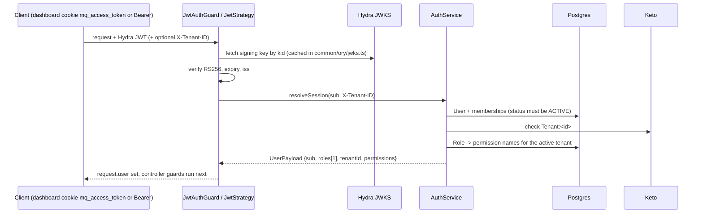
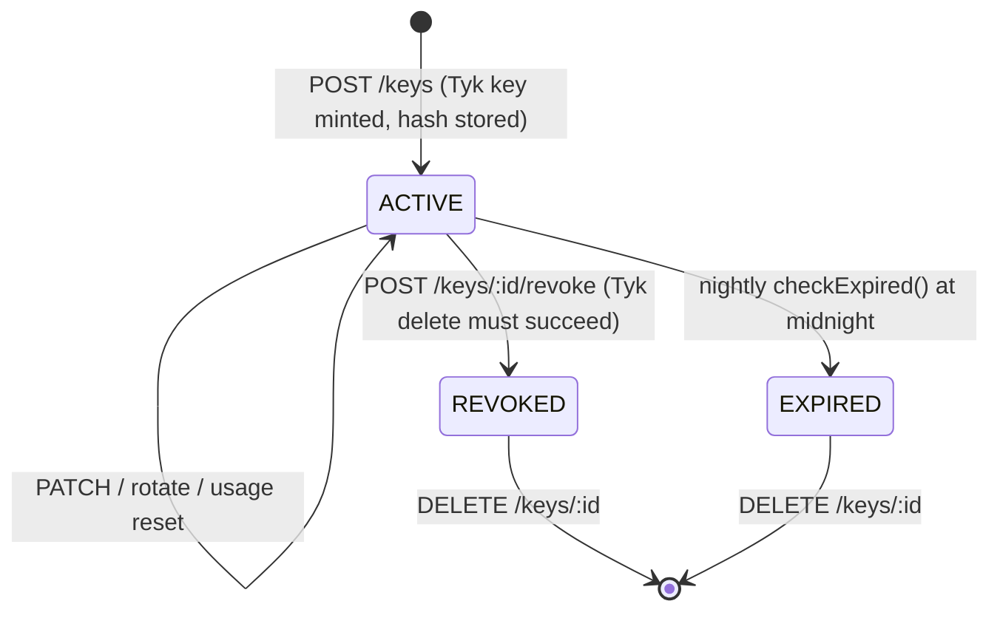
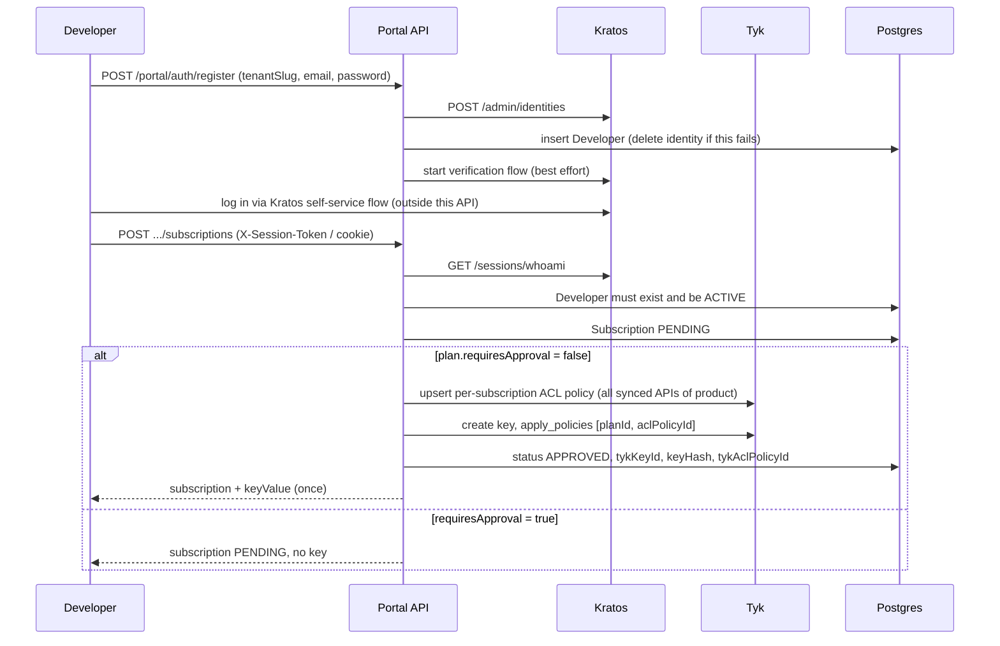

# API reference: identity, access and commerce modules

Scope: eleven NestJS modules under `apps/api/src/modules/` -- `auth`, `tenants`, `roles`, `oauth-clients`,
`keys`, `plans`, `products`, `quotas`, `portal`, `audit`, `governance`. Together they answer "who is calling",
"which tenant are they in", "what may they do", and "what credentials and limits do API consumers get".

Everything below was read from the code on branch `feat/web-dashboard-redesign`. Where a behaviour could not be
confirmed from code it is marked **unverified**. All routes are served under the global prefix `/api`
(`apps/api/src/main.ts`, `app.setGlobalPrefix('api')`); paths below omit it. Swagger is at `/api/docs`.

## Contents

1. [Summary table](#summary-table)
2. [Cross-cutting request pipeline](#cross-cutting-request-pipeline)
3. [auth](#auth)
4. [tenants](#tenants)
5. [roles](#roles)
6. [oauth-clients](#oauth-clients)
7. [keys](#keys)
8. [plans](#plans)
9. [products](#products)
10. [quotas](#quotas)
11. [portal](#portal)
12. [audit](#audit)
13. [governance](#governance)
14. [Permission catalogue](#permission-catalogue)
15. [Inaccuracies found in existing docs](#inaccuracies-found-in-existing-docs)

## Summary table

| Module | Purpose | Main routes prefix | Key permissions |
|---|---|---|---|
| auth | Verifies Hydra-issued JWTs and resolves the per-request session (active tenant, role, permissions). Only route: `GET /auth/me`. | `/auth` | none (authenticated only) |
| tenants | Tenant CRUD (soft delete), membership and role management, per-tenant org quota views. Keeps Postgres and Keto in step. | `/tenants` | `tenant:read/create/update/delete`, `user:read/create/update/delete` |
| roles | Custom per-tenant roles and the permission catalogue. | `/roles` | `role:read/create/update/delete` |
| oauth-clients | OAuth2 client-credentials clients (in Hydra) plus their Tyk policy, for APIs with `authType: OAUTH`. | `/oauth-clients` | `key:create/read/update/revoke` |
| keys | Tenant API keys minted on Tyk; hash stored locally; rotate, revoke, usage. | `/keys` | `key:create/read/update/revoke` |
| plans | Commercial rate/quota tiers; each plan is one Tyk policy (policy id = plan id). Also the per-tenant API-count ceiling guard. | `/plans` | `plan:read/create/update/delete` |
| products | Control-plane bundles of APIs; no gateway object. | `/products` | `product:read/create/update/delete` |
| quotas | Org-level (tenant) quota on Tyk, per-key counter reset, hourly metering job, quota/key-expiry schedulers. | `/quotas` | `settings:read`, `settings:update` |
| portal | Self-service developer portal: separate Kratos-session auth domain, catalogue, applications, subscriptions that mint keys. | `/portal/*` | none (own guard `DeveloperAuthGuard`) |
| audit | Audit log store, global `@Audit()` interceptor, query/stats/CSV export. | `/audit-logs` | `audit:read`, `audit:export`, `analytics:read` |
| governance | Drift report, deterministic config export, audited "adopt from gateway" override. | `/governance` | `api:read`, `api:update` |

## Cross-cutting request pipeline

These pieces live in `apps/api/src/common/` and `apps/api/src/app.module.ts`; every module below relies on them.

- **Global guards** (`app.module.ts`, `APP_GUARD`): `ThrottlerGuard` (100 req/min per IP in production, 1000 otherwise) then
  `JwtAuthGuard` (`common/guards/jwt-auth.guard.ts`). `@Public()` exempts a route from `JwtAuthGuard` only.
- **Per-controller guards**: most dashboard controllers add `@UseGuards(TenantIsolationGuard, PermissionsGuard)`.
  - `TenantIsolationGuard` (`common/guards/tenant-isolation.guard.ts`): rejects (403) an `X-Tenant-ID` header that differs from the resolved
    session tenant, rejects a session without a tenant, and sets `request.tenantId`.
  - `PermissionsGuard` (`common/guards/permissions.guard.ts`): all `@Permissions(...)` names must be in `user.permissions`;
    `super_admin` in the *active* tenant bypasses.
- **`@CurrentTenant()`** (`common/decorators/current-tenant.decorator.ts`) reads `request.tenantId` (never the raw header).
- **Global interceptor**: `AuditLogInterceptor` (registered by `AuditModule`) records `@Audit()` routes -- see [audit](#audit).
- **Error shape** (`common/filters/all-exceptions.filter.ts`): `{ success: false, error: { code, message, details, traceId } }`;
  any non-`HttpException` becomes a generic 500 (message hidden, stack logged).
- **Ory clients** are plain functions, not Nest providers: `common/ory/keto.ts`, `common/ory/kratos.ts`, `common/ory/jwks.ts`.
  Env is read per call, not at import. All Ory calls use a 5 s timeout.

Roles seeded per tenant by `packages/database/prisma/seed.ts`: `super_admin`, `admin`, `operator`, `viewer`
(lowercase; `UserTenant.role` is free text, not an enum).

---

## auth

**Purpose.** Since the Ory cutover this module no longer logs anyone in or signs tokens. It verifies Hydra-issued access tokens against
Hydra's JWKS and turns the token subject into the session object the guards read.

**Location.** `apps/api/src/modules/auth/`
- `auth.module.ts`, `controllers/auth.controller.ts`, `services/auth.service.ts`, `strategies/jwt.strategy.ts` (live)
- `services/token.service.ts`, `jwt-secret.ts`, `dto/login.dto.ts`, `dto/register.dto.ts`, `types/auth.types.ts` (dead, see Gotchas)

**HTTP endpoints**

| Method | Path | Permission | Behaviour |
|---|---|---|---|
| GET | `/auth/me` | none (any valid session) | Profile, roles and permissions of the *active* tenant, all tenant memberships (for a switcher), active tenant name. |

There is no `/auth/login`, `/register`, `/refresh` or `/logout` (`auth.controller.ts` header comment).

**Services**
- `AuthService.resolveSession(subject, requestedTenantId?)`: loads `User` by id with memberships; returns `null` (=> 401) unless `status === 'ACTIVE'`;
  picks the active tenant (`X-Tenant-ID` if the user is a member, else the `isDefault` membership, else the first); confirms membership with
  `ketoCheck(tenantId, 'view', userId)`; loads permissions via `UserTenant.role -> Role(name, tenantId) -> RolePermission -> Permission.name`.
- `AuthService.getCurrentUser` backs `/auth/me`.
- `JwtStrategy` (`strategies/jwt.strategy.ts`): token from cookie `mq_access_token` or `Authorization: Bearer`; RS256 only; signing key fetched from
  Hydra's JWKS (`ORY_HYDRA_PUBLIC_URL`); `iss` must equal `ORY_HYDRA_ISSUER`; audience is deliberately **not** checked.

**Data.** Reads `User`, `UserTenant`, `Role`, `RolePermission`, `Permission`. Writes nothing.

**Dependencies.** Ory Hydra (JWKS; env `ORY_HYDRA_PUBLIC_URL`, `ORY_HYDRA_ISSUER`), Ory Keto (`ORY_KETO_READ_URL`, default `http://keto:4466`), Postgres.

**Events / side effects.** None. No audit entry (login itself happens in Kratos/Hydra + `apps/web`).

**Gotchas**
- Tokens carry **no** tenant/role/permission claims (comment in `jwt.strategy.ts`); everything is resolved per request, so suspending a user or
  revoking a membership takes effect immediately, at the cost of a Postgres + Keto round trip on every authenticated request.
- Token `sub` must be a local `User.id`. A `client_credentials` token aimed at the data plane resolves to no user and gets 401.
- An unreachable Keto makes `ketoCheck` throw => 500, not a silent "denied" (`common/ory/keto.ts`). A membership row without a Keto tuple is denied.
- A requested tenant that the user is not in silently falls back to the default tenant here; `TenantIsolationGuard` then 403s on the header mismatch.
- `roles` in the session is a single-element array (active tenant only), by design; old behaviour (union across tenants) allowed cross-tenant bypass.
- Dead code kept on purpose (WP7 decision, per file headers): `token.service.ts`, `jwt-secret.ts`, the login/register DTOs, `types/auth.types.ts`.
  `JWT_SECRET` is still demanded by compose but nothing in the API reads it.
- `UserPayload.status` type includes `PENDING_VERIFICATION` (`common/types/index.ts`) but the Prisma `UserStatus` enum has only `ACTIVE | INACTIVE | SUSPENDED`.

---

## tenants

**Purpose.** Tenant (organisation) lifecycle, membership, role assignment, and per-tenant org quota views. It is the only module that writes Keto
membership tuples.

**Location.** `apps/api/src/modules/tenants/`
- `controllers/tenant.controller.ts`, `services/tenant.service.ts`, `tenants.module.ts` (imports `QuotasModule`)
- `dto/*.ts`, `guards/tenant-slug.guard.ts`

**HTTP endpoints** (controller guards: `TenantIsolationGuard`, `PermissionsGuard`)

| Method | Path | Permission | Behaviour |
|---|---|---|---|
| POST | `/tenants` | `tenant:create` | Create tenant + creator's `admin` membership + default roles, then Keto tuple. Audit `tenant:created`. |
| GET | `/tenants` | `tenant:read` | Paginated list of the caller's tenants (all for super_admin). |
| GET | `/tenants/:id` | `tenant:read` | One tenant (needs Keto `view`). |
| PATCH | `/tenants/:id` | `tenant:update` | Update name/status/plan/config (Keto `manage`). Slug is validated only if present in the DTO -- see Gotchas. |
| DELETE | `/tenants/:id` | `tenant:delete` | Soft delete: sets status `ARCHIVED`; 400 if already archived. |
| GET | `/tenants/:id/users` | `user:read` | Paginated members, optional `q` search on name/email; `pending` flag. |
| POST | `/tenants/:id/users` | `user:create` | Assign an existing user with a role. |
| POST | `/tenants/:id/users/invite` | `user:create` | Invite by email (pending user row). **Route only exists when `FEATURE_INVITE_BY_EMAIL=true`.** |
| GET | `/tenants/:id/users/lookup?email=` | `user:read` | Find an existing user by email; `null` if none. |
| PATCH | `/tenants/:id/users/:userId` | `user:update` | Change a member's role. Audit `tenant:role_changed`. |
| DELETE | `/tenants/:id/users/:userId` | `user:delete` | Remove a member (204). Audit `tenant:unassigned`. |
| GET | `/tenants/:id/quota` | `tenant:read` | Read the org-level quota ceiling (delegates to `OrgQuotaService`). |
| PATCH | `/tenants/:id/quota` | `tenant:update` | Set the ceiling. Audit `tenant:quota_updated`. |
| POST | `/tenants/:id/quota/reset` | `tenant:update` | Zero the org usage counter, keep ceiling. Audit `tenant:quota_reset`. |
| GET | `/tenants/:id/usage` | `tenant:read` | `used = quotaMax - quotaRemaining` when a ceiling exists. |

**Services**
- `TenantService` (`services/tenant.service.ts`)
  - `assertPermit(caller, tenantId, 'view'|'manage')`: gate on every `:id` route. Requires a `UserTenant` row for the *path* tenant **and** a Keto check
    for that tenant; super_admin skips both. Non-members get 403 (not 404).
  - `create`: one Prisma transaction for `Tenant` (id generated in app so `tykOrgId = tykOrgIdFor(id)` can be derived), creator `UserTenant` (`admin`,
    default), and the default `admin`/`operator`/`viewer` `Role` rows with permissions; then `ketoWriteMembership`. If Keto fails the tenant is deleted again and a 502 returned.
  - `assignUser` / `inviteByEmail` / `updateMemberRole` / `removeMember`: keep `UserTenant` and Keto tuples in step with defined ordering (below).
  - `isLastAdmin`: refuses demoting/removing the only *claimed* admin (pending invites with no `kratosIdentityId` do not count).
  - `getQuota/setQuota/resetQuota/getUsage`: thin wrappers over `OrgQuotaService` after `assertPermit`.
- `TenantSlugGuard` (`guards/tenant-slug.guard.ts`): validates a `?slug=`/`:slug` and attaches `request.resolvedTenant`. **Not referenced by any controller** (grep); so is `TenantService.findOneBySlug`.

**Data.** Owns `Tenant`, `UserTenant`; creates `Role`, `RolePermission`; reads `Permission`, `User`. Invite creates a `User` with `password: null`, `kratosIdentityId: null`.

**Dependencies.** Keto write API (`ORY_KETO_WRITE_URL`, default `http://keto:4467`) and read API; `QuotasModule` (`OrgQuotaService`, therefore Tyk); Postgres.

**Events / side effects.** Audit via `@Audit` labels above. Keto tuple writes/deletes. Tyk org session changes via the quota routes. No direct Tyk call on create -- `Tenant.tykOrgId` is only a stamp used by other modules.

**Gotchas**
- Role change ordering (documented in `updateMemberRole`): promotion writes Keto first; demotion writes Postgres first and rolls the row back if the Keto sync fails.
  `removeMember` deletes the tuple *before* the row. Keto only knows `admin` vs `member` (`relationForRole` in `common/ory/keto.ts`); finer roles live in Postgres.
- `super_admin` can never be assigned through the API (`assertNotReservedRole` => 403), because `isSuperAdmin` matches on the role *name* globally.
- `DEFAULT_TENANT_ROLE_PERMISSIONS` in `tenant.service.ts` is a hand-maintained copy of the lists in `packages/database/prisma/seed.ts` (comment says so). A new permission must be added to both or new tenants' `operator` role misses it.
- `POST /tenants` audit row is written with the *caller's* tenant id (`request.tenantId`), not the new tenant's.
- The auto-`@Audit('tenant:created')` label and every label maps to an `AuditAction` enum value; see [audit](#audit).
- `PATCH /tenants/:id` slug handling: the service validates/normalises `dto.slug` and checks uniqueness, but the `prisma.tenant.update` `data` block does not include `slug`, so a slug change is validated and then not persisted (read from code, `UpdateTenantDto` does expose `slug`; not exercised at runtime).
- Invite-by-email is held back for a security finding (H1, pending-invite takeover); flag is read once at import, so it needs a process restart and must be set in the process environment, not only `apps/api/.env.local`.
- The Postgres `User` row is provisioned lazily at first login (per a comment referencing `apps/web`'s oauth2 login route), so `lookup` cannot find someone who only registered in Kratos.

---

## roles

**Purpose.** Tenant-scoped custom roles (a name plus a set of permission names) and the global permission catalogue used by the role matrix UI.

**Location.** `apps/api/src/modules/roles/` -- `controllers/role.controller.ts`, `services/role.service.ts`, `dto/role.dto.ts`, `roles.module.ts`.

**HTTP endpoints** (`TenantIsolationGuard`, `PermissionsGuard`; tenant = `@CurrentTenant()`)

| Method | Path | Permission | Behaviour |
|---|---|---|---|
| GET | `/roles/permissions` | `role:read` | Full permission catalogue (declared before `:id` on purpose). |
| GET | `/roles` | `role:read` | Roles of the active tenant with permission names and `memberCount`. |
| GET | `/roles/:id` | `role:read` | One role. |
| POST | `/roles` | `role:create` | Create a role with permissions. Audit `role:created`. |
| PATCH | `/roles/:id` | `role:update` | Rename / edit description / **replace** permissions if `permissions` is sent. Audit `role:updated`. |
| DELETE | `/roles/:id` | `role:delete` | Refused (409) while any member holds the role by name. Audit `role:deleted`. |

**Services.** `RoleService`: CRUD; `resolvePermissionIds` rejects unknown permission names with 400; `update` runs a transaction (delete-all + create-many of `RolePermission`).

**Data.** Owns `Role`, `RolePermission`; reads `Permission`, `UserTenant` (member count / in-use check).

**Dependencies.** Postgres only.

**Events / side effects.** Audit only. No Keto or Tyk interaction.

**Gotchas**
- `super_admin` is a **reserved name**: create, rename-to, update, delete of it (case-insensitive) => 403 (`role.service.ts`).
- `UserTenant.role` is a plain string, not a foreign key to `Role`. Deleting or renaming a role that members hold would silently zero their permissions on the next request, hence the delete guard. **Renaming** a role that is in use is not guarded in `update` (read from code): members keep the old string and lose their permissions.
- Editing a role's permissions takes effect on the next request (permissions are resolved per request in `AuthService`), no token refresh needed.
- Roles do not change the Keto relation; changing which role a user holds is done in [tenants](#tenants).

---

## oauth-clients

**Purpose.** Issues OAuth2 `client_credentials` clients for APIs whose `authType` is `OAUTH`. There is no local table: Hydra is the record, and a per-client
Tyk policy authorises it.

**Location.** `apps/api/src/modules/oauth-clients/` -- `controllers/oauth-client.controller.ts`, `services/oauth-client.service.ts`, `services/hydra-admin.service.ts`, `services/oauth-client-mapper.ts`, `dto/oauth-client.dto.ts`.

**HTTP endpoints** (guards as above; deliberately reuses `key:*` permissions)

| Method | Path | Permission | Behaviour |
|---|---|---|---|
| POST | `/oauth-clients` | `key:create` | Create client for an OAUTH API; returns `clientSecret` once plus `tokenUrl`. Audit `oauth-client:created`. |
| GET | `/oauth-clients?apiDefId=` | `key:read` | Clients of one API (never includes secret), newest first. |
| POST | `/oauth-clients/:id/rotate` | `key:update` | Replace the secret (id and policy unchanged); returned once. Audit `oauth-client:updated`. |
| DELETE | `/oauth-clients/:id` | `key:revoke` | Delete Tyk policy first, then the Hydra client. Audit `oauth-client:revoked`. |

**Services**
- `OAuthClientService`: orchestration; verifies API ownership (`findApi`) and `authType === 'OAUTH'`; every client read re-checks `metadata.tenantId`.
- `HydraAdminService`: thin `fetch` wrapper over Hydra's admin `/admin/clients` (create, find, list by `owner`, full replace, delete). All failures become 502 with a generic message; 404 => `NotFoundException`.
- `oauth-client-mapper.ts`: `buildHydraClientDef`, `buildTykPolicy`, `generateClientSecret`.

**Data.** Reads `ApiDefinition` and tenant scope (`loadTenantScope` => `Tenant.tykOrgId`). Hydra client stores `owner = tenantId` and `metadata.{tenantId, apiDefId}`.

**Dependencies.** Ory Hydra admin API (`ORY_HYDRA_ADMIN_URL`, default `http://hydra:4445`, unauthenticated, in-network only); `ORY_HYDRA_ISSUER` for `tokenUrl`; Tyk via `TykClientService` (`upsertPolicy`, `deletePolicy`).

**Events / side effects.** Hydra client create/replace/delete; Tyk policy upsert/delete; audit rows.

**Gotchas**
- **Policy id == Hydra client id** (`oauth-client-mapper.ts` comment): Tyk maps the JWT to a policy through the `client_id` claim, which is the only claim naming the client.
- Create is compensating: if the policy write fails the Hydra client is removed; if that cleanup fails an orphan is logged for manual deletion.
- Revoke deletes the policy first because Tyk verifies these tokens offline; deleting only the Hydra client would leave issued tokens working until expiry. If policy deletion fails the client is *not* reported revoked.
- `listByOwner` fetches a single page of 500 (`ponytail:` comment in `hydra-admin.service.ts`); more than 500 clients per tenant would be truncated.
- Rotate does a full `PUT` of the client record (Hydra has no partial update).
- Plan/rate limits for the client come from the request DTO (`ClientLimits`) and are baked into its Tyk policy; they are not linked to a [plans](#plans) row (**unverified** beyond the mapper signature).

---

## keys

**Purpose.** Tenant-issued API keys: created on Tyk, only a SHA-256 hash is stored locally; lifecycle (update, rotate, revoke, delete, expire) and usage.

**Location.** `apps/api/src/modules/keys/` -- `controllers/key.controller.ts`, `services/key.service.ts`, `services/tyk-key-mapper.ts`, `dto/*.ts`, `keys.module.ts` (imports `TykIntegrationModule`, `forwardRef(QuotasModule)`, `McpModule`).

**HTTP endpoints**

| Method | Path | Permission | Behaviour |
|---|---|---|---|
| POST | `/keys` | `key:create` | Create key; raw `keyValue` returned once. Audit `key:created`. |
| GET | `/keys` | `key:read` | Paginated (pageSize clamped 1..100), filters `status`, `apiDefId`. Never returns hash or Tyk id. |
| GET | `/keys/:id` | `key:read` | Key plus live gateway limits (`tyk` is `null` if Tyk is unreachable or key not active). |
| PATCH | `/keys/:id` | `key:update` | Update name/expiry/rate/quota; 409 unless ACTIVE. Audit `key:updated`. |
| POST | `/keys/:id/revoke` | `key:revoke` | Delete on Tyk then mark `REVOKED`. Audit `key:revoked`. |
| GET | `/keys/:id/usage` | `key:read` | Request/error/latency rollup (pump tables, `range` query) merged with live quota. |
| POST | `/keys/:id/rotate` | `key:update` | New Tyk key with same settings, old one deleted; new raw value returned once. Audit `key:rotated`. |
| POST | `/keys/:id/usage/reset` | `key:update` | Zero counter locally and on Tyk (via `OrgQuotaService.resetKey`). Audit `key:usage_reset`. |
| DELETE | `/keys/:id` | `key:revoke` | Hard delete; 409 while still ACTIVE. Audit `key:deleted`. |

**Services**
- `KeyService`: all lifecycle above, plus `checkExpired()` (called nightly by `QuotaResetScheduler`) and private helpers (`deleteTykKey`, `readTykState`, `readRollup`, `viaGateway`).
- `tyk-key-mapper.ts`: pure builders `buildTykKeyDef`, `applyKeyUpdate`, `buildKeyAclPolicy`, `quotaPeriodToSeconds`.

**Data.** Owns `ApiKey` (`tykKeyId` = Tyk key hash, `keyHash` = SHA-256 of the raw key, `tykAclPolicyId`, `planId`, `apiDefId`, `mcpServerId`, `expiresAt`, `status`). Creates/updates `Quota` rows. Reads `ApiDefinition`, `Plan`, `Tenant`, pump table via `keyRollupQuery`.

**Dependencies.** Tyk (create/get/update/delete key, upsert/delete policy); `McpService` (`keyAccessRight` for MCP-scoped keys); `QuotaService`, `OrgQuotaService`; Postgres pump tables (`tyk_aggregated` etc. via `analytics/services/pump-query.builder`).

**Events / side effects.** Tyk key + policy writes; audit rows; `Quota` rows.

Create order (`KeyService.create`): validate API belongs to tenant and is synced (`tykApiId`) -> validate plan belongs to tenant -> if planned, push the
per-key ACL policy -> create key on Tyk -> hash and insert `ApiKey` -> optional `Quota` row. Failures compensate (delete ACL policy / Tyk key) and log the handle
if cleanup also fails.

**Gotchas**
- **Plan-governed keys carry two policies**: the plan's shared, ACL-less policy plus a per-key ACL policy (`tykAclPolicyId`, `partitions.acl: true`). Tyk refuses `apply_policies` unless a referenced policy owns access rights (live-verified on 5.15.0 per `buildKeyAclPolicy` comment). The ACL policy is deleted with the key.
- A key with `planId` carries **no** inline rate/quota; editing the plan changes every key at once.
- Revoke and expire treat "key not found" on Tyk as success (regex `TYK_KEY_MISSING`); any other gateway error aborts and leaves the key ACTIVE (revoke => 502).
- Rotate mints the new key **before** deleting the old one; if deleting the old key fails it is only logged (manual cleanup). Rotate does not touch `tykAclPolicyId`.
- `Quota` rows are described in code as vestigial/bookkeeping ("the gateway is the enforcing authority"), but `MeteringService` still writes `Quota.used` and raises `QUOTA_EXCEEDED` audit rows from them.
- `keyValue` is shown only in the create/rotate responses; it is not retrievable afterwards.
- An API that has not synced to Tyk yet cannot be used for a key (400 "not synced yet").

---

## plans

**Purpose.** Commercial tiers (rate limit + quota) implemented as one Tyk policy per plan, plus the per-tenant API-count ceiling.

**Location.** `apps/api/src/modules/plans/` -- `controllers/plan.controller.ts`, `services/plan.service.ts`, `services/plan-policy.ts`, `guards/plan-limit.guard.ts`, `dto/plan.dto.ts`, `plans.module.ts` (imports `TykIntegrationModule`, `McpModule`).

**HTTP endpoints**

| Method | Path | Permission | Behaviour |
|---|---|---|---|
| POST | `/plans` | `plan:create` | Create row, then push policy to every gateway node (awaited); row deleted if push fails. Audit `plan:created`. |
| GET | `/plans` | `plan:read` | List plans with `keyCount`. |
| GET | `/plans/:id` | `plan:read` | One plan. |
| PATCH | `/plans/:id` | `plan:update` | Update then re-push policy. Audit `plan:updated`. |
| POST | `/plans/:id/sync` | `plan:update` | Re-push the policy (drift repair); returns per-node outcomes. Audit `plan:updated`. |
| DELETE | `/plans/:id` | `plan:delete` | Delete Tyk policy then row; keys survive (FK `SetNull`). Audit `plan:deleted`. |

**Services**
- `PlanService`: as above; `accessRights()` asks `McpService.planAccessRights` for per-primitive MCP rate limits to embed in the policy.
- `buildPlanPolicy` (`plan-policy.ts`): `id = plan.id`, `rate <= 0` => `rate: 0, per: 0` (no limiting), `quota_max` as stored (`-1` unlimited), `partitions: {quota, rate_limit: true; acl: false}`.
- `PlanLimitGuard` (`guards/plan-limit.guard.ts`): used by `POST /apis` in the api-management module only (`api.controller.ts`); blocks creation with 403 `PLAN_LIMIT_EXCEEDED` when base APIs (`parentApiId: null`) reach the `Tenant.plan` ceiling: FREE 3, STARTER 10, PRO 50, ENTERPRISE unlimited (`API_LIMIT_BY_PLAN`).

**Data.** Owns `Plan` (`rate`, `per`, `quotaMax`, `quotaPeriod`, `active`, `requiresApproval`); relations: `ApiKey` (SetNull), `Subscription` (Restrict). Reads `Tenant.plan` for the guard.

**Dependencies.** Tyk policies (`TykClientService.upsertPolicy/deletePolicy`), `McpService`.

**Events / side effects.** Tyk policy writes on every create/update/sync/delete; audit rows.

**Gotchas**
- **`Plan.id` is the Tyk policy id** (gateway runs with `allow_explicit_policy_id`).
- Tyk conventions read backwards: `rate 0` = unlimited, `quota_max -1` = unlimited, `0` quota would be zero requests.
- `update` writes the DB first and pushes the policy after, with no rollback: if the push throws, the row is changed but the gateway is stale (use `POST /plans/:id/sync`).
- `remove` deletes the Tyk policy *before* the row. `Plan -> Subscription` is `onDelete: Restrict` (`schema.prisma`) and `PlanService.remove` has no handling for the resulting FK error, which the global filter would surface as a generic 500 -- **after** the policy is gone. Revoke/delete subscriptions first. (Behaviour inferred from code; not run.)
- `POST /plans/:id/sync` is audited as `updated`, deliberately (comment), because there is no `synced` `AuditAction`.
- `Plan.requiresApproval` exists, but no admin-approve endpoint exists (see [portal](#portal)).
- Plan tier ceilings are code config on purpose ("Changing a tier is a release").

---

## products

**Purpose.** Named bundles of the tenant's APIs, published to the developer portal. Purely a control-plane grouping.

**Location.** `apps/api/src/modules/products/` -- `controllers/product.controller.ts`, `services/product.service.ts`, `dto/product.dto.ts`, `products.module.ts`.

**HTTP endpoints**

| Method | Path | Permission | Behaviour |
|---|---|---|---|
| POST | `/products` | `product:create` | Create with optional `apiIds`. Audit `product:created`. |
| GET | `/products` | `product:read` | List (with member API summaries). |
| GET | `/products/:id` | `product:read` | One product. |
| PATCH | `/products/:id` | `product:update` | Rename / slug / description; `apiIds` **replaces** membership if present. Audit `product:updated`. |
| DELETE | `/products/:id` | `product:delete` | Delete product; `ProductApi` cascades, APIs untouched. Audit `product:deleted`. |

**Services.** `ProductService` -- `assertApisOwned` rejects (400) any `apiIds` not in the tenant; `asConflict` maps unique violations (name or slug) to 409.

**Data.** Owns `Product`, `ProductApi`; reads `ApiDefinition`. `Subscription.product` is `onDelete: Restrict`.

**Dependencies.** Postgres only. Deliberately never touches Tyk.

**Events / side effects.** Audit rows only. A product's APIs become the access grant of portal subscription keys (see [portal](#portal)).

**Gotchas**
- No visibility flag: **every product of a tenant is "published"** in the portal catalogue (explicit GAP comment in `portal-catalog.controller.ts`).
- Deleting a product that has subscriptions hits the `Restrict` FK; `ProductService.remove` does not translate it, so expect a 500 (inferred, not run).
- Product membership changes do **not** update keys already issued to subscriptions: their ACL policy was built from the product's APIs at approval time (`SubscriptionService.approveAndIssueKey`).

---

## quotas

**Purpose.** Org-level (whole tenant) quota ceiling on Tyk, per-key counter reset, and the background jobs that meter usage, reset local quota rows and expire keys.

**Location.** `apps/api/src/modules/quotas/` -- `controllers/org-quota.controller.ts`, `services/{quota,org-quota,metering}.service.ts`, `services/quota-reset.scheduler.ts`, `quotas.module.ts` (imports `ScheduleModule.forRoot()`, `forwardRef(KeysModule)`, `TykIntegrationModule`, `AuditModule`).

**HTTP endpoints** (`TenantIsolationGuard`, `PermissionsGuard`)

| Method | Path | Permission | Behaviour |
|---|---|---|---|
| GET | `/quotas/org` | `settings:read` | Caller's tenant org quota from the Tyk org session. |
| PUT | `/quotas/org` | `settings:update` | Set ceiling (`quotaMax`, `period`, `isInactive`) on every node. Audit `quota:org_updated`. |
| POST | `/quotas/org/reset` | `settings:update` | Delete and re-create the org session: counter to full, ceiling kept. Audit `quota:org_reset`. |
| POST | `/quotas/keys/:id/reset` | `settings:update` | Zero one key's counter locally and on Tyk. Audit `quota:key_reset`. |
| POST | `/quotas/meter` | `settings:update` | Run the metering pass now. |

The same org-quota operations are exposed by id under `/tenants/:id/quota*` (see [tenants](#tenants)).

**Services**
- `OrgQuotaService`: `get`, `set`, `reset`, `resetKey` (Tyk org session via `TykClientService.getOrgSession/setOrgSession/deleteOrgSession/resetKeyQuota`).
- `QuotaService`: local `Quota` row CRUD, `resetExpiredQuotas`, reset-time calculation per period (uses server-local time via `setHours` etc.).
- `MeteringService`: hourly cron (`handleMeterUsage`) and `meterAll()`; sums `counter_hits` from `tyk_aggregated` (`dimension = 'apikeys'`) since (earliest `resetAt` minus 30 days), writes `Quota.used`, writes an `QUOTA_EXCEEDED` audit row when `used` crosses `limit`.
- `QuotaResetScheduler`: `@Cron(EVERY_HOUR)` resets expired `Quota` rows; `@Cron(EVERY_DAY_AT_MIDNIGHT)` calls `KeyService.checkExpired()`. Both wrapped in `countJobRun` metrics.

**Data.** Owns `Quota` (`limit`, `used`, `period`, `resetAt`, cascade from `ApiKey`). Reads `ApiKey`, `tyk_aggregated` (pump table, raw SQL).

**Dependencies.** Tyk org sessions and key quota reset; `AuditModule`; the analytics pump writing `tyk_aggregated` to Postgres; `@nestjs/schedule`.

**Events / side effects.** Tyk org session writes; audit rows (`ORG_UPDATED`, `ORG_RESET`, `KEY_RESET`, `QUOTA_EXCEEDED`); hourly and nightly jobs.

**Gotchas**
- `POST /quotas/meter` calls `meterAll()`, which has **no tenant filter**: it meters every tenant's quotas. It is idempotent (recomputes totals), but any tenant holding `settings:update` can trigger a global pass.
- `OrgQuotaService.reset` implements "reset" as delete-then-recreate of the org session; a failure between the two steps would leave the org with no session (comment/behaviour read from code).
- `quotaMax < 0` means unlimited; renewal rate is then `0`. Default period on `set` is `MONTHLY`.
- Enforcement needs `enforce_org_quotas` and `enforce_org_data_age` enabled on the gateway, otherwise the call returns 200 and does nothing (`Tenant.tykOrgId` comment in `schema.prisma`).
- Metering audit rows carry no user id (system event).
- Scheduler job wiring: `QuotasModule` and `KeysModule` reference each other via `forwardRef`.

---

## portal

**Purpose.** Self-service developer portal API: developers register, browse the tenant's products and plans, register applications and subscribe them to a product at a plan tier, which mints a Tyk key.

**Location.** `apps/api/src/modules/portal/`
- controllers: `portal-auth.controller.ts`, `portal-catalog.controller.ts`, `portal-applications.controller.ts`, `portal-subscriptions.controller.ts`
- services: `developer.service.ts`, `application.service.ts`, `subscription.service.ts`, `portal-api-doc.service.ts`
- `guards/developer-auth.guard.ts`, `decorators/current-developer.decorator.ts`, `dto/*.ts`, `portal.module.ts`

**HTTP endpoints.** Every controller is `@Public()` (skips the dashboard `JwtAuthGuard`); protection comes from `DeveloperAuthGuard` except `register`. There are no `@Permissions`.

| Method | Path | Auth | Behaviour |
|---|---|---|---|
| POST | `/portal/auth/register` | public, throttled 5/min/IP | Create Kratos identity + `Developer` row in a tenant (by `tenantSlug`); best-effort verification email. |
| GET | `/portal/auth/me` | developer session | Session echo incl. `tenantSlug`. |
| GET | `/portal/catalog/products`, `/products/:id` | developer session | Tenant's products (all of them). |
| GET | `/portal/catalog/plans`, `/plans/:id` | developer session | Only `active` plans; inactive => 404. |
| GET | `/portal/catalog/apis/:id` | developer session | Sanitised OpenAPI doc + gateway listen path (`PortalApiDocService`). |
| POST | `/portal/applications` | developer session | Create application (max 20 per developer, unique name). |
| GET | `/portal/applications`, `/:id` | developer session | Own applications. |
| POST | `/portal/applications/:applicationId/subscriptions` | developer session, throttled 10/min/IP | Subscribe to product+plan; key returned once if auto-approved. |
| GET | `/portal/applications/:applicationId/subscriptions` | developer session | Subscriptions of an application. |
| POST | `/portal/applications/:applicationId/subscriptions/:id/revoke` | developer session | Delete key and ACL policy, mark `REVOKED`. |
| GET | `/portal/applications/:applicationId/subscriptions/:id/usage` | developer session | Usage for the subscription key (`range` query). |

**Services**
- `DeveloperAuthGuard`: forwards a Kratos session (Bearer token as `X-Session-Token`, or the raw `Cookie` header) to Kratos `/sessions/whoami`; then requires a `Developer` row by `kratosIdentityId` with `status === 'ACTIVE'`. Sets `request.developer` (`DeveloperPayload`).
- `DeveloperService.register`: `kratosCreateIdentity` -> `prisma.developer.create`; on DB failure deletes the Kratos identity; then `kratosSendVerificationEmail` (failure only logged).
- `ApplicationService`: scoped by `developerId`; cross-account access answers **403** (not 404).
- `SubscriptionService`: `create` (PENDING row, then `approveAndIssueKey` unless `plan.requiresApproval`), `revoke`, `getUsage`.
- `PortalApiDocService`: builds/caches the sanitised spec (8 MB serialized-size cache, per process, FIFO); API must be ACTIVE and in at least one product of the developer's tenant, else the same 404 as a missing id.

**Data.** Owns `Developer`, `Application`, `Subscription`. Reads `Tenant`, `Product`, `ProductApi`, `Plan`, `ApiDefinition`; pump table via `keyRollupQuery`.

**Dependencies.** Ory Kratos public (`ORY_KRATOS_PUBLIC_URL`, default `http://kratos:4433`) and admin (`ORY_KRATOS_ADMIN_URL`, default `http://kratos:4434`); Tyk (policy + key); `PlansModule`, `ProductsModule`, `ApiManagementModule`.

**Events / side effects.** Kratos identity create/delete and verification email; Tyk ACL policy and key create/delete. **No `@Audit` anywhere in the portal** (grep), so portal actions produce no audit rows.

**Gotchas**
- Two separate auth domains: a Kratos session token is not a JWT so it fails `JwtAuthGuard`; a Hydra JWT fails `whoami`. Neither reaches the other's routes.
- `register`: **any** failure of the Kratos identity call is reported as 409 "account already exists" (`developer.service.ts` catches everything), so a Kratos outage looks like a duplicate account.
- Kratos enforces one identity per email across the whole instance, dashboard users included (comment in `kratos.ts`).
- **No admin-approve endpoint exists** (`Plan.requiresApproval` comment in `schema.prisma`; no such route in this module): a `PENDING` subscription stays `PENDING`.
- Only the first subscription per (application, product) is allowed (`@@unique([applicationId, productId])`); re-subscribing to change plan is not implemented in this module (`create` returns 409).
- `approveAndIssueKey` fails with 400 if the product has no API synced to Tyk yet (an empty ACL policy is refused); the PENDING row created just before is left behind in that case (read from code: no cleanup of the row).
- Revoke deletes the key before the ACL policy; ACL policy deletion failure is only logged.
- Throttle limits are per IP; `deployment.md` line ~838 claims no per-endpoint limits exist (see Inaccuracies).
- Portal catalogue publishes every product (no visibility flag).

---

## audit

**Purpose.** Persist a tenant-scoped audit trail of mutating requests and selected system events, and expose it for search, stats and CSV export.

**Location.** `apps/api/src/modules/audit/` -- `audit.module.ts`, `controllers/audit.controller.ts`, `services/audit.service.ts`, `interceptors/audit-log.interceptor.ts`, `dto/audit-query.dto.ts`.

**HTTP endpoints** (`TenantIsolationGuard`, `PermissionsGuard`)

| Method | Path | Permission | Behaviour |
|---|---|---|---|
| GET | `/audit-logs` | `audit:read` | Filter by date range (inclusive days), `userId`, `action` (must be a real enum value, else ignored), `resource` (contains); page size max 100. |
| GET | `/audit-logs/stats` | `audit:read` | Totals, counts by action, top 10 users and resources over `range` (default `30d`). |
| GET | `/audit-logs/export/csv` | `audit:export` | CSV attachment, newest first, capped at `CSV_MAX_ROWS = 10_000`. |
| GET | `/audit-logs/traffic/:apiDefId` | `analytics:read` | Traffic rollup for an audit row's API (`findRelatedTraffic`, reuses `AnalyticsService`). |
| GET | `/audit-logs/:id` | `audit:read` | Single row (numeric id, tenant-scoped). |

**Services**
- `AuditService`: `record()` (swallows and logs its own failures), `recordOrThrow(entry, tx)` (throws; `tx` required so callers inside a transaction pass their client), reads, stats, CSV, related traffic.
- `AuditLogInterceptor` (global via `APP_INTERCEPTOR`): only `POST/PUT/PATCH/DELETE` handlers carrying `@Audit('<entity>:<action>')`. The `<action>` suffix, upper-cased, becomes the `AuditAction` enum value; `resource` = first path segment after `/api/`. Writes asynchronously (`setImmediate`). For `PATCH/PUT` it stores the redacted request body (keys matching password/secret/token/authorization/api-key/credential => `[REDACTED]`; URLs stripped of userinfo/query/fragment; spec-URL routes keep origin only; bodies over 16 KiB become a truncated preview).

**Data.** Owns `AuditLog` (`BigInt` id, `tenantId`, `userId`, `action` enum, `resource`, `details` JSON, `ipAddress`, `corrId`; FK `SetNull` on tenant/user delete). Enum `AuditAction` in `schema.prisma`.

**Dependencies.** Postgres; `AnalyticsModule` (`AnalyticsService`).

**Events / side effects.** This module *is* the side-effect sink. Other modules call `AuditService.record*` directly: `MeteringService` (`QUOTA_EXCEEDED`), `GovernanceAdoptService` (`UPDATED`).

**Gotchas**
- The label suffix must equal an `AuditAction` value. A wrong one makes the insert throw a Prisma error which is caught and logged, so **the row is silently never written**. `common/decorators/audit-actions.tripwire.spec.ts` guards this, but its regex is `[a-z_]+`, so labels whose entity contains a hyphen (`oauth-client:created` ...) are not scanned.
- `@Audit(action, entityType)`: the interceptor never reads `entityType`; `resource` always derives from the URL (e.g. `tenants`, `keys`, `oauth-clients`).
- The interceptor does not record failed 4xx requests. A 5xx (or non-`HttpException`) is recorded as `SYNC_FAILED` regardless of what the route does, with the error message URL-redacted. `POST /apis/:id/sync` returns 200 with `syncStatus`; a `FAILED` body flips `SYNC_SUCCEEDED` to `SYNC_FAILED`.
- All reads throw 403 when the session has no tenant (`requireTenant`); this prevents Prisma dropping an `undefined` tenant filter.
- System events (metering) have `userId = null`; the CSV shows `System` for them.
- Audit writes are best-effort by design except `recordOrThrow`; if you need the audit row to be part of the control, use `recordOrThrow` inside a transaction, as governance does.

---

## governance

**Purpose.** Operator tooling around "Postgres is config of record, each Tyk node is a projection": a tenant-wide drift report, a secret-free config export, and an audited override to adopt one node's definition.

**Location.** `apps/api/src/modules/governance/` -- `controllers/governance.controller.ts`, `services/{drift,export,adopt}.service.ts`, `dto/adopt-from-gateway.dto.ts`, `governance.module.ts` (imports `TykIntegrationModule`, `AuditModule`, `ApiManagementModule`).

**HTTP endpoints** (`TenantIsolationGuard`, `PermissionsGuard`; no new permission family)

| Method | Path | Permission | Behaviour |
|---|---|---|---|
| GET | `/governance/drift` | `api:read` | Recomputes drift for every synced API of the tenant, sequentially, via `ApiService.drift`. |
| POST | `/governance/export` | `api:read` | Bundle `{ apis, plans, products }`; unpaginated, sorted by id, no secrets, no wall-clock fields. |
| POST | `/governance/apis/:id/adopt` | `api:update` | Body `{ nodeUrl }`. Store that node's live definition in `ApiDefinition.adoptedFromGateway` and write a mandatory audit row. |

**Services**
- `GovernanceDriftService`: loop plus aggregate over `ApiService.drift(id, tenantId)`.
- `GovernanceExportService`: `select`-only Prisma queries (APIs without `tykApiId`/`oasDocument`, plans, products with sorted `apiIds`).
- `GovernanceAdoptService`: validates `nodeUrl` is in `TykClientService.nodes`, fetches OAS or classic definition from that node, then one `prisma.$transaction` with the `apiDefinition.update` and `auditService.recordOrThrow(..., tx)`.

**Data.** Reads/writes `ApiDefinition` (`adoptedFromGateway` JSON only on adopt); reads `Plan`, `Product`, `ProductApi`; writes `AuditLog` (`UPDATED`, resource `ApiDefinition`, `details.event = 'adopted_from_gateway'`).

**Dependencies.** Tyk node admin APIs (`TYK_ADMIN_URLS`); `ApiService` from api-management.

**Events / side effects.** Adopt writes an audit row atomically with the change; export and drift are read-only. Governance routes are **not** decorated with `@Audit` (spec comment in `governance.controller.spec.ts`).

**Gotchas**
- `nodeUrl` is checked against the configured node list to prevent SSRF; any other value => 400.
- Adopt does **not** reverse-map the document into `proxyUrl`/`listenPath`/`config`. The next edit or `POST /apis/:id/sync` regenerates from those structured fields and ignores what was adopted (stated in the service and in the response `message`).
- Drift is sequential on purpose (each check fans out to every node); a tenant with many APIs makes `/governance/drift` slow.
- The export excludes keys, OAuth2 clients, audit rows and env secrets by construction (only `apiDefinition`, `plan`, `product` are queried). `ApiDefinition.config` was reviewed by hand for credentials (comment); re-review when adding config fields.

---

## Permission catalogue

Names come from `packages/database/prisma/permissions.ts` (seeded by `seed.ts`): `api:{read,create,update,delete,sync}`, `key:{read,create,update,revoke}`,
`tenant:{read,create,update,delete}`, `user:{read,create,update,delete}`, `role:{read,create,update,delete}`, `analytics:{read,export}`, `audit:{read,export}`,
`settings:{read,update}`, `plan:{read,create,update,delete}`, `product:{read,create,update,delete}`, `cert:{read,create,delete}`.
Seeded role grants: `super_admin` all; `admin` all except `tenant:delete`, `role:delete`; `operator` a fixed list (api read/create/update, key read/create/update/revoke,
user/role/analytics/audit/settings read, plan/product/cert read); `viewer` every `read`/`export`. Any new route permission must be added to that catalogue,
to `seed.ts`, and to `DEFAULT_TENANT_ROLE_PERMISSIONS` in `tenant.service.ts`.

## Inaccuracies found in existing docs

- `apps/api/README.md` (lines ~30, 250-258): lists `POST /auth/login`, `/auth/register`, `/auth/refresh`, `/auth/logout`. None exist; only `GET /auth/me` does (`docs/architecture.md` and `docs/security.md` say so correctly).
- `apps/api/README.md` (~370): says `JWT_SECRET` is required and that startup rejects placeholder values. Nothing reads it any more (`docs/TYK-LOCAL-DEV.md:68` and `docs/security.md:34` say so). `docs/deployment.md` (~126, 335, 369, 832) and `docs/development.md:965` repeat the old advice, including a "rotate JWT_SECRET" runbook row that no longer applies.
- `apps/api/README.md` (~301): "Quotas: No REST surface". `QuotasModule` exposes `/quotas/org`, `/quotas/org/reset`, `/quotas/keys/:id/reset`, `/quotas/meter`; the file tree line 72 ("CRUD /quotas") is also wrong. It also says "nightly reset scheduler", but quota rows reset **hourly**, keys expire nightly at midnight, and metering runs hourly.
- `apps/api/README.md` (~260-268): `DELETE /tenants/:id` is described as delete; it archives (soft delete). The README also omits the tenant member, quota and usage routes, and all of `/roles`, `/plans`, `/products`, `/oauth-clients`, `/portal/*`, `/governance/*`, and keys' `rotate`, `usage/reset`, `DELETE`.
- `docs/deployment.md` (~838): "there is no per-endpoint override any more" contradicts `docs/security.md` (~363-371) and the code: `POST /portal/auth/register` is limited to 5/min and `POST /portal/applications/:id/subscriptions` to 10/min.
- `docs/architecture.md` (~104): `QuotasModule` is described as "Per-key usage limits | dependencies: -"; it depends on `KeysModule` (forwardRef), `TykIntegrationModule`, `AuditModule` and owns the org quota, metering and expiry jobs.
