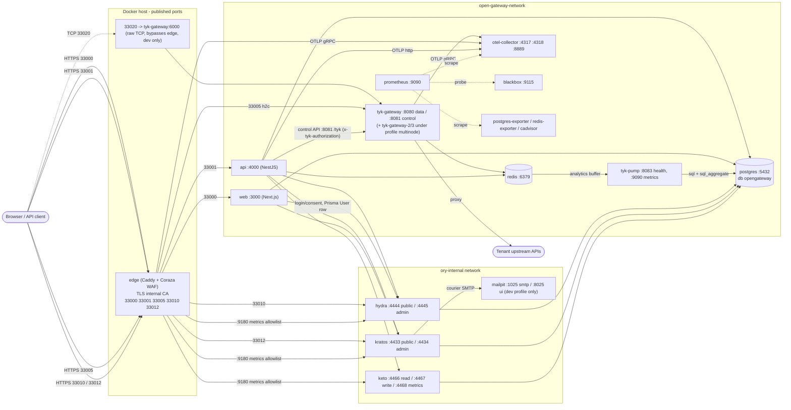

# Infrastructure reference

Every fact here was read from the files cited in backticks. Where a fact could not be confirmed from a file it says **unverified**.

Sources: `infra/docker-compose.yml` (base, 29 services: 25 by default, `mailpit` under `--profile dev`, 3 gateway-node services under `--profile multinode`), `infra/docker-compose.prod.yml` (overlay, adds 1 and changes 14), `infra/edge/`, `infra/ory/`, `infra/pump/`, `infra/postgres/`, `infra/scripts/`, `observability/`, `install.sh`, `rebuild.sh`.

Compose project name: `Open Gateway Infrastructure` (`name:` in the base file). Every container is named `open-gateway-<service>` (`container_name`), except `prod-preflight` (`open-gateway-prod-preflight`) which follows the same pattern.

There is no Loki, Grafana, Tempo or Alertmanager in either compose file (checked: no such service). The base file comment says `docker logs` is the only log store and traces go to the collector's stdout.

## 1. Topology

Request flow in words:

1. Browser -> `edge` (HTTPS, Caddy `tls internal`, Coraza WAF, in `DetectionOnly` mode) -> `web:3000` (UI), `api:4000` (`/api/*`), `hydra:4444` (OAuth2 public) or `kratos:4433` (self-service).
2. Data plane: client -> `edge:33005` -> `EDGE_GATEWAY_UPSTREAMS` (default `tyk-gateway:8080`, h2c) -> the tenant's upstream. The api never proxies traffic; it only writes definitions and policies through the Tyk control API (`http://tyk-gateway:8081/tyk`, or every node in `TYK_ADMIN_URLS`).
3. Analytics: Tyk buffers records in Redis -> `tyk-pump` purges every 10 s (`purge_delay`) -> Postgres tables (`sql` raw and `sql_aggregate`) -> read by the api's analytics module.
4. Auth: Kratos = identities and self-service flows; Hydra = OAuth2/OIDC (JWT access tokens, 1h); Keto = tenant membership tuples. The api verifies Hydra JWTs against Hydra's JWKS; the token comes from the `mq_access_token` cookie (`apps/api/src/modules/auth/strategies/jwt.strategy.ts`, names defined in `apps/web/src/lib/cookie-names.ts`).

## 2. Networks

Defined at the bottom of `infra/docker-compose.yml`. Both are plain `bridge`, neither is `internal: true`.

| Network | Members | Why |
|---|---|---|
| `open-gateway-network` | nearly everything, including tyk-gateway(s), tyk-pump, redis, prometheus, exporters, otel-collector | default app network |
| `ory-internal` | postgres, hydra*, kratos*, keto*, mailpit (`--profile dev` only), ory-db-init, edge, api, web (and `prod-preflight` in prod) | Hydra/Kratos/Keto admin APIs are unauthenticated. `tyk-gateway`/`tyk-pump` are deliberately NOT on this network, so a tenant `proxyUrl` pointed at a raw Ory container IP has no route (SSRF split, comment at top of the base file) |

Rule stated in the base file: never add a service to `open-gateway-network` that is unauthenticated or trusts the network origin of a request. The monitoring services (prometheus, cadvisor, exporters, blackbox) are the documented accepted exception. `node-exporter` uses `network_mode: host` and is on neither network.

## 3. Port table

Host-published ports only come from `ports:` entries. "expose" ports are container-internal.

| Host port | Bind | Container target | Service | Notes |
|---|---|---|---|---|
| 33000 | all interfaces (`"33000:33000"`) | edge:33000 -> `web:3000` | edge | HTTPS |
| 33001 | all interfaces | edge:33001 -> `api:4000` | edge | HTTPS, `/api/metrics*` answered 404 by the edge |
| 33005 | all interfaces | edge:33005 -> `EDGE_GATEWAY_UPSTREAMS` (`tyk-gateway:8080`) | edge | HTTPS, Tyk data plane |
| 33010 | all interfaces | edge:33010 -> `hydra:4444` | edge | HTTPS, Hydra public |
| 33012 | all interfaces | edge:33012 -> `kratos:4433` | edge | HTTPS, Kratos public |
| 33020 | all interfaces (`"33020:6000"`) | tyk-gateway:6000 | tyk-gateway | raw TCP passthrough API (`ApiProtocol.TCP`); the one deliberate non-edge published port. **Dev only**: the prod overlay resets it |
| 33002 | `127.0.0.1` | postgres:5432 | postgres | loopback only. **Dev only**: the prod overlay resets it |
| 33003 | `127.0.0.1` | redis:6379 | redis | loopback only, unauthenticated in base file. **Dev only** |
| 33011 | `127.0.0.1` | hydra:4445 | hydra | admin API, unauthenticated. **Dev only** |
| 33013 | `127.0.0.1` | kratos:4434 | kratos | admin API, unauthenticated. **Dev only**: the prod overlay resets it |
| 33014 | `127.0.0.1` | keto:4466 | keto | read API, unauthenticated. **Dev only** |
| 33015 | `127.0.0.1` | keto:4467 | keto | write API, unauthenticated. **Dev only** |
| 33016 | `127.0.0.1` | mailpit:8025 | mailpit | web UI/API for caught mail. Exists only under `--profile dev` |
| 9100 | `172.17.0.1` (docker0; `NODE_EXPORTER_LISTEN_ADDRESS`) | host netns | node-exporter | not a compose-networked port; refuses LAN/loopback |

In production (base + `docker-compose.prod.yml`) the published set is the edge's five ports and nothing else: `docker compose ... config` renders exactly five `ports:` entries, and `infra/scripts/check-prod-ports.sh` asserts it (and the Compose version) before every deploy. "Dev only" above means the overlay resets the mapping with `ports: !reset []`; the services keep listening inside their networks.

Not published (internal only): `web:3000`, `api:4000`, `tyk-gateway:8080` (data) and `:8081` (control API), `tyk-pump:8083` (health) and `:9090` (pump's own Prometheus endpoint, scraped as job `tyk-pump`), `edge:9180` (internal metrics listener), `edge:2019` (Caddy admin, loopback inside the container), `otel-collector:4317/4318/8889/8888`, `prometheus:9090`, `blackbox:9115`, `postgres-exporter:9187`, `redis-exporter:9121`, `cadvisor:8080`, `mailpit:1025`, `hydra:4444`, `kratos:4433`, `keto:4468` (metrics).

`33004` (Prisma Studio) is mentioned in `README.md` but is not a compose service (a `pnpm db:studio` dev command) and is not a container port. Port numbers are also hard-coded in `install.sh` (`HOST_WEB` ... `HOST_KETO_WRITE`).

## 4. Services (base file)

Common to almost all services: `logging: *default-logging` (json-file, `max-size 50m`, `max-file 5`; `edge`... also; the exception is `otel-collector` which now uses the same anchor too). `restart: unless-stopped` on long-running services; one-shot jobs have no restart policy.

### 4.1 Edge and application

| Service | Image / build | Purpose | Ports | Volumes | depends_on / health | Networks |
|---|---|---|---|---|---|---|
| `edge` | build `./edge` (`infra/edge/Dockerfile`), tag `open-gateway-edge:wp26b` | Caddy 2.11.4 + Coraza WAF (coraza-caddy v2.6.1, OWASP CRS 4) TLS termination; only publisher of app ports | publishes 33000, 33001, 33005, 33010, 33012; `expose` 9180 | `./edge/Caddyfile:/etc/caddy/Caddyfile:ro`; `caddy_data:/data` (internal CA private key); `edge_logs:/var/log/caddy` (WAF log) | `depends_on: web, api, tyk-gateway, hydra, kratos` (short form = started). healthcheck: `wget http://127.0.0.1:2019/config/apps/http/servers` (10 s / 5 s / 5 retries / 10 s start) | both |
| `api` | build `..` with `apps/api/Dockerfile` | NestJS control plane (multi-tenant API, Tyk sync, analytics, governance) | `expose` 4000 | `./edge:/etc/open-gateway/edge:ro` (whole directory, see gotchas) | postgres healthy, redis healthy, tyk-gateway started, hydra healthy, keto healthy, kratos started. Dockerfile `HEALTHCHECK` = `wget --spider http://localhost:4000/api/health` (30 s) | both |
| `web` | build `..` with `apps/web/Dockerfile`, `NEXT_PUBLIC_*` build args | Next.js dashboard, login/consent app for Hydra | `expose` 3000 | none | `depends_on: api`. Dockerfile `HEALTHCHECK` = `wget --spider http://127.0.0.1:3000/auth/login` | both |

Key environment (see `docs/reference/configuration.md` for the full list):

- `edge`: `EDGE_LAN_IP` (default `127.0.0.1`), `EDGE_GATEWAY_UPSTREAMS` (default `tyk-gateway:8080`), `OTEL_SERVICE_NAME`, `OTEL_EXPORTER_OTLP_ENDPOINT=http://otel-collector:4317`, `OTEL_EXPORTER_OTLP_PROTOCOL=grpc`.
- `api`: `NODE_ENV=development`, `PORT=4000`, `DATABASE_URL`, `REDIS_URL=redis://redis:6379`, `JWT_SECRET` (required by compose but not read by code), `TYK_WEBHOOK_RELAY_SECRET` (required), `ORY_*`, `CORS_ORIGINS=https://localhost:33000`, `COOKIE_SECURE`, `TRUST_PROXY_HOPS=1`, `TYK_ADMIN_URL`, `TYK_ADMIN_URLS`, `TYK_ADMIN_SECRET`, `TYK_GATEWAY_URL`, `PROXY_DENY_HOSTS`, `SPEC_FETCH_ALLOWED_HOSTS`, `PUMP_HEALTH_URL`, OTEL vars, `EDGE_ROOT_CERT_PATH`, `EDGE_TLS_PROBE`.
- `web`: build args and runtime `NEXT_PUBLIC_*`, `APP_URL`, `HYDRA_PUBLIC_URL`, `HYDRA_ADMIN_URL`, `KRATOS_INTERNAL_URL`, `DATABASE_URL`, `NODE_ENV=development`.

### 4.2 Data stores and backups

| Service | Image | Purpose | Ports | Volumes | depends_on / health | Networks |
|---|---|---|---|---|---|---|
| `postgres` | `postgres:16-alpine` | Single Postgres for the app DB `opengateway` plus `hydra`, `kratos`, `keto` DBs. WAL archiving on: `archive_mode=on`, `archive_command=test ! -f /wal_archive/%f && cp %p /wal_archive/%f`, `archive_timeout=300`, custom `hba_file` | `127.0.0.1:33002:5432` | `postgres_data:/var/lib/postgresql/data`; `pg_wal_archive:/wal_archive`; `./postgres/pg_hba.conf:/etc/postgresql/pg_hba.conf:ro` | `pg-archive-init` completed. healthcheck `pg_isready -U opengateway -d opengateway` | both |
| `pg-archive-init` | `postgres:16-alpine`, `user: root` | One-shot: `chown 70:70 /wal_archive && chmod 0750` (postgres uid 70 in alpine) | none | `pg_wal_archive` | none | open-gateway-network |
| `postgres-backup` | `postgres:16-alpine`, entrypoint `infra/scripts/pg-backup.sh` | Base backup loop (sleep loop, not cron): `PG_BACKUP_INTERVAL` (86400 s), `PG_BACKUP_KEEP` (7); prunes WAL older than the oldest kept backup; writes `og_backup.prom` for node-exporter | none | `./scripts/pg-backup.sh:/usr/local/bin/pg-backup.sh:ro`; `pg_backups:/backups`; `pg_wal_archive:/wal_archive`; `og_textfile:/textfile` | postgres healthy. healthcheck: `/backups/.last-success` exists and is younger than 2x interval (60 s, start 120 s) | open-gateway-network |
| `redis` | `redis:7-alpine` | Tyk sessions, quotas, analytics buffer; api cache/queues. `redis-server --appendonly yes --maxmemory 512mb --maxmemory-policy noeviction` | `127.0.0.1:33003:6379` | `redis_data:/data` | healthcheck `redis-cli ping` | open-gateway-network |
| `ory-db-init` | `postgres:16-alpine` | One-shot: runs `infra/ory/init-db.sql` (idempotent `CREATE DATABASE hydra/kratos/keto OWNER opengateway`). A job rather than `docker-entrypoint-initdb.d` because that only runs on a fresh volume | none | `./ory/init-db.sql:/init-db.sql:ro` | postgres healthy | ory-internal |
| `pg-monitoring-init` | `postgres:16-alpine` | One-shot: applies `infra/postgres/monitoring-role.sql` creating/updating `og_monitor` (LOGIN + `pg_monitor`) from `PG_EXPORTER_PASSWORD`; exits 1 if unset or shorter than 32 chars | none | `./postgres/monitoring-role.sql:/monitoring-role.sql:ro` | postgres healthy | open-gateway-network |

`infra/postgres/pg_hba.conf`: trust for local/loopback (including replication), `scram-sha-256` for `replication opengateway` from anywhere and for all other hosts. Only reason for the custom file is the extra replication rule.

Backup and restore: `infra/scripts/pg-backup.sh` (loop) and `infra/scripts/pg-restore-scratch.sh` (restore the latest or `--backup <ts>` into a scratch instance, verify, destroy; flags `--keep`, `--strict`, `--list`). The runbook lives in `docs/deployment.md`. No other backup jobs exist in compose (Redis relies on AOF only).

### 4.3 Tyk gateway and pump

| Service | Image | Purpose | Ports | Volumes | depends_on / health | Networks |
|---|---|---|---|---|---|---|
| `tyk-gateway-init` | `alpine:3` | One-shot: for `/apps` and `/policies`: `chown -R 65532:65532`, `chmod 0755`, `touch .keep`, chown `.keep` | none | `tyk_apps:/apps`, `tyk_policies:/policies` | none | open-gateway-network |
| `tyk-gateway` | `tykio/tyk-gateway:v5.15.0` | Tyk OSS gateway (no Tyk Dashboard). Config is entirely env (`x-tyk-gateway-env` anchor) | `expose` 8080; publishes `33020:6000` (dev only, reset in prod) | `tyk_apps:/opt/tyk-gateway/apps`; `tyk_policies:/opt/tyk-gateway/policies` | redis healthy, `tyk-gateway-init` completed. **No healthcheck** (distroless) | open-gateway-network |
| `tyk-gateway-multinode-init`, `tyk-gateway-2`, `tyk-gateway-3` | `alpine:3` / `tykio/tyk-gateway:v5.15.0` | Only with `--profile multinode`. Each extra node has its own apps/policies volumes (`tyk_apps_2`, `tyk_policies_2`, `tyk_apps_3`, `tyk_policies_3`) | `expose` 8080 only | per-node volumes | redis healthy, multinode-init completed | open-gateway-network |
| `tyk-pump` | `tykio/tyk-pump-docker-pub:v1.17.0` | Drains Redis analytics into Postgres | none published | `./pump/pump.conf:/opt/tyk-pump/pump.conf:ro` | redis healthy, postgres healthy. **No healthcheck** (distroless) | open-gateway-network |
The `tyk-healthcheck` curl sidecar that used to poll `tyk-gateway:8081/hello` and `tyk-pump:8083/health` was removed: nothing depended on it or alerted on it, and blackbox probes the same two endpoints continuously (`tyk-hello`, `tyk-hello-redis`, `pump-health` → `TykNodeDown`, `PumpHealthFailing`).

Tyk env (anchor `x-tyk-gateway-env`; identical for every node so drift detection works):
`TYK_GW_LISTENPORT=8080`, `TYK_GW_CONTROLAPIPORT=8081` (control API `/tyk/*` and `/hello` move here and are never published), `TYK_GW_SECRET` (default `tyk-gateway-secret`, dev only; prod overlay's preflight rejects it), `TYK_GW_USEDBAPPCONFIGS=false` (definitions are files), `TYK_GW_STORAGE_TYPE/HOST/PORT=redis/redis/6379`, `TYK_GW_ALLOWINSECURECONFIGS=true`, `TYK_GW_HTTPSERVEROPTIONS_ENABLEWEBSOCKETS=true`, `TYK_GW_DISABLEPORTWHITELIST=true` (needed for `protocol:"tcp"` listen ports), analytics on (`ENABLEANALYTICS`, empty `ANALYTICSCONFIG_TYPE`, `STORAGEEXPIRATIONTIME=3600`, detailed recording off), `TYK_GW_HASHKEYS=true`, `TYK_GW_ENFORCEORGQUOTAS=true` and `TYK_GW_ENFORCEORGDATAAGE=true` (both required for per-tenant org cutoff), file-backed policies (`POLICYSOURCE=file`, `POLICYPATH=/opt/tyk-gateway/policies`, `ALLOWEXPLICITPOLICYID=true`), OpenTelemetry to `otel-collector:4317` (gRPC, `simple` span processor, `AlwaysOn`, resource `open-gateway-tyk`).

Pump: `infra/pump/pump.conf` defines three pumps: `postgres` (`sql`, batch 1000, `omit_detailed_recording: false`), `postgresaggregate` (`sql_aggregate`) and `prometheus` (listens `:9090/metrics`, custom counter `tyk_http_requests_total`, three per-path/key/client metrics disabled). `analytics_storage_config` host `redis:6379`, `purge_delay 10`, `purge_chunk 1000`, health endpoint `/health` on 8083. The committed `connection_string` has an empty `password=`; the real one is injected by env `TYK_PMP_PUMPS_POSTGRES_META_CONNECTIONSTRING` and `TYK_PMP_PUMPS_POSTGRESAGGREGATE_META_CONNECTIONSTRING` (rule: `TYK_PMP_` + config path uppercased, underscores inside a segment removed).

`infra/gateway/tyk.conf` is an **empty root-owned directory**, not a file (`ls -la infra/gateway/tyk.conf` shows a directory with no entries). No compose service mounts it; the gateway is configured only through env. Almost certainly an artifact of an older bind mount of a missing path (Docker creates a directory); **unverified** how it arose. Docs that talk about a `tyk.conf` are describing a non-existent file.

### 4.4 Ory (auth)

| Service | Image | Purpose | Ports | Volumes | depends_on / health | Networks |
|---|---|---|---|---|---|---|
| `hydra-migrate` | `oryd/hydra:v26.2.0` | One-shot `migrate sql -e --yes` | none | none | `ory-db-init` completed | ory-internal |
| `hydra` | `oryd/hydra:v26.2.0` | OAuth2/OIDC, JWT access tokens. `serve all -c /etc/config/hydra.yml` (no `--dev`; TLS terminated at edge) | `expose` 4444; `127.0.0.1:33011:4445` | `./ory/hydra/hydra.yml:/etc/config/hydra.yml:ro` | `hydra-migrate` completed. healthcheck `wget http://127.0.0.1:4445/health/ready` | ory-internal |
| `mailpit` | `axllent/mailpit:v1.21.3` | SMTP catcher for Kratos courier. **Dev only**: `profiles: ["dev"]`, started by `install.sh` / `rebuild.sh` (`--profile dev`); the prod overlay does not start it | `expose` 1025; `127.0.0.1:33016:8025` | none | healthcheck `wget http://127.0.0.1:8025/readyz` | ory-internal |
| `kratos-migrate` | `oryd/kratos:v26.2.0` | One-shot migration | none | none | `ory-db-init` completed | ory-internal |
| `kratos` | `oryd/kratos:v26.2.0` | Identities, self-service flows (headless). `serve all --dev --watch-courier -c ...` | `expose` 4433; `127.0.0.1:33013:4434` | `./ory/kratos:/etc/config/kratos:ro` | `kratos-migrate` completed; `mailpit` healthy when the dev profile is on (`required: false`, so compose drops the edge without it). healthcheck `wget http://127.0.0.1:4434/health/ready` | ory-internal |
| `keto-migrate` | `oryd/keto:v26.2.0` | One-shot `migrate up --yes -c ...` | none | `./ory/keto:/etc/config/keto:ro` | `ory-db-init` completed | ory-internal |
| `keto` | `oryd/keto:v26.2.0` | Relation-tuple authorization (tenant membership) | `127.0.0.1:33014:4466`, `127.0.0.1:33015:4467` | `./ory/keto:/etc/config/keto:ro` | `keto-migrate` completed. healthcheck `wget http://127.0.0.1:4466/health/ready` | ory-internal |

Config files:

- `infra/ory/hydra/hydra.yml`: issuer `https://localhost:33010/`; login/consent/logout/error URLs on `https://localhost:33000/oauth2/*`; `strategies.access_token: jwt`; TTLs access 1h, refresh 720h, id 1h, auth code 10m; allowed top-level claims `pol`, `tid`; `serve.tls.allow_termination_from` = 10/8, 172.16/12, 192.168/16; `secrets: {}` (secrets come from env).
- `infra/ory/kratos/kratos.yml`: public base `https://localhost:33012/` with CORS for `https://localhost:33000`; admin base `http://localhost:33013/`; password and code methods; argon2 hasher; UI URLs under `https://localhost:33000/auth/*`; session lifespan 24h, cookie SameSite Lax; courier SMTP `smtp://mailpit:1025/...` (overridden by env `COURIER_SMTP_CONNECTION_URI` from `KRATOS_SMTP_URI`; the Mailpit address is a dev default, and the prod overlay requires `KRATOS_SMTP_URI`); `from_address: no-reply@open-gateway.local`; schema `identity.schema.json`.
- `infra/ory/keto/keto.yml`: namespaces from `namespaces.ts`; read 4466, write 4467, metrics 4468.
- `infra/ory/init-db.sql`: creates the three DBs.
- All URLs above are hard-coded to `localhost:330xx`; a deployment on a different origin has to edit these files (unverified whether any templating exists; none seen).

### 4.5 Observability

| Service | Image | Purpose | Ports | Volumes | depends_on / health | Networks |
|---|---|---|---|---|---|---|
| `otel-collector` | `otel/opentelemetry-collector-contrib:0.121.0` | Traces from edge/gateway/api (printed to its stdout via `debug` exporter); tails the WAF log and exposes a Prometheus counter on 8889 | `expose` 4317, 4318, 8889, 8888 | `../observability/otel-collector.yaml:/etc/otelcol/config.yaml:ro`; `edge_logs:/var/log/caddy:ro` | none; no healthcheck | open-gateway-network |
| `prometheus` | `prom/prometheus:v3.1.0` | Metrics + alert rules; retention 15d and `PROM_RETENTION_SIZE` (default 4GB); `extra_hosts: host.docker.internal:host-gateway` | `expose` 9090 | `../observability/prometheus.yml`; `../observability/rules`; `prometheus_data:/prometheus` | `depends_on: otel-collector`; healthcheck `wget http://127.0.0.1:9090/-/healthy` | open-gateway-network |
| `node-exporter` | `quay.io/prometheus/node-exporter:v1.12.1@sha256:...` | Host metrics; `network_mode: host`, `pid: host`; listens on `NODE_EXPORTER_LISTEN_ADDRESS` (default `172.17.0.1:9100`); textfile collector on `og_textfile` | none | `/:/host:ro,rslave`; `og_textfile:/textfile:ro` | none | host |
| `cadvisor` | `ghcr.io/google/cadvisor:v0.60.6@sha256:...` | Container metrics; `mem_limit 256m`, `cpus 0.5`, `no-new-privileges`, `cap_add SYSLOG`, device `/dev/kmsg` | `expose` 8080 | `/:/rootfs:ro`; `/var/run:/var/run:rw` (contains docker.sock); `/sys:/sys:ro`; `/var/lib/docker:ro` | none | open-gateway-network |
| `blackbox` | `prom/blackbox-exporter:v0.28.0@sha256:...` | Synthetic probes; modules in `observability/blackbox.yml` (`tyk_hello`, `tyk_hello_redis`, `http_2xx`, `http_2xx_redirect`, `oidc_discovery`, `oidc_discovery_insecure`, `tcp_connect`) | `expose` 9115 | `../observability/blackbox.yml`; `./edge:/etc/blackbox/edge:ro` | none | open-gateway-network |
| `postgres-exporter` | `quay.io/prometheuscommunity/postgres-exporter:v0.20.1@sha256:...` | Postgres metrics as `og_monitor` | `expose` 9187 | none | postgres healthy; `pg-monitoring-init` `service_started` (deliberately not `completed_successfully`) | open-gateway-network |
| `redis-exporter` | `oliver006/redis_exporter:v1.92.0@sha256:...` | Redis metrics, `--check-keys=analytics-*`, `/scrape` and key-value export disabled | `expose` 9121 | none | redis healthy | open-gateway-network |
The `edge-healthcheck` curl sidecar (a real HTTPS request to `edge:33001`) was removed. A TLS handshake on the edge is still exercised continuously and alerted on: by the api's own probe of `edge:33001` (`EDGE_TLS_PROBE`, feeding `EdgeCertificateMetricsAbsent` and `EdgeCertificateRenewalStalled`) and by the blackbox `oidc-availability` job through `edge:33010` (`OidcDiscoveryOrJwksFailing`). See `infra/edge/README.md`, "Health signals".

Prometheus jobs in `observability/prometheus.yml` (15 s interval): `tyk-pump`, `open-gateway-api`, `otel-collector`, `prometheus`, `node`, `cadvisor`, `postgres`, `redis`, `edge`, `ory-hydra`, `ory-kratos`, `ory-keto` (via `edge:9180`), `otel-collector-self`, and blackbox-driven `tyk-hello`, `tyk-hello-redis`, `api-health`, `pump-health`, `ory-ready`, `web-login`, `oidc`, `oidc-availability`, `tcp-33020`. Alert/recording rules: `observability/rules/{containers,host,monitoring,open-gateway,services}.yml` plus `tests/`. There is no Alertmanager, so alerts are read off `ALERTS{alertstate="firing"}` in the Prometheus query API.

Design notes for HA/observability are under `docs/ha-observability/` (five files).

## 5. Volumes

| Volume | Used by | Holds |
|---|---|---|
| `postgres_data` | postgres | database cluster |
| `pg_wal_archive` | postgres, pg-archive-init, postgres-backup | WAL segments (deliberately separate from data) |
| `pg_backups` | postgres-backup | base backups + `.last-success` |
| `redis_data` | redis | AOF |
| `tyk_apps`, `tyk_policies` | tyk-gateway(+init) | API definition files, policy JSON files |
| `tyk_apps_2`, `tyk_policies_2`, `tyk_apps_3`, `tyk_policies_3` | multinode nodes | per-node copies (writes fan out from the api) |
| `caddy_data` | edge | internal CA and its private key, cert store. Losing it mints a new root and invalidates installed roots |
| `edge_logs` | edge (rw), otel-collector (ro) | WAF detection log `waf.log` (rolled at 50 MiB, keep 5) |
| `prometheus_data` | prometheus | TSDB |
| `og_textfile` | postgres-backup (rw), node-exporter (ro) | `*.prom` marker files |

## 6. Edge routing (`infra/edge/Caddyfile`)

- Global: `order coraza_waf first`, `metrics`, `default_sni {$EDGE_LAN_IP:127.0.0.1}`, JSON access log, and a separate `log waf` writing `/var/log/caddy/waf.log`.
- Snippet `(edge_site)`: `tls internal`, Coraza with OWASP CRS, `SecRuleEngine DetectionOnly` (**detects and logs, does not block**), paranoia level 1, request body limit 10 MiB, `tracing { span edge }`, `X-Request-Id`, `respond /api/metrics* 404`, `reverse_proxy` with `X-Forwarded-For` replaced by `{remote_host}` (the client cannot forge it).
- Sites (each `localhost:PORT` and `{$EDGE_LAN_IP:127.0.0.1}:PORT`): 33000 -> `web:3000`, 33001 -> `api:4000`, 33005 -> `{$EDGE_GATEWAY_UPSTREAMS:tyk-gateway:8080}` (h2c, `dial_timeout 2s`, `fail_duration 10s`, `lb_try_duration 10s`, logs the chosen upstream), 33010 -> `hydra:4444`, 33012 -> `kratos:4433`.
- Catch-all `https://:33000, ... :33012` with `tls internal` answers 404 for any other host name.
- `http://:9180` (unpublished, no TLS, no WAF): `GET`/`HEAD` only (405 otherwise), `/metrics`, and a fixed allowlist of six `/ory/{hydra,kratos,keto}/{metrics,health}` paths rewritten to the Ory admin metrics/ready endpoints. Everything else 404. This lets Prometheus read Ory metrics without joining `ory-internal`.
- The Tyk control API (8081), Ory admin APIs, Prometheus and the Caddy admin API (2019) are not routed.
- Root CA export (needed by hosts and by `NODE_EXTRA_CA_CERTS`): `docker compose -f infra/docker-compose.yml cp edge:/data/caddy/pki/authorities/local/root.crt infra/edge/root.crt`, then `chmod 644` (see `infra/edge/README.md`; the file is git-ignored and per install; `infra/edge/root.crt` currently exists in the tree).
- `infra/edge/Dockerfile`: `xcaddy build v2.11.4 --with coraza-caddy/v2@v2.6.1`, base images pinned by index digest.

## 7. Production overlay (`infra/docker-compose.prod.yml`)

Usage (from the file header): `docker compose -f infra/docker-compose.yml -f infra/docker-compose.prod.yml --profile multinode up -d`. It is an overlay because a profile cannot change values of existing services. `--profile multinode` is still needed because `TYK_ADMIN_URLS` names three nodes.

| Service | Change vs base |
|---|---|
| `prod-preflight` (new) | `redis:7-alpine`, entrypoint `infra/scripts/prod-preflight.sh`. Runs to completion; api, web and all three gateways depend on `service_completed_successfully`. Depends on postgres healthy and kratos **healthy**. Checks (each prints `ok`/`FAIL`, none short-circuits; read from `infra/scripts/prod-preflight.sh`, pinned by `infra/scripts/prod-preflight.check.sh`): `NODE_ENV=production` (fed from the shared `x-node-env` anchor); `TYK_GW_SECRET` set, not the committed default, no whitespace, 32+ characters; `REDIS_PASSWORD` (32+), `DB_PASS` (16+) and `PG_EXPORTER_PASSWORD` (32+) set, no whitespace and only `A-Za-z0-9._~-` (spliced raw into URLs and command lines); Redis refuses an unauthenticated `PING` **and** accepts `REDIS_PASSWORD`; pump connection string carries a non-empty password; `infra/pump/pump.conf` has no baked password; `EDGE_IMAGE` is a 64-hex `@sha256:` digest; the seeded `admin@opengateway.io` login is **explicitly rejected** by Kratos (HTTP 400 as the first stderr line, non-zero wget exit; a session token anywhere in the answer fails; a 5xx, a 502 whose text says 400, a refused connection, a `-T` timeout or an empty answer is "inconclusive" and also fails); `KRATOS_SMTP_URI` parsed as Go does (authority ends at `/`, `?` or `#`, host after the last `@`, host:port shape required, so an unencoded `/ ? # @` in the credentials is rejected with a percent-encode hint; host not empty, loopback, unspecified, a bare number or Mailpit; `skip_ssl_verify` / `disable_starttls` only with an explicit false, no `%` in the query; the URI is never printed; reachability is not tested); `KRATOS_COOKIE_SECURE` and `COOKIE_SECURE` are `true`. Every `wget` is bounded by `-T $WGET_TIMEOUT` (10 s). |
| `redis` | `command` replaced: adds `--requirepass ${REDIS_PASSWORD:?}` (keeps `--appendonly yes --maxmemory 512mb --maxmemory-policy noeviction`); `REDISCLI_AUTH` env so the healthcheck needs no `-a`; `ports: !reset []` (no host port 33003) |
| `kratos` | `COURIER_SMTP_CONNECTION_URI=${KRATOS_SMTP_URI:?}`: no Mailpit default in production; `SESSION_COOKIE_SECURE=${KRATOS_COOKIE_SECURE:-true}` (the base default is `false`); `ports: !reset []` (no host port 33013) |
| `postgres`, `hydra`, `keto` | `ports: !reset []` (no host ports 33002, 33011, 33014, 33015) |
| `tyk-gateway`, `-2`, `-3` | `TYK_GW_STORAGE_PASSWORD=${REDIS_PASSWORD:?}`; depend on `prod-preflight`. `tyk-gateway` also resets `ports` (no host port 33020) |
| `tyk-pump` | `TYK_PMP_ANALYTICSSTORAGECONFIG_PASSWORD=${REDIS_PASSWORD:?}` |
| `pg-monitoring-init`, `postgres-exporter` | `PG_EXPORTER_PASSWORD` becomes required (`:?`) |
| `redis-exporter` | `REDIS_PASSWORD` |
| `edge` | `image: ${EDGE_IMAGE:?}` (must be `ghcr.io/<owner>/<repo>/edge@sha256:...`), `pull_policy: always`, `EDGE_GATEWAY_UPSTREAMS` default all three nodes. The base `build:` remains inherited, but a locally built image can never satisfy a digest reference |
| `api` | `image: ${API_IMAGE:-open-gateway-api:local}`; `NODE_ENV=production` (also switches the throttler from 1000 to 100 req/min, `apps/api/src/app.module.ts`); `REDIS_URL` with password; `TYK_ADMIN_URLS` default the three nodes' `:8081/tyk`; depends on `prod-preflight` |
| `web` | `image: ${WEB_IMAGE:-open-gateway-web:local}`; `NODE_ENV=production` (this is also what makes the web session cookies `Secure`); depends on `prod-preflight` |

The overlay repeats the `x-logging` anchor because YAML anchors do not cross files, and defines one more, `x-node-env`, that feeds `NODE_ENV` to `prod-preflight`, `api` and `web` so the preflight's check reads the real value. It uses the `!reset` YAML tag, so the Docker Compose on the deploy host has to understand it (2.24 or later; only v5.1.4 was run against it; an older one may ignore the tag and publish the development ports, so `check-prod-ports.sh` asserts the version and the rendered port list). The post-deploy login check, which used to need host-published Postgres and Kratos admin ports, now runs inside the `api` container (`docs/go-live.md`, step 10).

The runbook for taking this overlay live, with every input the owner has to supply, is `docs/go-live.md`; `infra/.env.production.example` lists the variables.

## 8. Scripts and entrypoints

| Path | What it is |
|---|---|
| `install.sh` (repo root) | Full installer v2.0.0. Checks Node >= 20, pnpm >= 9, Docker; generates secrets; writes `infra/.env`, `apps/api/.env.local`, `apps/web/.env.local` (all `chmod 600`); `pnpm install`; builds; `prisma generate`; `docker compose -f infra/docker-compose.yml --profile dev up -d --build` (base file only, no prod overlay, no multinode profile; `dev` starts Mailpit). It also writes `COMPOSE_PROFILES=dev` into `infra/.env` (appended on a re-run if missing) so a bare `docker compose up` / `pnpm infra:up` starts Mailpit too; an explicit `--profile` flag replaces that variable rather than adding to it; waits for health; runs `prisma migrate deploy` and the seed inside the api container; runs `migrate-users-to-kratos.ts`; prints URLs. Flags: `--non-interactive`, `--debug`, `--verbose`, `--help` (the old `--with-tyk` no-op was removed). Logs to `.install-logs/`. Re-run is safe: an existing `infra/.env` is only appended to (missing managed keys), values are never rotated. |
| `rebuild.sh` (repo root) | `docker compose ... build` + `up -d` for selected services (interactive list, `--all`, or names), then waits up to 60 s for `(healthy)` where a healthcheck exists. Uses the base file only, with `--profile dev` so `mailpit` is listed and selectable. Never runs `down -v`. Because it builds from the working tree, uncommitted compose changes go live. |
| `infra/scripts/pg-backup.sh` | `postgres-backup` entrypoint |
| `infra/scripts/pg-restore-scratch.sh` | manual restore drill |
| `infra/scripts/prod-preflight.sh` | `prod-preflight` entrypoint; also runnable standalone |
| `infra/scripts/prod-preflight.check.sh` | Pure-shell test of the preflight (130 assertions): runs the real script against fake `wget` / `redis-cli` whose behaviour was measured on busybox 1.37, asserting each check's line and exit status; `PREFLIGHT=<path>` points it at a variant. Run it in the image the preflight uses: `docker run --rm --network none -v "$PWD/infra/scripts:/s:ro" redis:7-alpine sh /s/prod-preflight.check.sh` (this is what CI does) |
| `infra/scripts/check-prod-ports.sh` | Asserts Docker Compose >= 2.24 and that base + prod renders exactly the edge's five published ports, with and without `--profile`; `deploy-staging.sh` runs it before `up` and CI runs it with dummy secrets. It cannot see node-exporter, which listens on the docker0 address from the host network namespace |
| `infra/scripts/check-prod-ports.check.sh` | Shim-based test of the guard above (versions, extra or missing ports, random ports, render failure, dev profile leaking in) |
| `infra/scripts/deploy-staging.sh` | run on the staging host, piped over SSH by `.github/workflows/cd-staging.yml` |
| `infra/scripts/setup.sh` | local dev bootstrap (**unverified** contents beyond the header) |
| `infra/scripts/check-docs-paths.sh`, `check-no-k8s.sh`, `check-page-gates.sh`, `check-locale-keys.mjs` | CI guards (dead doc links in README/CHANGELOG/deployment.md; no helm/k8s dirs; every dashboard page uses `PagePermissionGate`; locale key parity) |
| `infra/scripts/render-inventory.mjs` (+ test) and `infra/inventory/{opengateway.example.yaml,schema.json}` | renders an inventory file (**unverified** details) |

CI workflows: `.github/workflows/ci.yml`, `.github/workflows/cd-staging.yml`.

## 9. Gotchas

- **Tyk images are distroless** (uid 65532, no shell/curl/wget). `tyk-gateway`, `tyk-pump` have no compose healthcheck; dependents use `service_started`, and `docker compose ps` shows them as `running`, not `healthy`. Use `/hello` on 8081, the blackbox `tyk-hello` / `pump-health` probes in Prometheus, or `GET /api/gateway/status`.
- **`tyk_apps` / `tyk_policies` ownership.** A named volume's mount point is root-owned, so `POST /tyk/apis` fails with "file object creation failed". `tyk-gateway-init` chowns to 65532 and touches `.keep`. The `.keep` matters: Docker copies image content into a volume only while it is empty, so chowning an empty volume was undone on first boot. Multinode has its own init for the `_2`/`_3` volumes.
- **Ports 33000-33020 map.** The five app ports are the edge's HTTPS listeners with the same numbers as the old plain-HTTP ones. 33020 is the only non-edge published app port in the dev stack (TCP APIs cannot be WAF-inspected); the prod overlay does not publish it, so a TCP API in production needs its own published port (`docs/go-live.md`). Do not add `ports:` to `web`, `api`, `hydra`, `kratos` or `tyk-gateway:8080`: a client reaching Tyk directly forges `X-Forwarded-For` and defeats per-client rate limits and the IP deny list. Docs that say the host mapping is `33005:8080` are outdated.
- **Loopback-only** (`127.0.0.1`): 33002, 33003, 33011, 33013, 33014, 33015, 33016 (the last only with `--profile dev`). Ory admin APIs are unauthenticated. Production publishes none of them: the only host ports are the edge's five.
- **Mailpit follows `COMPOSE_PROFILES`, and an explicit `--profile` replaces it.** `install.sh` writes `COMPOSE_PROFILES=dev` into `infra/.env`, so a bare `docker compose up` / `pnpm infra:up` (and `down`) manages Mailpit. Passing `--profile multinode` on the command line REPLACES that variable (measured on Compose 5.1.4: with it, no Mailpit is rendered), so a dev stack that wants both passes `--profile dev --profile multinode`; a `down` without `dev` leaves a running Mailpit alone. A server must not carry `COMPOSE_PROFILES=dev`: `check-prod-ports.sh` renders without `--profile` precisely so that it would show.
- **Caddyfile is a bind mount and is read once at start.** Editing it does not change the running config nor the image digest. Reload/recreate `edge` and verify with `docker exec open-gateway-edge wget -qO- http://127.0.0.1:2019/config/`.
- **WAF is `DetectionOnly`.** It logs, it does not block.
- **`./edge` is mounted as a directory** into `api` and `blackbox` on purpose: `infra/edge/root.crt` is git-ignored, and a bind mount of a missing file makes Docker create a root-owned directory at that path, breaking the README export step. The api reads the cert at `EDGE_ROOT_CERT_PATH=/etc/open-gateway/edge/root.crt` for the expiry gauge; `docker compose cp` keeps Caddy's `0600`, hence the required `chmod 644`.
- **`infra/gateway/tyk.conf` is an empty directory**, not a config file (see 4.3).
- **Kratos runs with `--dev`** in the base file (`serve all --dev --watch-courier`) and `SESSION_COOKIE_SECURE` defaults to `false` (`KRATOS_COOKIE_SECURE`). `--watch-courier` is required or verification/recovery mail is queued and never sent.
- **`COOKIE_SECURE` is passed only to `api`, but the session cookies are set by `web`.** `web` has no `COOKIE_SECURE` in its compose environment and runs `NODE_ENV=development` in the base file, so `mq_access_token` / `mq_refresh_token` are issued without `Secure` on the default stack, despite HTTPS. The API never reads `COOKIE_SECURE` (see `docs/reference/configuration.md`). The prod overlay sets web `NODE_ENV=production`.
- **`NEXT_PUBLIC_*` are baked at build time.** They must be passed as `web.build.args`; changing them requires a rebuild (`rebuild.sh web`), not just a restart. This includes `NEXT_PUBLIC_GATEWAY_NODE_LOCATIONS`.
- **`PG_EXPORTER_PASSWORD` is soft in the base file** so a missing value cannot hold the stack hostage: `pg-monitoring-init` exits 1 and `pg_up` is 0, but nothing waits on it (live incident 2026-09-27 per the comment). Never gate anything with `service_completed_successfully` on that job.
- **`node-exporter` listens on the docker0 address (`172.17.0.1:9100`).** If the daemon uses a non-default `bip`, set `NODE_EXPORTER_LISTEN_ADDRESS`; a wrong value shows as `up == 0`.
- **`cadvisor` mounts `/var/run` read-write (docker.sock)**, which is root-equivalent on the host; documented as accepted risk R-OBS-01.
- **Single Redis with `noeviction`.** A second analytics Redis was proven a no-op on Tyk OSS 5.15.0 (spike S4c). When Redis fills, writes fail loudly. Do not switch to `allkeys-lru`.
- **Tenant org cutoff needs both** `TYK_GW_ENFORCEORGQUOTAS` and `TYK_GW_ENFORCEORGDATAAGE`; either alone silently does nothing.
- **Kratos cipher secret must be exactly 32 characters** (`openssl rand -hex 16`).
- **`rebuild.sh` deploys the working tree**: uncommitted compose changes go live.
- **`install.sh` final health probe uses `http://localhost:33001/api/health` and `http://localhost:33000`**, (via `curl -fsSL`, no `-k`) but those ports are HTTPS at the edge, so a plain-HTTP probe to a TLS listener cannot succeed and the summary is expected to print "Starting" (inferred from the code, not executed).
- **`--profile multinode`** is required for `tyk-gateway-2/3`. With it but without `TYK_ADMIN_URLS`, the api only talks to node 1 and the others drift.
