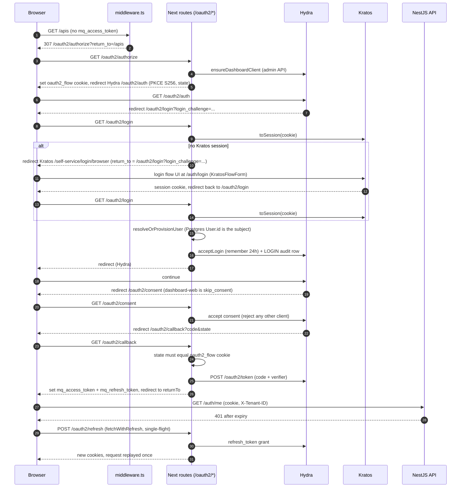
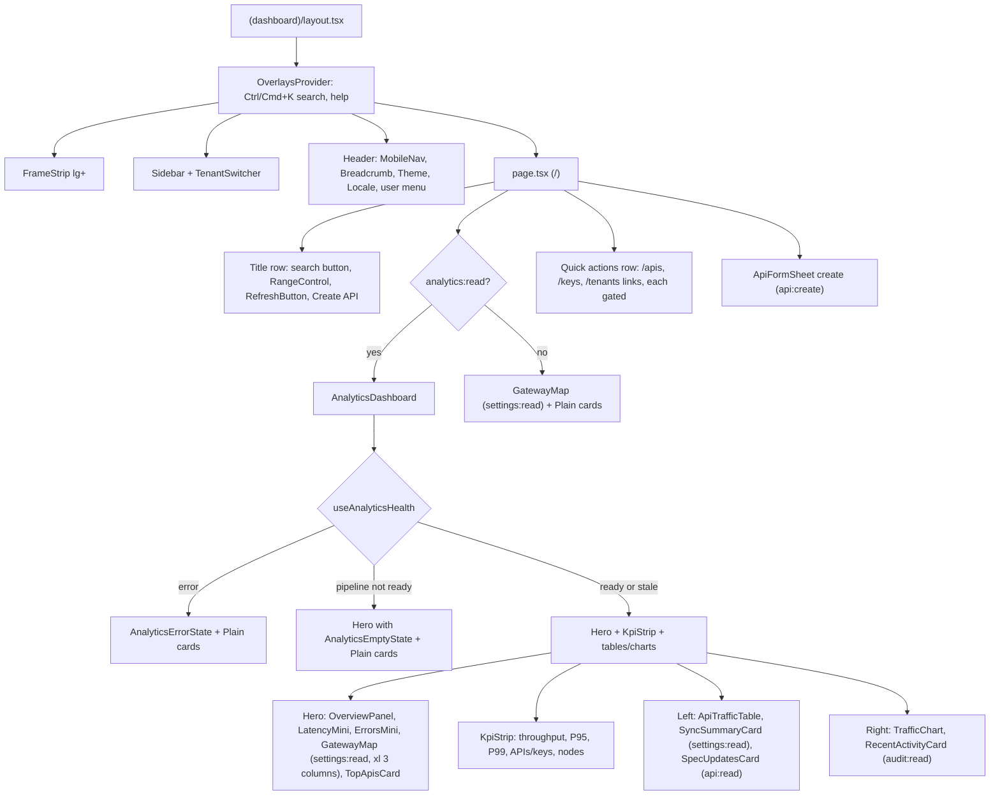

# Web app reference (`apps/web`)

Reference for the MIRQAB dashboard and developer portal: a Next.js 15 (App Router) app that talks to the NestJS API over HTTP and to Ory Kratos/Hydra for sign-in. Everything here was read from the code; anything not confirmed is marked **unverified**. All paths are relative to `apps/web/` unless they start with `packages/`, `infra/` or `docs/`.

Key facts:

- Package `@open-gateway/web` (`package.json`). `dev`/`start` bind port 3000 (`--port 3000`); the container also listens on 3000 (`Dockerfile`, `EXPOSE 3000`). The documented public URL `https://localhost:33000` is the Caddy edge in front of it (`.env.example`).
- Server state is TanStack Query; there is no global client store. Forms are react-hook-form + zod. UI is shadcn-style primitives in `src/components/ui` re-exporting or wrapping `@open-gateway/ui` (`packages/ui`).
- There is no i18n URL routing: the locale comes from a `locale` cookie (`src/i18n/request.ts`).
- The browser calls the NestJS API **directly** (cross-origin, `credentials: 'include'`, `NEXT_PUBLIC_API_URL`); the Next server does not proxy API calls. The only Next-side server work is `src/app/oauth2/**`, `src/app/locale/route.ts` and `src/middleware.ts`.

## 1. Routes

Route groups `(auth)` and `(dashboard)` do not appear in URLs, so the dashboard home is `/` (`src/app/(dashboard)/page.tsx`). There is **no** `src/app/page.tsx` and no `/login` route; login is `/auth/login`.

Permission gates: dashboard pages wrap their content in `PagePermissionGate` (CI guard `infra/scripts/check-page-gates.sh` fails if a `(dashboard)` page other than the landing page lacks it). Gates are UI-only; the API enforces the same permissions.

### Dashboard (`src/app/(dashboard)`, session required by middleware)

| URL | File | Permission gate | Purpose |
|---|---|---|---|
| `/` | `(dashboard)/page.tsx` | none at page level; sections gated: `analytics:read` (figures, range, refresh), `settings:read` (gateway map, sync card, nodes KPI), `api:read` (spec updates, quick link), `audit:read` (recent activity), `api:create` (create button/sheet), `key:read`, `tenant:read` (quick links) | Home: overview, KPI strip, gateway map, traffic chart, activity |
| `/analytics` | `(dashboard)/analytics/page.tsx` | `analytics:read` | Overview stat cards, requests/latency/status-code charts, per-API and per-key tables, range select |
| `/analytics/traffic` | `(dashboard)/analytics/traffic/page.tsx` | `analytics:read` | Filterable traffic analytics (filters live in the URL query string) |
| `/apis` | `(dashboard)/apis/page.tsx` | `api:read`; create `api:create`; row edit `api:update`, delete `api:delete` | API list, create sheet, import wizard |
| `/apis/[id]` | `(dashboard)/apis/[id]/page.tsx` | `api:read`; edit/delete buttons `api:update`/`api:delete`; Keys/Clients tab `key:read`; Traffic tab `api:update` | API detail with tabs overview / configuration / designer / endpoints / keys or clients / traffic; `?tab=` deep-links some tabs |
| `/keys` | `(dashboard)/keys/page.tsx` | `key:read`; create `key:create`; edit `key:update`; revoke/delete `key:revoke` | API key list |
| `/keys/[id]` | `(dashboard)/keys/[id]/page.tsx` | `key:read`; edit/rotate `key:update`; revoke `key:revoke` | Key detail, usage card |
| `/plans` | `(dashboard)/plans/page.tsx` | `plan:read`; `plan:create` / `plan:update` / `plan:delete` | Plans CRUD |
| `/products` | `(dashboard)/products/page.tsx` | `product:read`; `product:create` / `product:update` / `product:delete` | Products CRUD |
| `/tenants` | `(dashboard)/tenants/page.tsx` | `tenant:read`; `tenant:create` / `tenant:update` / `tenant:delete` | Tenant list |
| `/tenants/[id]` | `(dashboard)/tenants/[id]/page.tsx` | `tenant:read`; edit/archive `tenant:update`/`tenant:delete`; members card `user:read`; usage card manage flag `tenant:update` | Tenant detail, members, quota/usage |
| `/audit-logs` | `(dashboard)/audit-logs/page.tsx` | `audit:read`; CSV export `audit:export` | Paginated, filterable audit log |
| `/settings` | `(dashboard)/settings/page.tsx` | `settings:read`; reload nodes `settings:update`; link cards `role:read`, `cert:read` | Tabs General / Nodes (node health, reload) |
| `/settings/roles` | `(dashboard)/settings/roles/page.tsx` | `role:read`; `role:create` / `role:update` / `role:delete` | Roles CRUD |
| `/settings/certificates` | `(dashboard)/settings/certificates/page.tsx` | `cert:read`; `cert:create` / `cert:delete` | Certificates upload/delete |

Also in the group: `(dashboard)/layout.tsx` (shell, section 8) and `(dashboard)/error.tsx` (`RouteError`, home link `/`).

### Auth pages (`src/app/(auth)`, public by middleware prefix `/auth`)

Layout `(auth)/layout.tsx`: centred card, brand heading, theme + locale switchers top-end (usable before login). Each page renders a Kratos self-service flow through `useKratosFlow` + `KratosFlowForm`, inside `<Suspense>`.

| URL | File | Gate | Purpose |
|---|---|---|---|
| `/auth/login` | `(auth)/auth/login/page.tsx` | public | Kratos login flow; on success does `window.location.href = sanitizeClientReturnTo(flow.return_to)` |
| `/auth/register` | `(auth)/auth/register/page.tsx` | public | Kratos registration flow (does not log in; comment cites no `session` hook in kratos.yml) |
| `/auth/recovery` | `(auth)/auth/recovery/page.tsx` | public | Kratos recovery flow |
| `/auth/verification` | `(auth)/auth/verification/page.tsx` | public | Kratos verification flow |
| `/auth/settings` | `(auth)/auth/settings/page.tsx` | public prefix (Kratos requires a session for the flow) | Kratos profile/password settings; header menu links here |

### OAuth2 / locale route handlers (public by middleware)

| URL | File | Method | Purpose |
|---|---|---|---|
| `/oauth2/authorize` | `oauth2/authorize/route.ts` | GET | Ensures the Hydra client `dashboard-web` exists, builds PKCE + state, sets `oauth2_flow` cookie, redirects to Hydra `/oauth2/auth`. Accepts `?return_to=` |
| `/oauth2/login` | `oauth2/login/route.ts` | GET | Hydra `urls.login` target. Accepts/rejects the login challenge using the Kratos session; provisions the Postgres `User`; writes a `LOGIN` audit row |
| `/oauth2/consent` | `oauth2/consent/route.ts` | GET | Hydra `urls.consent` target; auto-accepts only for `dashboard-web`, rejects any other client |
| `/oauth2/callback` | `oauth2/callback/route.ts` | GET | Verifies `state`, exchanges the code, sets session cookies, redirects to sanitized `returnTo` |
| `/oauth2/refresh` | `oauth2/refresh/route.ts` | POST | `refresh_token` grant; re-sets cookies. 401 clears cookies, 503 on Hydra outage |
| `/oauth2/session-logout` | `oauth2/session-logout/route.ts` | POST | Header "Log out": clears cookies, revokes Hydra login sessions, returns `{ kratosLogoutUrl }`, writes `LOGOUT` audit row |
| `/oauth2/logout` | `oauth2/logout/route.ts` | GET | Hydra `urls.logout` (front-channel) target; always clears session cookies |
| `/oauth2/error` | `oauth2/error/page.tsx` | GET (page) | Error landing for every failure in the flow; "try again" links to `/oauth2/authorize` |
| `/locale` | `locale/route.ts` | POST | Body `{ locale }` validated against `LOCALES`; sets non-httpOnly `locale` cookie (1 year, `lax`); returns `{ success, data }` |

### Developer portal (`src/app/portal`, separate auth domain)

Public by middleware prefix `/portal`. Auth is a Kratos session enforced by the API (`DeveloperAuthGuard`, per the comment in `src/middleware.ts`), not the Hydra JWT. `portal/layout.tsx` renders `PortalHeader`; an ESLint `no-restricted-imports` rule (`eslint.config.js`) forbids portal code importing from `(dashboard)`. No RBAC gates. A 401 from the portal API redirects the browser to `/portal/auth/login?return_to=...` (`src/lib/portal-api-client.ts`).

| URL | File | Purpose |
|---|---|---|
| `/portal` | `portal/page.tsx` | Product catalog grid (`usePortalProducts`) |
| `/portal/products/[id]` | `portal/products/[id]/page.tsx` | Product info plus docs and try-it console per member API |
| `/portal/applications` | `portal/applications/page.tsx` | Developer applications list + create |
| `/portal/applications/[id]` | `portal/applications/[id]/page.tsx` | Subscriptions, subscribe sheet, revoke, usage |
| `/portal/auth/login`, `/recovery`, `/verification`, `/settings` | `portal/auth/*/page.tsx` | Kratos flows reusing `KratosFlowForm`/`useKratosFlow`; login creates the flow with `returnTo: '/portal'` |
| `/portal/auth/register` | `portal/auth/register/page.tsx` | Custom form (not a Kratos flow): `POST /portal/auth/register` with tenantSlug, name, email, password |

`src/app/layout.tsx` is the root layout (fonts Inter + IBM Plex Mono, `<html lang dir>`, `NextIntlClientProvider`, `Providers`); `src/app/icon.svg` is the favicon by file convention.

## 2. Component reference

Only the API paths a component reaches through its hooks are listed. "Hook" means a file in `src/hooks` unless a path is given. `useTranslations` and `useFormat` are used nearly everywhere and are omitted.

### `src/components/analytics`

| Component | Purpose | Key props / hooks | API |
|---|---|---|---|
| `analytics-empty-state.tsx` (`AnalyticsEmptyState`, `AnalyticsStaleNotice`, `AnalyticsErrorState`, `ChartCard`, chart constants `AXIS_TICK`, `GRID_STROKE`, `TOOLTIP_STYLE`, `formatCount`, `formatBucket`) | Shared empty/stale/error states and the chart card shell | `health?`, `description?`; `message`, `onRetry`; `ChartCard{title,description,isLoading,error,onRetry,isEmpty,children}` | none |
| `pipeline-status.ts` | `isPipelineStale(health)`, `pipelineHint(health)` helpers | takes `AnalyticsHealth` | none |
| `requests-chart.tsx` `RequestsChart` | Requests time series | `range`; `useAnalyticsTimeSeries`, `usePrefersReducedMotion` | `GET /analytics/timeseries` |
| `latency-chart.tsx` `LatencyChart` | Latency time series | `range`; same hooks | `GET /analytics/timeseries` |
| `status-code-chart.tsx` `StatusCodeChart` | Status-code distribution | `range`; `useAnalyticsStatusCodes` | `GET /analytics/status-codes` |
| `status-code-utils.ts` | `toStatusRows` grouping helper | pure | none |
| `traffic/traffic-filter-bar.tsx` `TrafficFilterBar` | Filter controls (API, key, method, status, path, latency, auth) | `filters`, `onChange(patch)`, `onReset`; `useApis`, `useKeys` | `GET /apis`, `GET /keys` |
| `traffic/traffic-kpis.tsx` `TrafficKpis` | KPI row for the traffic page | `data: AnalyticsTraffic \| undefined` | none (data from page) |
| `traffic/traffic-charts.tsx` `TrafficVolumeChart`, `TrafficLatencyChart` | Volume and latency charts | `data` | none |
| `traffic/traffic-breakdowns.tsx` `TrafficMix`, `EndpointTable` | Status mix and per-endpoint table | `data` | none |

The traffic page itself calls `useAnalyticsTraffic(filters)` (`GET /analytics/traffic?...`) and `useAnalyticsHealth` (`GET /analytics/health`).

### `src/components/apis`

| Component | Purpose | Key props / hooks | API |
|---|---|---|---|
| `api-form-sheet.tsx` `ApiFormSheet` | Create/edit API sheet (schema in `api-form-schema.ts`) | `mode`, `open`, `onOpenChange`; `useCreateApi`, `useUpdateApi` | `POST /apis`, `PATCH /apis/:id` |
| `api-config-card.tsx` `ApiConfigCard` | Read-only config summary | `config`, `onEdit` | none |
| `api-status-badge.tsx`, `sync-status-badge.tsx` | Status / sync badges; sync badge can retry | `status`; `apiId, syncStatus, syncError`; `useSyncApi` | `POST /apis/:id/sync` |
| `sync-outcome-toast.ts` | `toastSyncOutcome` helper | pure | none |
| `delete-api-dialog.tsx` `DeleteApiDialog` | Delete confirmation | `api`, `onClose`, `onDeleted`; `useDeleteApi` | `DELETE /apis/:id` |
| `clients-tab.tsx` `ClientsTab` | OAuth clients of an OAuth API | `apiId`; `useOAuthClients`, `useCreateOAuthClient`, `useRotateOAuthClient`, `useRevokeOAuthClient` | `GET /oauth-clients?apiDefId=`, `POST /oauth-clients`, `POST /oauth-clients/:id/rotate`, `DELETE /oauth-clients/:id` |
| `traffic-tab.tsx` `TrafficTab` | Captured request/response detail | `apiId`; `useApiTraffic` | `GET /apis/:id/traffic?range&page` |
| `designer/designer-tab.tsx` `DesignerTab` | Middleware cards that open one sheet each (state `openSheet`) | `api`; `usePermissions` | none itself |
| `designer/middleware-card.tsx`, `config-sheet.tsx` (`ConfigSheet`, `ConfigSheetFooter`), `list-codec.ts` | Card, shared sheet shell, textarea/CSV zod codecs | presentational | none |
| `designer/*-sheet.tsx`: `traffic-limits`, `load-balancing`, `uptime-tests`, `header-transform`, `url-rewrite`, `body-transform`, `mock-response`, `response-cache`, `detailed-recording`, `ip-access`, `request-validation`, `authentication`, `upstream-mtls` | One config sheet per gateway feature | `api`, `open`, `onOpenChange`; `useUpdateApi` (`upstream-mtls` also `useCertificates`; `response-cache` also `useInvalidateCache`) | `PATCH /apis/:id`; `GET /certificates`; `POST /apis/:id/cache/invalidate` |
| `designer/test-request-sheet.tsx` `TestRequestSheet` | Send a debug request | same props; `useDebugApi` | `POST /apis/:id/debug` |
| `designer/endpoint-list.tsx` `EndpointList` | Read-only endpoints from the OAS document, table/card toggle | `oasDocument`; `useViewMode` | none |
| `endpoints/endpoints-tab.tsx` `EndpointsTab` | Endpoint governance table (rate limit, timeout, size, cache, mock, tags) | `api`; `useEndpointGovernance`, `useUpdateEndpoints`, `usePermissions`, `useMediaQuery`, `useViewMode` (`src/lib/api/openapi.ts`) | `GET/PATCH /apis/:id/endpoints` |
| `endpoints/endpoint-governance-sheet.tsx`, `bulk-value-sheet.tsx`, `governance-form.ts`, `method-badge.tsx`, `unavailable-controls.tsx`, `api-error.tsx` | Per-endpoint / bulk edit sheets, form schema and limits, badges, API error text helpers | `useUpdateEndpoints` | `PATCH /apis/:id/endpoints` |
| `import/import-wizard-sheet.tsx` `ImportWizardSheet` | Import an OpenAPI document by paste/file or URL, preview then import | `open`, `onOpenChange`; `useImportApi`, `useImportUrl`, `previewImport`, `previewImportUrl` | `POST /apis/import/preview`, `POST /apis/import`, `POST /apis/import/url/preview`, `POST /apis/import/url` |
| `import/spec-source-field.tsx`, `import/findings-list.tsx` | Watch-URL field with zod schema; lint findings | form field / `findings` | none |
| `spec-update/spec-update-sheet.tsx` `SpecUpdateSheet` | Upload a new spec version (dry run then apply) | `apiId`, `versionNo`, `open`, `onOpenChange`; `useSpecUpdate` | `POST /apis/:id/spec/preview`, `POST /apis/:id/spec` (`expectedVersion`, `acknowledgeRemoved` query) |
| `spec-update/spec-diff-view.tsx` `SpecDiffView` | Renders a `SpecUpdateResult` diff | `result`, `acknowledge?` | none |
| `spec-source/spec-source-card.tsx`, `spec-source-sheet.tsx` | Watched spec URL status, edit, check now, remove | `apiId`, `canUpdate`; `useSpecSource`, `useSaveSpecSource`, `useCheckSpecSource`, `useRemoveSpecSource` (`src/lib/api/spec-source.ts`) | `GET/PUT/DELETE /apis/:id/spec-source`, `POST /apis/:id/spec-source/check` |
| `spec-source/spec-update-banner.tsx` `SpecUpdateBanner`, `SpecUpdateBadge` | "New spec version" banner on the API detail | `apiId`; `useSpecSource`, `useSpecCandidates`, `usePermissions` | `GET /apis/:id/spec-source`, `GET /apis/:id/spec-candidates` |
| `spec-source/spec-review-sheet.tsx` `SpecReviewSheet` | Review, apply or dismiss a detected candidate | `apiId`, `candidateId`, `canUpdate`, `onOpenChange`; `useCandidateDiff`, `useApplyCandidate`, `useDismissCandidate` | `GET /apis/:id/spec-candidates/:cid/diff`, `POST .../dismiss`, `POST /apis/:id/spec-candidates/:cid/apply?expectedVersion&acknowledgeRemoved` |

The API detail page also defines a local keys tab that uses `useApiKeys` (`GET /keys?apiDefId=&pageSize=`).

### `src/components/audit`

| Component | Purpose | Key props / hooks | API |
|---|---|---|---|
| `audit-traffic-action.tsx` `AuditTrafficAction` | Row action showing traffic summary for the API an audit row references | `row: {resource, createdAt}`; `useQuery` | `GET /audit-logs/traffic/:apiDefId?range=` |

### `src/components/auth`

| Component | Purpose | Key props / hooks | API |
|---|---|---|---|
| `kratos-flow-form.tsx` `KratosFlowForm` | Generic renderer for any Kratos flow `ui` container; submits to `ui.action` with `fetch` (`credentials: 'include'`, manual redirects) | `ui`, `onSuccess(body)`, `onFlowUpdate(ui)`, `onError(msg)`; helpers in `src/lib/kratos-flow.ts` | Kratos `ui.action` |
| `auth-error-card.tsx` `AuthErrorCard` | Flow load error card | `message` | none |
| `permission-gate.tsx` `PermissionGate`, `PagePermissionGate` | UI gating, section 6 | `permission`, `fallback?`, `children`; `usePermissions` | none |

### `src/components/certificates`, `keys`, `plans`, `products`, `roles`

| Component | Purpose | Key props / hooks | API |
|---|---|---|---|
| `certificates/certificate-upload-sheet.tsx` | Paste/upload PEM | `open`, `onOpenChange`; `useUploadCertificate` | `POST /certificates` |
| `certificates/delete-certificate-dialog.tsx` | Confirm delete | `target{id,label}`, `onOpenChange`; `useDeleteCertificate` | `DELETE /certificates/:id` |
| `keys/key-form-sheet.tsx` `KeyFormSheet` | Create/edit key | `mode`, `open`, `onOpenChange`, `apis?`, `plans?`, `keyData?`, `onCreated(keyValue)`; `useCreateKey`, `useUpdateKey` | `POST /keys`, `PATCH /keys/:id` |
| `keys/key-created-dialog.tsx` | One-time reveal of a key value | `keyValue`, `onClose` | none |
| `keys/rotate-key-dialog.tsx` | Rotate | `target`, `onRotated(keyValue)`; `useRotateKey` | `POST /keys/:id/rotate` |
| `keys/revoke-key-dialog.tsx` | Revoke | `target`; `useRevokeKey` | `POST /keys/:id/revoke` |
| `keys/delete-key-dialog.tsx` | Delete | `target`, `onDeleted?`; `useDeleteKey` | `DELETE /keys/:id` |
| `keys/key-usage-card.tsx` | Usage over a range | `keyId`, `gatewayReachable`; `useKeyUsage` | `GET /keys/:id/usage?range=` |
| `keys/key-utils.ts` | `keyStatusVariant`, quota/rate formatters | pure | none |
| `plans/plan-form-sheet.tsx`, `delete-plan-dialog.tsx` | Plan create/edit, delete | `useCreatePlan`, `useUpdatePlan`, `useDeletePlan` | `POST/PATCH/DELETE /plans` |
| `products/product-form-sheet.tsx`, `delete-product-dialog.tsx` | Product create/edit (picks APIs via `useApis`), delete | `useCreateProduct`, `useUpdateProduct`, `useDeleteProduct` | `POST/PATCH/DELETE /products` |
| `roles/role-form-sheet.tsx`, `delete-role-dialog.tsx` | Role create/edit (permission catalog), delete | `useCreateRole`, `useUpdateRole`, `usePermissionCatalog`, `useDeleteRole` | `POST/PATCH/DELETE /roles`, `GET /roles/permissions` |

Other keys hooks not tied to a component listed here: `useResetKeyUsage` (`POST /keys/:id/usage/reset`).

### `src/components/dashboard`

| Component | Purpose | Key props / hooks | API |
|---|---|---|---|
| `overview-panel.tsx` `OverviewPanel` | Dark "ink" card: headline figures + HTTP status mix | `range`; `useAnalyticsOverview`, `useAnalyticsStatusCodes` | `GET /analytics/overview`, `GET /analytics/status-codes` |
| `kpi-strip.tsx` `KpiStrip` | Throughput, P95, P99, active APIs/keys, node health | `range`, `showNodes`; `useAnalyticsOverview`, `useNodeHealth` | `GET /analytics/overview`, `GET /gateway/nodes/health` |
| `kpi-tile.tsx` `KpiTile`, `KpiTileSkeleton` | Compact tile shared by home and traffic pages | `icon`, `label`, `value`, `hint`, `tone` (props in `KpiTileProps`) | none |
| `stat-card.tsx` `StatCard`, `StatCardSkeleton` | Tile used by `/analytics` | `title, value, icon, description` | none |
| `figure.tsx` `Figure` | Number with small unit, locale formatted | `value`, `kind` (e.g. `ms`) | none |
| `sparkline.tsx` `Sparkline` | Decorative trend line | `values`, `area?`, `height?` | none |
| `trend-minis.tsx` `LatencyMini`, `ErrorsMini` | Latency split and error-rate mini cards | `range`; `useAnalyticsOverview`, `useAnalyticsTimeSeries` | `GET /analytics/overview`, `GET /analytics/timeseries` |
| `top-apis-card.tsx` `TopApisCard` | Share of requests for busiest APIs | `range`; `useAnalyticsApis`, `useAnalyticsOverview` | `GET /analytics/apis`, `/analytics/overview` |
| `api-traffic-table.tsx` `ApiTrafficTable` | Per-API volume, error rate, latency | `range`; `useAnalyticsApis` | `GET /analytics/apis` |
| `traffic-chart.tsx` `TrafficChart` | Request columns + error-rate strip, chart/table view, error budget; keyboard stepping (section 9) | `range`; `useAnalyticsTimeSeries('requests')`, `useAnalyticsOverview`, `usePrefersReducedMotion` | `GET /analytics/timeseries`, `/analytics/overview` |
| `gateway-map.tsx` `GatewayMap` | World map of nodes plus text list; link to `/settings` | none; `useNodeHealth`, `locationOf` | `GET /gateway/nodes/health` |
| `range-control.tsx` `RangeControl` | The page's single time-range filter | `value`, `onChange` | none |
| `recent-activity-card.tsx` `RecentActivityCard` | Last 10 audit entries | `useRecentAudit` | `GET /audit-logs?page=1&pageSize=10` |
| `sync-summary-card.tsx` `SyncSummaryCard` | Gateway reachability and API sync counts, retry failed syncs (polls 30 s) | `useGatewayStatus`, `useRetrySync` | `GET /gateway/status`, `POST /apis/:id/sync` |
| `spec-updates-card.tsx` `SpecUpdatesCard` | APIs whose watched URL has an unreviewed version | `useSpecUpdates` | `GET /spec-updates` |
| `viz-utils.ts` | `useElementWidth`, `columnPath`, `niceTicks`, `bucketErrorRate`, its own `usePrefersReducedMotion` (a second one exists in `src/hooks/use-media-query.ts`) | pure / hooks | none |

### `src/components/layout`

| Component | Purpose | Key props / hooks | API |
|---|---|---|---|
| `sidebar.tsx` `Sidebar`, `useNavItems`, `navLinkClass` | Permission-filtered nav (groups workspace / manage / trust), collapse toggle, help button, tenant switcher | `collapsed`, `onToggle`; `usePermissions`, `useOverlays` | none |
| `header.tsx` `Header` | Sticky top bar: `MobileNav`, `Breadcrumb`, theme + locale switchers, user menu (account settings `/auth/settings`, log out) | `useAuth`; logout `fetch('/oauth2/session-logout')` then navigates to Kratos logout URL or `/auth/login` | `POST /oauth2/session-logout` (same origin) |
| `frame-strip.tsx` `FrameStrip` | Strip on the dark frame (lg+): brand, tenant, pipeline state dot (needs `analytics:read`), local clock | `className`; `useAuth`, `usePermissions`, `useAnalyticsHealth` | `GET /analytics/health` |
| `overlays.tsx` `OverlaysProvider`; `overlays-context.ts` `useOverlays` | Search palette (Ctrl/Cmd+K) over nav items and help dialog; `useOverlays()` returns `{openSearch, openHelp}` and throws outside the provider | context | none |
| `mobile-nav.tsx` `MobileNav` | Sheet nav below `lg`; opens from the reading-direction start (`right` in RTL) | `useNavItems`, `useLocale` | none |
| `tenant-switcher.tsx` `TenantSwitcher` | Shows active tenant; dropdown only if the user has more than one membership; calls `switchTenant` (cancel + remove tenant-scoped queries, store id, reload) | `collapsed?`; `useAuth` | none |
| `theme-switcher.tsx` `ThemeSwitcher` | light / dark / system via next-themes | none | none |
| `locale-switcher.tsx` `LocaleSwitcher` | en / fr / ar; POSTs `/locale`, reloads | none | `POST /locale` (same origin) |
| `breadcrumb.tsx` `Breadcrumb`, `brand-mark.tsx` `BrandMark` | Path breadcrumb (UUID segments shown as "details"); logo | none | none |

### `src/components/portal`

| Component | Purpose | Key props / hooks | API |
|---|---|---|---|
| `portal-header.tsx` `PortalHeader` | Portal nav, developer identity, logout via `kratos.createBrowserLogoutFlow()` | `usePortalMe` | `GET /portal/auth/me`, Kratos logout |
| `api-docs-section.tsx` `ApiDocsSection` | Docs + try-it for one API | `apiId`; `usePortalApiDoc` | `GET /portal/catalog/apis/:id` |
| `try-it-console.tsx` `TryItConsole` | Sends a request from the browser straight to the data plane with the developer's key | `api: PortalApiDoc`; RHF+zod; `fetch(GATEWAY_URL + basePath + path)` | gateway (`NEXT_PUBLIC_GATEWAY_URL`) |
| `subscribe-sheet.tsx` `SubscribeSheet` | Subscribe an application to a product/plan | `applicationId`, `open`, `onOpenChange`, `onSubscribed`; `usePortalProducts`, `usePortalPlans`, `useCreatePortalSubscription` | `GET /portal/catalog/products`, `/plans`, `POST /portal/applications/:id/subscriptions` |
| `subscription-usage.tsx` `SubscriptionUsage` | Usage per subscription | `applicationId`, `subscriptionId`; `usePortalUsage` | `GET /portal/applications/:id/subscriptions/:sid/usage?range=` |
| `key-reveal-dialog.tsx` `KeyRevealDialog` | One-time key reveal | `keyValue`, `onClose` | none |

Portal hooks not shown above: `usePortalPlans` (`GET /portal/catalog/plans`), `usePortalApplications`, `useCreatePortalApplication` (`GET/POST /portal/applications`), `usePortalSubscriptions`, `useRevokePortalSubscription` (`POST .../subscriptions/:sid/revoke`).

### `src/components/providers`, `shared`, `tenants`, `ui`

| Component | Purpose | Key props / hooks | API |
|---|---|---|---|
| `providers.tsx` -> `providers/index.tsx` `Providers` | `DirectionProvider` > next-themes `ThemeProvider` (`attribute="class"`, default `system`) > `QueryProvider` + `Toaster` | `children`, `dir` | none |
| `providers/query-provider.tsx` | `QueryClient` defaults: `staleTime` 60 s, `gcTime` 5 min, `retry` 1, no refetch on focus; singleton in browser | none | none |
| `providers/direction-provider.tsx` | Re-export of Radix `DirectionProvider` so Radix menus/selects follow RTL | none | none |
| `shared/data-table.tsx` `DataTable`, `DataTablePagination`, `ViewModeToggle`, `useViewMode` | Canonical list view: TanStack table with loading/error/empty states, table/card toggle (remembered in localStorage per key), auto-cards on small screens | `table`, `isLoading`, `isError`, `error`, `onRetry`, `emptyMessage`, `emptyAction`, `skeletonRows`, `viewMode`, `renderCard` | none |
| `shared/page-header.tsx` `PageHeader` | Title, badges, description, actions, back link | `title, badges, description, actions, back` | none |
| `shared/state-card.tsx` `StateMessage`, `StateCard`; `shared/route-error.tsx` `RouteError`; `shared/formatted.tsx` `FormattedDate/DateTime/Number` | Empty/error states, route error UI, locale-aware formatting components | as named | none |
| `tenants/tenant-form-sheet.tsx` | Create/edit tenant | `useCreateTenant`, `useUpdateTenant` | `POST /tenants`, `PATCH /tenants/:id` |
| `tenants/tenant-status-dialog.tsx` | Archive / status change | `tenant`, `action`, `onClose`, `onArchived`; `useArchiveTenant`, `useUpdateTenant` | `DELETE /tenants/:id`, `PATCH /tenants/:id` |
| `tenants/members-card.tsx` | Members table, role change, invite | `tenantId`; `useTenantMembers`, `useUpdateMemberRole`, `usePermissions` | `GET /tenants/:id/users`, `PATCH /tenants/:id/users/:uid` |
| `tenants/invite-member-sheet.tsx` | Add existing user by email lookup; invite-by-email only when `NEXT_PUBLIC_FEATURE_INVITE_BY_EMAIL === 'true'` | `useLookupUser`, `useInviteMember`, `useInviteByEmail` | `GET /tenants/:id/users/lookup`, `POST /tenants/:id/users`, `POST /tenants/:id/users/invite` |
| `tenants/remove-member-dialog.tsx` | Remove member | `tenantId`, `member`, `onClose`; `useRemoveMember` | `DELETE /tenants/:id/users/:uid` |
| `tenants/tenant-quota-sheet.tsx`, `tenant-usage-card.tsx` | Quota edit; usage + reset | `useTenantQuota`, `useSetTenantQuota`, `useTenantUsage`, `useResetTenantQuota` | `GET/PATCH /tenants/:id/quota`, `POST /tenants/:id/quota/reset`, `GET /tenants/:id/usage` |
| `ui/*` | shadcn-style primitives: alert-dialog, avatar, badge, checkbox, collapsible, command, dialog, dropdown-menu, form, input, label, popover, scroll-area, select, separator, sheet, skeleton, sonner (`Toaster`, `toast`), switch, tabs, textarea, tooltip. `button`, `card`, `table`, `progress`, `toggle-group` re-export `@open-gateway/ui` | Radix based | none |

## 3. Hooks (`src/hooks`)

| File | Exports |
|---|---|
| `use-me.ts` | `useMe` (`GET /auth/me`, `retry: false`); shared source for the next two |
| `use-auth.ts` | `useAuth` -> `{ user, isLoading, isAuthenticated }` |
| `use-permissions.ts` | `usePermissions` -> `{ can(permission), isLoading }` |
| `use-apis.ts` | `useApis`, `useApiDetail`, `useApiKeys`, `useCreateApi`, `useUpdateApi`, `useSetApiStatus`, `useDeleteApi`, `useSyncApi`, `useDebugApi`, `useInvalidateCache`, `useApiTraffic` |
| `use-keys.ts` | `useKeys`, `useKey`, `useKeyUsage`, `useCreateKey`, `useUpdateKey`, `useRevokeKey`, `useRotateKey`, `useResetKeyUsage`, `useDeleteKey` |
| `use-oauth-clients.ts` | `useOAuthClients`, `useCreateOAuthClient`, `useRotateOAuthClient`, `useRevokeOAuthClient` |
| `use-tenants.ts` | `useTenants`, `useTenant`, `useTenantMembers`, `useCreateTenant`, `useUpdateTenant`, `useArchiveTenant`, `useLookupUser`, `useInviteMember`, `useInviteByEmail`, `useUpdateMemberRole`, `useRemoveMember`, `useTenantQuota`, `useSetTenantQuota`, `useResetTenantQuota`, `useTenantUsage` |
| `use-plans.ts`, `use-products.ts`, `use-roles.ts`, `use-certificates.ts` | list + create/update/delete hooks; roles also `usePermissionCatalog` |
| `use-analytics.ts` | `ANALYTICS_RANGES` (`1h`, `24h`, `7d`, `30d`), `useAnalyticsOverview`, `useAnalyticsTimeSeries`, `useAnalyticsApis`, `useAnalyticsKeys`, `useAnalyticsStatusCodes`, `useAnalyticsTraffic` (keeps previous data while filters change), `useAnalyticsHealth` |
| `use-traffic-filters.ts` | `parseTrafficFilters`, `activeFilterCount`, `useTrafficFilters` (filters <-> URL search params via `router.replace`) |
| `use-audit.ts` | `useRecentAudit` |
| `use-gateway-status.ts` | `useGatewayStatus` (30 s polling), `useRetrySync` |
| `use-settings.ts` | `useSettings` (`GET /settings`), `useNodeHealth`, `useReloadGateways` (`POST /gateway/reload`) |
| `use-portal.ts` | `usePortal*` hooks over `portalApi`, with its own `portalKeys` |
| `use-format.ts` | `createFormat(locale)`, `useFormat` (date, dateTime, number, percent, ms, bytes via `Intl`) |
| `use-media-query.ts` | `useMediaQuery`, `usePrefersReducedMotion` |

## 4. Library (`src/lib`)

| File | Purpose |
|---|---|
| `api-client.ts` | `api.{get,post,put,patch,delete,postRaw,getBlob}`, `ApiRequestError`, `canAttemptReauth` |
| `portal-api-client.ts` | `portalApi.{get,post}` for the portal; returns unwrapped `data`; no refresh, no `X-Tenant-ID` |
| `refresh-retry.ts` | `fetchWithRefresh`: on 401, one shared `POST /oauth2/refresh`, then one replay |
| `cookie-names.ts` / `oauth-cookies.ts` | Cookie names; set/clear helpers (`httpOnly`, `sameSite: lax`, `secure` from `COOKIE_SECURE` else `NODE_ENV === 'production'`) |
| `hydra-admin.ts` | Server-only Hydra clients and constants (`APP_URL`, `DASHBOARD_CLIENT_ID = 'dashboard-web'`, `DASHBOARD_SCOPE = 'openid offline_access'`), `ensureDashboardClient`, `exchangeToken`, `oauthError`, `sanitizeReturnTo` |
| `return-to.ts` | `sanitizeToOrigin`, `sanitizeClientReturnTo` (client-safe open-redirect guard) |
| `pkce.ts` | `generateCodeVerifier`, `generateCodeChallenge` (S256), `generateState` |
| `kratos-client.ts` / `kratos-server.ts` | Browser `FrontendApi` (`NEXT_PUBLIC_KRATOS_URL`, `credentials: 'include'`) / server `FrontendApi` (`KRATOS_INTERNAL_URL`) |
| `kratos-flow.ts`, `use-kratos-flow.ts` | Flow response interpretation; hook that loads `?flow=` or starts a flow (needs `ACCEPT_JSON`) |
| `audit-log.ts` | `recordAuditLog`: writes an `AuditLog` row with Prisma from the Next server (LOGIN/LOGOUT), best effort |
| `audit-actions.ts` | `AUDIT_ACTION_VALUES`, `auditActionLabel` |
| `active-tenant.ts`, `switch-tenant.ts` | localStorage key `og_active_tenant_id`; tenant switch procedure |
| `query-keys.ts` | Tenant-scoped query key factory |
| `gateway-locations.ts`, `gateway-cities.ts` | Node location parsing and city catalogue (section 11) |
| `gateway-url.ts` | `GATEWAY_URL` (`NEXT_PUBLIC_GATEWAY_URL`, default `https://localhost:33005`) |
| `api/openapi.ts`, `api/spec-source.ts` | Endpoint governance and spec-source hooks, types, error helpers (co-located with their queries) |
| `date-fns-locale.ts` | `dateFnsLocale(locale)` for `date-fns` |
| `utils.ts` | `cn` |

## 5. Authentication and session flow

Two separate identity domains:

- **Dashboard**: Kratos identity (login UI at `/auth/*`) -> Hydra OAuth2 authorization_code + PKCE for the public client `dashboard-web` -> JWT access token in an httpOnly cookie that the API reads directly (`apps/api/src/modules/auth/strategies/jwt.strategy.ts` reads `request.cookies.mq_access_token`).
- **Portal**: Kratos session only (section 1).

Cookies (all httpOnly, `sameSite: lax`, path `/` except `oauth2_flow`):

| Cookie | Set by | Max-Age | Notes |
|---|---|---|---|
| `mq_access_token` | `/oauth2/callback`, `/oauth2/refresh` | Hydra `expires_in` | `mq_` prefix avoids collisions with other local apps on the same host; also read by `apps/api` |
| `mq_refresh_token` | same | 720 h (`60*60*720`) | Only set when Hydra returns a refresh token |
| `oauth2_flow` | `/oauth2/authorize` | 600 s, path `/oauth2` | JSON `{state, codeVerifier, returnTo}`; `returnTo` re-sanitized on read |
| `locale` | `/locale` | 1 year, not httpOnly | UI language |

Behaviours to know:

- `src/middleware.ts` only checks that `mq_access_token` is present, not valid. Public prefixes: `/auth`, `/oauth2`, `/locale`, `/portal` (segment-aware). The matcher skips `_next/static`, `_next/image`, `favicon.ico` and common image extensions.
- A 401 that survives refresh sends the browser to `/oauth2/authorize?return_to=<current path>`; `canAttemptReauth()` allows this once per 5 s (sessionStorage key `reauth-attempted-at`), otherwise a toast is shown instead of looping. Pre-auth pages (`/auth`, `/oauth2`) are never redirected.
- `/oauth2/refresh` returns 401 and clears cookies only when Hydra answers 400/401; any other failure (5xx, network) returns 503 and keeps cookies.
- Logout (Header): `POST /oauth2/session-logout` clears cookies, introspects the token to revoke Hydra login sessions and audit `LOGOUT`, returns a Kratos logout URL which the client navigates to. `/oauth2/logout` is only Hydra's front-channel callback.
- Failures in any `/oauth2/*` step redirect to `/oauth2/error?error=...&error_description=...`.
- `resolveOrProvisionUser` (`oauth2/login/route.ts`) looks up the local user by `metadata_public.app_user_id`, then `kratosIdentityId`, then email (only if the address is verified and no other identity owns it), else creates an `ACTIVE` user with no tenant membership. Non-`ACTIVE` users are rejected.

## 6. Permissions (RBAC in the UI)

- `useMe()` loads `GET /auth/me` (`AuthMe`, with `roles`, `permissions`, `tenants`, `tenantName`). `usePermissions().can(p)` is true for any role named `super_admin` (case-insensitive) or when `p` is in `me.permissions`; `false` while loading or if `/auth/me` failed.
- Permission strings are `resource:action`, e.g. `api:read`, `key:revoke`, `audit:export`, `cert:create`, `settings:update`.
- `PermissionGate {permission, fallback?}`: renders children only when allowed (also hides while loading). Use for buttons and cards.
- `PagePermissionGate {permission}`: skeleton while loading, "no access" card when denied, and children are not mounted (so their queries never fire). Every `(dashboard)` page except `/` uses it (CI guard).
- Navigation is filtered by the same check (`useNavItems`, also feeds the Ctrl/Cmd+K palette and mobile nav).
- The dashboard sends `X-Tenant-ID` from `getActiveTenantId()`; permissions and the `AuthMe` are per tenant (the query key is tenant-scoped).

## 7. Data fetching conventions

- **Client**: `api` from `src/lib/api-client.ts`. Base URL is `NEXT_PUBLIC_API_URL` (fallback `http://localhost:33001/api` when unset or empty). Every call sends `credentials: 'include'`, `Content-Type: application/json` (overridable) and `X-Tenant-ID` when a tenant is stored.
- **Envelope**: responses shaped `{ success, data }` are returned as is; a bare payload is wrapped to `{ success: true, data }`. Hooks therefore always read `.then((res) => res.data)`. Some endpoints return `{ data, meta }` lists (e.g. `PaginatedResponse`), so hooks sometimes read `res.data.data` (`useRecentAudit`, `useKeyUsage`). Errors: non-2xx throws `ApiRequestError {status, code?}`; the message comes from `error.message` (arrays joined with `; `), else `HTTP <status>`. Branch on `status`/`code`, not message text.
- **Other helpers**: `api.postRaw(path, text, contentType)` for OpenAPI documents (`text/plain; charset=utf-8`), `api.getBlob` for CSV export.
- **Refresh retry**: `fetchWithRefresh` in `refresh-retry.ts` replays a 401 once after a single shared `POST /oauth2/refresh`. Bodies must be strings.
- **Query keys** (`src/lib/query-keys.ts`): every dashboard key starts with `['tenant', activeTenantId, ...]`, resolved at call time via getters. Invalidate a whole domain with e.g. `queryKeys.apis.all`; `queryKeys.tenantScope(id)` drops one tenant's cache. Portal keys live in `use-portal.ts` (`['portal', ...]`) and are not tenant-scoped.
- **Defaults** (`providers/query-provider.tsx`): staleTime 60 s, gcTime 5 min, retry 1, no window-focus refetch. Deviations: `useMe` no retry; `useGatewayStatus` polls 30 s; endpoint governance polls 5 s while `syncStatus === 'PENDING'` and does not retry 403/404.
- **Tenant switch**: `switchTenant` cancels and removes the previous tenant's queries, stores the new id, then reloads the page.
- **Mutations** invalidate their domain's `all` key; toasts via `toast` from `components/ui/sonner`.
- The portal uses `portalApi` (no envelope leakage, no refresh; 401 redirects to `/portal/auth/login`). Its fallback API URL is `https://localhost:33001/api`, unlike the dashboard client's `http://localhost:33001/api`.

## 8. Dashboard page composition

Shell (`(dashboard)/layout.tsx`): `OverlaysProvider` > (lg+) dark `bg-frame` with `FrameStrip` > rounded panel containing `Sidebar` (collapsed by default; expansion persisted under localStorage key `mirqab-sidebar-collapsed`) and a column with `Header` and `<main id="main-content">`. A skip-to-content link is the first tab stop. Below `lg` the frame is dropped and `MobileNav` replaces the sidebar.

Rendering details: blocks enter with `motion-enter` and a 70 ms stagger; the range (`1h` `24h` `7d` `30d`, default `24h`) is local `useState` shared by all analytics blocks; Refresh invalidates `queryKeys.analytics.all`. When the pipeline is stale but has earlier rows, `AnalyticsStaleNotice` is shown above the normal layout.

## 9. Keyboard shortcuts and overlays

Defined in `src/components/layout/overlays.tsx` and shown in the help dialog (`dashboard.help` messages):

| Keys | Action | Where |
|---|---|---|
| Ctrl/Cmd + K | Toggle the workspace search palette (`cmdk` `CommandDialog`) listing the permission-filtered nav items | `OverlaysProvider` `keydown` listener on `window` |
| Esc | Close menus and dialogs (Radix default behaviour; only documented in the help text) | Radix |
| Left / Right (also Home / End) | Step through buckets of the traffic chart when it is focused | `components/dashboard/traffic-chart.tsx` `onKeyDown`; Home/End are in code but not in the help text |

Overlays are opened programmatically with `useOverlays().openSearch()` (dashboard search button) and `openHelp()` (sidebar help button). Sheets (`Sheet`) are used for all create/edit forms, `AlertDialog`/`Dialog` for confirmations.

## 10. i18n

- Locales: `en` (default), `fr`, `ar` (`src/i18n/locales.ts`). `RTL_LOCALES = ['ar']`.
- Resolution: `src/i18n/request.ts` reads the `locale` cookie (fallback `en`) and returns that locale's message bundle; `next.config.ts` wires it with `createNextIntlPlugin`. No locale in the URL.
- Messages: `src/messages/<locale>/<namespace>.json`, 17 namespaces per locale: `common`, `nav`, `localeSwitcher`, `auth`, `apis`, `keys`, `tenants`, `analytics`, `dashboard`, `portal`, `settings`, `plans`, `products`, `roles`, `certificates`, `openapi`, `specSource`. **Adding a namespace requires editing the three import blocks and `MESSAGES` in `request.ts`.** All three locales currently have identical file sets and key sets (checked).
- Rules enforced: ESLint `react/jsx-no-literals` (bare JSX text is an error; wrap punctuation as `{'...'}`); CI runs `node infra/scripts/check-locale-keys.mjs` (key sets must match across en/fr/ar). Project convention (global rules): no hard-coded strings, no `t(...) ?? fallback`, all locales in the same change.
- RTL handling: `app/layout.tsx` sets `<html lang dir>`; `DirectionProvider` makes Radix follow it; layouts use logical utilities (`ps-`, `pe-`, `start-`, `end-`, `ms-`, `me-`); `rtl:rotate-180` / `rtl:-scale-x-100` on directional icons; `MobileNav` and sidebar tooltips pick their side from `RTL_LOCALES`; `globals.css` forces `direction: ltr; unicode-bidi: isolate` on `code, kbd, samp, pre, .font-mono` inside `[dir='rtl']`; identifiers are wrapped in `dir="ltr"`.
- Formatting: use `useFormat()` (`Intl`, UI locale) rather than the browser locale; `dateFnsLocale()` for date-fns. Observation: `ANALYTICS_RANGES` in `hooks/use-analytics.ts` carries English `label` strings; whether any UI renders them instead of `analytics.ranges.*` was not checked (**unverified**).
- `src/components/layout/locale-switcher.tsx` calls `/locale` then `window.location.reload()` (plus `router.refresh()` in the click handler).

## 11. Theming and design tokens

`src/styles/globals.css` (Tailwind v4, `@import 'tailwindcss'`, `tw-animate-css`, and `packages/ui/src/styles.css`):

- Tokens are `--color-*` in `@theme`; dark mode is the `.dark` class (custom variant `dark`), toggled by next-themes (`attribute="class"`, default `system`). Dark overrides only what changes (primary, status colours, background/surface/card, muted, borders, `--color-input`).
- Palette: `primary #087482` (dark `#22b8c9`), `secondary #1f2937`, status `success`/`warning`/`destructive`/`info`, method chips `info`/`patch`, plus `--radius-sm..xl` (8/12/16/20 px) and `--shadow-soft/md/lg`.
- **Frame**: `--color-frame`, `--color-frame-foreground`, `--color-frame-muted` (the dark bezel around the dashboard panel, dark in both themes) and the `.bg-grain` utility (SVG noise). `--color-grid-dot` / `.bg-dot-grid` for dot backgrounds.
- **`surface-ink`** (`packages/ui/src/styles.css`, applied by `<Card variant="ink">` in `packages/ui/src/components/card.tsx`): a dark card in both themes that re-points `--color-card/foreground/muted/border/accent/secondary/primary/status` for everything inside, so `Badge`, `Button`, `Table` need no overrides. Used for the Overview, Top APIs, traffic and API-table cards.
- Fonts: Inter (`--font-inter` via `next/font`) and IBM Plex Mono (`--font-plex-mono`), exposed as `--font-sans`, `--font-mono`; mono is used for identifiers, units, timestamps.
- Motion: `.motion-enter`, `.motion-grow`, `ui-pulse-ring`; a global `prefers-reduced-motion` rule collapses animations; charts use `usePrefersReducedMotion`.
- Accessibility: global `:focus-visible` outline; `scripts/check-contrast.js` (`pnpm check:contrast`) verifies WCAG AA (4.5:1) for token pairs in both themes. Whether CI runs it was not confirmed (**unverified**; `ci.yml` grep showed no match).
- Tailwind also has `tailwind.config.ts` (extends `@open-gateway/config/tailwind/base`; content includes `packages/ui/src`).

## 12. Environment variables

`NEXT_PUBLIC_*` values are inlined at build time (Dockerfile `ARG`s); server-only variables are read at runtime.

| Variable | Read in | Default | Purpose |
|---|---|---|---|
| `NEXT_PUBLIC_API_URL` | `lib/api-client.ts`, `lib/portal-api-client.ts` | `http://localhost:33001/api` (dashboard client), `https://localhost:33001/api` (portal client); empty counts as unset | NestJS API base incl. `/api` |
| `NEXT_PUBLIC_APP_URL` | `lib/hydra-admin.ts` (fallback for `APP_URL`) | `http://localhost:33000` | Browser-facing origin; redirect URIs, `metadataBase`, return_to validation |
| `APP_URL` (runtime, not public) | `lib/hydra-admin.ts`, `lib/return-to.ts` | falls back to the above | Preferred because Next freezes `NEXT_PUBLIC_*` at build |
| `NEXT_PUBLIC_KRATOS_URL` | `lib/kratos-client.ts` | `http://localhost:33012` | Browser-facing Kratos public URL |
| `NEXT_PUBLIC_HYDRA_URL` | `lib/hydra-admin.ts` | `http://localhost:33010` | Where `/oauth2/authorize` redirects the browser |
| `NEXT_PUBLIC_GATEWAY_URL` | `lib/gateway-url.ts` | `https://localhost:33005` | Data plane origin for the portal try-it console |
| `NEXT_PUBLIC_GATEWAY_NODE_LOCATIONS` | `lib/gateway-locations.ts` | unset (no pins) | Node -> location JSON (below) |
| `NEXT_PUBLIC_FEATURE_INVITE_BY_EMAIL` | `components/tenants/invite-member-sheet.tsx` | off unless exactly `'true'` | Must match API `FEATURE_INVITE_BY_EMAIL` |
| `HYDRA_ADMIN_URL` | `lib/hydra-admin.ts` | `http://hydra:4445` | Server-only, unauthenticated admin API |
| `HYDRA_PUBLIC_URL` | `lib/hydra-admin.ts` | `http://hydra:4444` | Server token endpoint |
| `KRATOS_INTERNAL_URL` | `lib/kratos-server.ts` | `http://kratos:4433` | Server-side Kratos calls |
| `COOKIE_SECURE` | `lib/oauth-cookies.ts` | `NODE_ENV === 'production'` | `true`/`false` override for `secure` cookies |
| `NODE_ENV` | cookies, `kratos-flow-form.tsx` | | |

`NEXT_PUBLIC_ENABLE_ANALYTICS` and `NEXT_PUBLIC_ENABLE_WEBSOCKETS` appear in `.env.example` and `.env.local.example` but no code under `src` reads them. The Next server also uses Prisma via `@open-gateway/database` (login provisioning and audit rows), so it needs `DATABASE_URL` at runtime (**unverified**: the variable is not referenced in `src`; inferred from the Prisma client import).

### How the gateway map places nodes

1. `GatewayMap` calls `useNodeHealth` (`GET /gateway/nodes/health`) -> `NodeHealthEntry[]` with `nodeUrl` and `health {reachable, version, latencyMs, error}`.
2. The node's key is `new URL(nodeUrl).host` (host plus port if any), e.g. `gw-ma-01:8080`.
3. `lib/gateway-locations.ts` parses `NEXT_PUBLIC_GATEWAY_NODE_LOCATIONS` once at module load: a JSON object mapping host -> either a city id string (from `lib/gateway-cities.ts`, format `<ISO country>-<CITY upper-case, A-Z only>`, e.g. `MA-CASABLANCA`, `MA-ELJADIDA`, `FR-PARIS`) or an explicit `{city, code?, lat, lon}`. Invalid JSON, unknown city ids, or bad coordinates are silently dropped.
4. `locationOf(host)` returns the location only if `isOnMap(lat, lon)` from `@open-gateway/ui` is true: the map's crop is lon -92..31, lat 14..64 (`packages/ui/src/components/world-map.tsx`).
5. Located nodes become `WorldMapNode` pins (`up` = reachable, `detail` = version and latency or the error). Nodes with no valid location or outside the crop are not pinned but always appear in the text list under the map with their health. If no node is located, only the list is shown. The control plane does not know node locations; this variable is the only source.

Example: `NEXT_PUBLIC_GATEWAY_NODE_LOCATIONS={"gw-ma-01:8080":"MA-CASABLANCA","gw-x:8080":{"city":"Lab","lat":10,"lon":20}}` (the second entry has lat 10, outside the crop, so it is listed but not pinned).

## 13. Testing conventions

- Runner: Vitest 3 (`pnpm test` -> `vitest run --passWithNoTests`; `test:watch`), config `vitest.config.ts`: alias `@` -> `src`, automatic JSX runtime, `testTimeout` 30 000 ms (cold Radix Sheet/Select renders in jsdom are slow under parallel workers).
- Environment: default is `node` (route handlers, lib code using real `Request`/`Response`). Component tests opt into jsdom per file with `// @vitest-environment jsdom` (46 of 64 test files mention jsdom).
- `vitest.setup.ts` (runs for all tests): `cleanup()` after each test; drops `<style>` elements appended to `document.head` (sonner and scroll-lock sheets cost seconds in jsdom `getComputedStyle`); stubs `ResizeObserver` and `Element.prototype.scrollIntoView`.
- Files: `*.test.ts(x)` next to the code. Shared helpers named `test-utils.tsx` (in `components/apis/designer`, `components/apis/endpoints`, `components/portal`, `components/tenants`) are not test files: they export `wrap()` (a `NextIntlClientProvider` with the real `en` messages), fixtures such as `baseApi`, and `at()` for safe indexing.
- Libraries: `@testing-library/react`, jsdom; route handlers are tested by calling `GET`/`POST` directly (`src/app/oauth2/*/route.test.ts`, `src/middleware.test.ts`).
- `src/lib/api-client.ts` deliberately has no `@/` runtime imports (`import type` only, relative import for `toast`) so it and `refresh-retry.ts` run under vitest with mocked `fetch`.
- No Playwright/E2E directory exists under `apps/web` (there is no `e2e/` folder).
- Other checks: `pnpm typecheck` (`tsc --noEmit`), `pnpm lint` (`next lint --max-warnings 0`; the root `eslint.config.js` also applies), `pnpm check:contrast`, and the CI guards `check-locale-keys.mjs` and `check-page-gates.sh`.
